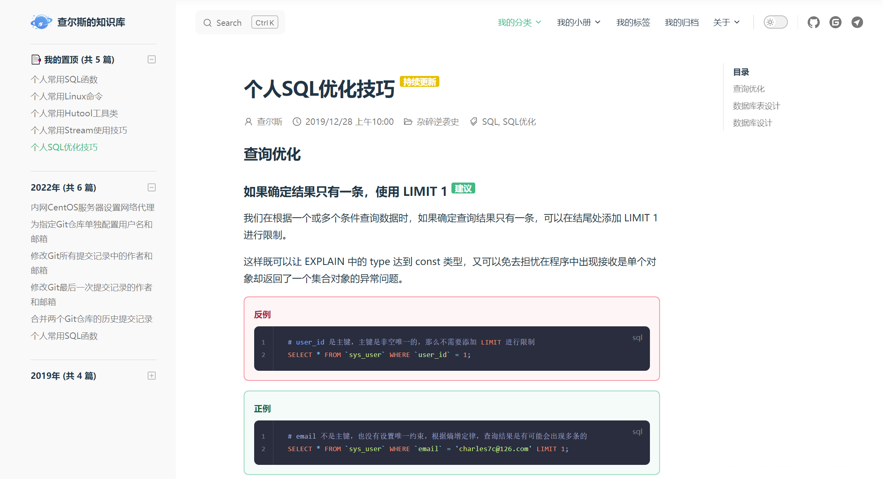

[English](./README.en.md) | 中文

# 查尔斯的知识库

<a href="http://creativecommons.org/licenses/by-sa/4.0/" target="_blank">
    
</a>
<a href="https://github.com/Charles7c/charles7c.github.io/blob/main/LICENSE" target="_blank">
    
</a>
<a href="https://github.com/Charles7c/charles7c.github.io/actions/workflows/deploy-pages.yml" target="_blank">
    
</a>


📝 **查尔斯的个人知识库，记录 & 分享个人碎片化、结构化、体系化的知识内容。** 

🐢 [GitHub Pages（完整体验）](https://blog.charles7c.top) | 🐇 [Gitee Pages（无法评论）](https://charles7c.gitee.io)

## 开始

```bash
# 1.克隆本仓库
git clone https://github.com/Charles7c/charles7c.github.io.git
# 2.安装依赖
yarn install
# 3.dev 运行，访问：http://localhost:3000
yarn dev
# 4.打包，文件存放位置：docs/.vitepress/dist
yarn build
# 5.部署
# 5.1 在 GitHub 启用 GitHub Pages 
# 5.2 在其他平台部署, 例如：Gitee Pages、Vercel、Netlify、个人虚拟主机、个人服务器等
```

## 已扩展功能（持续优化细节）

- [x] 拆分配置文件：解决“大”配置文件问题，提取公有配置选项进行复用，方便维护
- [x] GitHub Action：push 到 GitHub，自动进行项目打包及 GitHub Pages 部署，并同步到 Gitee Pages（可根据需要自行删除同步 Gitee Pages 部分工作流配置）
- [x] 自动生成侧边栏：将文章按规律性目录存放后，侧边栏将自动生成，支持文章置顶🔝（在文章 frontmatter 中配置 `isTop: true`，即可在侧边栏自动出现置顶分组）
- [x] 主页美化：参照 vite 文档主页进行美化
- [x] 自定义页脚：支持ICP备案号、公安备案号、版权信息配置（符合大陆网站审核要求）
- [x] 文章元数据信息显示：文章标题下显示作者、发布时间、所属分类、标签列表等信息，可全局配置作者及作者主页信息
- [x] 《我的标签》：模仿语雀标签页风格，另有标签云展示。语雀标签页地址：https://www.yuque.com/r/语雀用户名/tags?tag=
- [x] 《我的归档》：自定义时间轴，展示历史文章数据。年份前可展示生肖，还可按分类、标签筛选
- [x] 文章评论：目前仅支持Gitalk
- [x] 版权声明：文末显示文章版权声明，可自由配置采用的版权协议
- [x] 徽章：标题后可显示徽章，此功能来自于 VitePress 未合并的 PR，如若后续被合并，则改用官方主题功能
- [x] 更多细节优化：敬请发现

## 部分页面截图

### 主页美化


### 侧边栏置顶分组（自动生成侧边栏及置顶分组）


### 文章元数据信息


### 我的标签


### 我的归档


### 文章评论


### 版权声明


### 徽章



## 致谢

- [vuejs/vitepress](https://github.com/vuejs/vitepress) （本知识库基于 vitepress 构建）
- [vitejs/vite](https://github.com/vitejs/vite) （参考主页美化）
- [windicss/docs](https://github.com/windicss/docs) （参考配置文件拆分）
- [brc-dd/vitepress-blog-demo](https://github.com/brc-dd/vitepress-blog-demo) （感谢 vitepress 维护者 brc-dd 的热心帮助）
- [brc-dd/vitepress-with-arco](https://github.com/brc-dd/vitepress-with-arco) 
- [clark-cui/vitepress-blog-zaun](https://github.com/clark-cui/vitepress-blog-zaun) （参考文章标签的数据处理方案）
- [dingqianwen/my-blog](https://github.com/dingqianwen/my-blog) （参考 Gitalk 配置暗黑主题）
- [Dedicatus546/Dedicatus546.github.io](https://github.com/Dedicatus546/Dedicatus546.github.io) （参考 Gitalk 跨域调用 API 失效的解决方案）
- [xiaoxian521/pure-admin-utils-docs](https://github.com/xiaoxian521/pure-admin-utils-docs) （参考词云组件的使用）
- [arco-design/arco-design-vue](https://github.com/arco-design/arco-design-vue) （使用部分组件及图标）
- [antvis/G2plot](https://github.com/antvis/G2plot) （使用部分图表）
- [richardo2016/vitepress-pr](https://github.com/vuejs/vitepress/pull/1134) （使用徽章）
- ......

## License

- 文章遵循[ CC 4.0 BY-SA ](http://creativecommons.org/licenses/by-sa/4.0/)版权协议，转载请附上原文出处链接和声明
- 源码遵循 [MIT](https://github.com/Charles7c/charles7c.github.io/blob/main/LICENSE) 协议
- Copyright © 2019-2022 Charles7c