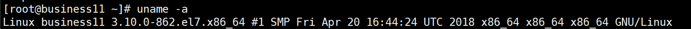
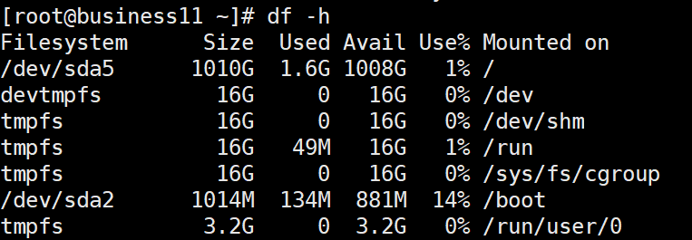
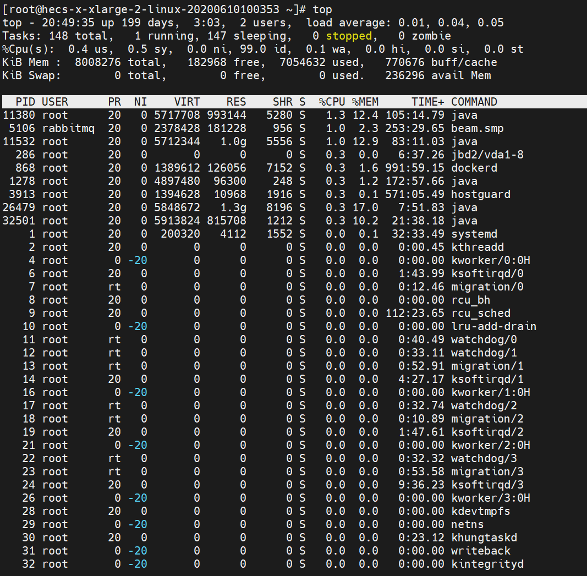

# 个人常用 Linux 命令 <Badge type="warning" text="持续更新" />

<!-- more -->

## 系统相关

::: tip 已测试系统
CentOS 7.5、8.2
:::

### 查询系统详情

```shell
# 详细输出所有信息，依次为内核名称，主机名，内核版本号，内核版本，硬件名，处理器类型，硬件平台类型，操作系统名称
uname -a
```



### 查询系统发行版本

```shell
# 只适合Redhat系的Linux
cat /etc/redhat-release
```


### 查看CPU信息

```shell
# 逻辑CPU数量和CPU型号
cat /proc/cpuinfo | grep name | cut -f2 -d: | uniq -c
```


```shell
# CPU真实数量（有时候虽然逻辑CPU是8核，但可能是由两颗4核CPU构成的）
cat /proc/cpuinfo | grep physical | uniq -c
```


### 查询环境变量

```shell
env

# 过滤环境变量中的配置
env | grep xxx
```

### 编辑环境变量

1. 编辑 /etc/profile 文件

   ```shell
   vim /etc/profile
   ```

2. 在文件末尾插入环境变量配置

   打开编辑器后，按下 shift + g，跳转到文件末尾，按 o 进入插入模式，将下方配置插入进去后，按 ESC 进入一般模式，再按 :wq 保存并退出。

   例如：插入 JAVA_HOME 环境变量配置

   ```shell
   JAVA_HOME=/opt/disk/java/jdk1.8.0_202
   CLASSPATH=.:$JAVA_HOME/lib.tools.jar
   PATH=$JAVA_HOME/bin:$PATH
   export JAVA_HOME CLASSPATH PATH
   ```

3. 重新加载 /etc/profile 文件，使最新配置生效

   ```shell
   source /etc/profile
   ```

### 查询端口占用

```shell
# 查询指定端口占用情况，还可以显示出占用该端口的进程 PID
netstat -anp | grep 端口号
```

### 查询程序位置

```shell
whereis 程序名
```

## 防火墙相关

::: tip 已测试系统
CentOS 7.5、8.2
:::

### 查看防火墙状态

```shell
systemctl status firewalld
```

### 开启防火墙

```shell
systemctl start firewalld
```

### 关闭防火墙

```shell
systemctl stop firewalld
```

### 查看开放的端口列表

```shell
firewall-cmd --zone=public --list-ports
```

### 查看防火墙某个端口是否开放

```shell
firewall-cmd --query-port=端口号/tcp
```

### 开放端口

```shell
# 开放某个端口
firewall-cmd --zone=public --add-port=端口号/tcp --permanent
# 开放指定端口范围
firewall-cmd --zone=public --add-port=端口号起-端口号止/tcp --permanent
```

### 关闭端口

```shell
firewall-cmd --zone=public --remove-port=端口号/tcp --permanent
```

### 重启防火墙（防火墙配置立即生效）

```shell
firewall-cmd --reload
```

## 系统服务相关

::: tip 已测试系统
CentOS 7.5、8.2
:::

### 查看服务状态

```shell
systemctl status 服务名
```

### 重新加载服务配置

```shell
systemctl daemon-reload
```

### 启动服务

```shell
systemctl start 服务名
```

### 停止服务

```shell
systemctl stop 服务名
```

### 重启服务

```shell
systemctl restart 服务名
```

### 设置服务开机自启

```shell
# 开机自启
systemctl enable 服务名

# 取消服务开机自启
systemctl diable 服务名
```

### 创建服务

1. 创建并编辑服务文件

   ```shell
   vim /etc/systemd/system/服务名.service
   ```

2. 编写服务配置

   ```shell
   [Unit]
   Description=服务描述
   Wants=network-online.target
   After=network-online.target
   
   [Service]
   # 设置环境变量
   Environment="xxx=xxx"
   # 设置服务执行命令或脚本
   ExecStart=/bin/bash xxx.sh
   KillSignal=SIGTERM
   
   [Install]
   WantedBy=multi-user.target
   ```

3. 重新加载服务配置

   ```shell
   systemctl daemon-reload
   ```

4. 启动服务

   ```
   systemctl start 服务名
   ```

5. 设置服务开机自启

   ```shell
   systemctl enable 服务名
   ```

## 监控相关

::: tip 已测试系统
CentOS 7.5、8.2
:::

### 查询RAM信息(内存)

```shell
# 用于查看有关系统 RAM 使用情况的信息（带大小单位）
free -h
```


### 查询ROM信息(磁盘)

```shell
# 以磁盘分区为单位查看文件系统，可以获取硬盘被占用了多少空间，目前还剩下多少空间等信息
df -h
```



### 查看当前进程状态

```shell
ps
```

#### 常见用法

```shell
# 查询指定进程
ps -ef | grep 进程关键字
```

查询后我们往往还会使用 `kill` 或 `pkill` 命令来结束指定进程。

```shell
# 通过进程ID，结束指定进程（-9代表无条件退出）
kill -9 进程ID

# 通过进程名，结束指定进程
# 例如：nginx启动后是两个进程，想要结束还需要分别 kill -9，直接 pkill -9 nginx 一次就搞定了
pkill -9 进程名
```

### 实时显示进程状态

```shell
# 空格键手动刷新，按 q 键退出
top
```

::: tip 笔者说
top 命令也是用来查看进程状态的，相比于 ps 命令，top 命令不同之处如下：
1. top 命令可以持续监视进程信息，ps 命令是进程运行情况的 "快照"
2. top 命令可以监视CPU负载、内存负载等综合系统信息
3. top 命令可以监视进程的CPU、内存占用情况，按占用资源的大小降序排列
3. top 命令可以操作进程，改变进程优先级

简单记忆的话就是：ps 命令一般是用于查看某个进程是否在运行的命令，而 top 命令一般是用于查看哪些进程占用CPU、内存较高，好让我们能对它进行“优化”的命令。
:::



前 5 行是系统整体统计信息，包含系统情况、进程情况、CPU情况、内存情况在内的综合内容。

第 1 行是系统情况：

| 内容                           | 含义                                                         |
| :----------------------------- | :----------------------------------------------------------- |
| 20:49:35 up 199 days           | 当前系统时间及系统运行时长                                   |
| 2 users                        | 当前登录用户数                                               |
| load average: 0.01, 0.04, 0.05 | 系统负载，即任务队列的平均长度。 三个数值分别为 1分钟、5分钟、15分钟前到现在的平均值。 |

第 2 行是进程情况：

| 内容         | 含义             |
| :----------- | :--------------- |
| xxx total    | 进程总数         |
| xxx running  | 正在运行的进程数 |
| xxx sleeping | 睡眠的进程数     |
| xxx stopped  | 停止的进程数     |
| xxx zombie   | 僵尸进程数       |

第 3 行是 CPU 情况：（当有多个 CPU 时，会有多行显示）

| 内容                     | 含义                                                         |
| :----------------------- | :----------------------------------------------------------- |
| us                       | 用户空间占用 CPU 百分比                                      |
| sy                       | 内核空间占用 CPU 百分比                                      |
| ni                       | 用户进程空间内改变过优先级的进程占用CPU百分比                |
| id (idle)                | 空闲 CPU 百分比                                              |
| wa                       | 等待输入输出的 CPU 时间百分比                                |
| hi (hardware IRQ)        | 硬中断占用 CPU 的百分比                                      |
| si (software interrupts) | 软中断占用 CPU 的百分比                                      |
| st (steal time)          | 当 hypervisor 服务另一个虚拟处理器的时候，虚拟 CPU 等待实际 CPU 的时间的百分比 |

第 4 行是物理内存情况：

| 内容           | 含义                     |
| -------------- | ------------------------ |
| total          | 物理内存总量             |
| free           | 空闲的物理内存量         |
| used           | 使用的物理内存量         |
| buffers/cached | 用作内核缓存的物理内存量 |

第 5 行是交换区内存情况：

| 内容      | 含义           |
| --------- | -------------- |
| total     | 交换区总量     |
| used      | 使用的交换区量 |
| free      | 空闲的交换区量 |
| avail Mem | 可用的内存量   |

再往下的信息表，每列信息的含义如下：

| 内容                        | 含义                                                         |
| --------------------------- | ------------------------------------------------------------ |
| PID                         | 进程ID                                                       |
| USER                        | 进程所有者                                                   |
| PR                          | 优先级（由内核动态调整，用户不可调整）                       |
| NI                          | 进程优先级（负值表示高优先级，正值表示低优先级，用户可调整） |
| VIRT (virtual memory usage) | 进程所使用的虚拟内存                                         |
| RES (resident memory usage) | 进程所使用的物理内存                                         |
| SHR (shared memory)         | 进程所使用的共享内存                                         |
| S (status)                  | 进程状态（D：不可中断的睡眠状态；R：运行中或可运行状态；S：睡眠状态；T：已跟踪/已停止状态；Z：僵停状态） |
| %CPU                        | 进程使用的 CPU 百分比                                        |
| %MEM                        | 进程使用的物理内存百分比                                     |
| TIME+                       | 进程使用的 CPU 时间总计，单位1/100秒                         |
| COMMAND                     | 命令名                                                       |

### 查看socket状态

```shell
# -t：显示 tcp socket
# -a：显示所有的
# -l：显示本地打开的端口
ss -tal
```

## 文件和目录相关

::: tip 已测试系统
CentOS 7.5、8.2
:::

### 创建文件

```shell
touch 文件名
```

### 创建目录

```shell
# -p 表示当该目录的父目录不存在时，会自动创建
mkdir -p 目录路径
```

例如：

- `mkdir -p /opt/disk/software` 创建 software 目录
- `mkdir -p /opt/disk/{software,data}` 同时创建 software 和 data 两个目录，甚至可以更多

### 删除文件或目录

```shell
# -r 对目录进行递归删除，包含子目录
# -f 删除时不进行确认
rm -rf 文件名/目录名
```

如果想删除指定目录下除某个文件及某个目录之外的所有文件，可以试试通配符匹配：

```shell
# 但使用前先记得开启通配符功能，可以通过 shopt -s 查看是否开启了，on 表示已经开启
# shopt -s extglob
rm -rf !(target_file|target_dir)
```

### 复制文件或目录

```shell
cp 文件名/目录名 目录路径
```

例如：

- `cp test test2`：
  - 如果 test2 目录存在，表示将 test 目录复制一份到 test2 目录下
  - 如果 test2 目录不存在，表示将 test 目录在当前目录下复制一份，命名为 test2 目录（cp 命令还可以在复制时实现文件/目录的重命名操作）

::: tip 无法执行的强制覆盖
大多数情况下，命令后带上 `-f` 参数就代表要强制执行，不需要进行确认输入。可当我们在 cp 命令后加上 `-f` 命令后，却发现当指定位置下存在同名文件/目录时，它依然会提示我们要进行确认。这是为什么呢？  

输入 `alias cp` 命令，然后可以看到这么一行输出，它输出的内容在告诉我们 cp 命令实际上是 `cp -i` 命令的别名  。

`alias cp='cp -i'`  

它代表着 cp 命令在执行时，实际执行的是 `cp -i`，`-i` 表示如果要复制到位置已经有同名文件，会进行确认提示是否覆盖。  

如果你依然想强制覆盖，有两种方法：
1. 使用原生 cp 命令：`/bin/cp -rf 文件名/目录名 目录路径`
2. 临时接触 cp 命令别名设置：`unalias cp` 
:::

### 剪切/移动文件或目录

```shell
mv 文件名/目录名 目录路径
```

例如：`mv` 命令不需要 `-r` 命令，即可递归移动子目录

- `mv test test2`：
  - 如果 test2 目录存在，表示将 test 目录移动到 test2 目录下
  - 如果 test2 目录不存在，表示将 test 目录重命名为 test2（mv 命令还可以在剪切/移动时实现文件/目录的重命名操作，所以，虽然 Linux 中没有重命名命令，但你只要在原目录下对文件/目录进行剪切/移动，那就可以实现重命名的效果了）

### 编辑文件

```shell
# 如果指定位置不存在该名称文件，则在保存时自动新建
vi 文件名
# vim 是 vi 的升级版，类似于 notepad 和 notepad++，额外支持语法高亮等功能
vim 文件名
```

常见操作：

- 一般模式（默认进入一般模式，此时为只读状态）

  - 按 `i` 键：进入插入模式，在当前光标左侧插入

  - 按 `I` 键：进入插入模式，在当前光标所在行行首插入

  - 按 `a` 键：进入插入模式，在当前光标右侧插入

  - 按 `A` 键：进入插入模式，在当前光标所在行行尾插入

  - 按 `o` 键：进入插入模式，在当前光标所在行下一行插入

  - 按 `O` 键：进入插入模式，在当前光标所在行上一行插入
  - 按 `r` 键：可以对光标所在位置进行替换，适合替换一个错误字符的情况
  - 按 `yy` 键：复制当前光标所在行
    - 按 `p` 键：将按 `yy` 键复制的内容，粘贴到当前光标的下一行
  - 按 `:` 键：进入底行模式/命令模式

- 插入模式

  - 按 `ESC` 键：退回到一般模式

- 底行模式/命令模式

  - 输入 `w`：保存不退出
  - 输入 `q`：退出（如果修改了文件，无法退出，只能使用强制退出）
  - 输入 `wq` / `x`：保存并退出
  - 输入 `q!`：强制退出

### 查找文件

```shell
find 目录名 -name 文件名关键词 
```

例如：

- `find / -name nginx`：全盘查找 nginx 文件

## 下载工具

cURL 是一个网络数据传输项目，通常说 cURL 是指 curl 命令行工具，它支持 DICT、FILE、FTP、FTPS、Gopher、HTTP、HTTPS、IMAP、IMAPS、LDAP、LDAPS、POP3、POP3S、RTMP、RTSP、SCP、SFTP、SMB、SMBS、SMTP、SMTPS、Telnet 与 TFTP 等协议，而 curl 的底层使用的是 libcurl 库，libcurl 与 curl 组成了 cURL 项目。

```shell
# -f(--fail)：表示在服务器错误时，阻止一个返回的表示错误原因的 HTML 页面，而由 curl 命令返回一个错误码 22 来提示错误
# -s(--silent)：不显示错误和进度信息
# -S(--show-error)：指定只输出错误信息，通常与 -s 一起使用
# -L(--location)：让 HTTP 请求跟随服务器的重定向，curl 默认不跟随重定向
curl -fsSL https://get.docker.com
```

