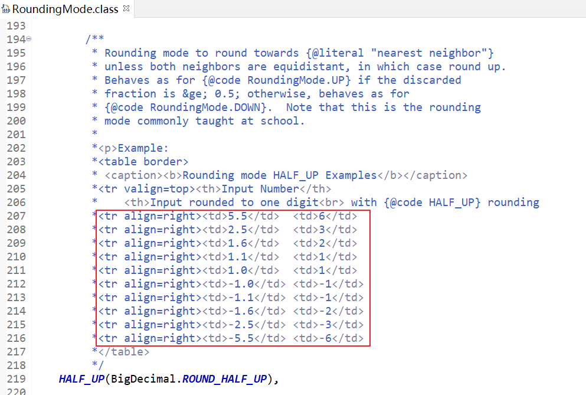

# 精密计算工具类-BigDecimal

## 前言

**C：** 下方有两个 double 浮点数据在进行减法计算，你先猜测一下输出结果是多少？

```java
System.out.println(16.27 - 3.12);
```

当然了，可能有小部分同学会怀疑笔者在玩弄你们的智商，其实不是，笔者是在玩弄你们的感情。


圆规正转，这结果究竟是多少？不是 **13.15** 吗？还真不是，结果是 **13.149999999999999** 。


**你：** 学了这么多年的数学，连两位的加减法都不行了吗？果然不是这块料儿。

::: tip 笔者说
其实，你没算错，错的是计算机。16.27 和 3.12 这两个数字都是十进制，而我们都知道，计算机中是使用二进制来进行存储的，所以这意味着我们要使用 16.27 和 3.12 的时候，它会先做一次十进制到二进制的转换。由于计算机中存储浮点数时的特殊规则，部分浮点数会在这个过程中损失精度，结果自然就会出错了。而且它也不只是 Java 语言的专属问题，大多数语言都有这问题。[1]
:::


所以啊，一些需要精确计算的时候，你还敢用 double、float 类型吗？

不过也别着急，虽然不能用它们，但 Java 中也给你想好了招儿，Java 中提供了一个类型 BigDecimal ，可以帮助我们解决此类精确计算问题，一起来瞧瞧。

<!-- more -->

## 简介

::: tip BigDecimal 简介
BigDecimal 是 Java 在 java.math 包中提供的一个计算类，是用来对超过 16 位有效位的数进行精确运算的。  

在 《Effective  Java》 一书中，就有提到 float 和 double 只能用来做科学计算或者是工程计算，在商业计算中要用 java.math.BigDecimal。[2]
:::

## 使用

### 构造方法

BigDecimal 作为一个类，要先利用构造方法创建对象之后才能使用。

它的构造方法有很多，但是我们需要了解的只有两个。

```java
// 利用 double 浮点数值作为构造参数
BigDecimal(double val)
    
// 利用 字符串 作为构造参数[记得使用它]
BigDecimal(String val)
```

乍一看，是不是觉得第一种构造更方便？正好计算 double 类型数据，直接传入构造就可以用了，多好？

别着急，如果直接使用第一种 double 作为构造参数的方法，在一开始它又会出现前言提到的转换后精度缺失的问题，而且在第二种构造的源码注释中，有这么一句注意：它通常是将 float 或 double 转换为 BigDecimal 的首选方式。

所以说，未来我们要使用 BigDecimal 做精确计算的时候，还是得用第二种传入字符串的构造方法来创建 BigDecimal 对象。


用法就是下方这样的。

```java
// 通过字符串来创建 BigDecimal 对象
BigDecimal num1 = new BigDecimal("16.27");
BigDecimal num2 = new BigDecimal("3.12");
```

### 减法运算

创建好 BigDecimal 对象后，也别急着上来就 +、-、*、/，它可不再是基本数据类型，想要计算得用对应的方法。

```java
// 通过字符串来创建 BigDecimal 对象
BigDecimal num1 = new BigDecimal("16.27");
BigDecimal num2 = new BigDecimal("3.12");

// 减法运算
// subtract(BigDecimal subtrahend):BigDecimal
BigDecimal result = num1.subtract(num2);
System.out.println(result); // 13.15
```

你看，BigDecimal 果然没辜负我们的期望，这回就没有再出现之前的浮点数问题。

如果计算完后，我们还要使用 double 来存储数据，BigDecimal 中还有对应的转换方法。

```java
// 转换为 double 类型
// doubleValue():double
double doubleValue = result.doubleValue();
```

### 加法运算

```java
// 通过字符串来创建 BigDecimal 对象
BigDecimal num1 = new BigDecimal("16.27");
BigDecimal num2 = new BigDecimal("3.12");

// 加法运算
// add(BigDecimal augend):BigDecimal
BigDecimal result = num1.add(num2);
System.out.println(result); // 19.39
```

### 乘法运算

```java
// 通过字符串来创建 BigDecimal 对象
BigDecimal num1 = new BigDecimal("16.27");
BigDecimal num2 = new BigDecimal("3.12");

// 乘法运算
// multiply(BigDecimal multiplicand):BigDecimal
BigDecimal result = num1.multiply(num2);
System.out.println(result); // 50.7624
```

### 除法运算

除法运算稍微有些复杂，要考虑保留的小数位及舍入模式的问题。

```java
// 通过字符串来创建 BigDecimal 对象
BigDecimal num1 = new BigDecimal("16.27");
BigDecimal num2 = new BigDecimal("3.12");

// 除法运算
// 方法参数1：除数 
// 方法参数2：小数点后保留几位
// 方法参数3：舍入模式，例：四舍五入等
// divide(BigDecimal divisor, int scale, int roundingMode):BigDecimal

// JDK 1.5 出现了枚举类型，定义RoundingMode枚举类优化了原来在BigDecimal中的舍入模式常量
// divide(BigDecimal divisor, int scale, RoundingMode roundingMode):BigDecimal
// 例如：四舍五入保留两位小数
BigDecimal result = num1.divide(num2, 2, RoundingMode.HALF_UP);
System.out.println(result); // 5.21
```

JDK 1.5 之前，BigDecimal 类中提供的舍入模式常量们。

```java
public class BigDecimal extends Number implements Comparable<BigDecimal> {
    // ...略...
    
    // Rounding Modes
    // 向外取整模式：向远离零的方向舍入
    public final static int ROUND_UP = 0;
    // 向内取整模式：向接近零的方向舍入
    public final static int ROUND_DOWN = 1;
    // 向上取整模式：向正无穷大的方向舍入
    public final static int ROUND_CEILING = 2;
    // 向下取整模式：向负无穷大的方向舍入
    public final static int ROUND_FLOOR = 3;
    // 四舍五入
    public final static int ROUND_HALF_UP = 4;
    // 五舍六入
    public final static int ROUND_HALF_DOWN = 5;
    // 四舍六入五取偶(银行家舍入法)
    public final static int ROUND_HALF_EVEN = 6;
    // 不需要舍入
    public final static int ROUND_UNNECESSARY = 7;

    // ...略...
}
```

JDK 1.5 开始，定义了一个 RoundingMode 专门作为舍入模式的枚举类。

```java
public enum RoundingMode {

    UP(BigDecimal.ROUND_UP),
    
    DOWN(BigDecimal.ROUND_DOWN),

    CEILING(BigDecimal.ROUND_CEILING),
    
    FLOOR(BigDecimal.ROUND_FLOOR),

    HALF_UP(BigDecimal.ROUND_HALF_UP),

    HALF_DOWN(BigDecimal.ROUND_HALF_DOWN),

    HALF_EVEN(BigDecimal.ROUND_HALF_EVEN),

    UNNECESSARY(BigDecimal.ROUND_UNNECESSARY);
    
    // ...略...
}
```

::: tip 笔者说
关于舍入模式，非数学专业出身的同学看着中文 API 都难以理解，这些枚举值在实际使用的时候再翻阅也来得及（银行、帐户、计费等领域）。[3]  

当然，最常用的就是 HALF_UP，也就是四舍五入。
:::



## 封装工具类

我们也看到了，如果直接使用 BigDecimal 类，光是构造方法要传入字符串，就够吃一壶的了，尤其计算完后大概率还要转回 double，程序员怎么可能接受这种代码？赶紧封装，上工具类！

```java
/**
 * 浮点数精确运算工具类
 */
public class BigDecimalUtil {

    // 私有化构造
    private BigDecimalUtil() {}
    
    /**
     * 加法运算
     * @param v1 被加数
     * @param v2 加数
     * @return 和
     */
    public static double add(double v1, double v2) {
        BigDecimal b1 = new BigDecimal(Double.toString(v1));
        BigDecimal b2 = new BigDecimal(Double.toString(v2));
        return b1.add(b2).doubleValue();
    }
	
    /**
     * 减法运算
     * @param v1 被减数
     * @param v2 减数
     * @return 差
     */
    public static double subtract(double v1, double v2) {
        BigDecimal b1 = new BigDecimal(Double.toString(v1));
        BigDecimal b2 = new BigDecimal(Double.toString(v2));
        return b1.subtract(b2).doubleValue();
    }
	
    /**
     * 乘法运算
     * @param v1 被乘数
     * @param v2 乘数
     * @return 积
     */
    public static double multiply(double v1, double v2) {
        BigDecimal b1 = new BigDecimal(Double.toString(v1));
        BigDecimal b2 = new BigDecimal(Double.toString(v2));
        return b1.multiply(b2).doubleValue();
    }
	
    /**
     * 除法运算（四舍五入）
     * @param v1 被除数
     * @param v2 除数
     * @param scale 小数点后保留几位
     * @return 商
     */
    public static double divide(double v1, double v2, int scale) {
        if (scale < 0) {
            throw new IllegalArgumentException("保留的小数位不能少于0个！");
        }
        BigDecimal b1 = new BigDecimal(Double.toString(v1));
        BigDecimal b2 = new BigDecimal(Double.toString(v2));
        return b1.divide(b2, scale, RoundingMode.HALF_UP).doubleValue();
    }
	
    /**
     * 四舍五入处理
     * @param v 需要四舍五入的数字
     * @param scale 小数点后保留几位
     * @return 四舍五入后的结果
     */
    public static double round(double v, int scale) {
        if (scale < 0) {
            throw new IllegalArgumentException("保留的小数位不能少于0");
        }
        BigDecimal b1 = new BigDecimal(Double.toString(v));
        BigDecimal b2 = new BigDecimal("1");
        return b1.divide(b2, scale, RoundingMode.HALF_UP).doubleValue();
    }
	
}
```

## 参考资料

[1]为什么在处理金额时不能用Double和Float，计算机是如何存储浮点数的：https://blog.csdn.net/qq_41872247/article/details/107861608

[2]java.math.BigDecimal类的用法：https://www.iteye.com/blog/jeelee-652003

[3]BigDecimal中的取整模式：https://blog.csdn.net/u010523770/article/details/53068809

## 后记

**C：** 好了，BigDecimal 类的介绍到这儿就结束了，认识了 BigDecimal 之后，可千万别再用 double 、float 来进行精确计算了。
