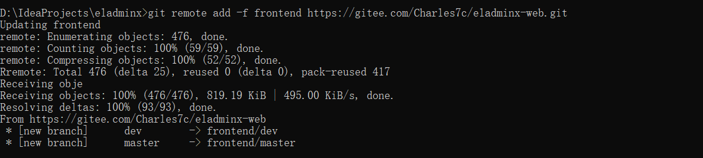

# 合并两个Git仓库的历史提交记录

## 前言

**C：** 最近在下班的时间一直在维护一个基于 EL-Admin 这个开源后台管理系统的衍生开源项目。EL-Admin 这个项目是采用前后端分离架构开发的，所以在开源平台上是分为了两个项目库，一个前端的，一个后端的。

这本无可厚非，分成两个项目库，在开发时还是挺友好的，公司内部基本也是这个模式，但对于一个开源项目来说，分散为两个库还是有一些不利的方面。

1. 在管理 issue 上不太方便，项目作者要兼顾查看两个项目，而且有些小伙伴在提出 issue 时并不会管你这是前端库还是后端库，提就完事了。在这方面，EL-Admin 项目的作者应该也发现了这个问题，所以直接干脆的关闭了前端库的 issue 功能，集中在后端库一起管理。
2. 在 star 方面会造成分流，前段时间看了看微博，在不知什么时候，竟然加入了一个明星超话，意外就看到置顶帖里标注了一点禁止创建其他小号超话，现在想想这不是一个意思吗？
3. ...

本来笔者最开始也是按原项目形式创建了两个 Git 仓库，但最近更换设备开发时单独要拉两次仓库，觉得很麻烦，思索了下突然意识到上述问题，干脆趁着这热乎劲儿，以后端仓库为主，把两个仓库合并一下。

## 解决方案

### 将前端项目提交到后端库

这是笔者首先想到的方法，即将前端项目拉下来，然后将前端项目的源码放到后端库里，提交一下。很简单粗暴，但是这种方法会造成之前前端项目历史提交记录的丢失。

### 不影响提交记录，合并仓库

笔者当然不希望将前端项目的历史提交记录丢失了，所以最终采用了下方的方案，完整步骤如下：

::: tip 笔者说

提示说明一下，后端仓库名叫：eladminx，前端仓库名叫：eladminx-web

:::

1. 克隆后端项目仓库到本地（笔者没有在 git bash 中操作，而是在 cmd 中进行的）

   ```sh
   git clone https://gitee.com/Charles7c/eladminx.git
   cd eladminx
   ```

   

2. 将前端仓库作为后端仓库的远程仓库，起别名为 frontend（这个随便起）

   ```sh
   git remote add -f frontend https://gitee.com/Charles7c/eladminx-web.git
   ```

   

3. 将前端仓库的 master 分支（自己选择哪个分支）合并到后端仓库

   ```sh
   git merge --strategy ours --no-commit frontend/master
   ```

   

   想法很美，但是报错了：

   ```
   fatal: refusing to merge unrelated histories
   ```

   这是因为后端仓库的本地分支历史记录和前端仓库的历史记录不匹配，人家 Git 怀疑你是不是合并错了，但咱们知道就是要合并，写个声明 “表明出事儿与人家无关”就可以了。

   ```sh
   git merge --strategy ours --allow-unrelated-histories --no-commit frontend/master
   ```

   

4. 将前端仓库的 master 分支内容放到在后端仓库内刚建好的 eladminx-web 文件夹中

   ```sh
   mkdir eladminx-web
   git read-tree --prefix=eladminx-web/ -u frontend/master
   ```

5. 提交刚才的修改（毕竟你刚才又合并又创建文件夹的，肯定要提交修改啊）

   ```sh
   git commit -m "迁移前端项目仓库，与后端项目仓库合并"
   ```

6. 最后将本地的修改强制推送到远程仓库即可

   ```sh
   git push --force
   ```

到此为止，笔者这两个项目的 master 分支就合并完了，如果你想合并其他分支，例如：dev，那就首先把后端仓库的分支切换到 dev，然后将上述中的 master 这个分支名换为 dev 就可以了。

## 后记

**C：** 关于这个合并，你以哪个仓库为主都可以。最后合并的提交记录是以历史提交时间进行降序排列的。

