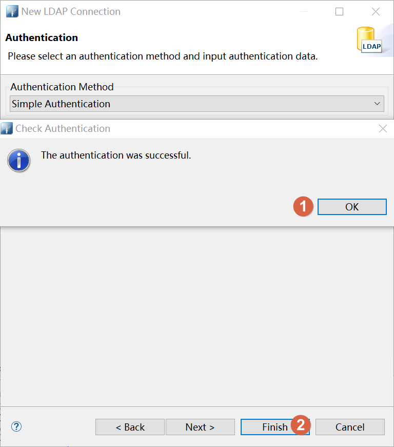

# Docker 安装 OpenLDAP 详细步骤

::: tip 笔者说
笔者下面的步骤及配置是基于指定版本的实践，大多数程序大多数情况下在相差不大的版本时可以直接参考。（当然了，即使是非 Docker 方式安装程序也是一样道理）  
:::

## 拉取镜像

::: warning 笔者说
拉取镜像时需要明确镜像版本（Tag）。
:::

不指定版本（Tag）就拉取镜像，那拉取下来的镜像版本（Tag）默认是 `latest`（最新的）。`latest` 会跟随 Docker Registry 中的记录变化，现在拉取下来的 `latest` 是 x1 版本，但隔了一段时间后你在其他机器上再拉取 `latest` 可能就是 x2 版本了。

变化的版本，不利于生产环境部署的稳定。无论是后续在其他环境部署还是扩容集群等场景均要求根据架构要求指定好版本。

```shell
docker pull osixia/openldap:1.5.0
```

## 运行容器

::: warning 笔者说
**下方的配置，切记要根据个人实际情况来修改。**  
:::

- 容器的名称
- 镜像名称:版本
- 是否设置自启动？
- 是否端口映射？
- 环境变量配置
- 映射的话映射到宿主机哪个端口？
- 是否挂载卷？
- 挂载的话要挂载宿主机哪个目录？
- ......
- 等自定义配置

```shell
# LDAP_ORGANISATION 组织名称，默认为 Example Inc
# LDAP_DOMAIN 域，默认为 example.org
# LDAP_ADMIN_PASSWORD 管理员密码，默认为 admin
# LDAP_TLS_VERIFY_CLIENT TLS验证客户端
#   demand：默认。检查客户端证书，没有证书或证书错误都将立即终止连接
#   try：检查客户端证书，没有证书（允许连接），证书错误（终止连接）
#   allow：检查客户端证书，没有证书或证书错误，都允许连接
#   never：不验证客户端证书
docker run -d \
--name openldap osixia/openldap:1.5.0 \
--restart=always \
-e LDAP_ORGANISATION="baidu" \
-e LDAP_DOMAIN="baidu.com" \
-e LDAP_ADMIN_PASSWORD="123456" \
-e LDAP_TLS_VERIFY_CLIENT=try \
-p 389:389 -p 636:636 \
-v /opt/disk/docker/volumes/openldap/conf:/etc/ldap/slapd.d \
-v /opt/disk/docker/volumes/openldap/data:/var/lib/ldap \
# 使用该参数，容器内的 root 用户才拥有真正的 root 权限
--privileged=true
```

## 验证

服务器开放好相应端口或设置好安全组规则后，我们使用 Apache Directory Studio 来验证一下。




## Docker Compose脚本

如果你是用的 docker-compose 来安装，下方附上相应 docker-compose.yml 脚本内容。

```yaml
version: '3'
services:
  openldap:
    container_name: openldap
    image: osixia/openldap:1.5.0
    restart: always
    environment:
      LDAP_ORGANISATION: baidu
      LDAP_DOMAIN: baidu.com
      LDAP_ADMIN_PASSWORD: 123456
      LDAP_TLS_VERIFY_CLIENT: try
    ports:
      - 389:389
      - 636:636
    volumes:
      - /opt/disk/docker/volumes/openldap/conf:/etc/ldap/slapd.d
      - /opt/disk/docker/volumes/openldap/data:/var/lib/ldap
    privileged: true
```

编写好 docker-compose.yml 脚本后，在脚本同级目录执行下方命令即可。

```shell
docker-compose up -d
```

