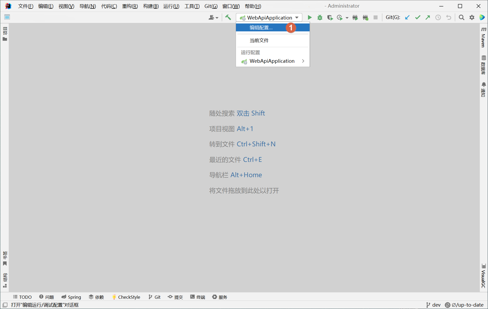
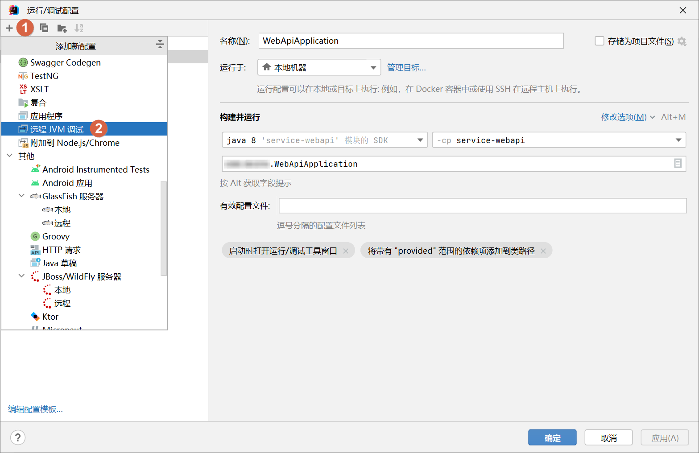

# 使用 IntelliJ IDEA 进行远程程序调试

**C：** 今天在测试环境出现了一个 “匪夷所思” 的问题，追踪日志、排查 Feign 日志，修改配置，尝试了很多种办法，均未解决。最终决定对测试环境进行远程程序调试来看看。

在开发时用 IDE 的断点调试倒是相对便捷，但到了部署好的环境，再使用 IDE 来调试，就要麻烦一些了。下面就跟着笔者来看看使用 IntelliJ IDEA 实现远程 Debug 的步骤吧。

<!-- more-->

::: tip 笔者说
由于笔者安装了 [Chinese（Simplified）Language Pack / 中文语言包] 插件，所以下方步骤的 IntelliJ IDEA 界面都是中文的，各位同学如果用的是默认语言包，那就参照着看吧。
:::

## 新增远程调试配置

点开运行程序下拉菜单，点击 [编辑配置...]。



在打开的 [运行/调试配置] 窗口，点击左上角 [+] 号，随后在弹出的 [添加新配置] 下拉菜单中，下拉找到 [远程 JVM 调试]，点击即可添加远程调试配置。



按照下图序号顺序，依次设置好 [名称]、[主机]、[端口]、[JDK 版本]，然后先复制一下下图红框中的 [远程 JVM 的命令行实参]，点击 [确定] 完成远程调试配置添加。

::: warning 笔者说
这里主要就注意一下主机和端口两个配置、主机是你要远程调试的程序所在服务器的 IP/域名，但端口可不是你要远程调试的程序所占用的端口。这个端口是远程调试端口，也不能和程序端口相同。
:::


## 修改启动命令

添加完配置之后，就立刻能开始调试吗？当然不是了，很简单的问题，如果我们只需要在 IntelliJ IDEA 中配置两下就能直接连接程序调试，那 Java 程序的安全性也太低了吧。

刚才笔者让你复制的 [远程 JVM 的命令行实参]，是 IntelliJ IDEA 基于我们刚才的配置帮我们生成的，我们需要将这个 JVM 命令行参数加到你要远程调试的程序启动命令中。

例如：

```shell
# -agentlib:jdwp=transport=dt_socket,server=y,suspend=n,address=5005
java -jar -agentlib:jdwp=transport=dt_socket,server=y,suspend=n,address=5005 你的程序名.jar --spring.profiles.active=test
```

好了，还差最后一步，把你配置的远程调试端口放开。

## 启动远程调试

回到 IDE 中，点击 [Debug 运行] 按钮，如果控制台窗口出现下方提示，那么接下来该怎么加断点，该怎么触发断点，该怎么进行调试就不用笔者过多介绍了吧？

```shell
# Connected to the target VM, address: ''xxx:5005', transport: 'socket''
已连接到目标 VM，地址：''xxx:5005', 传输: '套接字''
```


远程调试完后别忘了把远程调试端口关闭，该删除安全组规则就删除。

::: tip 笔者说
哦对了，笔者这 “匪夷所思” 的问题到底解决了没有呢？当然解决了，而且这个问题不是代码的问题，而是一位远程办公的同事在他本地连接了测试环境数据库（这在笔者项目开发时强调过不允许连接），他的程序一直运行着把测试环境的一些任务数据处理了。  

具体的不多说，因为当你调试时程序运行正常，断开调试再试就出错，而且在你没调试前添加的部分日志埋点也没输出时，其实就应该摒弃所谓的 “不可能”，即：程序没有在你预想的机器上运行。毕竟福尔摩斯有句话：“排除一切不可能的，剩下的即使再不可能，那也是真相”。
:::
