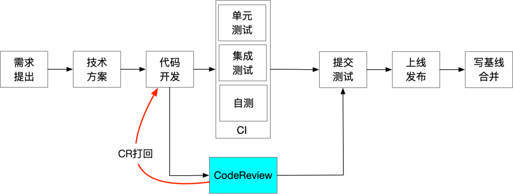

# 阿里巴巴的Code Review方法论与实践总结

作为卓越工程文化的一部分，Code Review 其实一直在进行中，只是各团队根据自身情况张驰有度，松紧可能也不一，这里简单梳理一下 CR 的方法和团队实践。

<!-- more -->

## 为什么要CR

- **提前发现缺陷**
  在CodeReview阶段发现的逻辑错误、业务理解偏差、性能隐患等时有发生，CR可以提前发现问题。
- **提高代码质量**
  主要体现在代码健壮性、设计合理性、代码优雅性等方面，持续CodeReview可以提升团队整体代码质量。
- **统一规范和风格**
  集团编码规范自不必说，对于代码风格要不要统一，可能会有不同的看法，个人观点对于风格也不强求。但代码其实不是写给自己看的，是写给下一任看的，就像经常被调侃的“程序员不喜欢写注释，更不喜欢别人不写注释”，代码风格的统一更有助于代码的可读性及继任者的快速上手。
- **防止架构腐烂**
  架构的维护者是谁？仅靠架构师或应用Owner是远远不够的，需要所有成员的努力，所谓人人都是架构师。架构防腐最好前置在设计阶段，但CodeReview作为对最终产出代码的检查，也算是最后一道关键工序。
- **知识分享**
  每一次CodeReview，都是一次知识的分享，磨合一定时间后，团队成员间会你中有我、我中有你，集百家之所长，融百家之所思。同时，业务逻辑都在代码中，团队CodeReview也是一种新人业务细节学习的途径。
- **团队共识**
  通过多次讨论与交流，逐步达成团队共识，特别是对架构理解和设计原则的认知，在共识的基础上团队也会更有凝聚力，特别是在较多新人加入时尤为重要。

## 他山之石

### 某大厂A

非常重视 Code Review，基本上代码需要至少有两位以上 Reviewer 审核通过后，才会让你 Check In。

#### 代码评审规则

- 如果变更达到可以提升系统整体代码质量的程度，就可以让它们通过，即使它们可能还不完美。这是所有代码评审准则的最高原则。
- 世界上没有“完美”的代码，只有更好的代码。**评审者不应该要求代码提交者在每个细节都写得很完美。评审者应该做好修改时间与修改重要性之间的权衡。**

#### 代码评审原则

- 以客观的技术因素与数据为准，而非个人偏好。
- 在代码样式上，遵从代码样式指南，所有代码都应与其保持一致，任何与代码样式指南不一致的观点都是个人偏好。但如果某项代码样式在指南中未提及，那就接受作者的样式。
- 任务涉及软件设计的问题，都应取决于基本设计原则，而不应由个人喜好来决定。当同时有多种可行方案时，如果作者能证明（以数据或公认的软件工程原理为依据）这些方案基本差不多，那就接受作者的选项；否则，应由标准的软件设计原则为准。
- 如果没有可用的规则，那么审核者应该让作者与当前代码库保持一致，至少不会恶化代码系统的质量。（一旦恶化代码质量，就会带来**破窗效应**，导致系统的代码质量逐渐下降）

#### 代码审核者应该看什么

- **设计**：代码是否设计良好？这种设计是否适合当前系统？
- **功能**：代码实现的行为与作者的期望是否相符？代码实现的交互界面是否对用户友好？
- **复杂性**：代码可以更简单吗？如果将来有其他开发者使用这段代码，他能很快理解吗？
- **测试**：这段代码是否有正确的、设计良好的自动化测试？
- **命名**：在为变量、类名、方法等命名时，开发者使用的名称是否清晰易懂？
- **注释**：所有的注释是否都一目了然？
- **代码样式**：所有的代码是否都遵循代码样式？
- **文档**：开发者是否同时更新了相关文档？

### 某大厂B

- 在开发流程上专门有这个环节，排期会明确排进日程，比如 5 天开发会排 2 天来做代码审核，分为代码自审、交叉审核、集中审核。
- 有明确的量化指标，如 8 人时审核/每千行代码，8 个以上非提示性有效问题/每千行代码。

### 某大厂C

- 推行 Code Owner 机制，每个代码变更必须有 Code Owner 审核通过才可以提交。
- 所有的一线工程师，无论职级高低，最重要的工程输出原则是 “show me the code”，而 Code Review 是最能够反应这个客观输出的。
- 尽量让每个人的 Code Review 参与状况都公开透明，每个变更发送给项目合作者，及转发到小组内成员，小组内任何人都可以去 Review 其他人的代码。
- 明确每个人的考评和 Code Review 表现相关，包括 Code Review 输出状况及提交代码的质量等。

## 我们怎么做CR

### 作为代码提交者

- **发起时机**：发起 Code Review 尽量提前，开发过程小步快跑

  

- **代码行数**：提交 Code Review 的代码行数最好在 400 行以下。根据数据分析发现，从代码行数来看，超过 400 行的 CR，缺陷发现率会急剧下降；从CR速度来看，超过 500 行/小时后，Review 质量也会大大降低，一个高质量的 CR 最好控制在一个小时以内。

- **明确意图**：编写语义明确的**标题**（必填）和**描述**（选填，可以包括背景、思路、改造点和影响面、风险等）

- **善用工具**：IDEA 打开编码规约实时检测，减少代码样式、编码规约等基础性问题
  （阿里编码规约插件：https://github.com/alibaba/p3c/tree/master/idea-plugin）

### 作为代码评审者

#### 评审范围

主要从两方面来评审：

- 代码逻辑
  - **功能完整**：代码实现是否满足功能需求，实现上有没有需求的理解偏差，对用户是否友好；
  - **逻辑设计**：是否考虑了全局设计和兼容现有业务细节，是否考虑边界条件和并发控制；
  - **安全隐患**：是否存在数据安全隐患及敏感信息泄漏，如越权、SQL 注入、CSRF、敏感信息未脱敏等；
  - **性能隐患**：是否存在损害性能的隐患，如死锁、死循环、FullGC、慢 SQL、缓存数据热点等；
  - **测试用例**：单元测试用例的验证逻辑是否有效，测试用例的代码行覆盖率和分支覆盖率；
- 代码质量
  - **编码规范**：命名、注释、领域术语、架构分层、日志打印、代码样式等是否符合规范
  - **可读性**：是否逻辑清晰、易理解，避免使用奇淫巧技，避免过度拆分
  - **简洁性**：是否有重复可简化的复杂逻辑，代码复杂度是否过高，符合 KISS 和 DRY 原则
  - **可维护性**：在可读性和简洁性基础上，是否分层清晰、模块化合理、高内聚低耦合、遵从基本设计原则
  - **可扩展性**：是否仅仅是满足一次性需求的代码，是否有必要的前瞻性扩展设计
  - **可测试性**：代码是否方便写单元测试及分支覆盖，是否便于自动化测试


#### 评审注意事项

- 尽快完成评审
- 避免过度追求完美
- 明确评论是否要解决
- 避免使用反问句来评价

我们主要是通过交叉 CR、集中 CR 相结合的方式，由应用 Owner + SM + 架构师 + TL 完成。

## CR怎么避免流于形式

CR 流于形式的因素很多，大概如下：

- **不认同 CodeReview**
  - 评审者的姿态？有没有带来好处？有没有从中收获？这些都会直观影响团队成员的认可度
  - 每个 Review 建议的提出都是一次思想交流，评论要友好、中肯、具体，避免教条式及负面词汇，在遵守评审原则下，同时尊重个性展现
  - 团队集中 CodeReview 尽量不要太正式和严肃，轻松的气氛下更有助于互相理解，来点水果，聊聊业务聊聊代码
  - 在 Review 过程有时候会陷入谁对谁错的争论，只要是为了寻求真理辩证的去看问题，哪怕是讨论再激烈也是有收获的，注意只对事不对人。
- **CodeReview 后改动太大**
  - 发布前发现问题多，改动太大，影响项目计划
  - 大项目要求编码前设计评审，小需求可以事先 Review 设计思路，避免最后的惊喜
  - 每次 Review 的代码行数最好控制在数百行以内
- **评审者没有足够时间**
  - 评审者在任务安排上尽量预留好时间
  - 尽快评审，代码在百行以内及时响应，在千行以内当日完结
- **评审者不了解业务和代码**
  - 代码提交人编写清晰的标题和描述
  - 有必要的情况下评审者需要了解 PRD
  - 评审者需要提前了解系统和代码

- **Review 建议未修改**
  - 这一点极为重要，需要对修改后的代码再次 Review，确保理解一致，以及预防带问题上线
  - 应用可以设置 Review 建议需全部解决的卡点，同时对于非必需修改的建议可以进行打标或说明


## CR实践中发现的几个常见代码问题

笔者对个人 CR 评论问题做了个大概统计，Bug 发现数占比约 4%（直接或潜在 Bug），重复代码数占比约 5%，其他还有规范、安全、性能、设计等问题。在 CR 代码质量时，可以参考《重构：改善既有代码的设计》，书中所列的 22 种坏味道在 CR 中基本都会遇到。而此处我们主要聚焦以下几个常见问题：

### DRY

DRY 是 Don't Repeat Yourself 的缩写，DRY 是 Andy Hunt 和 Dave Thomas's 在《 The Pragmatic Programmer 》一书中提出的核心原则。DRY 原则描述的重复是知识和意图的重复，包含代码重复、文档重复、数据重复、表征重复，我们这里重点讲讲**代码重复**。

#### 代码重复

> 《重构》中对 “Duplicated Code（重复代码）” 的描述：
>
> 坏味道行列中首当其冲的就是 Duplicated Code。如果你在一个以上的地点看到相同的程序结构，那么可以肯定：设法将它们合而为一，程序会变得更好。  
>
>
> 最单纯的 Duplicated Code 就是“同一个类的两个函数含有相同的表达式”。这时候你需要做的就是采用 Extract Method (110) 提炼出重复的代码，然后让这两个地点都调用被提炼出来的那一段代码。  
> 
>
> 另一种常见情况就是“两个互为兄弟的子类内含相同表达式”。要避免这种情况，只需对两个类都使用 Extract Method (110)，然后再对被提炼出来的代码使用 Pull Up Method (332)，将它推入超类内。如果代码之间只是类似，并非完全相同，那么就得运用 Extract Method (110) 将相似部分和差异部分割开，构成单独一个函数。然后你可能发现可以运用 Form Template Method (345) 获得一个Template Method 设计模式。如果有些函数以不同的算法做相同的事，你可以选择其中较清晰的一个，并使用 Substitute Algorithm (139) 将其他函数的算法替换掉。  
> 
>
> 如果两个毫不相关的类出现 Duplicated Code，你应该考虑对其中一个使用 Extract Class (149)，将重复代码提炼到一个独立类中，然后在另一个类内使用这个新类。但是，重复代码所在的函数也可能的确只应该属于某个类，另一个类只能调用它，抑或这个函数可能属于第三个类，而另两个类应该引用这第三个类。你必须决定这个函数放在哪儿最合适，并确保它被安置后就不会再在其他任何地方出现。

代码重复的几种场景：

- 一个类中重复代码抽象为一个方法
- 两个子类间重复代码抽象到父类
- 两个不相关类间重复代码抽象到第三个类

::: code-group
``` java [反例]
private BillVO convertBillDTO2BillVO(BillDTO billDTO) {
    if (billDTO == null) {
        return null;
    }
    BillVO billVO = new BillVO();
    Money cost = billDTO.getCost();
    if (cost != null && cost.getAmount() != null) {
        billVO.setCostDisplayText(String.format("%s %s", cost.getCurrency(), cost.getAmount()));
    }
    Money sale = billDTO.getSale();
    if (sale != null && sale.getAmount() != null) {
        billVO.setSaleDisplayText(String.format("%s %s", sale.getCurrency(), sale.getAmount()));
    }
    Money grossProfit = billDTO.getGrossProfit();
    if (grossProfit != null && grossProfit.getAmount() != null) {
        billVO.setGrossProfitDisplayText(String.format("%s %s", grossProfit.getCurrency(), grossProfit.getAmount()));
    }
    return billVO;
}
```

``` java [正例]
private static final String MONEY_DISPLAY_TEXT_PATTERN = "%s %s";

private BillVO convertBillDTO2BillVO(BillDTO billDTO) {
    if (billDTO == null) {
        return null;
    }
    BillVO billVO = new BillVO();
    billVO.setCostDisplayText(buildMoneyDisplayText(billDTO.getCost()));
    billVO.setSaleDisplayText(buildMoneyDisplayText(billDTO.getSale()));
    billVO.setGrossProfitDisplayText(buildMoneyDisplayText(billDTO.getGrossProfit()));
    return billVO;
}

private String buildMoneyDisplayText(Money money) {
    if (money == null || money.getAmount() == null) {
        return StringUtils.EMPTY;
    }
    return String.format(MONEY_DISPLAY_TEXT_PATTERN, money.getCurrency(), money.getAmount().toPlainString());
}
```
:::

#### DYR实践忠告

- 不要借用 DRY 之名，过度提前抽象，请遵循 **Rule of three 原则**。
- 不要过度追求 DRY，破坏了内聚性，实践中需要**平衡复用与内聚**。

### Primitive Obsession

> 《重构》中对 “Primitive Obsession（基本类型偏执）” 的描述：
>
> 大多数编程环境都有两种数据：结构类型允许你将数据组织成有意义的形式；基本类型则是构成结构类型的积木块。结构总是会带来一定的额外开销。它们可能代表着数据库中的表，如果只为做一两件事而创建结构类型也可能显得太麻烦。  
>
>
> 对象的一个极大的价值在于：它们模糊（甚至打破）了横亘于基本数据和体积较大的类之间的界限。你可以轻松编写出一些与语言内置（基本）类型无异的小型类。例如，Java 就以基本类型表示数值，而以类表示字符串和日期——这两个类型在其他许多编程环境中都以基本类型表现。  
>
>
> 对象技术的新手通常不愿意在小任务上运用小对象——像是结合数值和币种的 money 类、由一个起始值和一个结束值组成的 range 类、电话号码或邮政编码（ZIP)等的特殊字符串。你可以运用 Replace Data Valuewith Object (175) 将原本单独存在的数据值替换为对象，从而走出传统的洞窟，进入炙手可热的对象世界。如果想要替换的数据值是类型码，而它并不影响行为，则可以运用 Replace Type Code with Class (218) 将它换掉。如果你有与类型码相关的条件表达式，可运用 Replace Type Codewith Subclass (213) 或 Replace Type Code with State/Strategy (227) 加以处理。  
>
>
> 如果你有一组应该总是被放在一起的字段，可运用 Extract Class(149)。如果你在参数列中看到基本型数据，不妨试试 IntroduceParameter Object (295)。如果你发现自己正从数组中挑选数据，可运用 Replace Array with Object (186)。

给我们的启示主要有两点：

- 大部分业务场景和语言环境下，结构化类型导致的开销基本可以忽略
- 结构化类型带来更清晰的语义和复用

::: code-group
``` java [反例]
@Data
public class XxxConfigDTO implements Serializable {

    private static final long serialVersionUID = 8018480763009740953L;

    /**
     * 租户ID
     */
    private Long   tenantId;
    /**
     * 工商税务企业类型
     */
    private String companyType;
    /**
     * 企业名称
     */
    private String companyName;
    /**
     * 企业纳税人识别号
     */
    private String companyTaxNo;
    /**
     * 审单员工工号
     */
    private String auditEmpNo;
    /**
     * 审单员工姓名
     */
    private String auditEmpName;
    /**
     * 跟单员工工号
     */
    private String trackEmpNo;
    /**
     * 跟单员工姓名
     */
    private String trackEmpName;
}
```

``` java [正例]
@Data
public class XxxConfigDTO2 implements Serializable {

    private static final long serialVersionUID = 8018480763009740953L;

    /**
     * 租户ID
     */
    private Long   tenantId;
    /**
     * 企业信息
     */
    private Company company;
    /**
     * 审单员工信息
     */
    private Employee auditEmployee;
    /**
     * 跟单员工信息
     */
    private Employee trackEmployee;
}

@Data
public class Company {
    /**
     * 工商税务企业类型
     */
    private String companyType;
    /**
     * 企业名称
     */
    private String companyName;
    /**
     * 企业纳税人识别号
     */
    private String companyTaxNo;
}

@Data
public class Employee {
    /**
     * 员工工号
     */
    private String empNo;
    /**
     * 员工姓名
     */
    private String empName;
}
```
:::

其实就是怎么去抽象，对于特定领域的对象可以参考 DDD 里面的 Domain Primitive（DP）。

### 分布式锁

#### 未处理锁失败

```java
private void process(String orderId) {
    // do validate
    try {
        boolean lockSuccess = lockService.tryLock(LockBizType.ORDER, orderId);
        if (!lockSuccess) {
            // TODO 此处需要处理锁失败，重试或抛出异常
            return;
        }
        // do something
    } finally {
        lockService.unlock(LockBizType.ORDER, orderId);
    }
}
```

分布式锁的目的是为了防止并发冲突和保证数据一致性，锁失败时未处理直接返回，会带来非预期结果的影响，除非明确失败可放弃。

#### 手写解锁容易遗漏

上面的加锁和解锁都是手动编写，而这两个动作一般是成对出现的，在手动编写时容易发生遗漏解锁而导致线上问题，推荐封装一个加解锁的方法来实现，会更加安全和便利。

```java

private void procoess(String orderId) {
    // do validate
    Boolean processSuccess = lockService.executeWithLock(LockBizType.ORDER, orderId, () -> doProcess(orderId));
    // do something
}

private Boolean doProcess(String orderId) {
    // do something
    return Boolean.TRUE;
}

// LockService
public <T> T executeWithLock(LockBizType bizType, String bizId, Supplier<T> supplier) {
    return executeWithLock(bizType, bizId, 60, 3, supplier);
}

public <T> T execteWithLock(LockBizType bizType, String bizId, int expireSeconds, int retryTimes, Supplier<T> supplier) {
    // 尝试加锁
    int lockTimes = 1;
    boolean lock = tryLock(bizType, bizId, expireSeconds);
    while(lockTimes < retryTimes && !lock) {
        try {
            Thread.sleep(10);
        } catch (Exception e) {
            // do something
        }
        lock = tryLock(bizType, bizId, expireSeconds);
        lockTimes++;
    }
    // 锁失败抛异常
    if (!lock) {
        throw new LockException("try lock fail");
    }
    // 解锁
    try {
        return supplier.get();
    } finally {
        unlock(bizType, bizId);
    }
}
```

#### 加锁KEY无效

```java

private void process(String orderId) {
    // do validate
    try {
        // 此处加锁类型与加锁KEY不匹配
        boolean lockSuccess = lockService.tryLock(LockBizType.PRODUCT, orderId);
        if (!lockSuccess) {
            // TODO 重试或抛出异常
            return;
        }
        // do something
    } finally {
        lockService.unlock(LockBizType.PRODUCT, orderId);
    }
}
```

注意加锁类型与加锁 KEY 在同一个维度，否则加锁会失效。

### 分页查询

#### 完全没有分页

::: code-group
``` java [反例]
private List<OrderDTO> queryOrderList(Long customerId) {
    if (customerId == null) {
        return Lists.newArrayList();
    }

    List<OrderDO> orderDOList = orderMapper.list(customerId);
    return orderConverter.doList2dtoList(orderDOList);
}
```

``` java [正例]
private Page<OrderDTO> queryOrderList(OrderPageQuery query) {
    Preconditions.checkNotNull(query, "查询条件不能为空");
    Preconditions.checkArgument(query.getPageSize() <= MAX_PAGE_SIZE, "分页size不能大于" + MAX_PAGE_SIZE);
    // 分页size一般由前端传入
    // query.setPageSize(20);
    long cnt = orderMapper.count(query);
    if (cnt == 0) {
        return PageQueryUtil.buildPageData(query, null, cnt);
    }
    List<OrderDO> orderDOList = orderMapper.list(query);
    List<OrderDTO> orderDTOList = orderConverter.doList2dtoList(orderDOList);
    return PageQueryUtil.buildPageData(query, orderDTOList, cnt);
}
```
:::

没有分页的列表查询对DB性能影响非常大，特别是在项目初期，因为数据量非常小问题不明显，而导致没有及时发现，会给未来留坑。

#### 分页size太大

::: code-group
``` java [反例]
private Page<OrderDTO> queryOrderList2(OrderPageQuery query) {
    Preconditions.checkNotNull(query, "查询条件不能为空");
    query.setPageSize(10000);
    long cnt = orderMapper.count(query);
    if (cnt == 0) {
        return PageQueryUtil.buildPageData(query, null, cnt);
    }
    List<OrderDO> orderDOList = orderMapper.list(query);
    List<OrderDTO> orderDTOList = orderConverter.doList2dtoList(orderDOList);
    return PageQueryUtil.buildPageData(query, orderDTOList, cnt);
}
```
:::

分页 size 的大小并没有一个固定的标准，取决于业务需求、数据量及数据库等，但动辄几千上万的分页 size，会带来性能瓶颈，而大量的慢 SQL 不但影响客户体验，对系统稳定性也是极大的隐患。

#### 超多分页慢SQL

::: code-group
``` xml [反例]
<!-- 分页查询订单列表 -->
<select id="list" parameterType="com.xxx.OrderPageQuery" resultType="com.xxx.OrderDO">
    SELECT
        <include refid="all_columns"/>
    FROM t_order
        <include refid="listConditions"/>
    ORDER BY id DESC
    LIMIT #{offset},#{pageSize}
</select>
```

``` xml [正例]
<!-- 分页查询订单列表 -->
<select id="list" parameterType="com.xxx.OrderPageQuery" resultType="com.xxx.OrderDO">
    SELECT
        <include refid="all_columns"/>
    FROM t_order a
    INNER JOIN (
        SELECT id AS bid
        FROM t_order
            <include refid="listConditions"/>
        ORDER BY id DESC
        LIMIT #{offset},#{pageSize}
    ) b ON a.id = b.bid
</select>
```
:::

以上 bad case 的 SQL 在超多页分页查询时性能极其低下，存在多次回表甚至 Using Filesort 的问题，在阿里巴巴编码规范中也有明确的规避方案，此处不展开。


最后，我们工程师的智慧结晶都尽在代码之中，而 Code Review 可以促进结晶更加清莹通透、纯洁无瑕、精致完美，值得大家一起持续精进！

