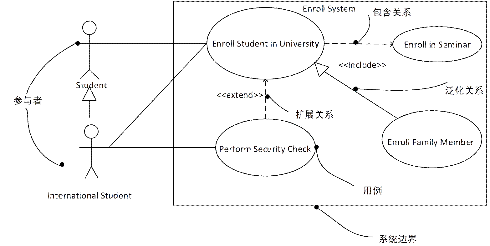

# 软件设计师知识点速记

## 流水线技术

- 流水线建立时间：第 1 条指令执行时间
- 流水线周期：指令分段后，最长段时间
- 流水线执行时间（默认使用理论公式，无答案时考虑实践公式）
  - 理论公式：流水线建立时间+(指令条数-1)x流水线周期
  - 实践公式：指令段数x流水线周期+(指令条数-1)x流水线周期
- 吞吐率=指令条数/流水线执行时间
- 最大吞吐率=流水线周期的倒数

吞吐率和建立时间是使用流水线技术的两个重要指标。吞吐率是指单位时间里流水线处理机流出的结果数。

对指令而言，就是单位时间里执行的指令数。流水线开始工作时，需经过一定时间才能达到最大吞吐率，这就是建立时间。若 m 个子过程所用时间一样，均为 $\Delta_{0}$ ，则建立时间 $T_{0} = m\Delta_{0}$。

::: details 2009上半年：某指令流水线由 5 段组成，第 1、3、5 段所需时间为 $\Delta t$，第 2、4 段所需时间分别为 $3\Delta t$、$2\Delta t$，如下图所示，那么连续输入 n 条指令时的吞吐率（单位时间内执行的指令个数）TP 为______。

连续输入 n 条指令时，第 1 条指令需要的时间为 $(1+3+1+2+1)\Delta t$，之后，每隔 $3\Delta t$ 便完成 1 条指令，即流水线一旦建立好，其吞吐率为最长子过程所需时间的倒数。综合 n 条指令的时间为 $(1+3+1+2+1)\Delta t+(n-1)\times 3\Delta t$，因此吞吐率为：

$$
\frac{n}{(3+3+2)\Delta t+3(n-1)\Delta t}
$$
:::

## McCabe 复杂度计算

McCabe复杂度计算公式：V(G)=m-n+2，其中 m 是有向弧的条数，n 是结点数。

对于伪代码可以先转换为程序流程图，对程序流程图可以最终转换为结点图处理，转换时注意将交点的地方标注为新的结点，以最终的结点图带入公式结算其 McCabe 复杂度。

## DFD（数据流图）

### 数据流常见的 3 种错误

- 黑洞：加工只有输入没有输出
- 奇迹：加工只有输出而没有输入
- 灰洞：加工中输入不足以产生输出（输入的数据流无法通过加工产生输出流）

## UML

### UML 图分类

UML 2.0 分为结构图和行为图。

结构图：

- 类图
- 对象图
- 包图*
- 组合结构图*
- 构件图
- 部署图：软硬件之间映射
- 制品图*

行为图：

- 用例图：系统与外部参与者的交互
- 顺序图：强调按时间顺序
- 通信图（协作图）
- 定时图*
- 状态图
- 活动图：类似程序流程图，并行行为
- 交互概览图*

### 类图关系

- 组合关系：整体与部分生命周期相同
  - 例如：大雁和翅膀属于组合关系
- 聚合关系：整体与部分生命周期不同
  - 例如：大雁和雁群属于聚合关系
- 依赖关系：一个事物发生变化影响另一个事物
  - 例如：y=x+1，我们就说 y 依赖于 x，y 的值随着 x 的值变化而变化
- 泛化关系：父子关系，一般与特殊的关系
  - 例如：动物类和猫类
- 实现关系：接口与类之间的关系
- 关联关系：两者之间用链进行连接，一般表示两个类进行通信

### 用例关系

- 包含关系（`<<include>>`）：其中这个提取出来的公共用例称为抽象用例，而把原始用例称为基本用例或基础用例系，当可以从两个或两个以上的用例中提取公共行为时，应该使用包含关系来表示它们。

  表示一个用例包含另一个用例的行为。当一个用例需要调用另一个用例的行为时，可以使用包含关系。例如，一个购物车用例包含了添加商品和删除商品的用例。

- 扩展关系（`<<extend>>`）：如果一个用例明显的混合了两种或两种以上的不同场景，即根据情况可能发生多种分支，则可以将这个用例分为一个基本用例和一个或多个扩展用例，这样使描述可能更加清晰。

  表示一个用例可以扩展另一个用例的行为。当一个用例需要在另一个用例的基础上扩展行为时，可以使用扩展关系。例如：一个支付用例可以扩展一个下单用例，以实现支付功能。

- 泛化关系：当多个用例共同拥有一种类似的结构和行为的时候，可以将它们的共性抽象称为父用例，其他的用例作为泛化关系中的子用例。在用例的泛化关系中，子用例是父用例的一种特殊形式，子用例继承了父用例所有的结构、行为和关系

  用例之间的继承关系表示子类型“是一种”父类型。其中父类型通常是一个 **抽象泛化用例** ，具有子类型共有的属性和行为，每个具体的子类型继承它，并实现适合自己的特定操作。

## 设计模式

### 设计模式分类

|      | 创建型                                                       | 结构型                                                       | 行为型                                                       | 行为型                                                       |
| ---- | ------------------------------------------------------------ | ------------------------------------------------------------ | ------------------------------------------------------------ | ------------------------------------------------------------ |
| 类   | factory method  工厂方法模式                            | adapter 适配器模式（类和对象）                          | template method 模板方法模式                            | interpreter 解释器模式                                  |
| 对象 | abstract factory（抽象工厂模式） prototype（原型模式） singleton（单例模式） builder（构建器模式） | bridge（桥接模式） composite（组合模式） decorator（装饰模式） facade（外观模式） flyweight（享元模式） proxy（代理模式） | chain of responsibility（职责链模式） command（命令模式） iterator（迭代器模式） mediator（中介者模式） | memento（备忘录模式） observer（观察者模式） state（状态模式） strategy（策略模式） visitor（访问者模式） |

### 创建型设计模式应用场景

| 设计模式名称                       | 简要说明                                                     | 速记关键字     |
| ---------------------------------- | ------------------------------------------------------------ | -------------- |
| Factory Method 工厂方法模式   | 定义一个创建对象的接口，但由子类决定需要实例化哪一个类。工厂方法使得子类实例化的过程推迟。 | 动态生产对象   |
| Abstract Factory 抽象工厂模式 | 提供一个接口，可以创建一系列相关接口或相互依赖的对象，而无需指定它们具体的类。 | 生产成系列对象 |
| Builder 构造器模式            | 将一个复杂类的表示与其构造相分离，使得相同的构建过程能够得出不同的表示。 | 复杂对象构造   |
| Prototype 原型模式            | 用原型实例指定创建对象的类型，并且通过拷贝这个原型来创建新的对象。 | 克隆对象       |
| Singleton 单例模式            | 保证一个类只有一个实例，并提供一个访问它的全局访问点。       | 单实例         |

### 结构型设计模式应用场景

| 设计模式名称            | 简要说明                                                     | 速记关键字   |
| ----------------------- | ------------------------------------------------------------ | ------------ |
| Adapter 适配器模式 | 将一个类的接口转换成用户希望得到的另一种接口。它使原本不相容的接口得以协同工作。 | 转换接口     |
| Bridge 桥接模式    | 将类的抽象部分和它的实现部分分离开来，使它们可以独立地变化。 | 继承树拆分   |
| Composite 组合模式 | 将对象组合成树型结构以表示“整体-部分”的层次结构，使得用户对单个对象和组合对象的使用具有一致性。 | 树形目录结构 |
| Decorator 装饰模式 | 动态地给一个对象添加一些额外的职责。它提供了用子类扩展功能的一个灵活的替代，比派生一个子类更加灵活。 | 动态附加职责 |
| Facade 外观模式    | 定义一个高层接口，为子系统中的一组接口提供一个一致的外观，从而简化了该子系统的使用。 | 对外统一接口 |
| Flyweight 享元模式 | 提供支持大量细粒度对象共享的有效方法。                       | 汉字编码     |
| Proxy 代理模式     | 为其他对象提供一种代理以控制这个对象的访问。                 | 快捷方式     |

### 行为型设计模式应用场景

| 设计模式名称                         | 简要说明                                                     | 速记关键字       |
| ------------------------------------ | ------------------------------------------------------------ | ---------------- |
| Chain of  Responsibility  职责链模式 | 通过给多个对象处理请求的机会，减少请求的发送者与接收者之间的耦合。将接收对象链接起来，在链中传递请求，直到有一个对象处理这个请求。 | 传递职责         |
| Command 命令模式                | 将一个请求封装为一个对象，从而可用不同的请求对客户进行参数化，将请求排队或记录请求日志，支持可撤销的操作。 | 日志记录，可撤销 |
| Interpreter 解释器模式          | 给定一种语言，定义它的文法表示，并定义一个解释器，该解释器用来根据文法表示来解释语言中的句子。 | 虚拟机的机制     |
| Iterator 迭代器模式             | 提供一种方法来顺序访问一个聚合对象中的各个元素，而不需要暴露该对象的内部表示。 | 数据集           |
| Mediator 中介者模式             | 用一个中介对象来封装一系列的对象交互。它使各对象不需要显式地相互调用，从而达到低耦合，还可以独立地改变对象间的交互。 | 不直接引用       |
| Memento 备忘录模式              | 在不破坏封装性的前提下，捕获一个对象的内部状态，并在该对象之外保存这个状态，从而可以在以后将该对象恢复到原先保存的状态。 | 游戏存档         |
| Observer 观察者模式             | 定义对象间的一种一对多的依赖关系，当一个对象的状态发生改变时，所有依赖于它的对象都得到通知并自动更新。 | 联动             |
| State 状态模式                  | 允许一个对象在其内部状态改变时改变它的行为。                 | 状态变成类       |
| Strategy 策略模式               | 定义一系列算法，把它们一个个封装起来，并且使它们之间可互相替换，从而让算法可以独立于使用它的用户而变化。 | 多方案切换       |
| Template Method 模板方法模式    | 定义一个操作中的算法骨架，而将一些步骤延迟到子类中，使得子类可以不改变一个算法的结构即可重新定义算法的某些特定步骤。 | 框架             |
| Visitor 访问者模式              | 表示一个作用于某对象结构中的各元素的操作，使得在不改变各元素的类的前提下定义作用于这些元素的新操作。 | 数据与操作分离   |

## 测试相关

### 测试分类

- 静态测试
  - 桌前检查
  - 代码走查
  - 代码审查
- 动态测试
  - 黑盒测试：等价类划分（确定无效与有效等价类，设计用例尽可能多的覆盖有效类，设计用例只覆盖一个无效类）、边界值分析（处理边界情况时最容易出错，选取的测试数据应该恰好等于、稍小于或稍大于边界值）、错误推测、因果图。
  - 白盒测试：语句覆盖、判定覆盖、条件覆盖、条件/判定覆盖、路径覆盖

### 白盒测试

|                      | 定义                                                         | 特点                                                         |
| -------------------- | ------------------------------------------------------------ | ------------------------------------------------------------ |
| 语句覆盖             | 被测试程序中的每条语句至少执行一次。                         | 对执行逻辑覆盖很低，一般认为是很弱的逻辑覆盖。               |
| 判定覆盖（分支覆盖） | 被测试程序每个判定表达式至少获得一次“真”值和“假”值（或者程序中每一个判定取“真”分支和取“假”分支至少通过一次）。 | 判定覆盖比语句覆盖更强一些。判定可以是 1 个条件，也可以是多个条件的组合。 |
| 条件覆盖             | 每一个判定语句中每个逻辑条件的各种可能的值至少满足一次。     | 条件覆盖和判断覆盖没有包含关系。                             |
| 判断/条件覆盖        | 判定中每个条件的所有可能取值（真/假）至少出现一次，并使每个判定本身的判定结果（真/假）也至少出现一次。 | 同时满足判定覆盖和条件覆盖。                                 |
| 条件组合覆盖         | 每个判定中的各种可能值的组合都至少出现一次。                 | 同时满足判定覆盖、条件覆盖、判定/条件覆盖。                  |
| 路径覆盖             | 覆盖被测试程序中所有可能的路。                               |                                                              |
| 基本路径测试         | 每一条独立路径都执行过（即程序中可执行语句至少执行一次）。   | 测试用例个数与环路复杂度一致。判定为关键控制结点，必须出现在基本路径中。 |
| 循环覆盖             | 循环中每个条件都得到验证。                                   | 注意数组参数可循环验证。                                     |

### 特殊的测试阶段及任务

- 验收测试：有效性测试、软件配置审查、验收测试。
- 系统测试：恢复测试、安全性测试、强度测试、性能测试、可靠性测试和安装测试。
- 集成测试：模块间的接口和通信。
- 单元测试：模块接口、局部数据结构、边界条件、独立的路径、错误处理。
- 回归测试：修改软件后进行的测试，防止引入新的错误。
- 负载测试：对软件负载能力的测试。
- 压力测试：对软件超负荷条件下运行情况的测试。

## 附录

### 考试题型

软考中级软件设计师考试科目分为上午《基础知识》与下午《应用技术》两门，考试题型也各不相同。

上午《基础知识》考试题型均为 **单选题（客观题）** ，一共 75 道题，总分 75 分，考试采取笔试的方式进行作答，考生在答题卡上进行填涂，考试时长共 150 分钟，其中 71~75 题为英语题。

下午《应用技术》考试题型为 **主观题，涵盖题型较广，包括填空题、问答题、算法设计图补充等** 多种题型。其中包括四道必做题与二道选答题，选答题一般是在 C++ 和 Java 中二选一，前面四道大题一般是结构化分析设计、数据库分析设计、面向对象分析与设计和常用数据结构和算法的掌握情况。考试时长同样为 150 分钟，总分 75 分[^1]。

以下是详细介绍：

**试题1：结构化分析与设计;** 

主要考查数据流图 DFD 的绘制，考查形式为顶层数据流图和 0 层数据流图填空(外部实体/数据源、数据存储/文件、加工处理/数据变换填空)、找出遗漏的数据流或者错误的数据流，偶尔考查数据流图的一些绘制要点，如分层数据流绘制需要注意的问题等。

**试题2：数据库分析与设计;** 

主要考查 ER 图的绘制以及 ER 图与关系模式的映射，考查形式为补充完成 ER 图(增加实体、联系、属性以及联系类型)、将关系模式补充完整(属性/字段填空)、找出关系模式的主外键，偶尔考查关系模式的规范化，如将某个关系模式转换为第三范式等。

**试题3：面向对象分析与设计;** 

主要考查对常用 UML 图形的掌握情况，比较常见的图形包括用例图、类图、顺序图、活动图和状态图，考查形式为图形填空，附带考查 UML 的一些基础知识，例如类图中的几种关系及其区别、用例图中用例之间关系的内涵等;

**试题4：数据结构与算法** 

主要考查对常用数据结构和算法的掌握情况，通常考查一些中等难度的算法，例如最短装配时间算法、B树、贪心算法、动态规划、回溯法、背包问题、最短路径、拓扑排序、堆排序等，考查形式为C语言代码填空、复杂度分析(时空复杂度)、算法稳定性分析等。

**试题5、6（二选一）：C++ 和 Java** 

主要考查对常见设计模式的掌握情况，该试题通常会结合一个设计模式实例，给出实例描述和类图，然后进行程序代码填空，有C++和Java两个语言版本，二选一[^2]。

## 参考资料

[^1]: 信管网-中级软件设计师考试题目类型有哪些？：https://www.cnitpm.com/pm1/108810.html
[^2]: 信管网-软件设计师下午题型有哪些？：https://www.cnitpm.com/pm1/109480.html
