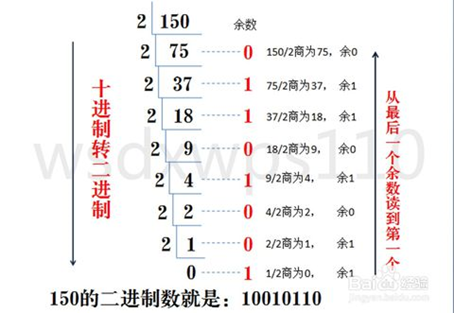
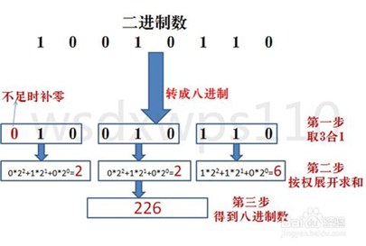
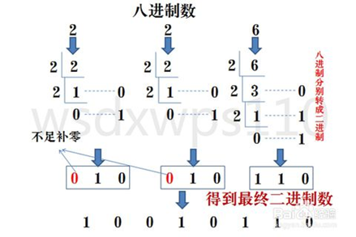
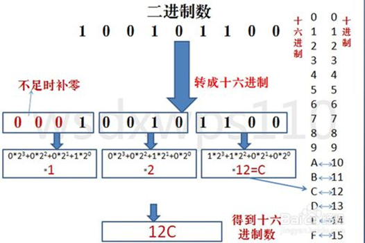
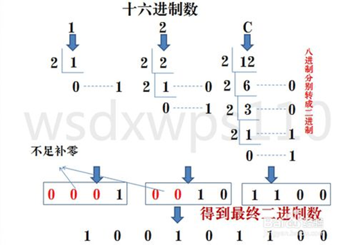

# 软件设计师知识点速记：计算机组成与体系结构

## 进制转换

### R 进制 => 十进制

R 进制转十进制使用 **按权展开法** ，其具体操作方式为：将 R 进制数的每一位数值用 $R^k$ 形式表示，即幂的底数是 R，指数为 k，k 与该位和小数点之间的距离有关。当该位位于小数点左边，k 值是该位和小数点之间数码的个数，而当该位位于小数点右边，k 值是负值，其绝对值是该位和小数点之间数码的个数加 1。

**示例：二进制数 10100.01 转换为十进制数。** 

**解析：** 示例中的二进制数存在小数点位，这时候我们可以分开转换整数和小数部分，最后将转换结果相加即可。

首先，将整数部分 10100 转换为十进制数，方法是将每个二进制数位乘以 2 的幂次方，再将结果相加。
$$
10100B = 1 * 2^4 + 0 * 2^3 + 1 * 2^2 + 0 * 2^1 + 0 * 2^0 = 16 + 4 = 20D
$$
然后，将小数部分 0.01 转换为十进制数，方法是将每个二进制数位乘以 2 的负幂次方，再将结果相加。
$$
0.01B = 0 * 2^{-1} + 1 * 2^{-2} = 0 + 0.25 = 0.25D
$$

最后，我们将整数部分和小数部分的结果相加即可。下方是整数部分和小数部分转换整合在一起的效果：

$$
10100.01B = 1 * 2^4 + 0 * 2^3 + 1 * 2^2 + 0 * 2^1 + 0 * 2^0 + 0 * 2^{-1} + 1 * 2^{-2} = 20 + 0.25 = 20.25D
$$

::: tip 笔者说
**权：** 即 R。  
**按权展开：** 即将 R 进制的每一权位数值（个位、十位、百位...）分别展开计算，最后求和。
:::

::: details 例题：七进制数 604.01 转换为十进制数。
**解析：** 根据按权展开法，可得到下列表达式：
$$
604.01 = 6 * 7^2 + 0 * 7^1 + 4 * 7^0 + 0 * 7^{-1} + 1 * 7^{-2} = 298 + 0.02 = 298.02D
$$
:::

### R 进制 <= 十进制

十进制转 R 进制使用 **短除法** ，简单来说就是将十进制数除 R 取余，余数为权位上的数，得到的商值继续除R，依此步骤继续向下运算直到商为 0 为止。然后从最后一个余数读到第一个即为我们转换的 R 进制。

**示例：十进制数 150 转换为二进制数。** 

**解析：** 



### 二进制 => 八进制

每 3 位二进制数 **按权展开** 相加得到 1 位八进制数，二进制转成八进制是从右到左开始转换，不足位时补 0。

**示例：二进制数 100101110 转换为八进制数。** 

**解析：** 



**结果为：100101110B = 226O** 

::: tip 笔者说
为什么每位八进制数要用 3 位二进制数表示？  
这也很好理解，八进制数中 7 是每位最大值，如果用二进制表示的话就是 111。这不就是 3 位二进制数吗？
$$
1 * 2^2 + 1 * 2^1 + 1 * 2^0 = 7
$$
:::

### 二进制 <= 八进制

上方提到了，二进制数转换为八进制，是用 3 位二进制数表示 1 位八进制数。反之八进制数转换为二进制数，那就需要用 1 位八进制数来表示 3 位二进制数。

八进制数通过对每位数值进行短除法，得到二进制数，每位八进制数为 3 位二进制数，不足时在最左边补 0。

**示例：八进制数 226 转换为二进制数。** 

**解析：** 



**结果为：226O = 10010110B** 

### 二进制 => 十六进制

与二进制转八进制方法类似，转八进制是取三合一，转十六进制是取四合一。即每 4 位二进制数 **按权展开** 相加得到 1 位十六进制数。

**示例：二进制数 100101110 转换为十六进制数。** 

**解析：** 



**结果为：100101110B = 12CH** 

### 二进制 <= 十六进制

二进制数转换为十六进制数，是用 4 位二进制数表示 1 位十六进制数。反之十六进制数转换为二进制数，那就需要用 1 位十六进制数来表示 4 位二进制数。

十六进制数通过对每位数值进行短除法，得到二进制数，每位十六进制数为 4 位二进制数，不足时在最左边补 0。

**示例：十六进制数 12C 转换为二进制。** 

**解析：** 



**结果为：12CH = 100101100B** 

::: tip 笔者说
十六进制中，每位的最大值为 15，但如果用十进制的写法的话就占用了 2 位，所以十六进制中，使用 A 表示 10、B 表示 11、C 表示 12、D 表示 13、E 表示 14、F 表示 15。
:::

## 码制的表示

在计算机中，数字通常以二进制形式表示，也就是由 0 和 1 组成的数字序列。为了方便计算机进行数学运算，计算机需要使用一些编码方式来表示数字，其中最常用的编码方式是原码、反码、补码和移码。

### 码制运算

|      | 数值1     | 数值-1    |
| ---- | --------- | --------- |
| 原码 | 0000 0001 | 1000 0001 |
| 反码 | 0000 0001 | 1111 1110 |
| 补码 | 0000 0001 | 1111 1111 |
| 移码 | 1000 0001 | 0111 1111 |

- 原码：原码是最基本的编码方式，它的规则很简单：将数字的符号位（左侧第 1 位）和数值位（其余位）分开，符号位用 0 表示正数，用 1 表示负数，数值位则按照正常的二进制表示。例如：+5 的原码是 **0**0000101，-5 的原码是 **1**0000101。

- 反码：反码是为了解决原码的符号位带来的问题而出现的。反码的规则是：正数的反码与原码相同，负数的反码是符号位不变，数值位按位取反。例如：+5 的反码还是 **0**0000101，-5 的反码是 **1**1111010。

  > **取反：** 原来为 0 则变为 1，原来为 1 则变为 0。（真假变换）

- **补码** ：补码是为了解决反码的问题而出现的。补码的规则是：正数的补码与原码相同，负数的补码是它的反码加 1。例如，+5 的补码还是 **0**0000101，-5 的补码是 **1**1111011。

  > 补码具有会溢出的特性，适合参与进行加减法运算。

- 移码：移码是将补码的符号位取反，其余位不变。例如，+5 的移码是 **1**0000101，-5 的移码是 **0**1111011。


这些编码方式在计算机中都有广泛的应用，不同的编码方式有不同的优缺点，具体使用哪种编码方式取决于具体的应用场景。

::: warning 笔者说

在上方补码介绍中，提到了二进制数计算加 1 的问题，**1**1111010 + 1 = **1**1111011，这个很简单，但如果是 **1**1111011 + 1 呢？其实也很简单，注意的就是二进制每位最大值是 1，如果每位 > 1 也就是 2 的时候就要进 1 了（逢 2 进 1）。

```
11111011  (原数)
00000001  (加1)
--------
11111100  (结果)
```
:::

::: details 为什么有原、反、补码之分？

> 在学习原码，反码和补码之前，需要先了解机器数和真值的概念。
>
> 1. 机器数：一个数在计算机中的二进制表示形式叫做这个数的机器数。机器数是带符号的，在计算机用一个数的最高位存放符号，正数为0，负数为 1。
>
>    例如：十进制中的数 +3，计算机字长为 8 位，转换成二进制就是**0**0000011。如果是 -3 ，就是 **1**0000011。
>
>    那么，这里的 **0**0000011 和 **1**0000011 就是机器数。
>
> 2. 真值：因为第一位是符号位，所以机器数的形式值就不等于真正的数值。例如：上面的有符号数 **1**0000011，其最高位 1 代表负，其真正数值是 -3 而不是形式值 131（10000011 转换成十进制等于131）。所以，为区别起见，将带符号位的机器数对应的真正数值称为机器数的真值。
>
>    例如：**0**000 0001 的真值 = +000 0001 = +1，**1**000 0001 的真值 = –000 0001 = –1

首先，因为人脑可以知道第一位是符号位，在计算的时候我们会根据符号位选择对真值区域的加减。但是对于计算机，加减乘数已经是最基础的运算，要设计的尽量简单。计算机辨别"符号位"显然会让计算机的基础电路设计变得十分复杂！于是人们想出了将符号位也参与运算的方法。我们知道，根据运算法则减去一个正数等于加上一个负数，即：`1 - 1 = 1 + (-1) = 0` ，所以机器可以只有加法而没有减法，这样计算机运算的设计就更简单了。

于是人们开始探索将符号位参与运算，并且只保留加法的方法。首先来看原码：

例如：计算十进制的表达式：1 - 1 = 0。

$$
1 - 1 = 1 + (-1) = [00000001]_原 + [10000001]_原 = [10000010]_原 = -2D
$$

```
00000001 (原码)
10000001 (原码)
--------
10000010 (原码)
```

如果用原码表示，让符号位也参与计算，显然对于减法来说，结果是不正确的。这也就是为何计算机内部不使用原码表示一个数。

为了解决原码做减法的问题，出现了反码：
$$
1 - 1 = [00000001]_反 + [11111110]_反 = [11111111]_反 = [10000000]_原 = -0D
$$

```
00000001 (反码)
11111110 (反码)
--------
11111111 (反码)
```

发现用反码计算减法，结果的真值部分是正确的。而唯一的问题其实就出现在"0"这个特殊的数值上。虽然人们理解上 `+0` 和 `-0` 是一样的，但是 0 带符号是没有任何意义的。而且会有 `[0000 0000]原` 和 `[1000 0000]原` 两个编码表示0。除此之外，虽然相反数相加没有问题，但是其他数的减法依旧不对劲。

例如：计算十进制的表达式：2 - 1 = 1。
$$
2 - 1 = 2 + (-1) = [00000010]_反 + [11111110]_反 = [00000000]_反 = [00000000]_原 = 0D
$$

```
00000010 (反码)
11111110 (反码)
--------
100000000 (反码) -> 最高位 1 溢出，则结果为 00000000
```

所以，这个码还是不行。

于是补码出现了，不仅解决了 0 的符号问题：
$$
1-1 = 1 + (-1) = [00000001]_原 + [10000001]_原 = [00000001]_补 + [11111111]_补 = [00000000]_补 = [00000000]_原 = 0D
$$

```
00000001 (补码)
11111111 (补码)
--------
00000000 (补码)
```

这样 0 用 `[00000000]` 表示，而以前出现问题的 `-0` 则不存在了。[^1]

还解决了负数加法的问题：
$$
2 - 1 = 2 + (-1) = [00000010]_补 + [11111111]_补 = [00000001]_补 = [00000001]_原 = 1D
$$

```
00000010 (补码)
11111111 (补码)
--------
100000001 (反码) -> 最高位 1 溢出，则结果为 00000001
```

所以，在计算机系统中，数据分为原码反码和补码三种，并且，不论整数或负数，一律用补码来表示和存储。而且，由于反码、补码都是为了解决负数的问题而产生的变化，正数则没有变化，这也是为什么正数的反码、补码和原码一致的原因了。
:::

### 数值范围

| 码制 | 定点整数                             | 定点小数                                    |
| ---- | ------------------------------------ | ------------------------------------------- |
| 原码 | $-(2^{n-1} -1) \sim + (2^{n-1} - 1)$ | $-(1 - 2^{-(n-1)}) \sim + (1 - 2^{-(n-1)})$ |
| 反码 | $-(2^{n-1} -1) \sim + (2^{n-1} - 1)$ | $-(1 - 2^{-(n-1)}) \sim + (1 - 2^{-(n-1)})$ |
| 补码 | $-2^{n-1} \sim + (2^{n-1} - 1)$      | $-1 \sim + (1 - 2^{-(n-1)})$                |
| 移码 | $-2^{n-1} \sim + (2^{n-1} - 1)$      | $-1 \sim + (1 - 2^{-(n-1)})$                |

在一个字长为 n （例如：字长为 8）的计算机中，原码可以表示的整数数值范围为：**1**1111111 ~ **0**1111111，将除符号位之外的数值位转换为十进制：
$$
1111111B = 1 * 2^6 + 1 * 2^5 + 1 * 2^4 + 1 * 2^3 + 1 * 2^2 + 1 * 2^1 + 1 * 2^0 = 127D
$$
即 8 位原码可表示的数值范围为：-127 ~ +127，推导得出 n 位原码可表示的数值范围是：
$$
-(2^{n-1} -1) \sim + (2^{n-1} - 1)
$$
原码和反码之所以负数要 - 1 主要是存在 -0 的表示，而补码、移码则不存在 -0，所以也不需要 - 1了。

::: tip 
其中 -128 的补码为 1000 0000，-1 的补码是 1000 0000 是人为规定的。
:::

## 浮点运算

浮点数表示：
$$
N = 尾数 * 基数^{指数}
$$
运算过程：
$$
对阶 > 尾数计算 > 结果格式化
$$
特点：

1. 一般尾数用补码，阶码用移码
2. 阶码的位数决定数的表示范围，位数越多范围越大
3. 尾数的位数决定数的有效精度，位数越多精度越高
4. 对阶时，小数向大数看齐
5. 对接是通过较小数的尾数右移实现的

## 计算机结构

运算器：

1. 算术逻辑单元 ALU：数据的算术运算和逻辑运算

2. 累加寄存器 AC：通用寄存器，为 ALU 提供一个工作区，用在暂存数据

3. 数据缓冲寄存器 DR：写内存时，暂存指令或数据

4. 状态条件寄存器 PSW：存状态标志与控制标志

   （争议：也有将其归为控制器的）

控制器：

1. 程序计数器 PC：存储下一条要执行指令的地址
2. 指令寄存器 IR：存储即将执行的指令
3. 指令译码器 ID：对指令中的操作码字段进行分析解释
4. 时序部件：提供时序控制信号

## 计算机体系结构分类-Flynn

| 体系结构类型               | 结构                                                 | 关键特性                               | 代表                                           |
| -------------------------- | ---------------------------------------------------- | -------------------------------------- | ---------------------------------------------- |
| 单指令流单数据流<br />SISD | 控制部分：一个<br />处理器：一个<br />主存模块：一个 |                                        | 单处理器系统                                   |
| 单指令流多数据流<br />SIMD | 控制部分：一个<br />处理器：多个<br />主存模块：多个 | 各处理器以异步的形式执行同一条指令     | 并行处理机<br />阵列处理机<br />超级向量处理机 |
| 多指令流单数据流<br />MISD | 控制部分：多个<br />处理器：一个<br />主存模块：多个 | 被证明不可能，至少是不实际             | 目前没有，有文献称流水线计算机为此类           |
| 多指令流多数据流<br />MIMD | 控制部分：多个<br />处理器：多个<br />主存模块：多个 | 能够实现作业、任务、指令等各级全面并行 | 多处理机系统<br />多计算机                     |

## 指令的基本概念

一条指令就是机器语言的一个语句，它是一组有意义的二进制代码，指令的基本格式为：操作码字段|地址码字段。

操作码部分指出了计算机要执行什么性质的操作，如加法、减法、取数、存数等。地址码字段需要包含各操作数的地址及操作结果的存放地址等，从其地址结构的角度可以分为三地址指令、二地址指令、一地址指令和零地址指令。

## 寻址方式

- 立即寻址方式：操作数直接在指令中，速度快，灵活性差
- 直接寻址方式：指令中存放的是操作数的地址
- 间接寻址方式：指令中存放了一个地址，这个地址对应的内容是操作数的地址
- 寄存器寻址方式：寄存器存放操作数
- 寄存器间接寻址方式：寄存器内存放的是操作数的地址

## CISC 和 RISC

| 指令系统类型       | 指令                                                         | 寻址方式   | 实现方式                                             | 其他                                           |
| ------------------ | ------------------------------------------------------------ | ---------- | ---------------------------------------------------- | ---------------------------------------------- |
| CISC（复杂指令集） | 数量多，使用频率差别大，可变长格式                           | 支持多种   | 微程序控制技术（微码）                               | 研制周期长，编译子程序库小                     |
| RISC（精简指令集） | 数量少，使用频率接近，定长格式，大部分为单周期指令，操作寄存器，只有 Load/Store 操作内存。 | 支持方式少 | 增加了通用寄存器，硬布线逻辑控制为主，适合采用流水线 | 优化编译，有效支持高级程序语言，编译子程序库大 |

## 流水线技术

流水线是指在程序执行时多条指令重叠进行操作的一种准并行处理实现技术。各种部件同时处理时针对不同指令而言的，它们可同时分为多条指令的不同部分进行工作，以提高各部件的利用率和指令的平均速度。

相关参数计算：

- 流水线建立时间：第 1 条指令执行时间
- 流水线周期：指令分段后，最长段时间
- 流水线执行时间（默认使用理论公式，无答案时考虑实践公式）
  - 理论公式：流水线建立时间+(指令条数-1)x流水线周期
  - 实践公式：指令段数x流水线周期+(指令条数-1)x流水线周期
- 流水线吞吐率=指令条数/流水线执行时间
- 流水线最大吞吐率=流水线周期的倒数

吞吐率和建立时间是使用流水线技术的两个重要指标。吞吐率是指单位时间里流水线处理机流出的结果数。

对指令而言，就是单位时间里执行的指令数。流水线开始工作时，需经过一定时间才能达到最大吞吐率，这就是建立时间。若 m 个子过程所用时间一样，均为 $\Delta_{0}$ ，则建立时间 $T_{0} = m\Delta_{0}$。

::: details 2009上半年：某指令流水线由 5 段组成，第 1、3、5 段所需时间为 $\Delta t$，第 2、4 段所需时间分别为 $3\Delta t$、$2\Delta t$，如下图所示，那么连续输入 n 条指令时的吞吐率（单位时间内执行的指令个数）TP 为______。

**答：** 连续输入 n 条指令时，第 1 条指令需要的时间为 $(1 + 3 + 1 + 2 + 1)\Delta t$，之后，每隔 $3\Delta t$ 便完成 1 条指令，即流水线一旦建立好，其吞吐率为最长子过程所需时间的倒数。综合 n 条指令的时间为 $(1 + 3 + 1 + 2 + 1)\Delta t + ( n - 1)\times 3\Delta t$，因此吞吐率为：
$$
\frac{n}{(3 + 3 + 2)\Delta t + 3(n - 1)\Delta t}
$$
:::

## 层次化存储结构

- CPU：寄存器，最快，但容量小，成本高
- Cache：按内容存取
- 内存（主存）：
  - 随机存储器（RAM）
  - 只读存储器（ROM）
- 外存（辅存）：硬盘、光盘、U盘等

局部性原理是层次化存储结构的支撑。

## Cache

### 概念

在计算机的存储系统体系中，Cache 是访问速度最快的层次（若有寄存器，则寄存器最快）。

使用 Cache 改善系统性能的依据是程序的局部性原理。

如果以 h 代表对 Cache 的访问命中率，$t_1$ 表示 Cache 的周期时间，$t_2$ 表示主存储器周期时间，以读操作为例，使用 “Cache + 主存储器” 的系统的平均周期为 $t_3$，则：
$$
t_3 = h * t_1 + (1 - h) * t_2
$$
其中，（1 - h）又称为失效率（未命中率）。

### 映像

- 直接相联映像：硬件电路较简单，但冲突率很高

- 全相联映像：电路难于设计和实现，只适用于小容量的 Cache，冲突率较低

- 组相联映像：直接相联与全相联的折中

- 地址映像是将主存与 Cache 的存储空间划分为若干大小相同的页（或称为块）。

  例如：某机的主存容量为 1GB，划分为 2048 页，每页 512KB；Cache 容量为 8MB，划分为 16 页，每页 512KB。

## 主存-编址与计算

- 存储单元
- 按字编址：存储体的存储单元是字存储单元，即最小寻址单位是一个字
- 按字节编址：存储体的存储单元是字节存储单元；即最小寻址单位是一个字节。

根据存储器所要求的的容量和选定的存储芯片的容量，就可以计算出所需芯片的总数，即：
$$
总片数 = 总容量 / 每片的容量
$$
**例如：若内存地址区间为 4000H ~ 43FFH，每个存储单元可存储 16 位二进制数，该内存区域用 4 片存储器芯片构成，则构成该内存所用的存储器芯片的容量是多少？** 

**解析：** 在计算机中，内存通常是按照地址来寻址的，每个地址对应着一个存储单元。在这个问题中，给定了内存地址区间为 4000H ~ 43FFH，其中 H 表示十六进制数。

在十六进制数中，一个数字可以表示 4 位二进制数。因此，4000H 表示的二进制数为 0100000000000000，43FFH  表示的二进制数为 0100001111111111。这两个二进制数之间的差值为 1111111111，即 2 的 10 次方减 1，也就是  1023。

因此，该内存地址区间中共有 1024 个存储单元（地址数量），分别对应着 4000H ~ 43FFH 中的每个地址。每个存储单元可以存储一个 16 位二进制数，因此该内存区域的总容量为 1024 x 16 = 16384 位二进制数。

由于该内存所用的存储器芯片数量为 4 片，因此每片存储器芯片的容量为 16384 / 4 = 4096 位二进制数，即 4KB。

## 总线

一条总线同一时刻仅允许一个设备发送，但允许多个设备接收。

总线的分类：

- 数据总线（Data Bus）：在 CPU 与 RAM 之间来回传送需要处理或是需要储存的数据。
- 地址总线（Address Bus）：用来指定在 RAM（Random Access Memory）之中储存的数据的地址。
- 控制总线（Control Bus）：将微处理器控制单元（Control Unit）的信号，传送到周边设备，一般常见的为 USB Bus 和 1394 Bus。

## 串联系统与并联系统

串联系统可靠度：
$$
R = R_1 * R_2 * ... *R_n
$$
并联系统可靠度：
$$
R = 1 - (1 - R_1) * (1 - R_2) * ... * (1 - R_n)
$$

## 附录

### 考试题型

软考中级软件设计师考试科目分为上午《基础知识》与下午《应用技术》两门，考试题型也各不相同。

上午《基础知识》考试题型均为 **单选题（客观题）** ，一共 75 道题，总分 75 分，考试采取笔试的方式进行作答，考生在答题卡上进行填涂，考试时长共 150 分钟，其中 71~75 题为英语题。

下午《应用技术》考试题型为 **主观题，涵盖题型较广，包括填空题、问答题、算法设计图补充等** 多种题型。其中包括四道必做题与二道选答题，选答题一般是在 C++ 和 Java 中二选一，前面四道大题一般是结构化分析设计、数据库分析设计、面向对象分析与设计和常用数据结构和算法的掌握情况。考试时长同样为 150 分钟，总分 75 分[^2]。

以下是详细介绍：

**试题1：结构化分析与设计;** 

主要考查数据流图 DFD 的绘制，考查形式为顶层数据流图和 0 层数据流图填空(外部实体/数据源、数据存储/文件、加工处理/数据变换填空)、找出遗漏的数据流或者错误的数据流，偶尔考查数据流图的一些绘制要点，如分层数据流绘制需要注意的问题等。

**试题2：数据库分析与设计;** 

主要考查 ER 图的绘制以及 ER 图与关系模式的映射，考查形式为补充完成 ER 图(增加实体、联系、属性以及联系类型)、将关系模式补充完整(属性/字段填空)、找出关系模式的主外键，偶尔考查关系模式的规范化，如将某个关系模式转换为第三范式等。

**试题3：面向对象分析与设计;** 

主要考查对常用 UML 图形的掌握情况，比较常见的图形包括用例图、类图、顺序图、活动图和状态图，考查形式为图形填空，附带考查 UML 的一些基础知识，例如类图中的几种关系及其区别、用例图中用例之间关系的内涵等;

**试题4：数据结构与算法** 

主要考查对常用数据结构和算法的掌握情况，通常考查一些中等难度的算法，例如最短装配时间算法、B树、贪心算法、动态规划、回溯法、背包问题、最短路径、拓扑排序、堆排序等，考查形式为C语言代码填空、复杂度分析(时空复杂度)、算法稳定性分析等。

**试题5、6（二选一）：C++ 和 Java** 

主要考查对常见设计模式的掌握情况，该试题通常会结合一个设计模式实例，给出实例描述和类图，然后进行程序代码填空，有C++和Java两个语言版本，二选一[^3]。

## 参考资料

[^1]: 转载的关于 二级制的反码，补码，原码等，筛选过的.：https://blog.csdn.net/tunln5288/article/details/97562905
[^2]: 信管网-中级软件设计师考试题目类型有哪些？：https://www.cnitpm.com/pm1/108810.html
[^3]: 信管网-软件设计师下午题型有哪些？：https://www.cnitpm.com/pm1/109480.html
