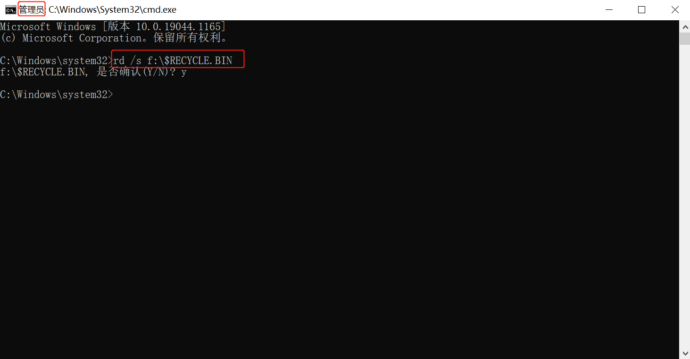
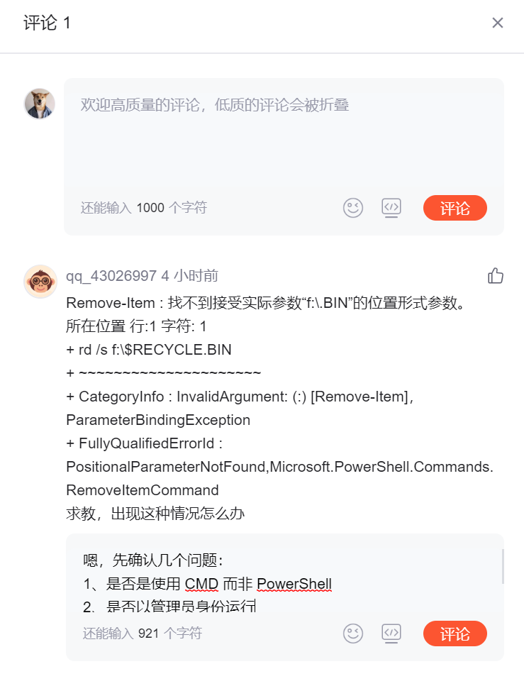
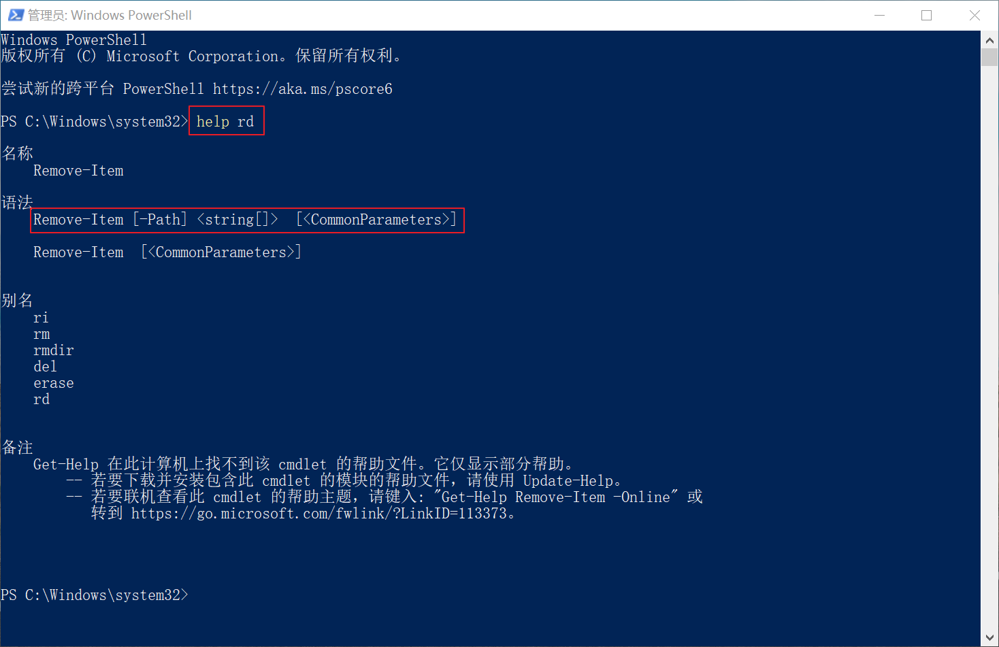

# F:\ 上的回收站已损坏。是否清空该驱动器上的"回收站"?

## 问题描述

近期打开移动硬盘时，经常弹出一个提示框，提示内容是：**F:\ 上的"回收站"已损坏。是否清空该驱动器上的"回收站"?** 


这个提示框出现过好多回了，除了第一次见到时担心数据丢失，所以比较重视，后来次数多了，点过 “是”，也点过 “否”，只要当下不再影响我就先忽略了。

但今天在公司打开时，它还没完没了的弹，我决定给它 "上一课"。

::: tip 笔者说

先说明一下我的这块移动硬盘情况，我把它分了两个区，在我的工作电脑上分别占据 E盘、F盘，E盘 打开没问题，打开 F盘就弹出这个提示。

:::

## 解决方案

### 尝试1：重新插拔移动硬盘

我首先考虑的是不是接触不良类的问题，于是我在电脑上弹出了移动硬盘，然后把硬盘接线也重新插拔了一下，再插到电脑上。

再次打开该盘，依然如此，问题未解决。

### 尝试2：重启电脑

我又考虑是不是电脑本次出了点故障，于是我重启了电脑。


果然，问题还是没解决了。

::: tip 笔者说

不过，重启的确应该成为解决问题的优先方法，毕竟有这么个说法："重启可以解决世间 90% 的问题"。巨石强森的电影《摩天营救》里不也是这么演的嘛。很明显，我遇到了剩下那 10% 的问题。

:::

### 尝试3：删除回收站

行吧，再次回归问题本身，它一直提示是回收站损坏，而且，此时我突然想到周末在使用 FreeFileSync 比较 NAS 和硬盘数据时，我看到过这块硬盘中有多一个 recylce 名词的目录（图标也是回收站图标）。

而除了系统回收站，其他硬盘回收站其实对我都无所谓，那就想法找到并干掉它。

然而，即使我开启了隐藏的项目显示，窗口下肉眼仍无法找到它，那就使用 CMD 吧。

以管理员身份打开 CMD，复制下方命令，改成你那提示的错误盘符，回车，再输入 y 确定后删除。

```shell
# $RECYCLE.BIN 是回收站名称
# rd 是删除命令
# 		/s 代表除目录本身外，还将删除指定目录下的所有子目录和文件，适用于删除目录树。
# f:\ 根据你自己提示的是哪个盘报错，你就将 f 改成哪个盘
rd /s f:\$RECYCLE.BIN
```



问题解决了。

## 注意事项

**C：** 各位同学，在按照本文进行该项问题修复时，请一定要注意 **红色选框**，确认好你的操作是否与笔者一致，下面列出两个容易被忽略的问题。

### 执行命令的终端

::: tip 笔者说
这个注意事项是一位同学在 CSDN 上评论遇到的，特别记录一下。
:::



笔者是用 CMD 来执行的命令，你如果用了 PowerShell 或其他的终端，需要采用对应的命令语法。

以 CMD 和 PowerShell 中的 `rd` 命令为例，在 CMD 中 `rd` 命令的语法如下：

``` shell
# [] 代表对应参数可选
# 一般情况下直接使用 /s /q 组合的形式，表示不需要提示确认，直接对指定目录进行删除（包含子目录）
# 本文中的命令没加 /q 是本着稳妥的方面，让你确认一次后再删除
rd [/s] [/q] 目录路径
rmdir [/s] [/q] 目录路径
```


而在 PowerShell 中 `rd` 命令的语法如下：

::: tip 笔者说
说起来，命令其实差不多，因为是表达相同动作，而且外国人就那么几个单词。就和编程语言里的语法单词也相似一样。
:::

```shell
# 下面这些命令都可以，笔者习惯在 PowerShell 中使用 rm
# -r 是 recurse 的意思，表示递归删除（包含子目录）
rd [-r] 目录路径
rm [-r] 目录路径
rmdir [-r] 目录路径
ri [-r] 目录路径
del [-r] 目录路径
erase [-r] 目录路径
remove-item [-Recurse] 目录路径
```



很显然，当你用 CMD 的 `rd` 命令语法来在 PowerShell 中删除目录时，自然会报错了。


### 以管理员身份运行 

一般来说，操作系统提供商提供多用户功能的目的，一方面是隔离数据，另一方面是为了防止小白用户操作错误还要怪在他们头上。

可能不需要管理员身份运行也没问题，但是为了防止部分同学机器的操作系统存在一些 “怪癖”，最好是采用管理员身份来运行，避免无权限之类的问题。

好了，目前就先简单提这两点注意事项，Good luck。
