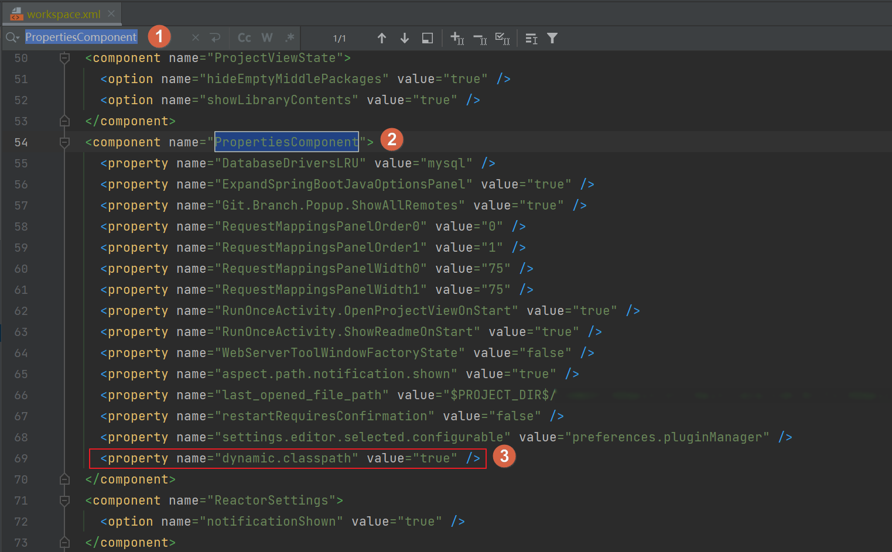

# Command line is too long. Shorten command line for XXX or also for Spring Boot default configuration？

## 问题描述

今天笔者在公司从测试环境拉取了一个 bugfix 分支之后，等待 Maven 依赖也加载完了，点了【Debug】运行按钮，想起身去接杯水，跳过项目启动的这段时间。

结果，刚握住水杯，就看到 IntelliJ IDEA 在左下角弹出了一个错误提示框，如下：


看提示的意思是命令行太长了，让缩短一下命令行。又点了两下【Debug】运行按钮，依然不依不饶的弹出这个提示，那就放下水杯解决吧。


## 原因分析
我想了想原因，就明白什么问题了，给大家贴一下启动的项目程序所在位置。

- 仓库目录（.git目录）
  - 项目doc目录
  - src
    - 项目源码父级项目目录
      - 启动入口所在项目目录
        - src\main\java（三级目录）
          - com\xx\xxx（N级的包目录）
            - Spring Boot 项目启动类
      - 若干模块项目目录
      - pom.xml

这个结构，不好多说什么，历史遗留， doc 和源码放在了一个仓库，层级的确挺深，但一般情况下也不会出现此问题，这次算是一个特殊情况。


## 解决方案
其实问题解决起来也不难，这种问题笔者以前也遇到过，不过当时也忘了怎么切到了 IntelliJ IDEA 修复提示内，选了一下就结束了。

而这一次笔者没找到正确的修复入口，所以只能采用手动修改配置的方法了。

双击打开项目根目录下的 `.idea` 目录，这个目录下都是 IntelliJ IDEA 自动保存的项目配置内容，一般情况下我们不需要关注它，但这次我们需要找到其中的 `workspace.xml` 配置文件，手动修改一下配置。


按下 【Ctrl + F】，在弹出的搜索框中，输入【PropertiesComponent】回车，定位到该项配置后，在其所在的 `<component>` 标签内最后部分添加一条属性配置，如下：

```xml
<property name="dynamic.classpath" value="true" />
```



添加完后，关闭该配置文件即可，再次点击【Debug】运行按钮，项目正常启动了，笔者也该去接水了。