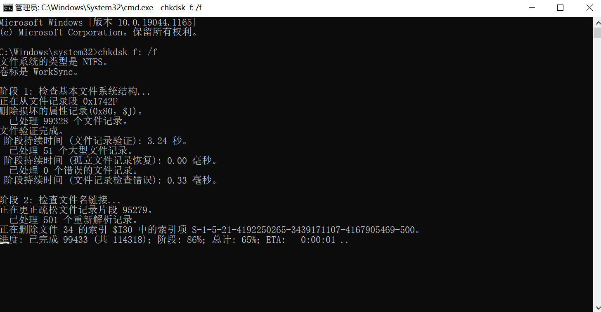

# 无法访问 F:\。文件或目录损坏且无法读取。

## 问题描述

笔者这块西数的移动硬盘最近真的是问题频发，前段时间无法删除损坏的回收站，这两天在家里电脑上插上之后，双击 F 盘提示已损坏，较之以前问题更甚。

这的确给了笔者一个 “惊喜”，最近两周好像没开 Drive 备份到 NAS 。硬盘要是坏了，这两周的东西还能剩下多少就不好说了。

不过好在最后问题解决了，跟笔者来一起看看解决方法吧。


## 解决方案
### 尝试1：尝试检查与修复

首先，在出现问题的磁盘上【右键】单击，然后选择【属性】。


在弹出的【属性】对话框中，选择【工具】选项卡，然后点击【检查】按钮。这个功能是用来检查磁盘文件系统错误的，检查完还会有个错误修复的环节。


可惜的是，不知道是笔者这台电脑登录的账号权限问题，还是系统错误，这项修复手段，笔者用不了。


### 尝试2：命令行修复

还是老规矩，桌面可视化中的功能只是一种手段，每一项功能都有其对应的系统命令。

按下【Windows】键，弹出【开始】菜单，直接输入【cmd】来在菜单中搜索。搜索出来后，在【cmd.exe/命令行】上【右键】单击，选择【以管理员身份运行】。


在弹出的 CMD 命令行窗口中，输入以下命令：

```bash
# 这条命令是用来检查磁盘并修复的，中间的 f: 换成你出现上方问题的盘符即可。 
chkdsk f: /f
```




等待检查修复结束，笔者的 F 盘又回来了。


