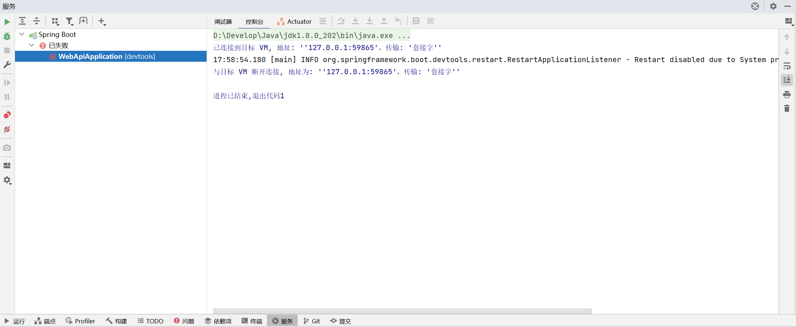

# SpringBoot项目引入OpenFeign后无法启动

**C：** 由于项目需要调用第三方 API，所以打算使用 Open Feign 来作为调用工具。但这次新项目用的 Spring Boot 版本有点高，花了点时间排除问题。

<!-- more -->

## 问题描述

先简单描述一下我们项目的技术栈，这是一个前后端分离的单体项目，前端不用提，后端部分主框架用的是 Spring Boot 2.7.2 版本。现在需要对接第三方 API，打算使用 Open Feign 来作为调用工具。Open Feign 是 Spring Cloud 开发的一个轻量级RESTful HTTP 服务客户端，多数使用的场景是用于微服务项目。

### 引入依赖

下方只贴出了关键部分依赖：

```xml
<properties>
    <spring-cloud.version>2.0.4.RELEASE</spring-cloud.version>
</properties>

<!-- 全局版本锁定 -->
<dependencyManagement>
    <!-- Spring Cloud -->
    <dependency>
        <groupId>org.springframework.cloud</groupId>
        <artifactId>spring-cloud-dependencies</artifactId>
        <version>${spring-cloud.version}</version>
        <type>pom</type>
        <scope>import</scope>
    </dependency>
</dependencyManagement>
```

```xml
<dependencies>
    <!-- Feign，用于服务间的 HTTP 调用 -->
    <dependency>
        <groupId>org.springframework.cloud</groupId>
        <artifactId>spring-cloud-starter-openfeign</artifactId>
    </dependency>
</dependencies>
```

### 编写配置

引入完依赖，自然是要简单配置一下。

application.yml 中的 Feign 部分配置：

```yaml
## Feign 配置
feign:
  client:
    config:
      default:
        connect-timeout: 20000
        read-timeout: 120000
```

FeignConfig 配置类：

```java
/**
 * Feign配置
 *
 * @author Charles7c
 * @date 2022/8/30 18:10
 */
@Configuration
public class FeignConfig {

    @Value("${spring.profiles.active}")
    private String activeProfile;

    /**
     * Feign 日志级别配置
     * @return /
     */
    @Bean
    Logger.Level feignLoggerLevel() {
        if ("prod".equals(activeProfile)) {
            return Logger.Level.BASIC;
        }
        return Logger.Level.FULL;
    }
    
    /**
     * 解决 javax.net.ssl.SSLHandshakeException: java.security.cert.CertificateException: No subject alternative names present
     * @return /
     */
    @Bean
    public Client client() {
        try {
            SSLContext context = new SSLContextBuilder().loadTrustMaterial(null, (chain, authType) -> true).build();
            return new Client.Default(context.getSocketFactory(), new NoopHostnameVerifier());
        } catch (Exception e) {
            return new Client.Default(null, null);
        }
    }
}
```

### 启用Feign

最后只需要在启动类上使用 `@EnableFeignClients` 启用一下配置即可。

```java
/**
 * 启动程序
 *
 * @author Charles7c
 * @date 2022/8/24 15:46
 */
@EnableFeignClients
@SpringBootApplication
public class WebApiApplication {
    public static void main(String[] args) {
        System.setProperty("spring.devtools.restart.enabled", "false");
        SpringApplication application = new SpringApplication(WebApiApplication.class);
        application.setApplicationStartup(new BufferingApplicationStartup(2048));
        application.run(args);
    }
}
```

### 报错信息

根据以前的经验到这步也就结束了，该怎么用 Feign 就怎么用了。好的，写完之后启动项目。



显然笔者被技术的 "浪潮" 又拍了一个 "跟头"，技术从来都不是停滞不前的，采用新版本就肯定会有这样那样的问题，不提前做版本踩坑和梳理，就必然如此。

## 原因分析

从提示来看，控制台只打印了我在启动类中配置的一个系统属性，Spring Boot 项目的 Banner 都没打出来，显然是启动时都没走到打印 banner 这一步。但控制台什么错误也看不到，这可不行啊，先给启动这一步加个 try-catch 捕获下异常，起码先把异常显示出来。

```java
/**
 * 启动程序
 *
 * @author Charles7c
 * @date 2022/8/24 15:46
 */
@EnableFeignClients
@SpringBootApplication
public class WebApiApplication {
    public static void main(String[] args) {
        try {
            System.setProperty("spring.devtools.restart.enabled", "false");
            SpringApplication application = new SpringApplication(WebApiApplication.class);
            application.setApplicationStartup(new BufferingApplicationStartup(2048));
            application.run(args);
        } catch (Exception e) {
            throw new RuntimeException(e);
        }
    }
}
```

映入眼帘的就是：`java.lang.NoClassDefFoundError: org/springframework/boot/context/properties/ConfigurationBeanFactoryMetadata` 。这种错误我熟啊，八成是和版本有关。

```
已连接到目标 VM, 地址: ''127.0.0.1:59906'，传输: '套接字''
17:59:40.709 [main] INFO org.springframework.boot.devtools.restart.RestartApplicationListener - Restart disabled due to System property 'spring.devtools.restart.enabled' being set to false
Exception in thread "main" java.lang.RuntimeException: org.springframework.beans.factory.BeanCreationException: Error creating bean with name 'configurationPropertiesBeans' defined in org.springframework.cloud.autoconfigure.ConfigurationPropertiesRebinderAutoConfiguration: Bean instantiation via factory method failed; nested exception is org.springframework.beans.BeanInstantiationException: Failed to instantiate [org.springframework.cloud.context.properties.ConfigurationPropertiesBeans]: Factory method 'configurationPropertiesBeans' threw exception; nested exception is java.lang.NoClassDefFoundError: org/springframework/boot/context/properties/ConfigurationBeanFactoryMetadata
	at com.xxx.WebApiApplication.main(WebApiApplication.java:26)
Caused by: org.springframework.beans.factory.BeanCreationException: Error creating bean with name 'configurationPropertiesBeans' defined in org.springframework.cloud.autoconfigure.ConfigurationPropertiesRebinderAutoConfiguration: Bean instantiation via factory method failed; nested exception is org.springframework.beans.BeanInstantiationException: Failed to instantiate [org.springframework.cloud.context.properties.ConfigurationPropertiesBeans]: Factory method 'configurationPropertiesBeans' threw exception; nested exception is java.lang.NoClassDefFoundError: org/springframework/boot/context/properties/ConfigurationBeanFactoryMetadata
	at org.springframework.beans.factory.support.ConstructorResolver.instantiate(ConstructorResolver.java:658)
	at org.springframework.beans.factory.support.ConstructorResolver.instantiateUsingFactoryMethod(ConstructorResolver.java:486)
	at org.springframework.beans.factory.support.AbstractAutowireCapableBeanFactory.instantiateUsingFactoryMethod(AbstractAutowireCapableBeanFactory.java:1352)
	at org.springframework.beans.factory.support.AbstractAutowireCapableBeanFactory.createBeanInstance(AbstractAutowireCapableBeanFactory.java:1195)
	at org.springframework.beans.factory.support.AbstractAutowireCapableBeanFactory.doCreateBean(AbstractAutowireCapableBeanFactory.java:582)
	at org.springframework.beans.factory.support.AbstractAutowireCapableBeanFactory.createBean(AbstractAutowireCapableBeanFactory.java:542)
	at org.springframework.beans.factory.support.AbstractBeanFactory.lambda$doGetBean$0(AbstractBeanFactory.java:335)
	at org.springframework.beans.factory.support.DefaultSingletonBeanRegistry.getSingleton(DefaultSingletonBeanRegistry.java:234)
	at org.springframework.beans.factory.support.AbstractBeanFactory.doGetBean(AbstractBeanFactory.java:333)
	at org.springframework.beans.factory.support.AbstractBeanFactory.getBean(AbstractBeanFactory.java:213)
	at org.springframework.context.support.PostProcessorRegistrationDelegate.registerBeanPostProcessors(PostProcessorRegistrationDelegate.java:270)
	at org.springframework.context.support.AbstractApplicationContext.registerBeanPostProcessors(AbstractApplicationContext.java:762)
	at org.springframework.context.support.AbstractApplicationContext.refresh(AbstractApplicationContext.java:567)
	at org.springframework.boot.SpringApplication.refresh(SpringApplication.java:734)
	at org.springframework.boot.SpringApplication.refreshContext(SpringApplication.java:408)
	at org.springframework.boot.SpringApplication.run(SpringApplication.java:308)
	at org.springframework.boot.builder.SpringApplicationBuilder.run(SpringApplicationBuilder.java:164)
	at org.springframework.cloud.bootstrap.BootstrapApplicationListener.bootstrapServiceContext(BootstrapApplicationListener.java:208)
	at org.springframework.cloud.bootstrap.BootstrapApplicationListener.onApplicationEvent(BootstrapApplicationListener.java:104)
	at org.springframework.cloud.bootstrap.BootstrapApplicationListener.onApplicationEvent(BootstrapApplicationListener.java:70)
	at org.springframework.context.event.SimpleApplicationEventMulticaster.doInvokeListener(SimpleApplicationEventMulticaster.java:176)
	at org.springframework.context.event.SimpleApplicationEventMulticaster.invokeListener(SimpleApplicationEventMulticaster.java:169)
	at org.springframework.context.event.SimpleApplicationEventMulticaster.multicastEvent(SimpleApplicationEventMulticaster.java:143)
	at org.springframework.context.event.SimpleApplicationEventMulticaster.multicastEvent(SimpleApplicationEventMulticaster.java:131)
	at org.springframework.boot.context.event.EventPublishingRunListener.environmentPrepared(EventPublishingRunListener.java:85)
	at org.springframework.boot.SpringApplicationRunListeners.lambda$environmentPrepared$2(SpringApplicationRunListeners.java:66)
	at java.util.ArrayList.forEach(ArrayList.java:1257)
	at org.springframework.boot.SpringApplicationRunListeners.doWithListeners(SpringApplicationRunListeners.java:120)
	at org.springframework.boot.SpringApplicationRunListeners.doWithListeners(SpringApplicationRunListeners.java:114)
	at org.springframework.boot.SpringApplicationRunListeners.environmentPrepared(SpringApplicationRunListeners.java:65)
	at org.springframework.boot.SpringApplication.prepareEnvironment(SpringApplication.java:344)
	at org.springframework.boot.SpringApplication.run(SpringApplication.java:302)
	at com.xxx.WebApiApplication.main(WebApiApplication.java:23)
Caused by: org.springframework.beans.BeanInstantiationException: Failed to instantiate [org.springframework.cloud.context.properties.ConfigurationPropertiesBeans]: Factory method 'configurationPropertiesBeans' threw exception; nested exception is java.lang.NoClassDefFoundError: org/springframework/boot/context/properties/ConfigurationBeanFactoryMetadata
	at org.springframework.beans.factory.support.SimpleInstantiationStrategy.instantiate(SimpleInstantiationStrategy.java:185)
	at org.springframework.beans.factory.support.ConstructorResolver.instantiate(ConstructorResolver.java:653)
	... 32 more
Caused by: java.lang.NoClassDefFoundError: org/springframework/boot/context/properties/ConfigurationBeanFactoryMetadata
	at org.springframework.cloud.autoconfigure.ConfigurationPropertiesRebinderAutoConfiguration.configurationPropertiesBeans(ConfigurationPropertiesRebinderAutoConfiguration.java:51)
	at org.springframework.cloud.autoconfigure.ConfigurationPropertiesRebinderAutoConfiguration$$EnhancerBySpringCGLIB$$97caf445.CGLIB$configurationPropertiesBeans$1(<generated>)
	at org.springframework.cloud.autoconfigure.ConfigurationPropertiesRebinderAutoConfiguration$$EnhancerBySpringCGLIB$$97caf445$$FastClassBySpringCGLIB$$3f1d782c.invoke(<generated>)
	at org.springframework.cglib.proxy.MethodProxy.invokeSuper(MethodProxy.java:244)
	at org.springframework.context.annotation.ConfigurationClassEnhancer$BeanMethodInterceptor.intercept(ConfigurationClassEnhancer.java:331)
	at org.springframework.cloud.autoconfigure.ConfigurationPropertiesRebinderAutoConfiguration$$EnhancerBySpringCGLIB$$97caf445.configurationPropertiesBeans(<generated>)
	at sun.reflect.NativeMethodAccessorImpl.invoke0(Native Method)
	at sun.reflect.NativeMethodAccessorImpl.invoke(NativeMethodAccessorImpl.java:62)
	at sun.reflect.DelegatingMethodAccessorImpl.invoke(DelegatingMethodAccessorImpl.java:43)
	at java.lang.reflect.Method.invoke(Method.java:498)
	at org.springframework.beans.factory.support.SimpleInstantiationStrategy.instantiate(SimpleInstantiationStrategy.java:154)
	... 33 more
Caused by: java.lang.ClassNotFoundException: org.springframework.boot.context.properties.ConfigurationBeanFactoryMetadata
	at java.net.URLClassLoader.findClass(URLClassLoader.java:382)
	at java.lang.ClassLoader.loadClass(ClassLoader.java:424)
	at sun.misc.Launcher$AppClassLoader.loadClass(Launcher.java:349)
	at java.lang.ClassLoader.loadClass(ClassLoader.java:357)
	... 44 more
与目标 VM 断开连接, 地址为: ''127.0.0.1:59906'，传输: '套接字''

进程已结束,退出代码1
```

## 解决方案

实际上，早就等着这一步呢，笔者只是不死心尝试一下，前文也提到了，这个项目用的 Spring Boot 2.7.2 版本，而笔者引入的依赖是老项目中的依赖，老项目的 Spring Boot 是 2.0.4.RELEASE 版本，和 2.7.2 差了好几代了，怎么可能还兼容这么好呢。

::: tip 笔者说
Spring Boot 这种大版本升级，往往涉及到很多类的删除和重构，所以说学无止境啊。
:::

好了，那就去 [Spring Cloud 概述](https://spring.io/projects/spring-cloud#overview) 中摸一下 Spring Cloud 和 Spring Boot 最新的版本对应关系，然后好能确定该使用哪一个版本。

| Release Train        | Boot Version                          |
| :------------------- | :------------------------------------ |
| 2021.0.x aka Jubilee | 2.6.x, 2.7.x (Starting with 2021.0.3) |
| 2020.0.x aka Ilford  | 2.4.x, 2.5.x (Starting with 2020.0.3) |
| Hoxton               | 2.2.x, 2.3.x (Starting with SR5)      |
| Greenwich            | 2.1.x                                 |
| Finchley             | 2.0.x                                 |
| Edgware              | 1.5.x                                 |
| Dalston              | 1.5.x                                 |

根据 Spring Cloud 概述页面的介绍，2.7.x 版本的 Spring Boot 可以使用 2021.0.x 任意版本的 Spring Cloud，笔者最后使用了 2021.0.3 版本。

```xml
<properties>
    <spring-cloud.version>2021.0.3</spring-cloud.version>
</properties>

<!-- 全局版本锁定 -->
<dependencyManagement>
    <!-- Spring Cloud -->
    <dependency>
        <groupId>org.springframework.cloud</groupId>
        <artifactId>spring-cloud-dependencies</artifactId>
        <version>${spring-cloud.version}</version>
        <type>pom</type>
        <scope>import</scope>
    </dependency>
</dependencyManagement>
```

再启动，熟悉的 Spring Boot Banner 出现了，但是最后又报错了。

```
Exception in thread "main" java.lang.RuntimeException: org.springframework.beans.factory.UnsatisfiedDependencyException: Error creating bean with name 'captchaController' defined in file [D:\IdeaProjects\IdeaProjects-charles7c\fucloud-union-service\service-webapi\target\classes\com\xxx\webapi\controller\common\CaptchaController.class]: Unsatisfied dependency expressed through constructor parameter 2; nested exception is org.springframework.beans.factory.BeanCreationException: Error creating bean with name 'com.xxx.core.rest.CloudUnionDataRestApi': Unexpected exception during bean creation; nested exception is java.lang.IllegalStateException: No Feign Client for loadBalancing defined. Did you forget to include spring-cloud-starter-loadbalancer?
	at com.xxx.WebApiApplication.main(WebApiApplication.java:26)
Caused by: org.springframework.beans.factory.UnsatisfiedDependencyException: Error creating bean with name 'captchaController' defined in file [D:\IdeaProjects\IdeaProjects-charles7c\fucloud-union-service\service-webapi\target\classes\com\xxx\webapi\controller\common\CaptchaController.class]: Unsatisfied dependency expressed through constructor parameter 2; nested exception is org.springframework.beans.factory.BeanCreationException: Error creating bean with name 'com.xxx.core.rest.CloudUnionDataRestApi': Unexpected exception during bean creation; nested exception is java.lang.IllegalStateException: No Feign Client for loadBalancing defined. Did you forget to include spring-cloud-starter-loadbalancer?
	at org.springframework.beans.factory.support.ConstructorResolver.createArgumentArray(ConstructorResolver.java:800)
	at org.springframework.beans.factory.support.ConstructorResolver.autowireConstructor(ConstructorResolver.java:229)
	at org.springframework.beans.factory.support.AbstractAutowireCapableBeanFactory.autowireConstructor(AbstractAutowireCapableBeanFactory.java:1372)
	at org.springframework.beans.factory.support.AbstractAutowireCapableBeanFactory.createBeanInstance(AbstractAutowireCapableBeanFactory.java:1222)
	at org.springframework.beans.factory.support.AbstractAutowireCapableBeanFactory.doCreateBean(AbstractAutowireCapableBeanFactory.java:582)
	at org.springframework.beans.factory.support.AbstractAutowireCapableBeanFactory.createBean(AbstractAutowireCapableBeanFactory.java:542)
	at org.springframework.beans.factory.support.AbstractBeanFactory.lambda$doGetBean$0(AbstractBeanFactory.java:335)
	at org.springframework.beans.factory.support.DefaultSingletonBeanRegistry.getSingleton(DefaultSingletonBeanRegistry.java:234)
	at org.springframework.beans.factory.support.AbstractBeanFactory.doGetBean(AbstractBeanFactory.java:333)
	at org.springframework.beans.factory.support.AbstractBeanFactory.getBean(AbstractBeanFactory.java:208)
	at org.springframework.beans.factory.support.DefaultListableBeanFactory.preInstantiateSingletons(DefaultListableBeanFactory.java:955)
	at org.springframework.context.support.AbstractApplicationContext.finishBeanFactoryInitialization(AbstractApplicationContext.java:918)
	at org.springframework.context.support.AbstractApplicationContext.refresh(AbstractApplicationContext.java:583)
	at org.springframework.boot.web.servlet.context.ServletWebServerApplicationContext.refresh(ServletWebServerApplicationContext.java:147)
	at org.springframework.boot.SpringApplication.refresh(SpringApplication.java:734)
	at org.springframework.boot.SpringApplication.refreshContext(SpringApplication.java:408)
	at org.springframework.boot.SpringApplication.run(SpringApplication.java:308)
	at com.xxx.WebApiApplication.main(WebApiApplication.java:23)
Caused by: org.springframework.beans.factory.BeanCreationException: Error creating bean with name 'com.xxx.core.rest.CloudUnionDataRestApi': Unexpected exception during bean creation; nested exception is java.lang.IllegalStateException: No Feign Client for loadBalancing defined. Did you forget to include spring-cloud-starter-loadbalancer?
	at org.springframework.beans.factory.support.AbstractAutowireCapableBeanFactory.createBean(AbstractAutowireCapableBeanFactory.java:555)
	at org.springframework.beans.factory.support.AbstractBeanFactory.lambda$doGetBean$0(AbstractBeanFactory.java:335)
	at org.springframework.beans.factory.support.DefaultSingletonBeanRegistry.getSingleton(DefaultSingletonBeanRegistry.java:234)
	at org.springframework.beans.factory.support.AbstractBeanFactory.doGetBean(AbstractBeanFactory.java:333)
	at org.springframework.beans.factory.support.AbstractBeanFactory.getBean(AbstractBeanFactory.java:208)
	at org.springframework.beans.factory.config.DependencyDescriptor.resolveCandidate(DependencyDescriptor.java:276)
	at org.springframework.beans.factory.support.DefaultListableBeanFactory.doResolveDependency(DefaultListableBeanFactory.java:1391)
	at org.springframework.beans.factory.support.DefaultListableBeanFactory.resolveDependency(DefaultListableBeanFactory.java:1311)
	at org.springframework.beans.factory.support.ConstructorResolver.resolveAutowiredArgument(ConstructorResolver.java:887)
	at org.springframework.beans.factory.support.ConstructorResolver.createArgumentArray(ConstructorResolver.java:791)
	... 17 more
Caused by: java.lang.IllegalStateException: No Feign Client for loadBalancing defined. Did you forget to include spring-cloud-starter-loadbalancer?
	at org.springframework.cloud.openfeign.FeignClientFactoryBean.loadBalance(FeignClientFactoryBean.java:382)
	at org.springframework.cloud.openfeign.FeignClientFactoryBean.getTarget(FeignClientFactoryBean.java:427)
	at org.springframework.cloud.openfeign.FeignClientFactoryBean.getObject(FeignClientFactoryBean.java:402)
	at org.springframework.cloud.openfeign.FeignClientsRegistrar.lambda$registerFeignClient$0(FeignClientsRegistrar.java:235)
	at org.springframework.beans.factory.support.AbstractAutowireCapableBeanFactory.obtainFromSupplier(AbstractAutowireCapableBeanFactory.java:1249)
	at org.springframework.beans.factory.support.AbstractAutowireCapableBeanFactory.createBeanInstance(AbstractAutowireCapableBeanFactory.java:1191)
	at org.springframework.beans.factory.support.AbstractAutowireCapableBeanFactory.doCreateBean(AbstractAutowireCapableBeanFactory.java:582)
	at org.springframework.beans.factory.support.AbstractAutowireCapableBeanFactory.createBean(AbstractAutowireCapableBeanFactory.java:542)
	... 26 more
与目标 VM 断开连接, 地址为: ''127.0.0.1:52466'，传输: '套接字''
```

这回也是因为版本升级引起的，而且提示的已经很到位了，要求我们单独引入一个 `spring-cloud-loadbalancer` 依赖。

::: tip 笔者说
Spring Cloud Open Feign 在 Hoxton.M2 版本之后就不再使用 Ribbon 了，改为使用 Spring Cloud Loadbalancer。
:::

```xml
<dependencies>
    <!-- Feign，用于服务间的 HTTP 调用 -->
    <dependency>
        <groupId>org.springframework.cloud</groupId>
        <artifactId>spring-cloud-starter-openfeign</artifactId>
    </dependency>
    
    <dependency>
        <groupId>org.springframework.cloud</groupId>
        <artifactId>spring-cloud-loadbalancer</artifactId>
    </dependency>
</dependencies>
```

最后启动成功。
