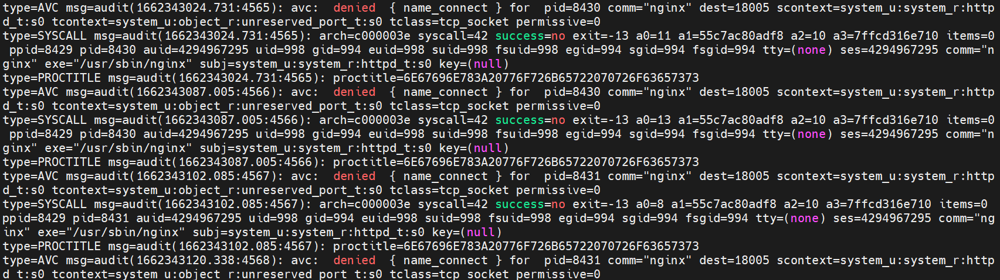

#  Nginx转发请求，报13：Permission denied错误

## 问题描述

**C：** 上周五下班前刚给新项目的测试环境添加上了 CI/CD，本以为事情就告一段落了，今天上午前端小伙伴合并了一版到测试环境，然后测试小伙伴就在群里 @ 笔者，问登录验证码怎么出不来了。

赶紧去测试地址看了一下，发现验证码接口 Nginx 502 了，首先想到的就是后端服务宕了，登上测试环境看了看，人家跑得欢快的很啊，程序日志里也没出现什么错误。

::: tip 笔者说
HTTP 状态码 502：表示作为网关或代理角色的服务器，从上游服务器（如tomcat、php-fpm）中接收到的响应是无效的。
:::

既然错误不在后端服务，那就顺着调用链路往前排查看看，打开 Nginx 错误日志，看看究竟是什么原因导致的 502。

```sh
cd /var/log/nginx/
# 查看错误日志
tail -50 error.log
```

```
2022/09/05 10:03:47 [crit] 8431#8431: *45 connect() to 127.0.0.1:18005 failed (13: Permission denied) while connecting to upstream, client: xx.xxx.xx.xxx, server: _, request: "GET /api/captcha?_t=1662344535439 HTTP/1.1", upstream: "http://127.0.0.1:18005/captcha?_t=1662344535439", host: "xx.x.xxx.xx", referrer: "http://xx.x.xxx.xx/"
```


## 原因分析

抓住错误关键词 `Permission denied`，没有权限的意思，笔者突然灵光一现，很早以前安装 Nginx，在启动的时候遇到过一个和权限类似的错误，大意是你不能用 `root` 直接启动。 Nginx 配置文件中有一个 `user` 配置，启动 Nginx 需要用对应的用户才能启动，笔者现在是登录的 `root` 用户，今天 CI/CD 执行后出现这问题了，还是得去确认下 Nginx 配置。

::: tip 笔者说
这个 Nginx 是上周五让网管装的，代理部分配置也是直接复制的另一个项目的发给他就配上了，配完笔者直接用上了，当时手动打包前端传上来也没见出现什么问题。
:::

```
# For more information on configuration, see:
#   * Official English Documentation: http://nginx.org/en/docs/
#   * Official Russian Documentation: http://nginx.org/ru/docs/

user nginx;
worker_processes auto;
error_log /var/log/nginx/error.log;
pid /run/nginx.pid;

....
```

## 解决方案

赶紧改一下，重新加载下配置试试。

```
# For more information on configuration, see:
#   * Official English Documentation: http://nginx.org/en/docs/
#   * Official Russian Documentation: http://nginx.org/ru/docs/
# 将 user 配置改为 root
user root;
worker_processes auto;
error_log /var/log/nginx/error.log;
pid /run/nginx.pid;

....
```

```sh
nginx -s reload
```

问题没解决，还是 502，这可就触碰到笔者的知识盲区了，搜索一下吧，实在不行问问网管。

这一搜啊，有一个搜索结果摘要引起了笔者的注意：

> **解决SELinux阻止Nginx访问服务** 
>
> “在使用 yum 安装 nginx 后可能会出现配置完成后却无法访问的问题”。[1]

笔者这一想，我们公司的网管当时让他安装 Nginx 没 5 分钟就告诉 OK 了，那很大可能是用 yum 安装的啊，作者博客让看一下 audit.log 有没有出现错误信息，笔者前去看了一下

```sh
tail -50 /var/log/audit/audit.log
```

果然和作者贴的图一模一样。



> 根据作者所言，"出现此问题的原因是 SELinux 基于最小权限原则默认拦截了 Nginx 的请求，SELinux 是 Linux 的安全子系统，提供更安全的访问控制。"[1]

解决方法，要么是直接关掉它，要么执行下方指令开启 HTTP 访问。

```sh
setsebool -P httpd_can_network_connect 1
```

执行后，立竿见影。忍不住感叹：Linux 知识学无止境。

## 参考资料

[1]解决SELinux阻止Nginx访问服务：https://blog.csdn.net/liweitao7610/article/details/107073852
