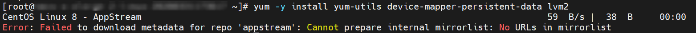

# 解决 CentOS 8 执行 yum install 报 Error: Failed to download metadata for repo 'appstream': Cannot prepare internal mirrorlist: No URLs in mirrorlist 的问题

## 问题描述

**C：** 今天，笔者在一台刚重装了 CentOS 8.2 操作系统的云服务器上正打算安装一下 Docker，结果开局安装依赖的环节就报错了。

```
CentOS Linux 8 - AppStream
Error: Failed to download metadata for repo 'appstream': Cannot prepare internal mirrorlist: No URLs in mirrorlist
```



<!-- more -->

## 原因分析

首先排除掉是安装 Docker 引起的错误，因为笔者起初还尝试了下把三个依赖分开安装，想看看是不是由于某个依赖安装引起的，最终发现无论执行 yum 安装哪一个包都会报这个错。

而从报错信息的字面意思来看，应该是和 yum 的镜像源有关。

```
错误：从仓库 ‘appstream’ 下载元数据失败：无法准备内部镜像列表：镜像列表中没有 url
```

这可就触碰到笔者的盲区部分了，最不擅长的就是这类 Linux 系统的初始配置，所以笔者搜索了一下，发现了一个较为靠谱的答案。

> 2020 年 12 月 8 号，CentOS 官方宣布了停止维护 CentOS Linux 的计划，并推出了 CentOS Stream 项目，CentOS Linux 8 作为 RHEL 8 的复刻版本，生命周期缩短，于 2021 年 12 月 31 日停止更新并停止维护（EOL），更多的信息可以查看 CentOS 官方公告。[1]

## 解决方案

解决起来也较为容易，那就是如果需要更新 CentOS，需要将镜像从 mirror.centos.org 更改为 vault.centos.org。

1. 进入 yum 的 repos 目录

   ```shell
   cd /etc/yum.repos.d/
   ```

2. 替换镜像

   ```shell
   sed -i 's/mirrorlist/#mirrorlist/g' /etc/yum.repos.d/CentOS-*
   sed -i 's|#baseurl=http://mirror.centos.org|baseurl=http://vault.centos.org|g' /etc/yum.repos.d/CentOS-*
   ```

3. 生成缓存

   ```shell
   yum makecache
   ```

4. 更新

   ```shell
   yum -y update
   ```

等待更新完之后，再执行 yum 安装就正常了。

## 参考资料

1. 【已解决】Error: Failed to download metadata for repo ‘appstream‘: Cannot prepare internal mirrorlist：https://blog.csdn.net/weixin_43252521/article/details/124409151
1. CentOS 8 EOL如何切换源？：https://help.aliyun.com/document_detail/405635.html
1. CentOS Project shifts focus to CentOS Stream：https://blog.centos.org/2020/12/future-is-centos-stream/