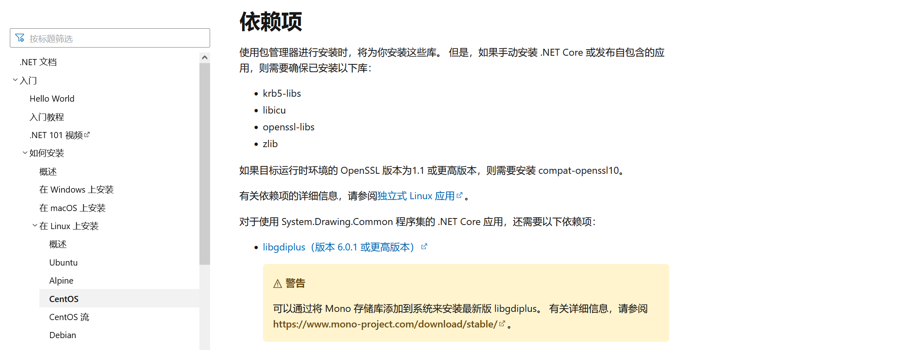

# 解决 DotNet 安装完，报错：Couldn't find a valid ICU package installed on the system. Please install libicu using your package manager and try again

## 问题描述

**C：** 今天，笔者在一台 CentOS 7.9 服务器上手动安装完 DotNet 6.0.401 并配置好了环境变量之后，照例想查看一下是否安装成功。

```shell
dotnet --version
```

预想的版本信息没输出，倒是输出了这么一段错误。


```c#
Process terminated. Couldn't find a valid ICU package installed on the system. Please install libicu using your package manager and try again. Alternatively you can set the configuration flag System.Globalization.Invariant to true if you want to run with no globalization support. Please see https://aka.ms/dotnet-missing-libicu for more information.
   at System.Environment.FailFast(System.String)
   at System.Globalization.GlobalizationMode+Settings..cctor()
   at System.Globalization.CultureData.CreateCultureWithInvariantData()
   at System.Globalization.CultureData.get_Invariant()
   at System.Globalization.CultureInfo..cctor()
   at System.Globalization.CultureInfo.get_CurrentUICulture()
   at System.TimeZoneInfo.GetUtcStandardDisplayName()
   at System.TimeZoneInfo.CreateUtcTimeZone()
   at System.TimeZoneInfo..cctor()
   at System.DateTime.get_Now()
   at Microsoft.DotNet.Cli.Program.Main(System.String[])
Aborted
```

<!-- more -->

## 原因分析

简单翻译一下关键错误信息。

> 进程终止。找不到系统上安装的有效 ICU 包。请使用包管理器安装 libicu，然后重试。或者，如果您想在不支持全球化的情况下运行，可以将配置标志 System.Globalization.Invariant 设置为 true。请访问 https://aka.ms/dotnet-missing-libicu 了解更多信息。

从提示信息来看，问题的原因是当前系统没有安装 DotNet 需要的 `libicu` 库。

## 解决方案

实际上这也是因为笔者采用的手动安装方式才导致的问题，如果采用包管理器（在线）安装方式，这个 `libicu` 库会自动被安装好，也就不会出现这个问题了。



知道了问题的原因，那就安装一下这个依赖库。

```shell
yum -y install libicu
```

安装完后，再执行查看版本命令，版本信息正常输出了。

## 参考资料

1. 在 CentOS 上安装 .NET SDK 或 .NET 运行时：https://learn.microsoft.com/zh-cn/dotnet/core/install/linux-centos
2. 用于全球化的运行时配置选项：https://learn.microsoft.com/zh-cn/dotnet/core/runtime-config/globalization
