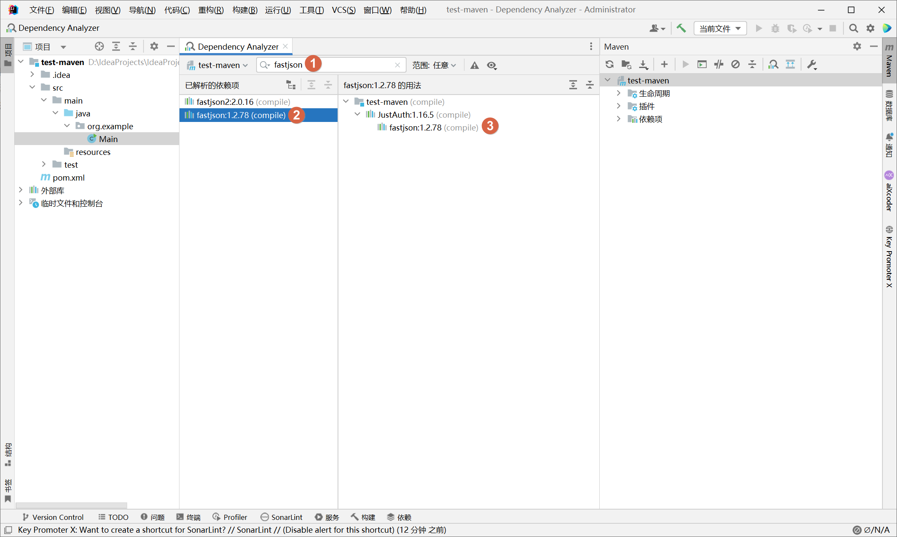

# 解决 Maven 传递依赖污染的问题

## 问题描述

**C：** 下午遇到了一个很常见的情况，类似于下图：

事情是这样的，笔者正想使用 `JSON` 工具来处理数据，结果 IntelliJ IDEA 提示笔者命名为 `JSON` 的工具类存在多个，到底要使用哪一个 `JSON`。


再打开提示，可选择的一共有两个：

1. com.alibaba.fastjson.JSON
2. com.alibaba.fastjson2.JSON

很明显，在笔者的项目中引入了 Fastjson、Fastjson2 两个依赖，这两个依赖中都有一个命名为 `JSON` 的工具类/接口。可问题来了，笔者仅在项目中显式引入了 Fastjson2 依赖，这个 Fastjson 依赖是哪来的？


## 原因分析

下面贴上笔者项目的 `pom.xml`，这当然不是笔者出问题的项目了，为了简单，笔者也没有特意创建父子项目场景，但其中关键的部分就是下面这些。很简单的项目依赖配置，锁定了  JustAuth 和 Fastjson2 的版本，并引入了这两个依赖。

```xml
<?xml version="1.0" encoding="UTF-8"?>
<project xmlns="http://maven.apache.org/POM/4.0.0"
         xmlns:xsi="http://www.w3.org/2001/XMLSchema-instance"
         xsi:schemaLocation="http://maven.apache.org/POM/4.0.0 http://maven.apache.org/xsd/maven-4.0.0.xsd">
    <modelVersion>4.0.0</modelVersion>

    <groupId>org.example</groupId>
    <artifactId>test-maven</artifactId>
    <version>1.0-SNAPSHOT</version>

    <properties>
        <justauth.version>1.16.5</justauth.version>
        <fastjson.version>2.0.16</fastjson.version>
        <maven.compiler.source>8</maven.compiler.source>
        <maven.compiler.target>8</maven.compiler.target>
        <project.build.sourceEncoding>UTF-8</project.build.sourceEncoding>
    </properties>

    <!-- 依赖版本锁定 -->
    <dependencyManagement>
        <dependencies>
            <!-- JustAuth（开箱即用的整合第三方登录的开源组件 ） -->
            <dependency>
                <groupId>me.zhyd.oauth</groupId>
                <artifactId>JustAuth</artifactId>
                <version>${justauth.version}</version>
            </dependency>

            <!-- Fastjson2（序列化和反序列化 JSON 工具） -->
            <dependency>
                <groupId>com.alibaba.fastjson2</groupId>
                <artifactId>fastjson2</artifactId>
                <version>${fastjson.version}</version>
            </dependency>
        </dependencies>
    </dependencyManagement>

    <!-- 依赖引入 -->
    <dependencies>
        <!-- JustAuth（开箱即用的整合第三方登录的开源组件 ） -->
        <dependency>
            <groupId>me.zhyd.oauth</groupId>
            <artifactId>JustAuth</artifactId>
        </dependency>

        <!-- Fastjson2（序列化和反序列化 JSON 工具） -->
        <dependency>
            <groupId>com.alibaba.fastjson2</groupId>
            <artifactId>fastjson2</artifactId>
        </dependency>
    </dependencies>
</project>
```

这问题，其实只要你全局搜索一下 `<artifactId>fastjson</artifactId>`，如果没有找到引入的话，那就是 Maven 传递依赖导致的结果了。如果想知道是谁传递依赖了它，那就打开 Maven 窗口，从每个项目模块的依赖项中挨个点开左侧有箭头的依赖。


依赖多的话，这效率就有些”捉急“了，所以笔者建议采用另一种方式：分析依赖关系。




根据依赖分析的结果，问题的原因就定位到了。虽然笔者没有显式引入 Fastjson 依赖，但因为 JustAuth 依赖了 Fastjson，所以笔者项目中就传递依赖了 Fastjson（如果多个依赖都依赖了 fastjson，而且版本还不一样，Maven 最后会生效哪个传递依赖？本篇重点不是介绍 Maven 的传递依赖“竞争”，所以这部分自行搜索一下吧，笔者仅是抛一下“砖”）。

## 解决方案

解决传递依赖其实很简单，最常见的有两种：

1. 如果 JustAuth 是笔者写的项目，那么只需要将 Fastjson 依赖加上一个 optional 配置即可。

   ```xml
   <!-- 依赖引入 -->
   <dependencies>
       <dependency>
           <groupId>com.alibaba</groupId>
           <artifactId>fastjson</artifactId>
           <version>1.2.78</version>
           <!-- 表示该依赖是可选的，不会被依赖传递 -->
           <optional>true</optional>
       </dependency>
   </dependencies>
   ```

2. 如果你项目中已经有了 Fastjson 传递依赖，经过 Maven 传递依赖竞争还生效了这 JustAuth 中的传递依赖，那可以根据实际情况排除掉它。

   ```xml
   <properties>
       <justauth.version>1.16.5</justauth.version>
       <maven.compiler.source>8</maven.compiler.source>
       <maven.compiler.target>8</maven.compiler.target>
       <project.build.sourceEncoding>UTF-8</project.build.sourceEncoding>
   </properties>
   
   <!-- 依赖版本锁定 -->
   <dependencyManagement>
       <dependencies>
           <!-- JustAuth（开箱即用的整合第三方登录的开源组件 ） -->
           <dependency>
               <groupId>me.zhyd.oauth</groupId>
               <artifactId>JustAuth</artifactId>
               <version>${justauth.version}</version>
               <!-- 排除指定传递依赖（如果配置了版本锁定，在版本锁定部分配置即可，其他引入部分不需要再配置） -->
               <exclusions>
                   <exclusion>
                       <groupId>com.alibaba</groupId>
                       <artifactId>fastjson</artifactId>
                   </exclusion>
               </exclusions>
           </dependency>
       </dependencies>
   </dependencyManagement>
   
   <!-- 依赖引入 -->
   <dependencies>
       <!-- JustAuth（开箱即用的整合第三方登录的开源组件 ） -->
       <dependency>
           <groupId>me.zhyd.oauth</groupId>
           <artifactId>JustAuth</artifactId>
       </dependency>
   </dependencies>
   ```

可惜这两种方法，第 1 种不符合笔者情况，第 2 种倒是可以移除，但是 JustAuth 需要使用这个依赖啊。

总结下笔者期望的效果：

1. 笔者不希望在写代码时，被 IntelliJ IDEA 提示这个和笔者无关的依赖中的类。

2. JustAuth 在使用时还能使用到这个依赖。


其实关键是 IntelliJ IDEA 提示这块的问题，那 IntelliJ IDEA 这提示的来源是什么？实际就是它在编译项目时引入了这些依赖，那么这个依赖能不能不在编译时提供，而是仅在运行时提供呢？

可以利用 Maven 的 scope（作用域）来尝试一下：

1. 从 JustAuth 传递依赖中排除掉 Fastjson 依赖（不排除掉它，你也无法操控 JustAuth 中的依赖配置）；

2. 显式提供一个 Fastjson 依赖，并设置其 scope（作用域）为 runtime（显式声明的依赖自然可以自由配置，设置为 runtime 后 Maven 就仅在运行时提供该依赖了）。

```xml
<properties>
    <justauth.version>1.16.5</justauth.version>
    <fastjson.version>2.0.16</fastjson.version>
    <maven.compiler.source>8</maven.compiler.source>
    <maven.compiler.target>8</maven.compiler.target>
    <project.build.sourceEncoding>UTF-8</project.build.sourceEncoding>
</properties>

<!-- 依赖版本锁定 -->
<dependencyManagement>
    <dependencies>
        <!-- JustAuth（开箱即用的整合第三方登录的开源组件 ） -->
        <dependency>
            <groupId>me.zhyd.oauth</groupId>
            <artifactId>JustAuth</artifactId>
            <version>${justauth.version}</version>
            <!-- 排除指定传递依赖（如果配置了版本锁定，在版本锁定部分配置即可，其他引入部分不需要再配置） -->
            <exclusions>
                <exclusion>
                    <groupId>com.alibaba</groupId>
                    <artifactId>fastjson</artifactId>
                </exclusion>
            </exclusions>
        </dependency>
        <dependency>
            <groupId>com.alibaba</groupId>
            <artifactId>fastjson</artifactId>
            <version>1.2.78</version>
            <!-- 仅在运行时提供该依赖 -->
            <scope>runtime</scope>
        </dependency>
    </dependencies>
</dependencyManagement>

<!-- 依赖引入 -->
<dependencies>
    <!-- JustAuth（开箱即用的整合第三方登录的开源组件 ） -->
    <dependency>
        <groupId>me.zhyd.oauth</groupId>
        <artifactId>JustAuth</artifactId>
    </dependency>
    <dependency>
        <groupId>com.alibaba</groupId>
        <artifactId>fastjson</artifactId>
    </dependency>
</dependencies>
```

OK，问题解决，写完 `JSON` 这个单词，IntelliJ IDEA 没有任何犹豫的自动导入了笔者期望的包。

