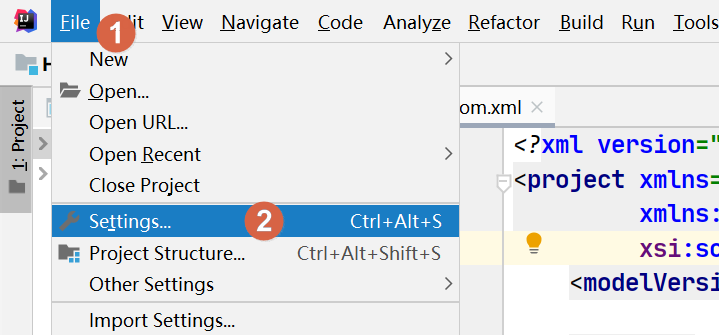
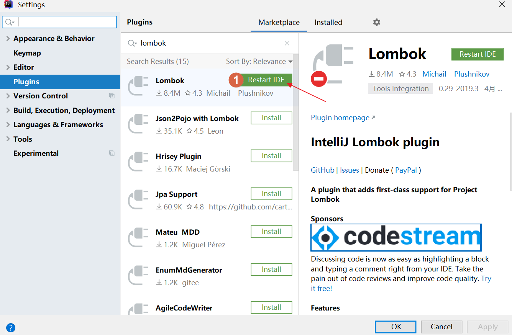

# 初识 Lombok

## 前言

**C：** 在 Java 开发中，为了符合 `封装` 这一面向对象特性，在构建 JavaBean 时往往要加上 `getter/setter` 方法。  

在封装的概念里，`getter` 和 `setter` 方法是我们提供给外界的统一访问入口，我们可以在其中添加合理的逻辑控制语句，来处理一些业务或解决一些不合理的赋值，非常好的特性！  

但现代开发的实际使用中，我们编写的 JavaBean 的 `getter/setter` 方法体都是空的，显得非常冗余，但又不能去除。对此，我们在每次使用时，只能通过反复的心理暗示（IDE 自动生成快捷键、生成不费事儿）来麻痹自己。

Eclipse 中是 `Alt + Shift+S > R`，IntelliJ IDEA 中是 `[FN] + Alt+Insert > Getter and Setter`。  

笔者相信，这些快捷键大家都很熟悉，甚至不只是它们，一般我们还会用上无参构造、带参构造、重写 `toString`、重写 `equals` 、`hashCode` 等生成快捷键，每次创建 JavaBean，写完属性之后就是一通 "火花带闪电" 快速生成，就像下面的代码一样。  

```java
/**
 * 宠物类
 * @author Charles7c
 * @date 2020-01-14
 */
public class Pet {
    // 属性声明
    /** 宠物名 */
    private String name;
    /** 健康值 */
    private int health;
    
    // getter/setter 方法
    public String getName() {
        return name;
    }
    public void setName(String name) {
        this.name = name;
    }
    public int getHealth() {
        return health;
    }
    public void setHealth(int health) {
        this.health = health;
    }
    @Override
    public boolean equals(Object o) {
        if (this == o) return true;
        if (o == null || getClass() != o.getClass()) return false;
        Pet pet = (Pet) o;
        return health == pet.health && name.equals(pet.name);
    }
    @Override
    public int hashCode() {
        return Objects.hash(name, health);
    }
    @Override
    public String toString() {
        return "Pet{" +
                "name='" + name + '\'' +
                ", health=" + health +
                '}';
    }	
}
```

毫无疑问，天下苦之久矣，于是 Lombok 出现了，旨在通过用简单的语法和注解（Annoation）代替众多的冗余代码，接下来我们就好好认识认识它。


<!-- more -->

## 概述

::: tip  [Lombok](https://projectlombok.org/) 简介
Project Lombok is a java library that automatically plugs into your editor and build tools, spicing up your java.  

Never write another getter or equals method again, with one  annotation your class has a fully featured builder, Automate your  logging variables, and much more. [1]
:::

上方是 Lombok 官方的简介，看不懂的同学也没关系，笔者按它实际的体验简单给你介绍下。

Lombok 是一个 Java 库，这个库提供了很多注解，这些注解会在代码编译的时候，帮助我们自动生成 `getter` 、`setter`、`equals`、`hashCode` 等等方法，这样我们就可以摆脱曾经的苦恼了。  

使用上它之后，你甚至会觉得在使用一个基于 Java 构建的新编程语言，下面就是 Lombok 优化上述 Pet 类的冗余代码后的效果。

```java
/**
 * 宠物类
 * @author Charles7c
 * @date 2020-01-14
 */
@Data
public class Pet {
    // 属性声明
    /** 宠物名 */
    private String name;
    /** 健康值 */
    private int health;
}
```

一个 `@Data` 注解直接可以替代掉那些冗余方法们。怎么样，还不错吧。

## 安装

### IDEA插件安装

::: tip 笔者说
截止笔者发文时， IntelliJ IDEA 的 2020.3 版本已经发布了，这一版开始，已经预装了 Lombok 插件，意味着你如果用的这版及之后，可以不用看这一小节了。
:::

因为 Lombok 是在项目编译时，根据我们使用的注解，生成我们不想写的冗余代码。 但是 IDE 们可不认识它这一套 "骚操作"，你在 JavaBean 中没写对应的 `getter/setter` 等方法，那么在 IDE 中写代码时想使用对应 JavaBean 的这些方法就是 "天方夜谭"。

也就是说如果你在类中没写 `getter/setter` ，那在 IDE 中编写类时，哪怕已经标注了`@Data`，也无法让 IDE 提示及使用它们。  

想要在 IDE 中正常使用 Lombok，必须先在 IDE 中安装对应的 Lombok 插件。Lombok 为主流的 IDE 提供了插件支持，我们本次就以 IntelliJ IDEA 为例，来安装下插件，并测试使用效果。 


其实 Lombok 官网对各种 IDE 如何安装插件是有教程的（[IDEA的教程](https://projectlombok.org/setup/intellij)）。笔者个人认为写得已经很详细了，那接下来笔者就带大家实际操作一遍，你来实现的话记得按我的步骤来。

首先打开 IDEA，在菜单 `File` 中找到 `Settings` 子菜单。



在弹出的对话框中，选择 `Plugins`，然后在 `Marketplace` 插件市场中输入 `lombok` 回车搜索，搜索到了点击`Install` 安装就可以了。


安装成功后，直接点击 `Restart IDE` 重启 IDEA，插件就安装成功了。



### 引入依赖

::: tip 笔者说
如果你使用了 Spring Boot，Lombok 的版本已经被 Spring Boot 锁定了，意味着你可以不用指定版本，只需要引入 Lombok 依赖即可。
:::

安装好插件后，就可以在你的项目中引入 Lombok 依赖来使用了。

Maven 依赖如下：

```xml
<dependency>
    <groupId>org.projectlombok</groupId>
    <artifactId>lombok</artifactId>
    <version>1.18.24</version>
</dependency>
```

Gradle 依赖如下：

```groovy
compile group: 'org.projectlombok', name: 'lombok', version: '1.18.24'
```

## 常用注解

Lombok 的学习使用，就是要学习它的注解们。但的确很多，笔者要是全来一遍，时间花费可不少而且意义不大，所以我们挑一些常见常用的来介绍演示一下就可以了。

对这些注解的使用，笔者奉行基本应用即可，特殊的类，麻烦的属性，不建议采用，以免"上头"。如果你到时候真的需要，自行搜索一下 [官网文档](https://projectlombok.org/features/all) 即可。

### @NonNull

我们在设值时，经常要进行非空判断，因为为空后再进行处理可能会引发业务错误，`@NonNull` 注解可以帮助我们简化此类代码。

它可以用在属性或方法形参上，如果标注的属性/参数为空，则抛出 `NPE(NullPointerException)`。

::: tip 笔者说
下图中，左侧是我使用 Lombok 的代码，右侧是 `mvn compile` 之后，从 `target` 文件夹中查看的反编译后的代码（这些多出来的代码，都是 Lombok 在编译时自动生成的），后续示例笔者不再解释这一点。
:::


### @Getter/@Setter

`@Getter` 和 `@Setter` 这两个注解，顾名思义就是为我们生成对应的 `getter/setter` 方法的，一般情况下直接在类上声明就可以了，这样类中所有的非静态私有属性都会生成 `public` 修饰的 `getter/setter` 方法了。

::: tip 笔者说
生成的 `getter` 遵循布尔属性的约定，例如：`boolean` 类型的 `deleted` 生成的 `getter` 方法为 `isDeleted` 而不是 `getDeleted`。 
:::


当然，如果你只是想为部分属性生成对应的 `getter/setter` 方法，就在属性左侧或上方添加注解即可，它们默认生成的方法都是 `public` 修饰的。如果你想调整访问级别，可以通过注解内的属性值来进行设置。


`@Getter` 和 `@Setter` 的确挺好用的，笔者个人比较喜欢使用，诚意推荐。

还有同学可能担心，如果有一天需要自己在 `getter/setter` 方法中添加逻辑控制怎么办？不用担心，你直接正常写对应的方法即可，因为 Lombok 检测到你写了之后就不会生成了（这点 "眼力见儿" 还是有的）。

### @ToString

`@ToString` 就是帮助我们生成非静态属性的 `toString` 方法的一个注解，它的使用也很简单，一般情况下都是直接在类上面添加即可。

有些时候我们在 `toString` 方法中，不想出现某个属性，可以直接在该属性上标注`@ToString.Exclude` 或采用 `@ToString(exclude={"属性名",....)` 来排除。


还有，如果你不想 `toString` 方法输出属性名，那么 `includeFieldNames=false` 适合你。


另外如果一个子类想要在 `toString` 中也输出父类的 `toString` 内容，那么在 `@ToString` 内添加 `callSuper` 属性为 `true` 即可，但注意父类必须也重写 `toString`，否则肯定是使用 `Object` 类默认的 `toString` 方法返回值了。


### 构造类注解

构造方法也是我们经常要生成的代码了，Lombok 提供了三个注解来满足你的各种构造需求。

- `@NoArgsConstructor` 可以自动生成无参数构造方法
- `@AllArgsConstructor` 可以按顺序自动生成所有参数的构造方法
- `@RequiredArgsConstructor` 仅为标注了 `@NonNull` 注解的属性生成构造方法

我举一个 `@AllArgsConstructor` 注解的例子。


### @Data

在上方 Lombok 概述的示例中，我们就看到了 `@Data` 这个注解，大多数人都喜欢使用此注解。但笔者认为，如果你没有特别需求，仅仅要生成 `getter/setter` 方法，那使用 `@Getter` 和 `@Setter` 就可以了。

看看下方的示例吧，我仅仅写了一个干干净净的 Pet 类，但是在使用时，它却提示出很多的方法，像 `setter`、`getter`、`equals` 等都提供出来了，显然是 Lombok 的 "锅"，它等价于 `@ToString`、 `@EqualsAndHashCode`, `@Getter`、`@Setter`、`@RequiredArgsConstructor` 等注解的集合。


### @Cleanup

我们在使用 IO 系 API 时，需要自行进行资源管理（关流），`Java 7` 中上线了 `try-with-resources` 语法来帮助我们实现自动关流，现在 Lombok 也来 "抢活" 了。它提供了一个注解来帮助你自动生成资源管理代码，孰优孰劣自行选择吧。

```java
// Java 7的try-with-resources
try(InputStream in = new FileInputStream("d:\\a.txt")){
    // ....
}catch (Exception e){
    e.printStackTrace();
}
```

`@Cleanup` 注解使用后及其反编译代码如下。

::: tip 笔者说
因为 Lombok 编译生成的代码涉及到 `close()` 方法调用，所以需要提前抛出一个 IOException，否则编译会失败。
:::


### @Synchronized

为了解决多线程不安全的问题，我们经常使用 `synchronized` 关键字来进行加锁，可以加在方法上也可以使用代码块来加锁。

`@Synchronized` 注解的效果和 `synchronized` 关键字一样，它可以用在类方法或者实例方法上，是`synchronized` 关键字更安全的变体。  

区别在于锁对象不同，对于类方法和实例方法，`synchronized` 关键字的锁对象分别是类的 `class` 对象和 `this` 对象，而 `@Synchronized` 的锁对象则分别是私有静态 final 对象 `$LOCK` 和私有 final 对象 `$lock`。当然，也可以自己指定锁对象。


### @Builder

`@Builder` 用在类上，是类似于构建者模式的一个注解。它的作用就是帮你生成一套 `builder APIs`，将对象构建过程和细节进行封装，更简单和优雅的实现对象的创建及赋值。我们看个对象创建的对比例子吧。

```java
// 不使用 @Builder 注解 常见的创建对象方式
Pet pet = new Pet();
pet.setName("小白");
pet.setHealth(100);
// ......

// 使用@Builder注解后 创建对象
// 在IDEA中，你直接一路敲下来就可以了 链式编程简直不要太舒服
Pet pet1 = Pet.builder()
    .name("小白")
    .health(100)
    .build();
```

那么 `@Builder` 注解实际帮助我们添加了什么代码呢？看看反编译后的内容吧。

```java
public class Pet {
    private String name;
    private int health;
    // 1.一个构造
    Pet(String name, int health) {
        this.name = name;
        this.health = health;
    }
    // 2.一个静态构建方法  返回构建类对象
    public static Pet.PetBuilder builder() {
        return new Pet.PetBuilder();
    }
    // 3.一个静态内部构建类
    public static class PetBuilder {
        private String name;
        private int health;

        PetBuilder() {
        }
        // 4.属性同名赋值方法  
        // 【调用完还会返回构建对象，这样可以继续调用其他方法】
        public Pet.PetBuilder name(String name) {
            this.name = name;
            return this;
        }

        public Pet.PetBuilder health(int health) {
            this.health = health;
            return this;
        }
        // 5.最终构建对象方法
        public Pet build() {
            return new Pet(this.name, this.health);
        }
        // 6.一个toString
        public String toString() {
            return "Pet.PetBuilder(name=" + this.name + ", health=" + this.health + ")";
        }
    }
}
```

### 日志类注解

在开发中，我们常常要使用 log 来记录程序执行过程，Lombok 为我们提供了6种注解，根据不同的注解将生成不同类型的 log 实例，但是实例名称都是 `log`。

- `@CommonsLog`
- `@Log`
- `@Log4j`
- `@Log4j2`
- **`@Slf4j(推荐)`**  
- `@XSlf4j`

```java
@Slf4j
@Controller
@RequestMapping("/user")
public class UserController {
    @GetMapping
    public Result findAll() {
        // 直接使用 log 实例
        log.info("用户列表查询");    
    }
}
```

::: tip 笔者说
SLF4J（Simple Logging Facade For Java，为 Java 提供的简单日志门面）。在阿里巴巴 Java 开发手册日志规约中强调，如果要使用日志 API ，必须使用日志门面 API 而不是具体日志框架的 API。  


所谓日志门面，其实就是类似于 Java 的 JDBC 一样的一套 API ，有了 JDBC，你无需关心未来切换成哪种关系型数据库，因为获取连接等方法用的是 JDBC 的 API 。  

同样日志门面，可以让我们无需关心未来切换哪种日志框架，因为获取日志实例用的是日志门面的 API。
:::

## Java 14 新特性 Records

2020年3月17日，Java 14 正式 `GA`，虽然我们目前仍然主要使用 Java 8，但更新肯定是趋势，未来升级到 14 或更高的某个版本只是时间问题，所以这些新特性我们还是应该关注关注的。

在 Java 14 中有一个预览特性 `Records`，Java 15 对该特性又进行了二次预览，`Records`  提供了一种紧凑的语法来声明类（我们经常用来做类声明的方式有 `class`、`enum` 等，这回又多一个），以帮助开发者写出更简洁的代码。

该特性主要用在特定领域的类，这些类主要用于保存数据，不提供领域行为。再通俗的讲就是我们可以给一些简单的，一般不提供业务操作的类（`POJO类`等）更改下声明类的方法了。更多详情请查看：[Records的官方介绍](https://openjdk.java.net/jeps/359)


来个简单的语法示例吧？看看下面的代码，它也自动解决了头疼的 `getter`、`setter`、`equals`、`hashCode`、无参构造等。

```java
// record 声明类语法
{ClassModifier} record TypeIdentifier [TypeParameters] 
    (RecordComponents) [SuperInterfaces] [RecordBody]
// 示例代码：注意这是类，不是方法
public record Pet(String name,int health){
    
}
```

## 参考资料

[1]Project Lombok 简介：https://projectlombok.org

[2]Lombok常用注解：https://www.cnblogs.com/mayhh/p/10113169.html

[3]Records介绍：https://openjdk.java.net/jeps/359

## 后记

Lombok 入门到这里也就介绍完了，感觉怎么样？这只是个入门示例，如果想再多研究研究其他注解和属性，那需要更多的篇幅和时间。

实际上，在现在的业内，Lombok 的使用存在着争议，有些人认为它是 `开发利器`，有些人 `避之不及`。认为它好的是因为它的确减少了大量的冗余代码，相当于写代码随时带个生成器，阅读代码也变得更加清晰直观；认为它不好的是因为它的使用还需要安装额外的插件，且是侵入性的设计（有些人认为，它这种改变语法的事应该是语言本身自己该做的，它 "越俎代庖" 了），如果开发中 IDEA、JDK、Lombok 不配套，那结果显而易见；还有些人认为它影响了业务控制代码的添加和阅读。

孰是孰非，仁者见仁智者见智。笔者个人觉得，自己平时练习和测试都可以随便用用，如果上升到公司，还是应该以实际和团队整体出发。


::: info 笔者说
对于技术的学习，笔者一贯遵循的步骤是：先用最最简单的 demo 让它跑起来，然后学学它的最最常用 API 和 配置让自己能用起来，最后熟练使用的基础上，在空闲时尝试阅读它的源码让自己能够洞彻它的运行机制，部分问题出现的原因，同时借鉴这些技术实现来提升自己的代码高度。

所以在笔者的文章中，前期基本都是小白文，仅仅穿插很少量的源码研究。当然等小白文更新多了，你们还依然喜欢，后期会不定时专门对部分技术的源码进行解析。
:::

