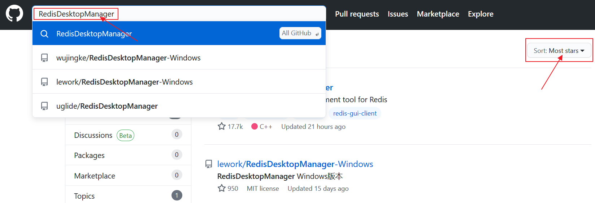
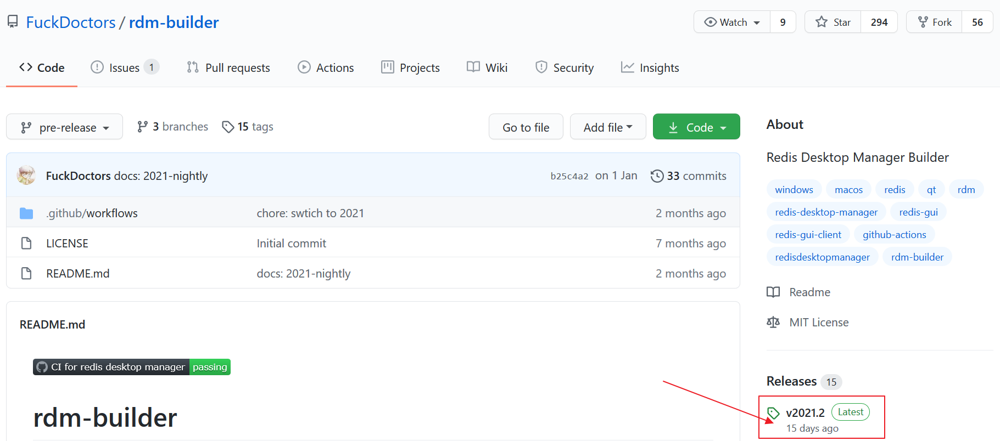
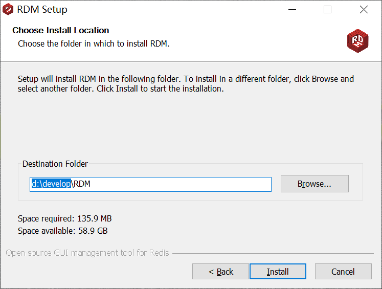
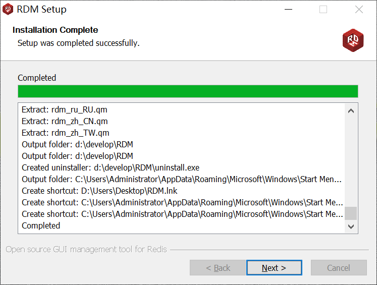
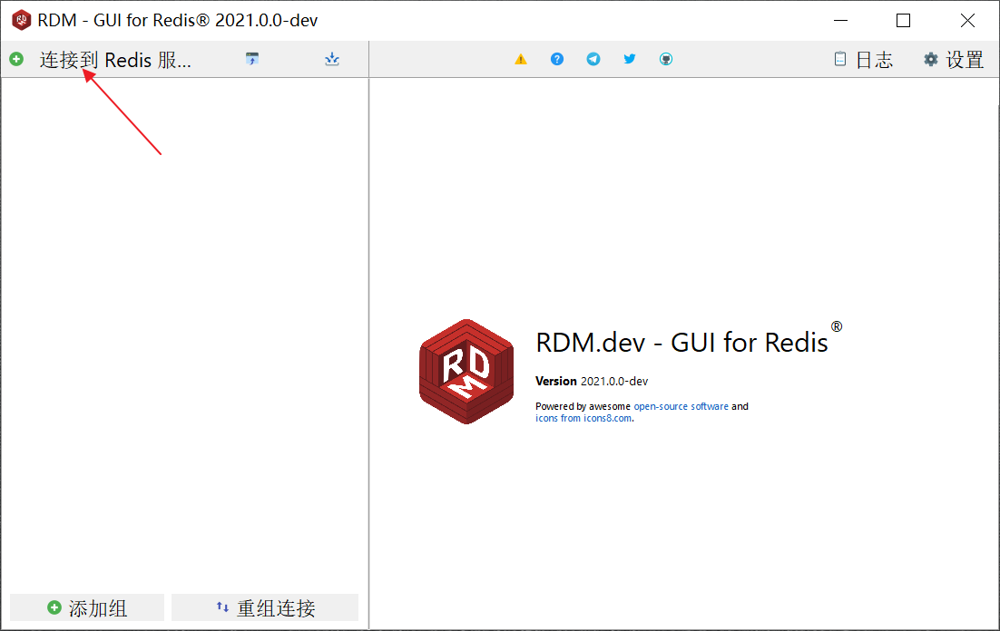
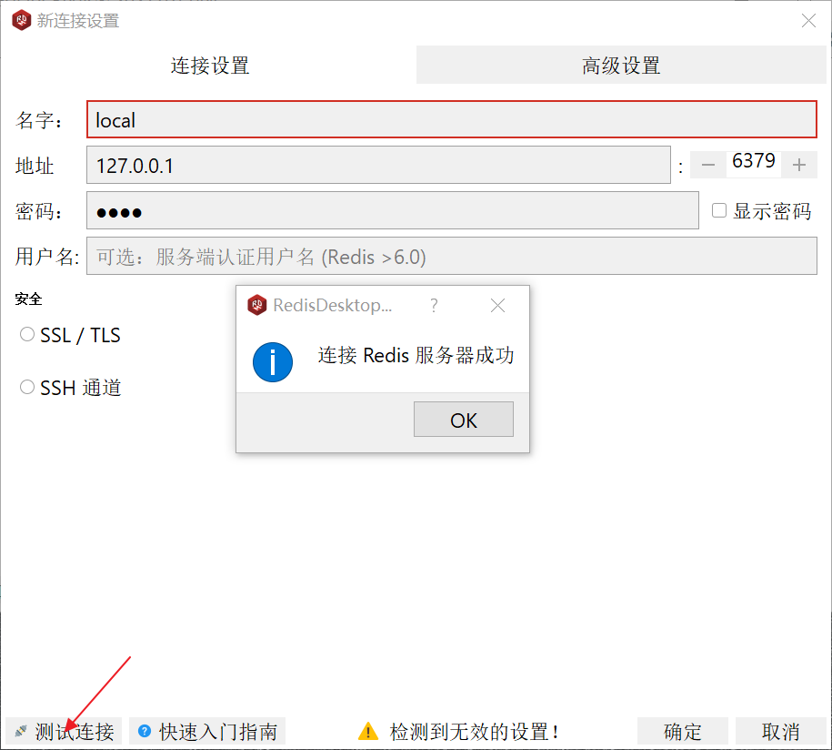
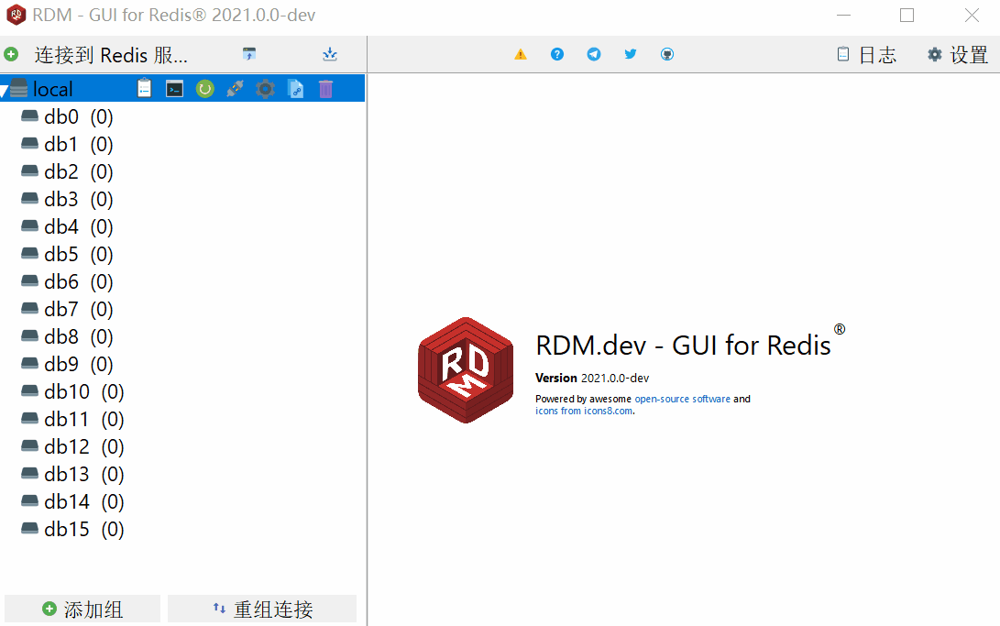

# Redis Desktop Manager 快速入门

## 前言

这个时代，Redis 多流行啊，10 个程序员起码有 8 个听过用过。人多了，自然有人不太喜欢使用命令行来直接操作 Redis。所以，在官方没有提供的情况下，大家一直都在寻求一款好用的 Redis 客户端管理工具，而 RDM 这款软件，在咱们国内 IT 圈子里不说人尽皆知吧，也可以说的上是小有名气的。

::: tip 简介
RDM，全称 Redis Desktop Manager。它是一个快速、简单、支持跨平台的 Redis 桌面管理工具，基于 Qt 5 开发，支持通过 SSH Tunnel 连接 [1]。它开源在了 GitHub [2] 上。
:::

<!-- more -->

长下面这样。在当前 Redis 客户端工具圈里可以说的上是 “高颜值”，而且也比较实用。

但是很可惜，0.9.3.817 是它的最后一个免费版。

你可能会比较好奇，它不是开源的吗？的确，它是开源的，但也仅仅是开源，即开放源代码。而大多数开源软件都会免费提供安装包，但 RDM 从 0.9.3.817 版本开始就不再免费提供了。

这意味着什么？如果你懂一定的相关技术，自然可以利用它的源代码自己编译一个。而如果你不懂？不好意思，那就买它吧！看看下方的价格，其实也算良心价了。

当然，笔者不是来刺激你的，早就给你准备好了一份 RDM 的第三方编译版 。

在 GitHub 上，这类 RDM 第三方编译版还是挺多的，你也可以自己去搜索一下。

## 下载

笔者这里以 rdm-builder 这个 GitHub 仓库为示例，来介绍下第三方编译版的 Windows 版 RDM 下载和安装。

打开这个仓库之后，在右侧的 Releases 显示它有15个发行版，最新的是 v2021.2 版，这也是随着官方来更新的。等你看到这篇文章的时候，或许它已经变成了更新的版本。

点击最新发行版，跳转到版本下载页面。

然后再点击 `xxx.exe` 即可开始下载这个第三方编译的 Windows 版 RDM 了。

下载好了，一个普普通通的可执行程序。

## 安装

接下来，我们 “傻瓜式” 安装即可。

改动一下安装位置，这个目录专门放开发工具，是笔者以前逐渐养成的个人习惯。

## 连接服务器

安装完成后，直接打开。因为不是最新版，所以每次都会弹出这个更新提示框。别管，直接点 [OK] 就行。

RDM 使用起来还是比较容易的，点击左上角的 [连接到 Redis 服务器]。

进入到连接设置之后，依次填写 [连接名称，Redis 服务器地址，Redis 密码（可选），用户名（可选）]，可以先点击 [测试连接] 查看下是否可以连接成功。

## 常见使用

虽然，本篇笔者重点是给你安利第三方编译的 RDM，但思来想去还是决定为部分小白们介绍一下 RDM 的简易操作，会用的老白们就不用看了。

### 查看所有数据库

测试连接成功后，双击连接名，就可以看到当前 Redis 服务器的所有数据库。

### 存储键

### 修改值

### 修改过期时间

### 删除键

刚才我们给 `name` 这个键设置了5秒过期之后，唯一存储的数据也没了，我们再新建一个，然后来测试一下删除功能。

### 命令行操作

不仅如此，当你想用命令行操作时，RDM 还可以直接打开控制台连接 Redis 服务器。

## 参考资料

[1]Redis Desktop Manager 介绍：https://www.oschina.net/p/redisdesktop?hmsr=aladdin1e1

[2]RDM GitHub 地址：https://github.com/uglide/RedisDesktopManager/

[3]RDM 的第三方编译版：https://github.com/FuckDoctors/rdm-builder