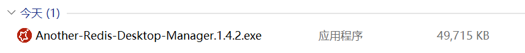
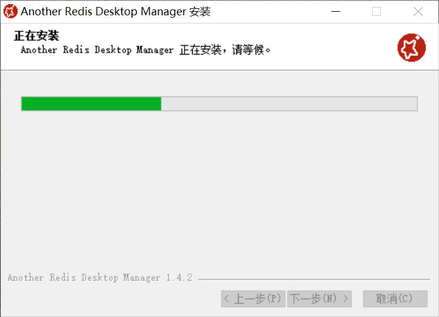
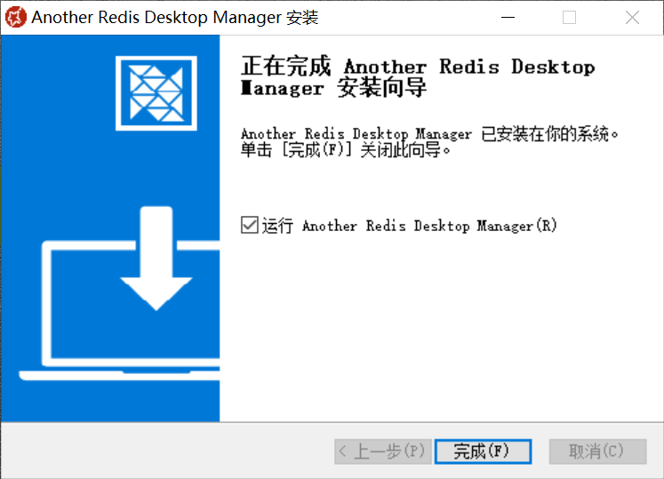
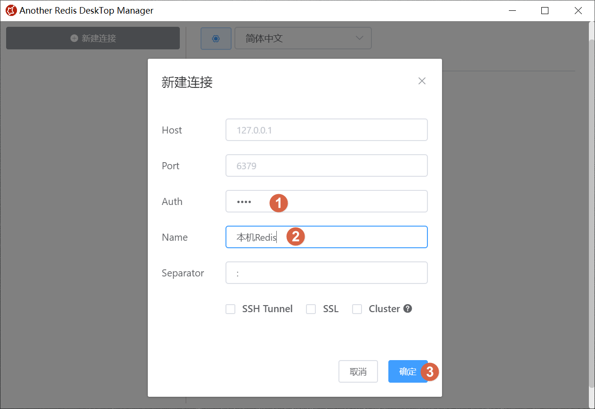
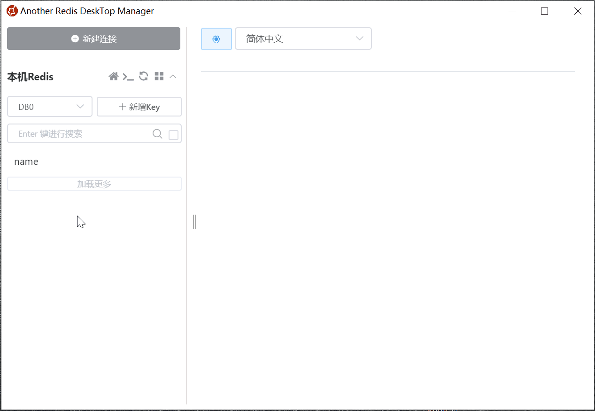
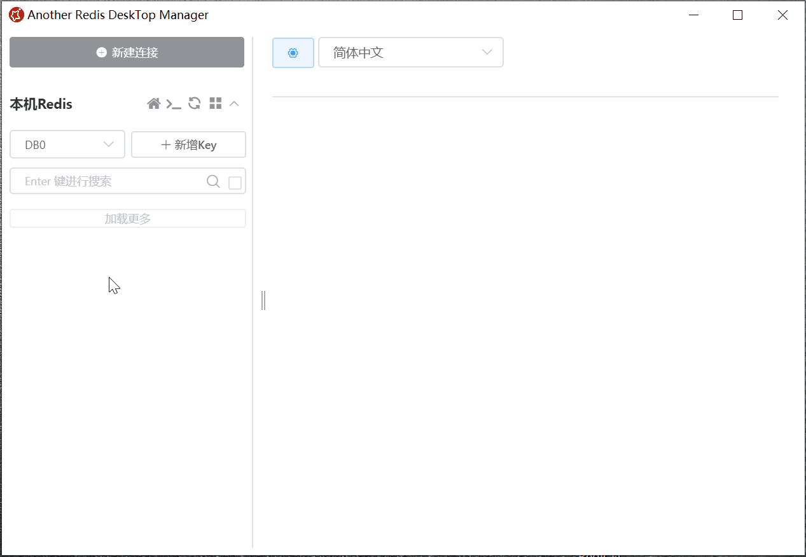

# Another Redis Desktop Manager 快速入门

## 前言

之前，笔者发布过一篇有关于 Redis 可视化客户端：RDM 的介绍文章，有童鞋看了后留言给笔者说：“RDM 不怎么好用，建议试试 Another Redis Desktop Manager。“

实际上，虽然笔者发的是 RDM，但近段时间一直在用的就是 ARDM。当然了，这不是笔者藏着掖着，而是因为资源不得一点点发吗？而且，还是有童鞋在用 RDM 的，习惯一个工具之后，随便更换也是需要学习成本不是？

OK，本篇笔者就要给童鞋们分享一下这个所谓的 ARDM。

<!-- more -->

## 简介

::: tip 简介
Another Redis Desktop Manager，一个更快，更好，更稳定的 Redis 桌面管理器，兼容 Linux, windows, mac。更重要的是，它不会在加载大量的键时崩溃。[1]  

顾名思义，Another Redis Desktop Manager 就是 另一个 RDM 的意思，它在功能方面和 RDM 大体没什么区别，不过在 UI 和体验上的确更胜一筹。  

这个项目从 2019 年 2 月份就开始了，开源且免费提供打包版本，更新到今天也不短的时间了，所以关于稳定性的问题就暂时不用担心了。[2]
:::

## 下载

打开 GitHub 直接搜索 AnotherRedisDesktopManager 项目，然后点击项目右下方的最新发行版，就可以跳转到对应的版本下载页面了。

当然，也可以直接复制本文最后参考资料 [2] 的下载地址，然后在 PC 浏览器打开，也同样可以跳转到最新版的下载页面。

然后，根据你的系统情况选择合适的版本下载吧。

下载好了，一个平平无奇的 exe 安装包。

## 安装

接下来，我们 “傻瓜式” 安装即可。

改动一下安装位置，这个目录专门放开发工具，是笔者以前逐渐养成的个人习惯。

## 连接服务器

安装完成后，直接打开，界面可真是简洁到家了。

连接服务器的步骤也和 RDM 差不多，点击左上角的 [新建连接]。

进入到新建连接界面之后，依次填写 [Redis 服务器地址，Redis 端口号，Redis 密码，连接名] 后即可点击 [确定] 来新建一个连接。

::: tip 笔者说
如果你要连接的 Redis 就在本机，并且你没改过什么默认设置（端口、密码等），你甚至只需要在这个界面点一下确定就可以新建好一个连接。
:::

## 常见使用

虽然，笔者觉得 ARDM 和 RDM 在功能上大体是一样的，但为了照顾小白们的感受，笔者还是按当初介绍 RDM 的步骤再演示一下常见操作。

### 查看所有键

单击连接名，就可以打开单个连接，默认是处于 0 号数据库，可以根据需求进行数据库切换。另外，打开连接时默认还会在右侧打开当前 Redis 的服务监控。

### 存储键

ARDM 中存储键是先新增一个 key，这个 key 默认什么也没存储，你需要再为这个 key 设置下 value，这一步实际就是下面的修改操作。

### 修改值

### 修改过期时间

### 删除键

刚才我们给 `name` 这个键设置了 5 秒过期之后，唯一存储的数据也没了，我们再新建一个，然后来测试一下删除功能。

### 命令行操作

当你想用命令行操作时，ARDM 同样也可以直接打开控制台连接 Redis 服务器。

## 参考资料

[1]Another Redis Desktop Manager GitHub 地址：https://github.com/qishibo/AnotherRedisDesktopManager

[2]Another Redis Desktop Manager 下载地址：https://github.com/qishibo/AnotherRedisDesktopManager/releases

## 后记

**C：** 好了，ARDM 的介绍就到这儿结束了，至于其他的功能，自行去发现体验吧，那样才更有乐趣，不是吗？

当然，本篇介绍完，笔者暂时就不会再推荐其他 Redis 可视化客户端了，也许后面有后起之秀，到那时候再说吧，也欢迎童鞋们再留言告诉我。