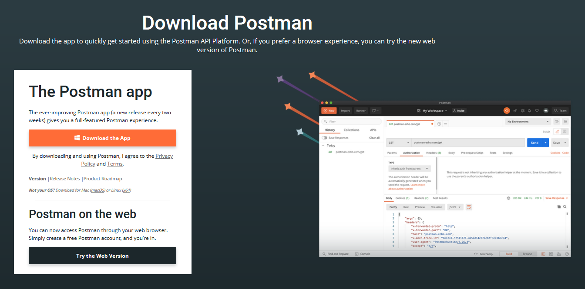
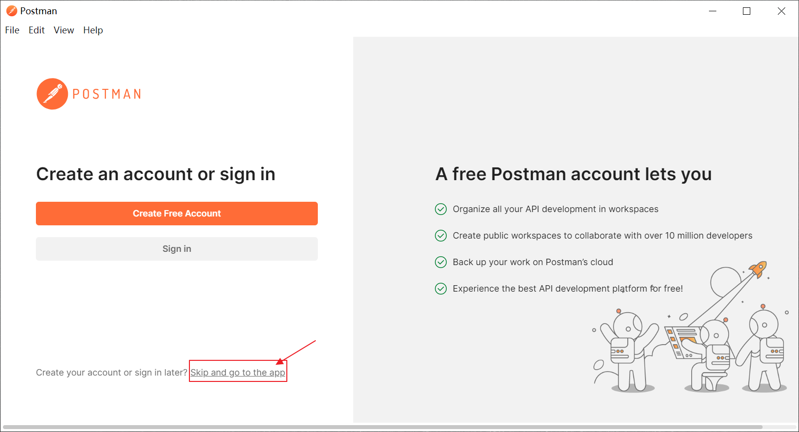
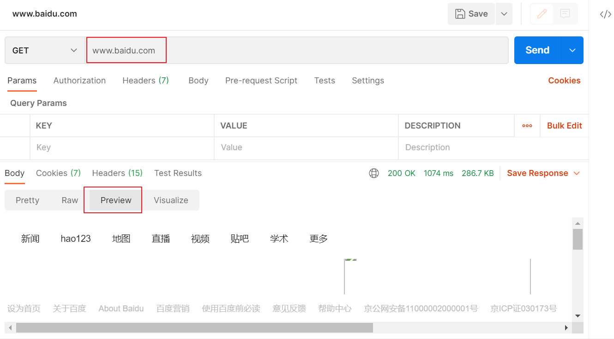
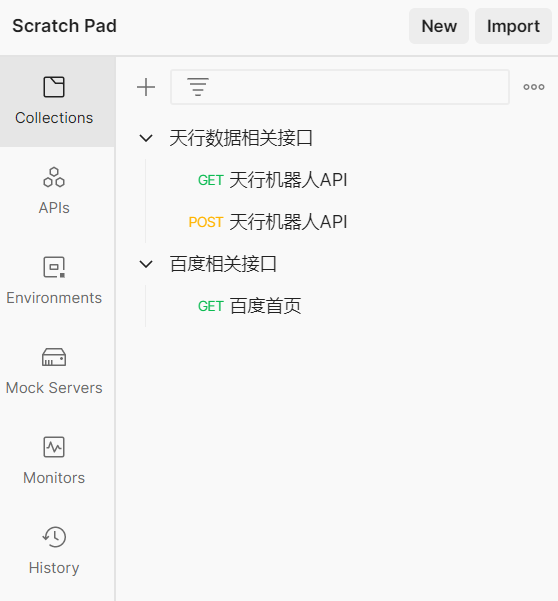
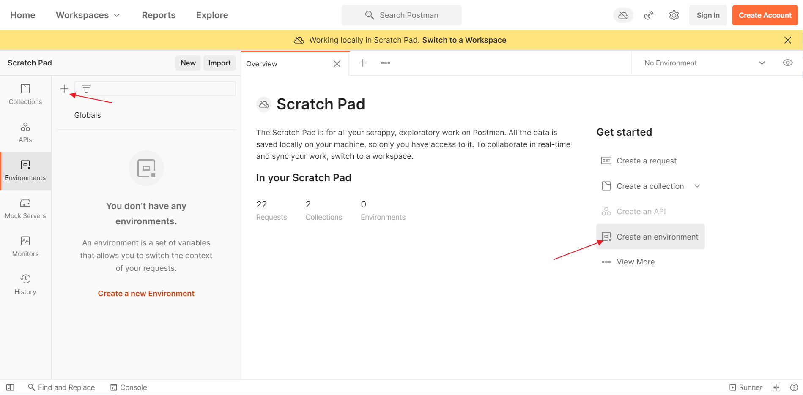
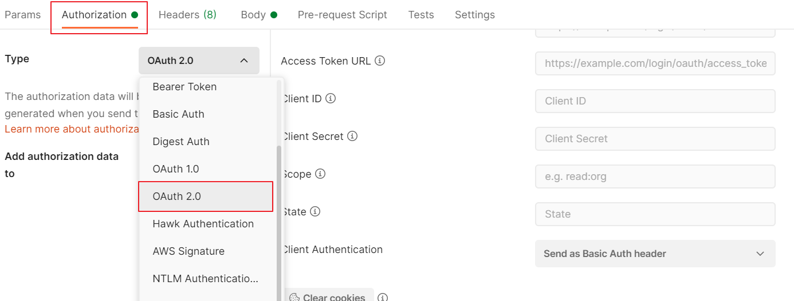

# Postman 快速入门

## 前言

近两年前后端分离开发成为了主流趋势，前端可以专心实现自己的客户端样式和交互，而后端可以更多关注业务逻辑的处理。

在后端开发了接口之后，需要进行测试工作，而由于前端的拆分，这回想要测试一下，可没有相应的页面能够提供功能入口了。

莫非，要通过浏览器地址栏来进行测试？但这些接口又不仅仅是 GET 请求方式。而且，有些接口的要求很是复杂，需要传递请求头或更为复杂的参数。再不成，后端自己写个简单页面 demo 来进行测试？那也太 Low 了！

本篇，笔者就要为后端开发推荐一款强大的测试工具，这个工具可是笔者从测试那儿 GET 到的。

<!-- more -->

## 简介

::: tip Postman 简介
Postman 是一款功能强大的，网页调试与发送网页 HTTP 请求的工具，通过 Postman 我们可以发送几乎任何请求方式的请求，也可以附带各种类型的请求头、请求参数。
:::

## 下载

Postman 最初是谷歌浏览器的一款插件，后来火了之后，人家自己也开发了相应的客户端以及 Web 端。笔者在本篇就以客户端来进行示例使用，你要是不喜欢这两种，也可以去百度找一下它的插件版。

复制文章最后参考资料 [1] 的地址，然后粘贴到你的 PC 浏览器地址栏，访问之后就可以点击 [Download the App] 按钮，然后根据自己系统情况来进行客户端下载了。

::: tip 笔者说
你点击 [Download the App] 按钮的时候，它会弹出一个下拉框，让你选择 Windows 系统的某个位数版本，然后再开始下载。  

但实际上 Postman 也有 Mac、Linux 系统的版本，就在下载按钮下方 [Not your OS？] 那儿，点击对应系统版本的链接就可以下载了。
:::

下载好了，一个平平无奇的 exe 安装包。

## 安装

双击 exe 安装包，Postman 就会不识抬举的自行完成安装，想必又是装在了 C 盘。

安装完成后，双击桌面上出现的 Postman 图标，打开后的 Postman 首屏如下。

Postman 在首屏极力推荐我们进行注册，注册后可以实现云端同步备份，如果你有这需求可以创建一个。当然，点击 [Skip and go to the app] 跳过这一步，直接进入主界面也行。 

::: tip 笔者说
如果一会儿体验过打算长期使用起来，别忘了注册个账号，还可以云端同步。
:::

和最初版本比起来，Postman 更新的还是挺快的，功能也更加丰富了，但对于咱们来讲，只需要重点关注好它的核心功能即可。

安装好后，笔者将带各位同学，学习 Postman 中的三种基本操作，这也是 Postman 在应用主界面首要推荐你尝试的。

在开始前，我们先准备一个数据接口，笔者这里注册并申请了天行数据的机器人 API [2]，你也可以用自己的项目 API 来进行测试。

## 测试请求

找到 [Overview] 窗口右侧的 [Get started]，然后点击 [Create a request] 来开始创建一个请求。其实你点击 [Overview] 选项卡右侧的 + 号也可以打开创建请求窗口。

::: tip 笔者说
如果你进入主界面后，不小心把 [Overview] 窗口关闭了，可以点击左侧的 [Scratch Pad] 再次打开它。
:::

在弹出的创建请求窗口里，提供了丰富的选项，几乎可以满足我们所有的接口测试需求。

接下来我们按照刚才申请的接口要求，来进行请求测试吧。在大多情况下，我们用的最多的就是 GET 请求和 POST 请求，笔者就用 Postman 来分别演示一下。

### GET请求

按照 API 介绍依次选择并填写好请求方式，请求URL，请求参数，然后点击 [Send] 发送请求即可。

接收到的响应内容默认是以 [Pretty] 漂亮的格式化好的 [JSON] 格式来展示的，你也可以调整为其他数据格式和展示方式。

- Pretty：以漂亮的格式化的形式来展示响应数据，支持 JSON、XML、HTML 等数据内容的格式化；

- Raw：以普通的文本形式来展示响应数据；

- Preview：以预览的形式来展示响应数据，适合 HTML 格式的响应数据；（在浏览器控制台的网络选项卡中，查看某个网络请求的响应内容也有此种方式）

  

- Visualize：以可视化的图形来展示响应数据，但这一项需要提前在 Postman 中编写一些测试脚本。

### POST请求

发送 POST 请求也和 GET 差不多，我们也是依次选择并填写好请求方式，请求URL及请求参数。这里的请求参数，需要在请求体部分设置。

在请求体 [Body] 中选择 [x-www-form-urlencoded] 然后填写请求参数键值对即可。

::: tip 笔者说
这个过程等价于我们在网页上编写一个 form 表单，设置请求方式为 POST，然后对表单设置好 name 和 value 值一样，以 POST 请求方式来提交 form 表单的时候，默认的 enctype (encodetype，规定了 form 表单在发送到服务器时的编码方式) 就是：application/x-www-form-urlencoded。
:::

当然，请求体部分还可以设置为其他的格式：

- form-data：做文件上传的时候，我们都知道要将请求的 enctype 设置为 multipart/form-data，该选项等价于此；

  

- raw：该选项下，可以发送任意格式的普通文本数据，例如：Text、JSON、XML、HTML等；

- binary：该选项等价于设置请求头 Content-Type 为 application/octet-stream，只可以发送二进制数据，t通常用于文件的上传，且只能上传一个，没有像 form-data 格式的键值对；

  

- GraphQL：顾名思义，该选项支持 GraphQL 查询。

  ::: tip GraphQL 简介
  GraphQL 是一种用于 API 的查询语言，GraphQL 对你的 API 中的数据提供了一套易于理解的完整描述，通过向你的 API 发出一个 GraphQL 请求就能准确获得你想要的数据，不多不少。[3]  
  我们定义的 API 在返回数据的时候，需要定义好相应的 DTO 类，否则直接返回实体类，会包含过多不需要的数据，而 GraphQL 可以有效解决此问题。
  :::

  

## 创建Collection

我们在测试 API 的时候，有些 API 是属于用户相关的接口，有些是属于用户相关的接口，零零散散的很混乱。Postman 中提供了 collection （集合）的概念，我们通过创建一个个的 collection，就可以在 Postman 中对创建过的请求归类，更方便我们查阅和使用。

在 [Overview] 窗口，点击右侧 [Get started] 中的 [Create a collection]，就可以开始创建一个 collection 了。也可以点击左侧 [Collections] 菜单界面中的 + 号来开始创建。

在创建 collection 界面，先为 collection 起个名，然后就可以点击 [Add a request] 来添加请求了，但是点击这个按钮添加请求，是在 collection 中创建一个新请求，我们之前的那些请求咋办？

别着急，打开之前创建过的请求窗口，点击地址栏上的 [Save] 按钮，可以将其保存到指定 collection 中。

在弹出的保存请求对话框中，依次填写请求名称，请求描述，选择好要保存到的 collection，最后点击保存即可。

笔者只是给你打个样儿。你还可以用项目名作为 collection 的名字，然后在 collection 下可以继续创建一个个的文件夹来细分模块，还是挺方便的。

::: tip 笔者说
如果你不小心关闭过请求窗口，在 Postman 中还可以点击 [History] 菜单找到之前的历史记录。
:::

## 创建环境

实际项目开发的时候，我们还要准备多套环境：开发环境、测试环境、生产环境...，这些环境的地址等信息是不同的，总不能让我们对相同接口前缀地址换来换去吧。

当然不能，在 Postman 中可以通过创建 environment 来方便的进行各种环境切换，更加方便了我们对 API 的测试。

在 [Overview] 窗口，点击右侧 [Get started] 中的 [Create an environment]，就可以开始创建一个环境了。也可以点击左侧 [Environments] 菜单界面中的 + 号来开始创建。

先给环境起个名，然后添加环境变量，为环境变量设置好初始值和当前值，最后保存。

::: tip 笔者说
关于环境变量的初始值和当前值，它俩的区别在于我们开启云端团队协作后，初始值会同步到 Postman 服务器与团队成员共享，当前值则只会存储在本地。默认情况下，你设置了初始值后，当前值会默认设置相同值。
:::

依此类推，你可以再创建一些其他环境。如果用过 Spring Boot 配置文件的 profile 设置，那这应该很好理解的。

- application.yml
- application-dev.yml
- application-prod.yml

这环境定义好后，使用起来也很容易，先用双大括号 `{{环境变量名}}` 替换掉原来 URL 的一些固定值。以后，就可以根据当前的环境需求，点击右上角的 [环境切换] 按钮，来自如切换环境了。

## 参考资料

[1]Postman 官方下载地址：https://www.postman.com/downloads/

[2]天行数据 天行机器人 API 介绍：https://www.tianapi.com/apiview/47

[3]GraphQL 官网介绍：https://graphql.cn/

## 后记

**C：** 好了，关于 Postman 的介绍就到此结束了，笔者介绍的是基础操作，如果你还想了解更多，可以去看看官方文档，在 Postman 中还可以编写测试脚本，配置认证信息用于 OAuth 等协议请求，有需要的时候搜索一下。

其实，除了 Postman 之外，还有一些同类型的工具，例如：ApiPost、Apifox 等，有兴趣和需要的同学也可以去了解一下。

