# 开发环境搭建

## 前言

**C：** 上篇的介绍是否能让你对 Java 语言有一个初步的认识呢？认识完后，大家可能着急想上手编程了吧？但就像你要去游泳，也得先找到一个泳池？所以还是先耐下性子，听笔者说，在正式开发一个 Java 程序前，我们首先应该在计算机中，准备好对应的开发环境，Java 语言所需要的开发环境是 JDK / JRE。

这是万里长征的第一步，搭好 Java 基础开发环境是 Java 系开发者必须掌握的技能，所以笔者建议你，收藏好本篇教程，JDK 多安装个几遍，它又不是流氓软件，不影响（卸载不残留，重装如新装）。

<!-- more -->

## JDK和JRE的概念

首先我们介绍一下我们要安装的 JDK / JRE 的概念。

`JDK` 的全称是 `Java Development Kit`，即 Java 开发工具包，是 Sun 公司提供的一套用于开发 Java 应用程序的开发包，它提供了编译、运行 Java 程序所需的各种工具和资源，包括 Java 编译器、Java 运行时环境（`JRE`），以及常用的 Java类库 等。

`JRE`，全称 `Java Runtime Environment` ，Java 运行时环境。它是运行 Java 程序的必须条件。如果只是运行Java 程序，可以只安装 `JRE`，无需安装 `JDK`。

::: tip 笔者说
在业内，一般都是直接安装 `JDK`，因为 `JDK` 内置了一个 `JRE`，我们亦是如此。 
:::

## JDK的选择

### 选择谁家的？

了解完 `JDK` 概念之后，我们还要了解下目前 `JDK` 的现状。Sun 公司当初开发了 Java 语言，作为 Java 语言的开发工具包， `JDK` 在发展中被 Sun 公司分化为了两大分支。（ 可延伸阅读 [Java 终于开源了，采用GPLv2授权协议](https://www.51cto.com/specbook/11/35089.htm) ）

-  `Open JDK`  ，开源（源代码公开）版本，以 GPL V2（General Public License）协议的形式开源
-  `Sun JDK` ，使用 JRL（Java Research License，Java 研究授权协议）发布。

::: tip 笔者说
GPL 协议，在开源协议里被称为"病毒"协议，只要是基于 GPL 协议 **开源** 的代码来开发，那么这项目也必须开源。  

JRL 协议，是 Sun 公司自己搞出来的协议，理解起来就是 Sun 公司公开代码，但是代码的所有权完全归它自己所有，你们能看。  

不过上述协议对我们使用 JDK 没有什么影响，它影响的是那些想改动 JDK 或基于 JDK 代码二次开发的个人或公司群体，我们又不动 JDK 代码。
:::

其实两个分支版本，在发展中有很大部分的相同代码，不过`Open JDK`不如 `Sun JDK` 完整是肯定的(缺少一些特性API)，且一部分代码由于产权等原因无法授权给 `Open JDK` 使用，便在 `Open JDK` 中替换为没有产权问题的代码。

很多大公司为了避免版权问题，都在使用基于 `Open JDK` 开发或自主开发的 JDK 版本，例如亚马逊的 Corretto、阿里巴巴的 Dragonwell、华为的毕昇、腾讯的 Kona等（咱们国内今年井喷式开源 JDK）。

另外我们都知道，Sun （升阳公司）在2009年被 Oracle（甲骨文公司）收购了，Java 相关业务及版权也就归Oracle 所有。后续的 `JDK` 更新当然也就由 Oracle 负责了，但是 Oracle 在行业内有一个"不太好"的名声，"什么都要钱，什么都死贵"（实际上，商业公司的本质就是盈利，Sun 公司当初还没做到怎么盈利就没了，Oracle 后面继续做这件事也无可厚非）。

在2009年到2019年期间，Oracle 没有做什么收费的大动作，但是这种情况在2019年1月1日出现了点变化。Oracle 宣布从2019年1月1日起，`Oracle JDK 8` 的后续更新将需要收费。`Oracle JDK 8` 的 `8u211` 和 `8u212`更新，开始把许可协议从 `BCL` 换成了 `OTN`，这就意味着，你不能在生产环境使用这类版本了。

::: tip Oracle 采用的许可协议介绍
BCL协议，即Oracle Binary Code License  Agreement，协议规定你可以使用JDK，但是不能进行修改(和上文的JRL类似)，私用和商用都可以，但是JDK中的某些商业特性，是需要付费才可以使用的。  

OTN协议，即Oracle Technology Network License Agreement，目前新发布的JDK用的都是这个协议，可以私用，商用需要付费。[1]
:::

一石激起千层浪，本来就担心的事终于发生了，很多公司更是开始进行 `JDK` 版本转移和考虑以后的选择。

下图是2020年初，Jrebel 在 Java 生态报告中，对 `JDK` 选择的调查结果（中国内也差不多，仅供参考）。根据结果表示，`Oracle JDK(Sun JDK)`和`Oracle Open JDK(Sun Open JDK)`还是占据比较大的市场地位，但`AdoptOpenJDK`的占有率也在迅速提升中。

我们现在学习选择用 `Oracle JDK` 就可以了，公司内就看公司的架构师或领导想法了。[可延伸阅读，了解更多的 [JDK 发行版](https://www.oschina.net/news/99836/time-to-look-beyond-oracles-jdk)]

### 选择哪个版本？

每个版本的对应 `Open JDK` 更新也不是无限期，是有支持期限的。`Oracle JDK 8` 还有个人版、商业版。这些事其实还挺头疼的，不过我们现在学习用 `Oracle JDK` 没有问题，进公司到时候就"入乡随俗"吧。

选定好发行版之后，那我们用第几版本呢？下面是 Jrebel 的报告，其中很明显是 `JDK 8` 应用最广。虽然截止笔者调整教程今天，JDK 已经快要发布到了 `JDK 16`，但是公司追求的是稳定，所以没有太大更新或修复的情况，一般升级就非常慢，你想想 Windows 7 到 Windows 10 的用户升级之路就理解了。另外 JDK 9、JDK 10 都没人用，是因为它们都是过渡版本，类似于 Windows8 一样，不是长期支持（维护）版本。

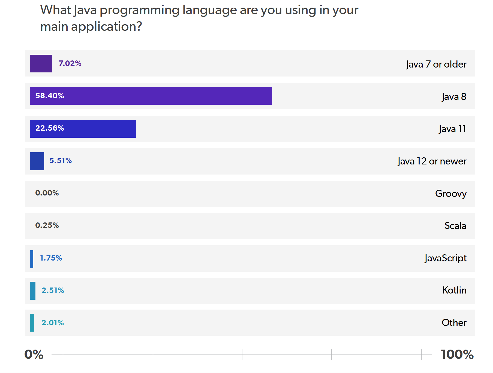

## JDK下载

既然我们选择了 `Oralce JDK 8`，那就前往Oracle官网下载吧。

1.打开下方的链接，或者自行百度搜索 `JDK`，找到类似下方页面。

- [Oracle国际官网](http://www.oracle.com/technetwork/java/javase/downloads/index.html )

- [Oracle中国官网](http://www.oracle.com/technetwork/cn/java/javase/downloads/index.html )

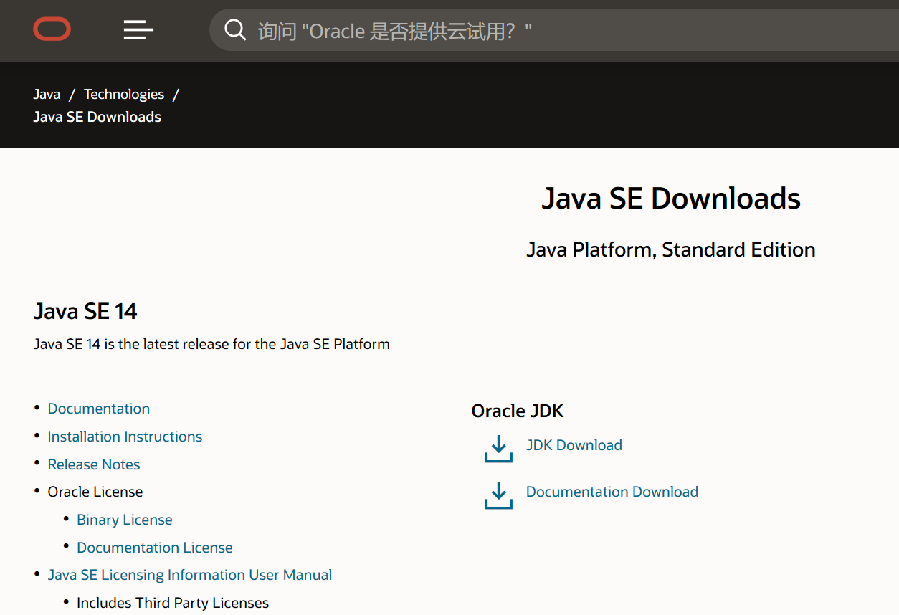

2.下拉到页面最下方，找到`Java Archive`点击进入`JDK`历史版本存档页面。

你看 `Java SE 8` 分为了两个链接，`8u211及之后 `（收费）和`8u202及之前`（免费）。

3.点击 `Java SE 8(8u2020 and earlier)` 进入下载页面，然后选择你所需的平台版本。大多数同学应该用的都是 Windows 64 位的系统，选择下方箭头指示的版本即可。

记得勾选 `卖身协议` 。

Oracle 现在要求下载 `JDK` 必须先登录，没有帐号的同学，自己先注册一个吧。网络是真慢！忍忍！

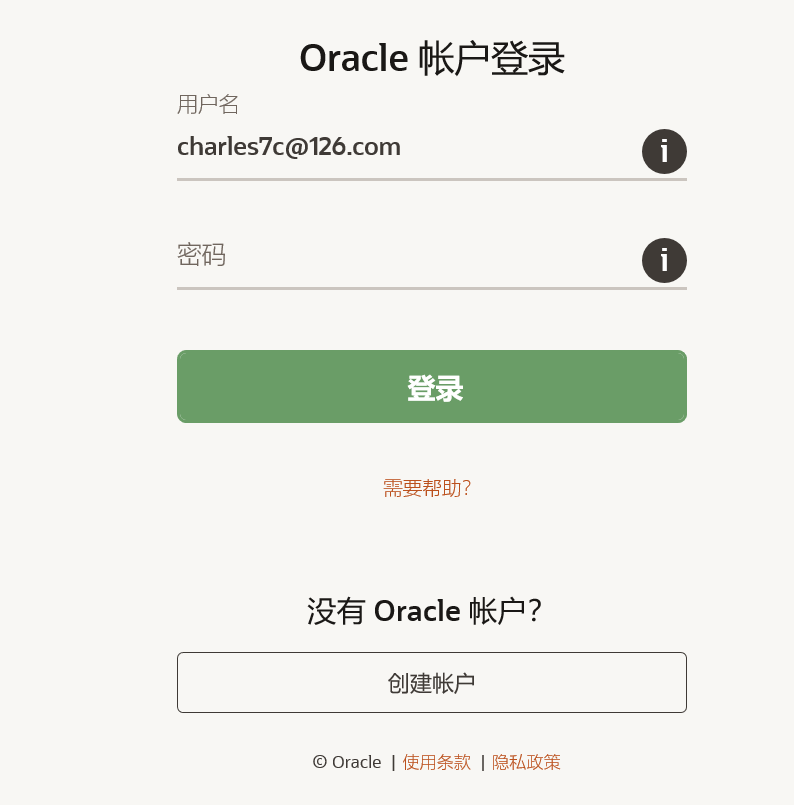

4.终于下载好了，笔者家里开的热点网络，太慢了。

## JDK安装

下载好了，开始安装 `JDK` 吧，和安装 QQ 等软件一样，而且它不是流氓软件，不会静默给你下载一个"全家桶"。

1.双击程序安装包，开始进行 `JDK` 安装，点击下一步。

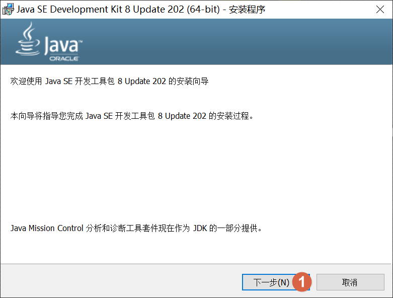

2.点击更改，更改 `JDK` 的安装位置。

::: warning 笔者说
为了防止出现，你自己安装的软件自己都找不到在哪儿这种问题，我们统一安装位置，任选一个磁盘，在其下新建一个 `develop` 的文件夹，用于以后安装所有开发软件。笔者演示时将 `develop` 文件夹放在了 `d` 盘下。
:::

在弹出的更改安装目录对话框中，只需要修改前面的盘符 `d:` 和文件夹 `develop`，后面的子文件夹 `Java\jdk1.8.0_xxx\` 不需要修改，然后点击确定。如果文件夹不存在，安装时会自动创建。

::: danger 笔者说
安装路径不要出现空格，中文，特殊符号等！
:::

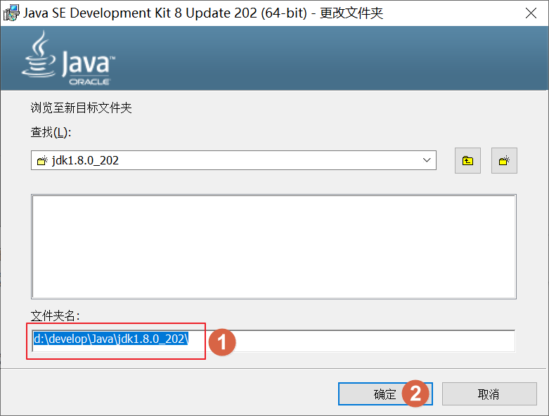

这个时候程序将要安装的位置已经更改，点击下一步即可开始安装。

### **关于我们安装JDK时到底安装了些什么？**  

我们选中第一个 `开发工具` 时，右侧给出了提示，这是安装的 `JDK`。它是最主要的，甚至我们可以说只需要有它就可以。

当我们选中第二个 `源代码` 时右侧给出提示，这是 Java 8 的源代码，因为 Java 是公开源代码的。

当我选中第三个 `公共JRE` 时，右边给出提示，这是一个独立的 `JRE`，我们可以不用安装。不过一般情况我们都选择安装，目的是为了以后如果有一些 Java 程序想单独运行，那么必须配套一个 `JRE`，到那时候就可以用上了。

比如下方是做支付宝第三方支付支持时，支付宝官方给提供的一个做签名校验的 Java 程序。后缀名为 `.jar` 的是 Java 程序，但是如果想运行此程序就必须依赖上方的一个独立 `jre`，我们刚才安装选择界面看到的就是它。(支付宝官方下载下来的这工具，就给你带着这个 JRE )

4.等待安装，这步只是在安装 `JDK`。

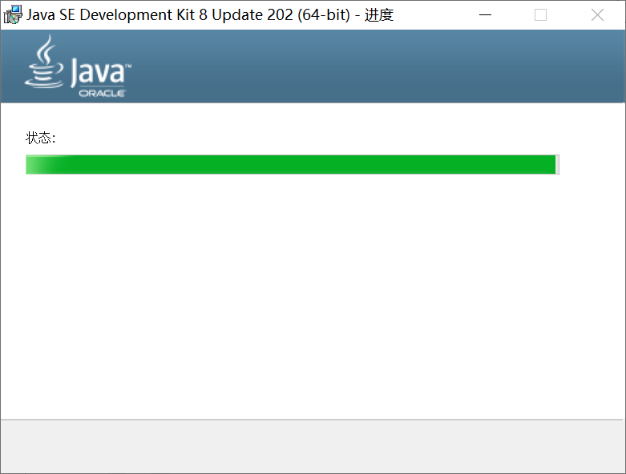

安装完 `JDK` 后，会弹出一个提示框，提示我们安装的 `JDK` 版本不受到收费影响，点确定即可。

5.因为刚才我们没有放弃独立 `JRE` 的安装，所以现在开始安装它，自己更改好安装路径。最好类似我下方示例，然后点击下一步。

等待安装。

点击关闭，即完成安装。

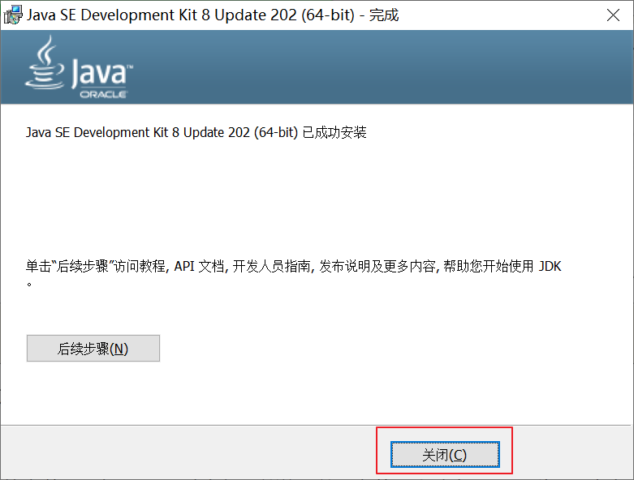

安装完成后，你的桌面不会出现任何图标，不用大惊小怪，`JDK` 是开发环境，不是 QQ 这类软件。

`JDK` 的安装目录如下。

::: tip 笔者说
刚才之所以说可以不安装那个独立 `JRE`，因为 `JDK` 本身自己就自带一个 `JRE`，为什么`JDK` 会自带一个？我们就不讨论 JDK 内自带的 Java 程序，就说我们用 `JDK` 开发 Java 程序，开发好后也需要进行测试运行啊，所以自然需要这 `JRE` 了。
:::

独立 `JRE` 的安装目录如下。

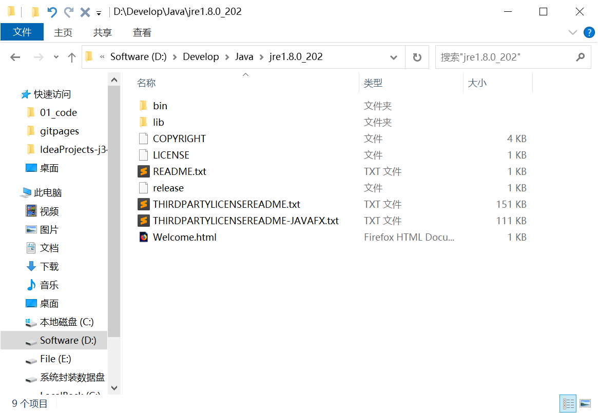

安装完之后，我们想测试一下 `JDK` 是否安装成功，可以运行 `JDK` 安装目录下 `bin` 目录内的 `java.exe` 程序。如果你看不到 `.exe`，记得自行开启下计算机的扩展名显示。

在 `Windows` 中我们习惯双击运行程序，但是却发现 `java.exe` 双击后会弹出一个黑窗口一闪而过。这是因为这种程序，它们需要在特别的系统内运行，比如说我们的 `DOS` 系统，下面就和笔者去学一下基本的 `DOS` 使用吧。

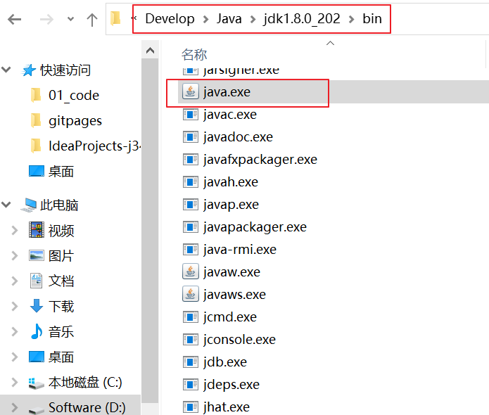

## DOS系统

### 什么是DOS？

那 `DOS` 是什么呢？它的全称是 `Disk Operating System` ，即磁盘操作系统。简单点说，你看过的电影里，黑客们是不是在计算机的一个黑窗口中"运指如飞"？这个所谓的黑窗口不是 `DOS` 那就是 Linux 系。

实际上 `DOS` 它就是早期主流的计算机操作系统，后来 Windows 等主打可视化的系统出现，才让计算机逐渐摆脱专业的概念，变得"平民化"，走入千家万家。之前之所以专业化，就是因为这个系统需要通过命令来进行计算机操作，而不能使用鼠标点来点去，所以非专业人士去背命令和习惯这使用方式，简直"太难"了。

### 进入DOS系统

在Windows 系统任何位置，可以通过按下 `Windows` 键 + `r` 键，在左下角弹出的运行窗口输入 `cmd` 然后回车，就可以弹出 `DOS` 命令行。

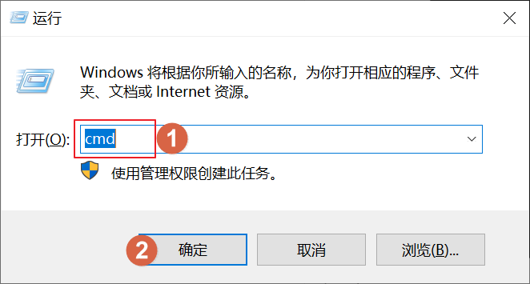

另外，还可以通过在 `开始菜单` 中直接搜索 `cmd`，然后 `右键以管理员身份运行` 的方式打开。

进入了 `DOS` 命令行。要求左上方有管理员标识(如果没有此标识，你创建文件等都没有权限，有些命令甚至提示不存在)。当你是 `Windows 10` 系统，那么很可能没有，因为 `Windows 10` 对于权限的把控比较严格，所以你可以采取上方的第二种方法进入 `DOS` 命令行。

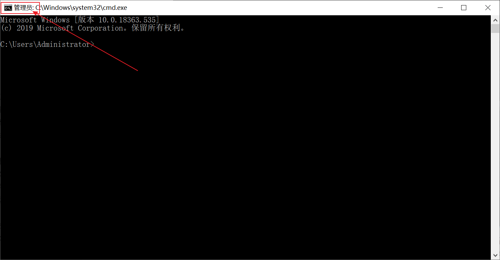

进入了 `DOS` 命令行，先认识下组成，前部分是当前你在 `DOS` 系统所处的路径（当前目录/文件夹，目录就是文件夹的意思，之后不再解释），后部分就是可以输入命令的位置。

上方的路径，等价于你在 `Windows` 系统中进入了如下位置。

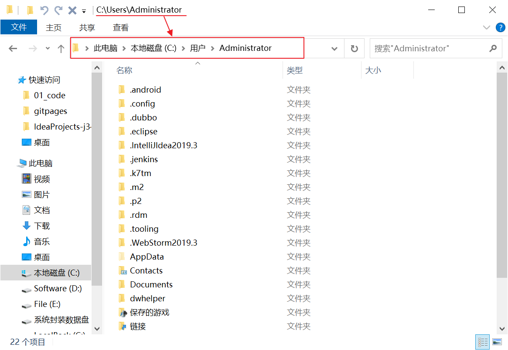

### DOS常用命令

#### 查看列表

在上图中，如果我们在 `Windows` 系统中进入了某个路径，可以很直观的看到当前路径下的所有文件和文件夹。那么在 `DOS` 中如何实现这一目的呢？

输入 `dir` 命令，即可列出当前所处位置的文件和文件夹列表，如下图所示。

#### 切换目录

那如果不想待在默认的路径了，想切换到其它位置。

- 相同磁盘的目录切换，直接通过 `cd 目录路径` 来切换。（这个路径必须存在，不然切换不过去）

  例如：我想切换到当前目录下的 `Documents` 目录。

  

- 不同磁盘的目录切换，先通过 `盘符:` 来切换磁盘，然后 `cd 目录路径` （注意 cd 后有空格）再切换到对应位置。

  例如：我想切换到刚才 `JDK` 的安装目录。

::: tip 笔者说
如果路径长，在输入的时候，还可以通过 `Tab` 键来进行内容补全。例如下方的输入，输入完 `De` 就可以按一下 `Tab`  键快速补全。因为 DOS 会自动识别所在目录下的内容名字，如果能匹配到就可以快速补全，当然如果有多个 `De ` 打头的内容，那就尽量输入多一些字母后再按 `Tab` ，这样就更精准。
:::

  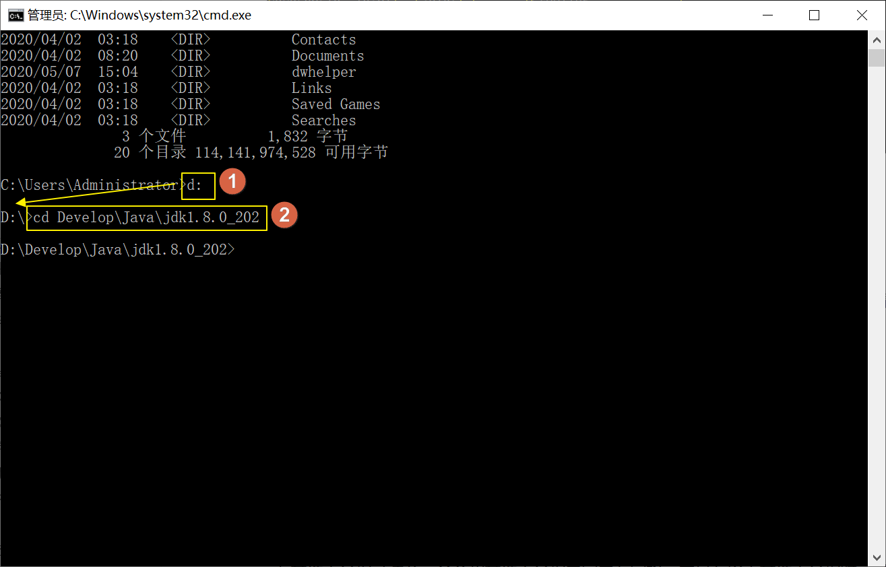

还有一些特别的路径切换，比如返回上一级目录。在 `Windows` 系统中，鼠标点一下返回键就可以了，在 `DOS`中，可以通过 `cd ..` 命令来切换。`..`和`.` 是每个目录下都存在的两个隐藏文件夹，它们一个代表上一级目录，一个代表当前目录。

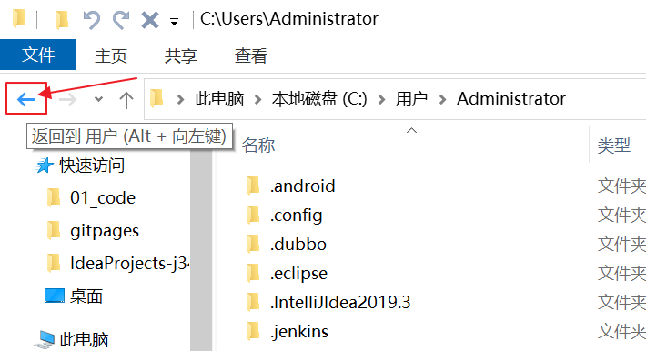

还有在磁盘比较深的路径时，可以输入 `cd  /` 来快速回到磁盘根目录下。

#### 运行程序

在 `Windows` 中如果想运行程序，我们都是双击程序快捷方式或程序启动文件。而在 `DOS` 中，如果我们想要运行程序，只需要输入程序启动文件路径，然后回车即可。

例如：我想运行钉钉程序，我知道它的启动程序地址，那么就可以利用 `Tab` 快速提示着来输入好地址。下图的 `""` 是按 `Tab` 自动生成的，`DOS `里为了防止空格产生的影响，可以加 `""` 进行包裹，表示一个整体。

这个路径实在太长了，如果在 `DOS` 中，使用过了且没关闭 `DOS` 窗口的情况下，还需要使用时，建议按 `↑` 或 `↓` 方向键，翻一翻历史命令。

### 测试JDK是否安装成功

OK，掌握了 `DOS` 基本使用，这时候我们再来通过它运行下 `java.exe`，输入 `java.exe` 路径太长了，我们可以偷点懒。

先通过 `Windows` 找到 `java.exe`，然后在地址栏输入 `cmd`，回车后就可以快速进入程序所在的位置了。

然后就可以运行 `java.exe `了，后面追加一个 `-version` 可以用来查看 `JDK` 的版本，如果出现下方所示内容，说明 `JDK` 的安装是完全正常的。

::: tip 笔者说
`DOS` 中可以省略 `exe` 之类的后缀
:::

## 环境变量

### 概述

在刚才的内容搞定后，其实我们的 Java 开发环境已经搭建完了，我们之后开发 Java 程序会一直使用刚才的`java.exe `程序。不过现在使用还是挺麻烦的，每次都要在 `DOS` 中先找到程序或输入程序路径才能运行，有没有什么办法可以在 `DOS` 任意目录使用 `java.exe` 呢？

看看百度百科了解一下环境变量吧，其实环境变量就是操作系统里存储的一些参数或关键值，每个在操作系统里运行的程序都可以获取到这些存储的内容。（后面我们学到变量这一程序概念时，就可以更好的理解它的作用了，到时候记得回来再看看）

### 找到环境变量设置

在 `开始菜单` 中搜索 `环境变量`，点击 `编辑系统环境变量`，打开 `系统属性` 对话框。

在 `高级` 选项卡中，点击 `环境变量` 就可以进入修改环境变量的对话框。

### path环境变量

其中 `path` 环境变量就是用来存储路径列表的，里面存储了一个个的路径。当我们在 `DOS` 命令行中直接输入程序的名字然后回车，这时候 `DOS` 会先在当前目录下搜索该文件，若找到则运行之，若找不到该文件，则根据 `path` 环境变量所设置的路径列表，顺序逐条地搜索这些路径下是否有该程序，有的话也能运行。

这就是我们现在需要的，可以有效解决我们为了运行 `java.exe` 而很麻烦的输入路径等，一劳永逸。有些同学还把一些游戏启动程序存到了 `path` 环境变量。

### 配置JAVA_HOME

接下来就将 `java.exe` 的程序目录存储到 `path` 环境变量吧。

1.点击 `系统变量` 下的 `新建`，在弹出 `新建系统变量` 窗口后，将变量值设为 JDK 安装路径（bin 目录上一级），变量名设为 `JAVA_HOME` （之所以叫这名，是因为Maven、Tomcat等日后所用开发程序大多会使用到此环境变量），所以名称不允许修改。

2.上方存储的环境变量还不完整，并且没添加到 `path` 环境变量。所以我们需要在 `path` 环境变量中再做些处理。

点击系统变量中的 `path` 环境变量，然后点击 `编辑`，删除其中 Oracle 默认生成的一个目录配置（JDK 1.8之后就开始自动加上了，但是这个地址对我们用处不大，删掉）。

点击 `新增 `，添加一条 `%JAVA_HOME%\bin` 变量，`%JAVA_HOME%` 表示引用 `JAVA_HOME` 环境变量的值，这一条变量等价于在 `path` 中添加了 `D:\Develop\Java\jdk1.8.0_202\bin`。

::: danger 笔者说
`Win7`系统的 `path` 环境变量是全部在一起的，而不是像 `Win10` 这样一条条很清晰。自己去新加入一条：`%JAVA_HOME%\bin;`（结尾这一定要用英文`;`来分隔其他的环境变量啊！）。  

还有我们在配置 Java 安装路径的时候，需要格外注意不要将之前的还有一些系统的 `path` 配置删除，也不要写错。（不要在蓝色选中状态时直接输入，会全部替换的！！！）否则有很多系统命令就没法在 DOS 中便捷愉快的使用了。
:::

### 测试效果

配置好 `path` 环境变量之后，关闭所有的 `DOS` 窗口。再重新打开 `DOS` 后，输入 `java -version` ，我们看到和之前一样的效果，而且我们不用在输入 `java.exe` 冗长的路径了！

## 参考文献

[1]闷瓜蛋子. Oracle如何对JDK收费[EB/OL]. https://zhuanlan.zhihu.com/p/64731331. 2019-06-18

## 后记

`JDK` 的安装环节也就介绍到这。补充了一些基础内容，比较杂的感觉，但实际是顺序流程的学习，好好看看本篇文章大纲！每个步骤一定要实践一下！加油！有问题可以邮箱或订阅号联系笔者。

::: info 笔者说
对于技术的学习，笔者一贯遵循的步骤是：先用最最简单的 demo 让它跑起来，然后学学它的最最常用 API 和 配置让自己能用起来，最后熟练使用的基础上，在空闲时尝试阅读它的源码让自己能够洞彻它的运行机制，部分问题出现的原因，同时借鉴这些技术实现来提升自己的代码高度。

所以在笔者的文章中，前期基本都是小白文，仅仅穿插很少量的源码研究。当然等小白文更新多了，你们还依然喜欢，后期会不定时专门对部分技术的源码进行解析。
:::