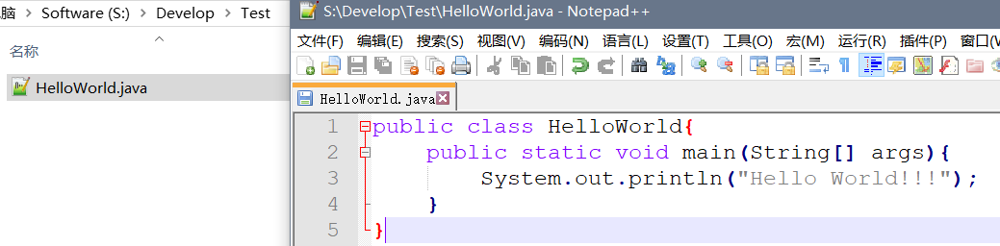
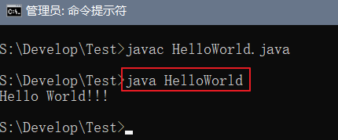
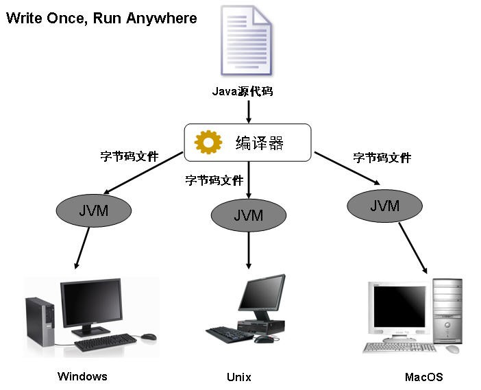
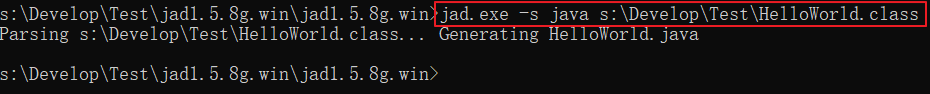

# 第一个Java程序

## 前言

**C：** 在上一篇，我们搭建好了 Java 语言的开发环境，这一篇笔者就带着大家愉快的写出我们的第一个程序，不过本篇我们是使用记事本（比较原生态）来写程序，并不使用其他的高级开发工具，所以可能会显得比较低端，请大家见谅。

::: tip 笔者说
饭要一口一口的吃，工具也要一点一点的升级，技术也要一点一滴的积累。
:::


<!-- more -->

## 开发步骤

一个Java程序的开发，需要经过：编写源码，编译源码和运行，这三大阶段。


和笔者来体验一下吧！**源代码/源程序：程序的原始指令，由程序员编写** 。

1.首先使用记事本编写源代码文件（ Java 程序的源代码文件扩展名为 `.java`）。



2.打开cmd命令窗口，进入源代码所在地，使用 `javac` 命令编译，生成 `.class` 文件。 


::: tip 笔者说
编写完的源代码，计算机是无法直接执行的，因为它只识别二进制，所以我们需要一个 `翻译官` 帮助我们去翻译下，这样计算机才能够识别。`翻译官` 就是编译器，编译之后就会出现一个扩展名为 `.class` 的字节码文件（它并非纯二进制文件，是运行于JVM中的一种伪二进制文件），这时才能够被计算机执行。
:::

3.使用 `java` 命令运行 `.class` 文件。

::: warning 笔者说
运行 `.class` 文件时不能加上 `.class` 后缀名。
:::



这样我们就实现了第一个 Java 程序，我们借助它给计算机下达了一个在控制台输出 `Hello World!!!` 的指令。

::: details 为什么我们开始编写的第一个程序要输出 Hello World 这句话？
实际是因为《The C Programming Language》这本 C 语言书籍中使用它做了第一个演示程序，非常著名，所以后来的程序员在学习编程或进行设备调试时延续了这一习惯。  

一个程序员才懂的冷笑话：一位资深程序员到了退休的年纪，为了给自己的晚年生活增加点乐趣，开始学习书法，在开始学习书法的第一天，资深程序员铺开纸张，大笔一挥 `Hello World` ！
:::

## 基本程序结构

刚才我们编写了第一个 Java 程序，尽管背了相关单词，但肯定还是看的云里雾里的。笔者先给你个提醒，现在呢不要求你过多理解它们的含义，只需要知道它的效果和注意事项即可。随着学习的深入，慢慢就会深入认识和理解了，**千万别钻牛角尖** ，因为还没给你讲的肯定是因为笔者认为目前还不是太适合你的，**欲速则不达** 。

::: warning 下方是你现在需要记忆的注意事项和规范：
1. 类名与文件名完全一致，首字母大写（帕斯卡/大驼峰命名法）。

2. main() 方法是程序的入口，四要素必不可少。

3. 核心语句：System.out.print**ln**(); 从控制台输出信息，S是大写。（ Java 严格区分大小写）

4. { 和 }一 一对应，缺一不可。（注意模仿笔者的编写习惯）

5. 注意要有层级缩进，一行只写一条语句即可。
:::


::: tip 笔者说
“好的代码应该是给人看的，而不是给机器看的。”**  上面的5条注意事项，其实4条都在强调规范，编码规范非常重要！  

一个软件的生命周期中，80%的花费都在于维护。几乎没有任何一个软件，在其整个生命周期中，均由最初的开发人员来维护。编码规范可以改善软件的可读性，可以让程序员尽快而彻底地理解新的代码。更多规范除了模仿笔者文章示例习惯外，还请后续随时与笔者一起解读[《阿里巴巴Java开发手册》](https://github.com/alibaba/p3c/blob/master/Java%E5%BC%80%E5%8F%91%E6%89%8B%E5%86%8C%EF%BC%88%E5%B5%A9%E5%B1%B1%E7%89%88%EF%BC%89.pdf)。
:::

### 输出语句

其实输出功能，不仅仅只有 `println()` 这一个语法，还有去掉了 `ln` 之后的 `print()` 也可以实现。

```java
System.out.print(); // 输出完不换行
System.out.println(); // 输出完换行
```

如果想让 `print()` 实现 `println()` 的效果，可以借助转义符。

| 转义符 | 说明                           |
| ------ | ------------------------------ |
| \n     | 将光标移动到下一行的第一格     |
| \t     | 将光标移动到下一个水平制表位置 |

```java
// 下方前两行和第三行代码是等效的。
System.out.println("Hello");
System.out.println("World");
System.out.print("Hello \n World\n");
```

### 注释

在 Java 的编写过程中我们需要对一些程序进行注释，这样除了自己更方便阅读，别人也更好理解我们的程序，所以我们一定要适时的加一些注释，可以是编程思路或者是程序的作用。

Java 中有三种注释：

1. 单行注释以 `//` 开始；
2. 多行注释以 `/*` 开头，以 `*/` 结尾；
3. JavaDoc（文档注释）注释以`/**`开头，以`*/`结尾（文档注释前期了解，后期再掌握）

```java
/**
 * HelloWorld.java           
 * 第一个Java程序
 */
public class HelloWorld{
    public static void main(String[ ] args){
        // 输出消息到控制台(单行注释后注意添加一个空格，这是一个小规范)
        System.out.println("Hello  World!!!");      
    }
}
```


## 跨平台原理

在《Java概述》中，笔者讲 Java 的能力时就埋了一个伏笔，Java 程序是跨平台的，何谓跨平台？笔者给你举个非跨平台的程序例子，下图是百度网盘客户端程序的下载页面，它为了能够运行在不同的平台（系统）上，开发了6套系统（其实是7套，还有一套网页版）。看到这其实你就应该能明白为什么跨平台是一个非常优秀的能力了。


而经过刚才编写完第一个 Java 程序之后，我们思考一下 Java 为什么能跨平台？其实在开发步骤中就能找到原因。编译！编译会将源代码转变为字节码文件（伪二进制），而这伪二进制内容未来运行时是运行在 JVM（Java Virtual Machine）上的，换而言之，**其是因为 JVM 能跨平台安装，所以 Java 才能实现跨平台** 。

由此，Java 程序员就可以不用考虑所写的程序要在哪里运行了，反正都是在 JVM 虚拟机上运行的，JVM 会负责将其变成相应平台的机器语言，而这个转变并不是程序员应该关心的。后续的很多优秀程序设计都采用了该思想。



::: tip 《Java虚拟机的分析与研究》
Java虚拟机有自己完善的硬件架构，如处理器、堆栈等，还具有相应的指令系统。  

Java虚拟机本质上就是一个程序，当它在命令行上启动的时候，就开始执行保存在某字节码文件中的指令。Java语言的可移植性正是建立在Java虚拟机的基础上。任何平台只要装有针对于该平台的Java虚拟机，字节码文件（.class）就可以在该平台上运行。这就是“一次编译，多次运行”。  

Java虚拟机不仅是一种跨平台的软件，而且是一种新的网络计算平台。该平台包括许多相关的技术，如符合开放接口标准的各种API、优化技术等。Java技术使同一种应用可以运行在不同的平台上。Java平台可分为两部分，即Java虚拟机（Java virtual machine，JVM）和Java API类库。[1]  
:::
目前先了解到这种程度即可，JVM 深入学习是未来提升 "Java 内功" 的重要一步，但它不太适合刚学习的你。

## 编译和反编译

从刚才的学习中，我们清楚了编译是将源代码文件转换为了字节码文件，这字节码文件也是以后我们运行所需的。如果有一天，你的老板给你了一堆字节码文件，让你去借鉴一下内容(源代码)，你当然知道字节码文件里是一堆乱码了，所以随着而来的，我们需要它再转换为源代码文件，这就是反编译，我们可以借助工具来更快，更好的批量处理。

**编译：** 将源文件（.java）转换成字节码文件（.class）的过程称为编译。  
**反编译：** 将字节码文件（.class）转换回源文件（.java）的过程称为反编译。（常用有Jad、FrontEnd、jd-gui）

此处仅仅演示利用 `Jad` 来将 HelloWorld.class 进行反编译，类似的工具还有 jd-gui 等。




## 答题环节

### 输出基本信息

::: details 需求：逐行输出个人基本信息。
提示：个人基本信息可包括：姓名、年龄、性别、身高、体重、婚否等
:::

## 参考文献

[1]顾玮. Java虚拟机的分析与研究[J]. 办公自动化,2017,22(9):35-36,11

## 后记

今天这篇感觉怎么样？概念是否清楚了？语法是否记住了？万事开头难，加油啊同学！

::: info 笔者说
对于技术的学习，笔者一贯遵循的步骤是：先用最最简单的 demo 让它跑起来，然后学学它的最最常用 API 和 配置让自己能用起来，最后熟练使用的基础上，在空闲时尝试阅读它的源码让自己能够洞彻它的运行机制，部分问题出现的原因，同时借鉴这些技术实现来提升自己的代码高度。

所以在笔者的文章中，前期基本都是小白文，仅仅穿插很少量的源码研究。当然等小白文更新多了，你们还依然喜欢，后期会不定时专门对部分技术的源码进行解析。
:::

