# 初识Eclipse

## 前言

**C：** 古语有云："工欲善其事必先利其器"。我们在上一篇开始编写第一个 Java 程序，体验过了一些单词大小写引发的"磕磕绊绊"，还体验了来自中文输入法的深深"恶意"。

那么我们对它们就没治了吗？只能到最后运行或单独调试才能知道错误吗？实际上对于这种语法型错误，我们可以使用专业的工具，在代码编写过程中随时解决掉，这种专业工具被称为：`IDE`。

今天笔者将带着你领略一款成熟且有魅力的 Java 系 IDE。

<!-- more -->

## IDE(集成开发环境)

### IDE概述

在前言中，笔者已经简单的说了一下 IDE 的能力，它们除了可以有效解决你的上述问题，还能让你编译和运行程序更便捷（提升开发效率），尤其使用上快捷键之后，可能鼠标都将"失业"！但是前期，笔者建议你，不要着急使用 `IDE` 的快捷键，先练练打字速度和完整语法吧。

### 主流IDE介绍

我们现在是学习 Java 语言的，所以自然要选择适合 Java 开发的 `IDE`。目前业内主流的 `Java IDE` 有这么几个。

1. [Eclipse](https://www.eclipse.org/downloads/ )

   开源免费的 `Java IDE`，由 `Eclipse` 基金会负责维护，为各种编程语言都开发了对应的版本或插件。在笔者看来，它的软件体积和使用方式比较适合初期和入门的编程人员。

   

2. [IntelliJ IDEA](https://www.jetbrains.com/idea/)

   收费但很多"白嫖学习党"在用的 `Java IDE`，它所属的公司 `JetBrains` 也开发了适配各种编程语言的 IDE 版本。例如：适合前端开发的 `WebStorm`，适合 `PHP` 开发的 `PhpStorm`，适合`Python` 开发的 `PyCharm` 等，同样都是"价格不菲"。所以在正版收费和破解学习的斗争上，国内开发者们还需要走很远很远。

3. [MyEclipse](http://www.myeclipsecn.com/ )

   收费但很多"传统公司"还在用的 `Java IDE` ，这个软件看名字就知道和 `Eclipse` 脱不了关系，的确是这样的。它出身于 `Eclipse社区`，你可以理解为它是 Genuitec 公司为 `Java EE` 开发者们开发的 VIP 版本，对 `Java EE` 支持比较友好。其实学会了 `Eclipse` 之后，`MyEclipse` 基本就差不多了。

   

4. [VSCode(Visual Studio Code)](https://code.visualstudio.com/)

   免费，微软大厂出品，本质上是一个编辑器，不算是 `IDE`。但是，国外用的挺多，需要自己安装插件进行配置才能支持更多的功能，对于新手来说还是比较麻烦的。

::: tip 笔者说
关于 `IDE` 具体哪个好，笔者最后委婉一下：所处学习阶段，"经费"，个人习惯、公司团队等决定了使用哪一个，笔者个人只是从市场行情来带大家选择性学习，没有引起"IDE圣战"的意思。
:::

## 没落的王族IDE

在程序开发过程中，得心应手的 `IDE` 永远令人着迷。在众多 `Java IDE` 中，如果单纯从初期学习建议和情怀角度评论的话，笔者更喜欢 `Eclipse` 。**免费** ，扩展性良好，初期使用体验不错，比较简单，这些都是笔者推荐给初期开发者的理由。

虽然近两年在中高级开发中有所没落，但是不妨碍我们在初期学习一下。

### Eclipse概述

好的，我们再来回顾一下 Eclipse ，刚才惊鸿一瞥可能没留下太多印象。`Eclipse` 是一个开源免费的 `Java IDE`，由  `Eclipse` 基金会负责维护，为各种编程语言都开发了对应的版本或插件。在笔者看来，它的软件体积和使用方式比较适合初期和入门的编程人员。

在 2020 年年初的时候，Jrebel 发布了[ 《2020年 Java 技术报告》](https://www.jrebel.com/blog/2020-java-technology-report)，从来自全球 Java 开发专业人员的近 400 份回复中对 Java 技术生态进行了统计分析。其中在 IDE 的使用分析报告部分，`24%` 的人使用 Eclipse，仅次于 `IntelliJ IDEA`。

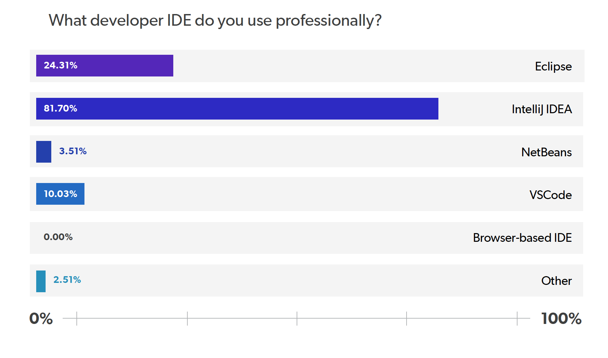

在 `PYPL` 的 `TOP IDE` 热度排行榜上，`Eclipse` 则常年霸占第二。（其实也和 `Eclipse` 适配了很多编程语言版本，名字都叫 `Eclipse` 有关）。

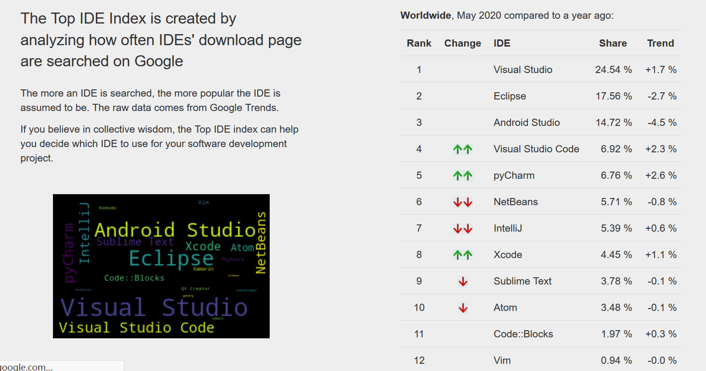

这些最新的数据看起来也还可以，实际上在更早前，数据还要更加可观。只不过在2017年左右开始，`JetBrains` 家的产品在国内开始风靡。

例如：随着 `Spring Boot` 框架等现代开发技术的兴起，`JetBrains` 适配 Java 开发的 `IntelliJ IDEA` 产品以更加方便快捷的优势，快速抢占了 `Eclipse` 的市场，`Eclipse` 的使用者们纷纷"投敌"（但是 `Eclipse` 在现代开发方式中表现不争气，能咋办？很多程序员都是从 `Eclipse` 跳到`IDEA`，然后回不去了）。下面是近期 `IntelliJ IDEA` 与 `Eclipse` 的话题讨论，管中窥豹，可见一斑。

好了，简单说这些，就是让你了解一下现状，见见"世面"，不至于懵头懵脑的。

本篇毕竟是 `Eclipse` 的主场，笔者也不再过多给你介绍其他 `IDE` 产品。想知道更多的，关于 `Eclipse` 在不同语言内的生态地位对比，自己度娘即可。

### Eclipse下载

接下来我们准备下载 `Eclipse`，`Eclipse` 官网有两种下载方式，一种是 `Installer`（exe 安装包，引导型安装），另一种是 `Package` （zip 包，解压就可以使用，类似于绿色软件）。

笔者个人建议以 `Package` 形式下载，点击下载[Eclipse Zip版](https://www.eclipse.org/downloads/eclipse-packages/ )。

下载前一定要牢记好三个注意：

1. 注意要下载的 `Eclipse` 与安装的 `JDK` 版本是否契合

   可查看 [Eclipse各版本JDK要求](https://wiki.eclipse.org/Eclipse/Installation)。

   |        Eclipse版本         |     首发时间      |                 JDK版本                 |
   | :------------------------: | :---------------: | :-------------------------------------: |
   |   Eclipse 4.5 (Mars火星)   |   2015年6月24日   |                   1.7                   |
   |  Eclipse 4.6 (Neon霓虹灯)  |   2016年6月22日   |                   1.8                   |
   |  Eclipse 4.7 (Oxygen氧气)  |   2017年6月28日   | 1.8及以上，1.9建议选择**4.7.1a** 及以上 |
   |  Eclipse 4.8 (Photon光子)  |   2018年6月27日   |                1.8及以上                |
   |   Eclipse 4.9 (2018-09)    |   2018年9月19日   |                1.8及以上                |
   |         ..........         |    ..........     |               ..........                |
   | **Eclipse 4.15 (2020-03)** | **2020年3月18日** |     **1.8及以上，不再支持32位JVM**      |

2. 注意要下载的 `Eclipse` 与安装的 `JDK` 位数是否契合（要么都是32位，要么都是64位） 

3. 注意要下载的 `Eclipse` 与你的电脑系统和位数是否契合

我们现在用的 `JDK 8`，下载当前的最新版 `Eclipse`（2020-03版本）就可以了。

::: warning 笔者说
时间在更替，笔者指的最新版未来不一定是现在这个，但是笔者仅在变动比较大时，会再进行内容更新，所以选择你打开时的最新版即可。
:::

在下载确认页面，我们可以点击 `Select Another Mirror` 选择其他的镜像源，可以选择国内的镜像源，不然下载太慢了。

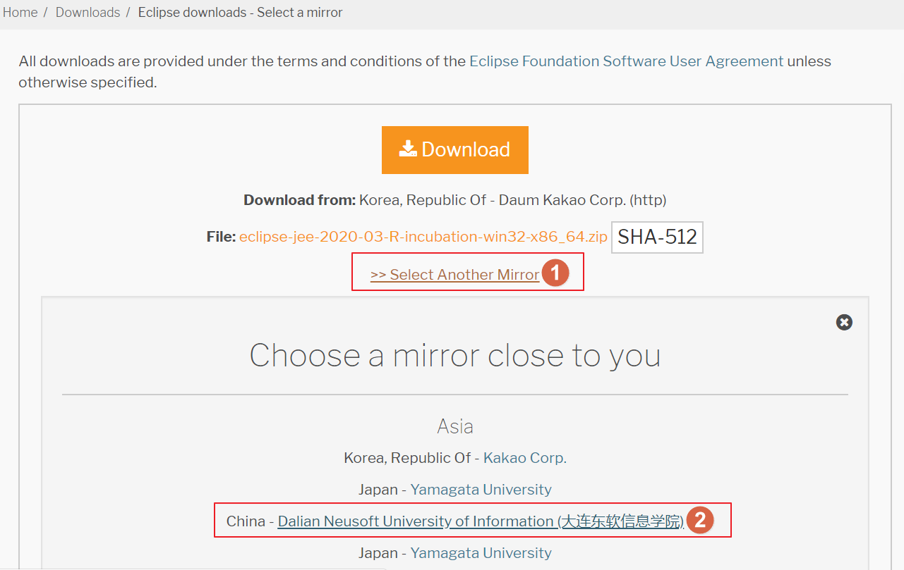

点击后进入 `Eclipse` 捐献页面，国外盛行捐赠文化，用来支持这些非盈利组织。不打算捐赠就在页面等一会儿，这个页面按理应该会自动开始下载或弹出下载提示，如果没有开始，你直接点击下图的 `click here` 也可以开始下载。

等待一会儿，一个 `Eclipse` 的 `zip` 安装包就下载好了。

### Eclipse安装

笔者刚才的下载方式，下载的就是 zip 格式的压缩包。它就像你平时下载的一些破解版绿色软件一样，不需要双击 `.exe` 安装程序进行引导安装，只需要解压就可以使用。

右键点击压缩包，寻找个位置解压，笔者还是希望你将其放到你统一的开发软件安装目录(例如：笔者之前建议的 `develop` 文件夹)。

去掉勾选，否则提取的内容额外带一个压缩包同名文件夹。

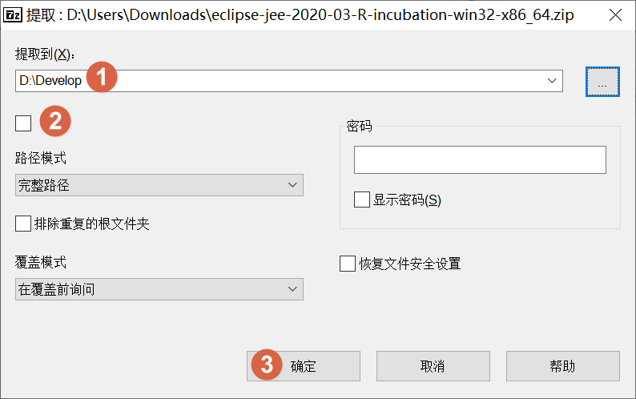

解压后，找到解压的位置。其中 `.exe` 结尾的就是启动程序。为了方便以后快速打开，可以右键在弹出的菜单中将其发送到桌面快捷方式。

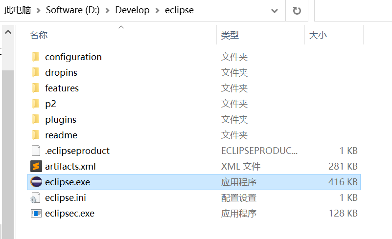

然后我们双击这个 `.exe `程序，或者双击快捷方式就可以打开 `Eclipse` 了。

只要你上面三条下载注意都核查过了，并且 `JDK` 的 `JAVA_HOME` 配置按照笔者要求做了，理论上不会出现别的毛病。没配置好 `JAVA_HOME` 时，下方就是结果。

::: tip 笔者说
如果你是 `win 10` 还可能会出现一些兼容性问题：我们环境变量明明配置好了，但是还是提示下图，这时候需要你再次去看一下 `JAVA_HOME`，甚至不用动，去看环境变量然后确定关闭即可，这个问题曾经在部分同学那儿多次出现。
:::

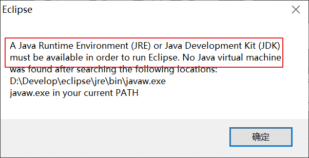

打开之后，第一个弹出的窗口会要求你选择或输入一个文件夹地址作为工作空间，文件夹不存在时会自动创建。`Eclipse` 会使用此工作空间存储你的代码、项目和一些配置。

注意：如果切换工作空间，那么你的配置等都需要重新设置，不同的工作空间是相互独立的。

进入之后，则来到了欢迎界面，点击关闭 `Welcome选项卡` 进入程序主界面。

## Eclipse初始配置

好工具想使用好，也得调一调。

### 视图窗口配置

进入了主界面，自然意味着我们安装成功了。本身我们下载的就是适配 `Java EE` 开发的 `Eclipse`，所以打开之后，`Eclipse` 默认就处于 `Java EE` 视图下。但是笔者喜欢在 Java 视图操作，所以我们需要切换一下视图。不同的视图模式，一些窗口和菜单显示也不太一样，建议初期先用Java 视图模式。

点击 `Open Perspective` 按钮，在弹出的对话框中，选中 Java，然后点击 `Open`，则切换到了Java 视图模式。

可以在以后学习使用中，逐渐关闭一些自己用不上的选项卡窗口，也可以随意调整每个选项卡窗口的位置。如果弄乱了，不用怕，直接在右上角视图名上右击，选择 `Reset(重置)` 即可回到视图窗口初始的状态。

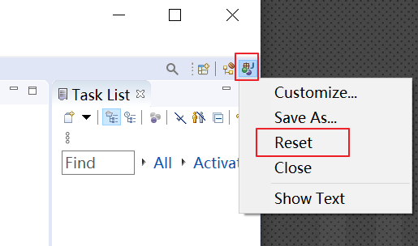

另外还可以在 `Window` 菜单的 `Show View` 选项中去添加一些自己需要的选项卡窗口。

例如：我们之后常用的 `Console` 控制台。

最后初步调整后的窗口效果如下，你们后面使用久了，然后按自己习惯调整就好了。

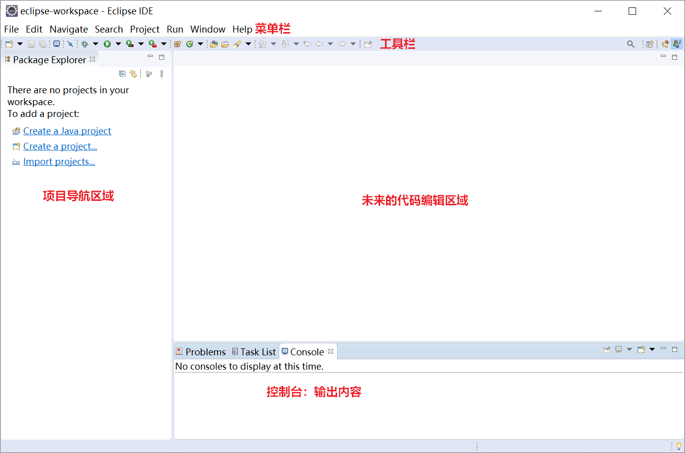

### 字符编码配置

`Eclipse` 中默认使用 `GBK` 作为字符编码，但是为了解决我们之后开发的编码问题，我们要求统一字符编码的配置，将默认的字符编码更改为 `UTF-8`。因为这种字符编码具有更好的适用性，对于汉语和外语支持都比较好。

点击 `Window` > `Preferences(首选项)`，Eclipse 的所有设置基本都在这里。

在搜索框输入 `workspace`，然后选择图示的选项，在右侧的窗口中设置文本文件编码为 `Other` > `UTF-8`，然后点击 `Apply and Close(应用并关闭)`。

### 字体配置

最后一个配置，写代码没有一个合适的字体及大小怎么行？

再次打开首选项窗口，依次点击 `General` > `Appearance` > `Colors and Fonts` > `Basic`，然后点击 `Basic` 里的最后一项 `Text Font(文本字体)`，双击或者点击 `Edit(编辑)` 进入修改界面。

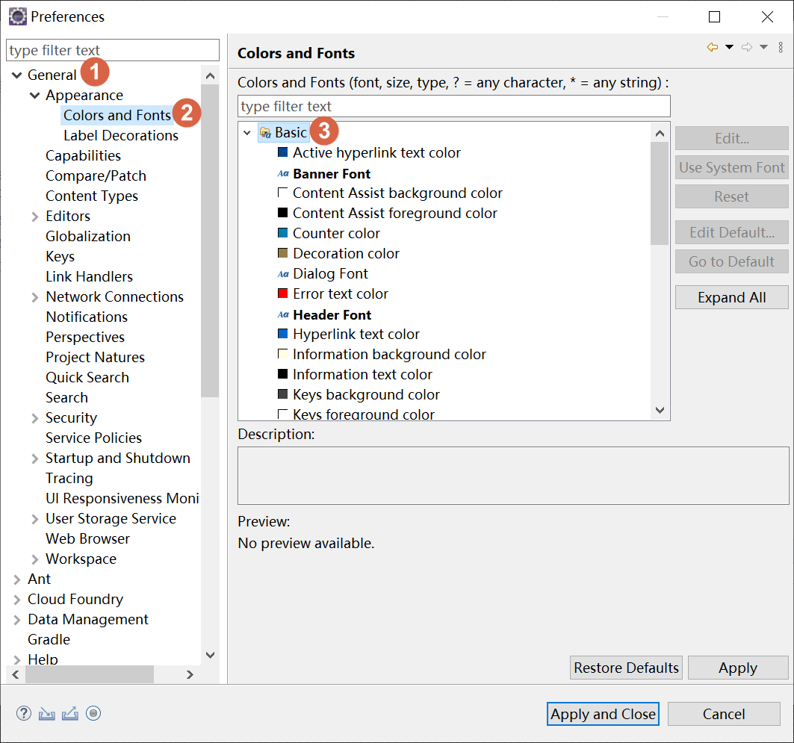

一般来讲，字体都是使用默认值 `Consolas`，只是简单改改大小，方便查看而已，选完之后，一直点确定即可应用成功。

::: tip 笔者说
实际上，Eclipse 现在已经支持在文本编辑时，通过 `Ctrl` 加 ` +号` 或 `-号` 来调整编辑区的文字大小了，这一步其实可以不用这么麻烦了。
:::

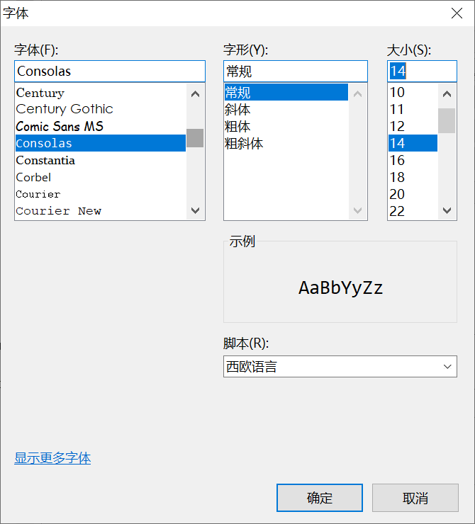

另外 `JetBrains` 为开发者设计了一套字体，据说可以降低眼疲劳，有需要的从 JetBrains 官网下载[JetBrains Mono字体](https://www.jetbrains.com/zh-cn/lp/mono/)安装即可。

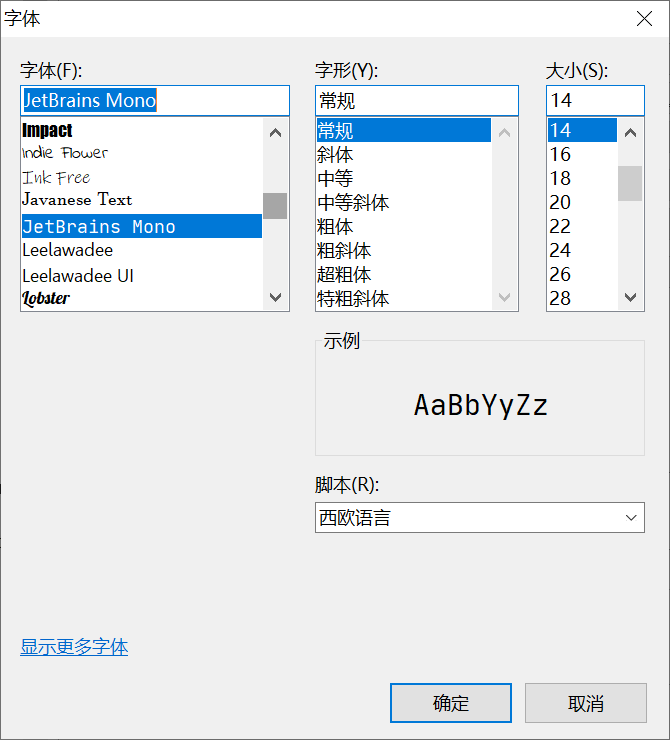

## 用Eclipse开发Java程序

调也跳完了，接下来我们使用 `Eclipse` 来开发一个 `Hello World` 程序，看看它比我们第一章是不是要简单一些？

用 `Eclipse` 开发 Java 程序，可以分为4个步骤：

1. 创建一个 Java 项目（一个复杂的程序肯定需要很多源代码文件，我们以项目为单位来组织这些源文件）
2. 手动创建 Java 源程序
3. 编译 Java 源程序（在 Eclipse 中此步骤是自动的）
4. 运行 Java 程序

首先，我们打开配置好的 `Eclipse`，点击 `File` 菜单，选择 `New` 子菜单中的 `Java Project` 来创建一个新的 Java 项目。

输入项目名称，然后确认下是否自动指定好了 `JRE运行库`（JAVA_HOME配置没有问题的话，应该无异常），此项内容很关键，决定是否能正常编写代码和编译运行。

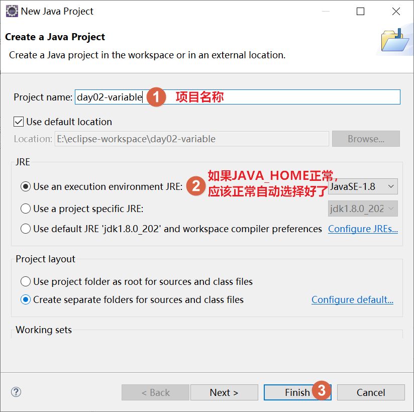

下图就是一个创建好的基本 Java 项目。

那我们之前编写的源代码这时候要在哪里写？答案是在 `src(source)` 源码目录下编写。但是别直接就在 `src` 根目录下创建源文件，笔者要求你先创建一个包组织 `Package`（现在知道它是分类存放源文件的文件夹就可以了）。

::: tip 笔者说
`Package` 的命名是由公司域名的倒序组成的，例如：百度公司写com.baidu.xxx，并且包名的单词全部小写。
:::

右击 `src` 目录，然后 `New` 一个 `Package`，输入一个自定义包名，然后 `Finish`。

创建好包后，然后右击 `包名` 进行创建类的操作，这一步才是上一篇我们直接写过的东西。

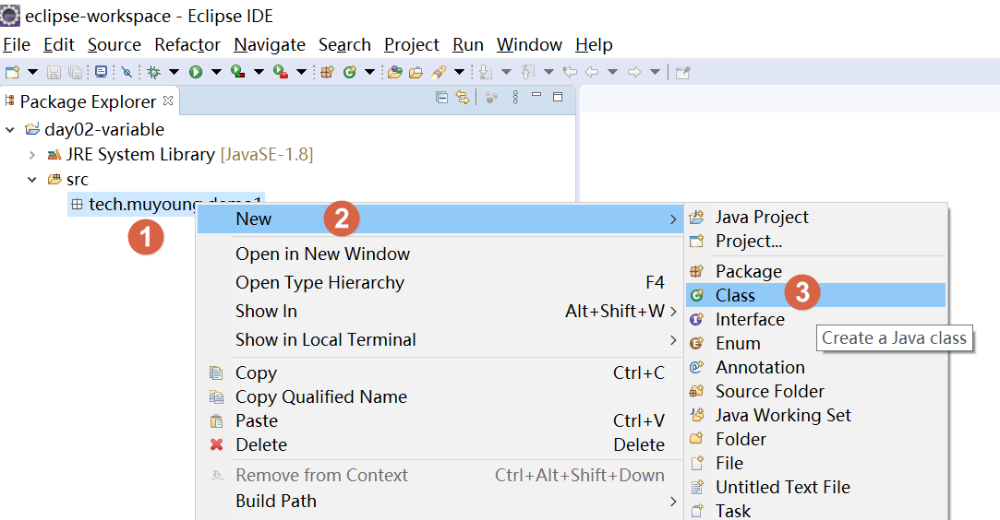

创建好了，是不是和上篇写的一模一样了，但你发现 `pulic class xxx` 类声明这部分现在是用`Eclipse` 快速完成的，你不用再写它了，直接写程序入口 `main` 方法和内容就可以了。

编写过程中，如果停下来，这时候没写完呢，`Eclipse` 会提示报错，这很正常，写完并保存后再看还报不报错。

一顿火花带闪电的代码敲写，很舒服的把上篇的内容写完了，而且还有高亮及部分回车自动缩进的功能。

输入完代码后，上章节我们需要 `javac` 先编译然后才能用 `java` 来运行这代码，现在有了`Eclipse`，直接在代码空白处右击，在弹出的菜单中选择 `Run As` > `Java Application`即可运行了（`Eclipse`帮你自动编译了）。

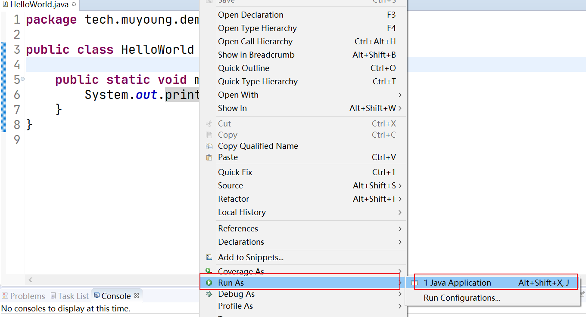

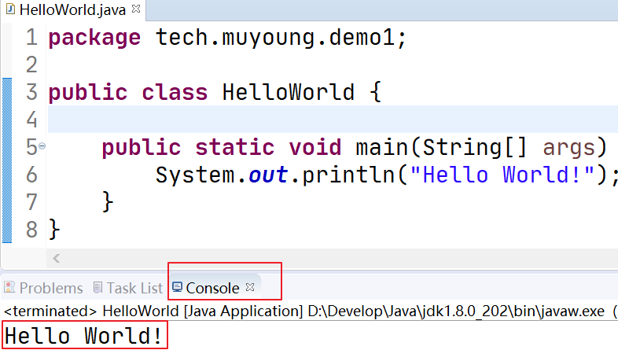

::: tip 笔者说
其实`Eclipse`还是在按照我们上篇的形式干活，只不过很多东西帮我们归了归类，做了些自动处理。
:::

你自己打开设定的工作空间地址，你会发现你刚创建的 Java 项目，实际就是一个特殊的多级文件夹。所以也无需担心玩不转 `Eclipse`，没你想的那么难，慢慢来，熟练就好了。

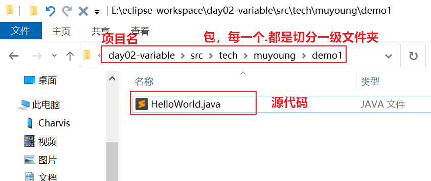

## 后记

到这里，`Eclipse` 的初步认识就结束了。`Eclipse` 还支持更改主题，自己有兴趣可以了解一下。其他的配置，未来我们需要的时候，就会进行对应讲解，目前已经够了。

另外再提示一点：前期很多同学喜欢使用汉化版的软件，但是殊不知，在众多 `IDE` 中，中文的并不是很多，养成依赖之后尤为可怕，所以有“汉化一时爽，xxxx”一说。

对于我们来讲，编程语言大多是英文的，如果我们连使用工具都要用中文，不仅显得不专业，而且也浪费了大好的学习英文的机会！

所以谨记笔者的劝告，切勿汉化。

`Eclipse` 还有一段传闻：据说是当初的 `SUN` 公司名称缩写是 `太阳` 的意思，而且 `SUN` 公司因为`Java` 的原因真的是如日中天，在互联网行业首屈一指，于是 `IBM` 希望能出一款产品来盖过太阳的光芒，所以起名为 `eclipse(日蚀)`。

孰真孰假，不得而知。只是这个将伴随我们很久的开源 `IDE`，请记得善待它。

::: info 笔者说
对于技术的学习，笔者一贯遵循的步骤是：先用最最简单的 demo 让它跑起来，然后学学它的最最常用 API 和 配置让自己能用起来，最后熟练使用的基础上，在空闲时尝试阅读它的源码让自己能够洞彻它的运行机制，部分问题出现的原因，同时借鉴这些技术实现来提升自己的代码高度。

所以在笔者的文章中，前期基本都是小白文，仅仅穿插很少量的源码研究。当然等小白文更新多了，你们还依然喜欢，后期会不定时专门对部分技术的源码进行解析。
:::
