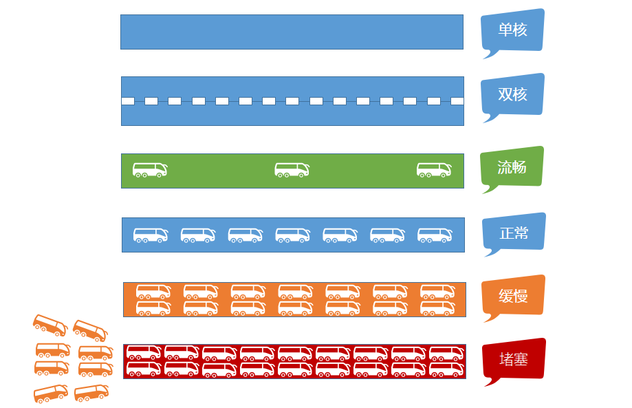

# 程序和计算机的那点事儿

## 前言

**C：** 在上一篇，我们已经能够很熟练的使用 Eclipse 开发一个入门的 Java 程序，给计算机下达一些简单的指令。虽然它很简陋，但麻雀虽小，五脏俱全，你平时使用的程序们该有的，它也都有。

按理说呢，我们接下来就要开始学习更多的 Java 指令（语法）了，但笔者担心你的基础还不够，所以还是想给你再加点“料”。

在我们讲解下一篇 《变量和常量》前，我们先对计算机中的一些基本概念，以及程序在计算机中安装、执行的原理来分析一下。

<!-- more -->

## 计算机三大件

我们现在使用的计算机，它是由很多的硬件组成的。但是一个程序要安装及运行，我们主要关注 **三个** 核心的硬件即可，它们分别是：

|                             CPU                              |                             RAM                              |                             ROM                              |
| :----------------------------------------------------------: | :----------------------------------------------------------: | :----------------------------------------------------------: |
| 中央处理器，负责 **处理数据**／**计算**，是一块超大规模的集成电路。 | 内存，**临时** 存储数据（断电之后，数据会消失），速度快，空间小。  （单位价格高） |   硬盘，**永久** 存储数据，速度慢，空间大。（单位价格低）    |
|  |  |  |

我们可以拿车道的例子来理解它们三者的作用：

- CPU核心数：车道数量   
- 内存：车道宽度     
- 磁盘IO：车道限速

## 案例分析：QQ程序

结合着 QQ 程序，我们来捋一下一个程序从安装到运行的原理。

### 程序安装的原理

像我们以后，在开发好了程序之后，如果需要给客户来使用，就要准备好相应的程序包，否则到了客户电脑上，缺少程序所需的环境就无法运行程序了，例如：Java 程序至少需要配套一份 JRE 。

我们在平时为了使用 QQ 程序，首先要做的就是下载一个对应的安装程序，然后通过安装程序来引导我们或自动将 QQ 的一系列程序文件解压并存储到 **硬盘** 的指定位置。

::: tip 笔者说
安装程序/引导安装程序，它们也是电脑程序，但它们诞生的目的是帮助普通用户快速实现程序的环境初始化、程序文件存储等过程的。
:::

### 程序执行的原理

安装好之后，而当要运行一个程序时，首先操作系统会让 **CPU** 将存储在 **硬盘** 中的程序文件们读取到 **内存** 中来，然后由 **CPU** 执行 **内存** 中的程序文件/代码来处理数据。

::: tip 笔者说
每个程序在运行过程中都会在内存中"占据"一块属于自己的空间，而这块空间的大小及内存的总大小也是决定程序是否可以自如的"施展手脚"。  

所以一般我们想要同时运行更多程序而不卡时，都优先考虑到买大内存的计算机。
:::

当你在双击桌面的 QQ 快捷方式时，快捷方式会链接到对应位置的 QQ 程序，启动开始了。

然后 **CPU** 就会将存储在 **硬盘** 上的 QQ 程序文件加载到 **内存** 中，QQ 程序会在 **内存** 中占据一块自己的内存区域，然后由 **CPU** 执行 **内存** 中的 QQ 程序文件/代码，于是就出现了下方的界面。

### 程序内存中的数据管理

当我们在 QQ 程序中点击过 “记住密码”，并且登录过一次后，我们再次打开 QQ 程序登录界面，会看到 QQ 号及密码直接回显在了输入框中。

此时其实是在加载 QQ 程序文件到内存后，QQ 程序代码将保存在硬盘上的帐号数据恢复到了内存中，然后将它们再插入到输入框内。

那 QQ 这个程序是怎么保存用户的 **QQ 号码** 和 **QQ 密码** 的呢？

1. 在内存中为 **QQ 号码** 和 **QQ 密码** 各自分配一块空间
   * 在 QQ 程序结束之前，这两块空间是由 QQ 程序负责管理的，其他任何程序都不允许使用
   * 在 QQ 自己使用完成之前，这两块空间始终都只负责保存 **QQ 号码** 和 **QQ 密码**
2. 另外为了能够方便找到该内存空间，分别使用一个 **别名** 标记 **QQ 号码** 和 **QQ 密码** 在内存中的位置

## 后记

实际上，在程序内部，为 **QQ 号码** 和 **QQ 密码** 在内存中分配的空间就叫做 **变量**，这也是我们下一篇要介绍的主要内容！跟上别掉队！

::: info 笔者说
对于技术的学习，笔者一贯遵循的步骤是：先用最最简单的 demo 让它跑起来，然后学学它的最最常用 API 和 配置让自己能用起来，最后熟练使用的基础上，在空闲时尝试阅读它的源码让自己能够洞彻它的运行机制，部分问题出现的原因，同时借鉴这些技术实现来提升自己的代码高度。

所以在笔者的文章中，前期基本都是小白文，仅仅穿插很少量的源码研究。当然等小白文更新多了，你们还依然喜欢，后期会不定时专门对部分技术的源码进行解析。
:::