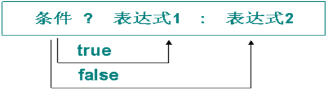

# 常用的运算符

## 前言

**C：** 计算机，计算机，顾名思义就是用来进行数据计算的。那在计算机中运行的程序们，也是用于计算和处理数据的，每个编程语言都准备了很多常用的运算符来支撑我们的数据处理和计算。

而且我们有良好的数学打底的话，它们一点也不难。


<!-- more -->

## 赋值运算符

首先要介绍的就是 `=` 号，上篇我们见过了，在 Java 中它不再表示相等，而是表示赋值的意思。前期每次遇到它你都要给自己刷刷被数学洗过的脑："它不是相等判断，它是赋值符号，即将等号右侧的内容赋值给左侧的变量"。

**案例需求：学员王浩的Java成绩是80分，学员张萌的Java成绩与王浩的相同，输出张萌的成绩。** 

```java
public class Demo {
    public static void main(String[] args) {
        // 王浩成绩
        int wScore = 80;
        // 张萌成绩
        int zScore;
        // 赋值：把等号右边的赋值给等号左边的
        zScore = wScore;
        System.out.println("张萌的成绩为：" + zScore);
    }
}
```

::: tip 笔者说
几乎所有编程语言中，= 号都表示赋值，再或者又表示赋值又表示相等。
:::

我们再来个案例感受下赋值符号。

::: details 案例需求：将 num1 和 num2 实现值的交换。
**思路：** 下方的 num1 和 num2 的值要想交换一下，可以通过第3个变量作为中间媒介来进行。
::: tip 笔者说
当我们想让一瓶雪碧和一瓶可乐里的液体进行交换时，我们没办法直接将它们交换，需要用到一个空瓶子来做个中转。
:::

```java
public class Demo {
    public static void main(String[] args) {
        int num1 = 8;
        int num2 = 9;
        // 此种转换方式不可行  类似于雪碧和可乐直接对嘴换 
        // num1 = num2; num1结果为9
        // num2 = num1; num2结果为9
        
        // 定义一个中间变量来实现交换
        int temp;
        temp = num1; // temp为8
        num1 = num2; // num1为9
        num2 = temp; // num2为8
    }
}
```

## 算术运算符

除了赋值符号外，我们最不陌生的应该就是算术运算符了：

- `+` 加法运算符
- `-` 减法运算符
- `* ` 乘法运算符
- `/` 除法运算符
- `%` 求模运算符（求余数）
- `++` 自增运算符
- `--` 自减运算符

### 四则运算

这些运算符，前五个都挺简单，看看下面的示例：

```java
int num1 = 11;
int num2 = 2;
System.out.println(num1 + num2); // 13
System.out.println(num1 - num2); // 9
System.out.println(num1 * num2); // 22
System.out.println(num1 / num2); // 5
System.out.println(num1 % num2); // 1
```

::: details 你肯定很好奇为什么 11 / 2 = 5 ？ 而不是等于 5.5 ？
其实这就要涉及到数据类型的问题了，在 Java 中参与计算时，两个数参与计算会以其中取值范围大的类型为最终计算结果的类型。  

因为上方是两个 int 类型变量，所以计算后的结果也是 int 类型。如果你执意想要更精确的结果，那么可以将输出语句这么改造： `num1 * 1.0 / num2` 。这样的话，其中一方已经变为了更大取值范围的类型，计算结果的类型也会与之变化为取值范围大的类型。
:::


### 自增和自减

但你可能对最后两个算术符号产生疑惑，`++` 和 `--` 到底是用来干嘛的？

```java
// ++ 和 --都分为前置形式和后置形式
int num1 = 10;

// 下方示例，以 ++ 符号为例，++ 和 -- 同理。
// 1.如果单独写成一条语句，前置 ++ 和后置 ++ 都是表示自增1
// 等价于 num1 = num1 + 1;（num1 = 10 + 1） 将num1的值+1然后再赋值给num1，这样num1的结果为11
// num1 ++; 
// ++ num1;

// 2.但如果 ++ 被放在复杂情况使用时，前置和后置是有区别的
// System.out.println(++ num1); // 11
System.out.println(num1 ++); // 10
System.out.println(num1); // 11
```

::: tip 笔者说
之所以出现此类结果，目前简单理解为前置++表示先自增然后再使用值，后置++表示先使用值再自增。  

即：System.out.println(++ num1); 中，先是将num1进行了自增操作，变为了11，然后再进行了输出。  

System.out.println(num1 ++); 中，先是使用num1进行了输出，结果是10，然后再对变量num1进行了自增操作，所以下方再打印输出num1，结果就成为了11。
:::

我们再来看下方的代码，试着去读一读它们的含义，分析下结果是否和你预期的一致。

```java
int num1 = 5;
int num2 = 2;
int a = num1 % num2;
int b = num1 / num2;
System.out.println(num1 + "%" + num2 + "=" + a); // 5 % 2 = 1
System.out.println(num1 + "/" + num2 + "=" + b); // 5 / 2 = 2
num1 ++; 
num2 --;
System.out.println("num1 = " + num1); // num1 = 6
System.out.println("num2 = " + num2); // num2 = 1
```

::: warning 笔者说
学会阅读代码，真的很重要，你自己写的也好还是别人写的也罢，读不懂它们，就无法理清楚它想干什么，不要怕！尝试尝试！
:::

### char类型的秘密

**补充：++ 和 - - 与 char 类型相遇时的问题：** 

```java
// 如果字符执行数值计算 那么它会自动转换为对应码表中数值然后执行计算
char alp1 = 'a';
char alp2 = 'A';
System.out.println(alp1 + 1); // 98
System.out.println(alp2 + 1); // 67
```

char 类型是可以转换为 int 整数类型的，它的转换规则是按照 ASCII 、DBCS 这些码表来进行的。例如：小写的 a 是 97，大写的 A 是 65。


::: tip ASCII ((American Standard Code for Information Interchange)
美国信息交换标准代码）是基于拉丁字母的一套电脑编码系统，主要用于显示现代英语和其他西欧语言。它是最通用的信息交换标准，并等同于国际标准ISO/IEC 646。ASCII第一次以规范标准的类型发表是在1967年，最后一次更新则是在1986年，到目前为止共定义了128个字符。[1]  

为了解决中国、日本和韩国的象形文字符和ASCII的某种兼容性，出现了双字节字符集（DBCS：double-byte character set）。DBCS从 第256  代码开始，就像ASCII一样，最初的128个代码是ASCII。然而，较高的128个代码中的某些总是跟随着第二个字节。这两个字节一起（称作首字节和跟随字节）定义一个字符，通常是一个复杂的象形文字。[2]
:::

```java
// 如果执行++或-- 则是先将char类型转换为整数类型，然后计算完之后再将其转换为char类型
char alp1 = 'a';
alp1 ++; // alp1 = alp1 + 1;
System.out.println(alp1); // b
```

## 复合赋值运算符

在同时认识了赋值、算术两种运算符之后，笔者再带你认识 Java 中一种特别的运算符：复合赋值运算符，即整合了赋值运算符和算术运算符的特别玩法。

- `+=`
- `-=`
- `*=`
- `/=`
- `%=`

虽然长的奇特，但是它们理解起来真的很容易，看看下方的示例：

```java
int num1 = 10;
num1 -= 2; // 等价于 num1 = num1 - 2;
System.out.println(num1); // 结果为8
```

## 关系运算符

Java 中还有可以用来判断的关系运算符，以后我们应用还是很多的。

例如：当用户名长度小于5时，做一些错误提示等，这都是关系运算符要应用的场景。

关系运算符计算的结果是一个布尔类型（boolean）的值，要么是 true，要么是 false。

| 运算符 |   含义   |  示例   | 结果  |
| :----: | :------: | :-----: | :---: |
|  \==   |   等于   | 5 == 6  | false |
|  \!=   |  不等于  | 5 != 6  | true  |
|   \>   |   大于   | 5 \> 6  | false |
|   \<   |   小于   | 5 \< 6  | true  |
|  \>=   | 大于等于 | 5 \>= 6 | false |
|  \<=   | 小于等于 | 5 \<= 6 | true  |

```java
// 下方代码用 () 括起来纯粹为了让 == 和 = 分开一些，更利于阅读
boolean result = (5 == 2);
System.out.println(result); // false
// 在Java中 不相等用!=表示
boolean result1 = (5 != 2);
System.out.println(result1); // true
```

::: tip 笔者说
牢记的方法就是多在对应代码上写注释，= 号表示赋值运算符  == 表示相等关系。
:::

## 逻辑运算符

生活中，有很多情况下不是一个关系运算符就可以做好判断的，例如：我想表示某个成绩范围 70 到 80，Java 中不可以用 `70 < x < 80`，这时候就需要用逻辑运算符了。

所谓逻辑运算符，就是我们生活中的 **并且、或者** 这些意思。`70 < x < 80` 代表的就是 x 大于 70，**并且** x 小于 80，可以用逻辑运算符写为`x > 70 && x < 80`。

| 运算符 |    含义     |                        运算规则                        |
| :----: | :---------: | :----------------------------------------------------: |
|  \&&   | **短路** 与 |            两个操作数都是true，结果才是true            |
|  \|\|  | **短路** 或 |           两个操作数一个是true，结果就是true           |
|   \!   |     非      | 操作数为true，结果为false；操作数为false，结果就为true |

```java
// 短路与：&&  理解为并且   两个条件都为true，结果才能为true     true && true == true;
// 短路或：||  理解为或者   只要有一个条件为true，结果就为true   true || false == true;
// 非：!  理解为取反     !true == false;   !false == true;
boolean flag1 = (2 == 3); // false
boolean flag2 = (2 == 2); // true
boolean flag3 = flag1 && flag2;
boolean flag4 = flag1 || flag2;
System.out.println(flag3); // false
System.out.println(flag4); // true
```

### 神奇的短路功能

其实除了 `&&` 还有单个 `&` 也可以表达一样的意思，`||` 还有 `|` 也可以表达一样的意思。

但是我们一般推荐使用 `&&` 或 `||` ，原因就是它们拥有 **短路** 功能。

```java
// ======非短路情况======
int num1 = 7;
// 无论第一个表达式是否成立，都会执行后面的表达式
boolean flag2 = false & (++ num1 != 8);
System.out.println(flag2); // false
// ++ num1执行了，所以结果为8
System.out.println(num1); // 8
```

```java
// ======短路情况======
int num1 = 7;
// 因为第一个表达式是false，它已经可以决定flag2的值就是false，所以&&后的表达式不会再执行，构成了短路
boolean flag2 = false && (++ num1 == 8); 
System.out.println(flag2); // false
// ++ num1没有执行，所以保留为原值
System.out.println(num1); // 7
```

::: tip 笔者说
毫无疑问，短路符号可以更加节省程序的执行效率。
:::

## 三目运算符

在 Java 中还支持一种特殊的运算符，三目运算符，它又被称为三元运算符。



```java
// 三目运算符(三元运算符)
// 条件 ? 表达式1 : 表达式2
// 如果条件为true，则执行表达式1，否则执行表达式2
int min = (5 < 7) ? 5 : 7;
System.out.println(min); // 5
int max = (10 < 7) ? 7 : 10;
System.out.println(max); // 10
```

::: tip 笔者说
后期用的还挺多的，用好了它可以有效优化一些代码结构，简化代码。
:::

## 运算符优先级

至于运算符号的优先级，笔者则认为无需记忆，只要记住：想让谁先运行，就给其加小括号即可。而且其实从我们多年的数学习惯来看，加小括号也有利于阅读。

- 单目运算符包括 `!` 、`++`、 `--`，优先级别高
- 优先级别最低的事赋值运算符
- 可以通过 `()` 控制表达式的运算顺序，`()` 优先级最高
- 从右向左结合性的只有赋值运算符、三目运算符和单目运算符
- 算术运算符 > 关系运算符 > 逻辑运算符

## 答题环节

### 计算BMI

::: details 需求：使用 Scanner 收集身高体重，并计算出相应BMI值是多少？

提示：BMI的计算公式是：体重(kg) / (身高 \* 身高)  

例如：小明的体重是 72 kg, 身高是1.69，那么小明的 BMI 就是：72 / (1.69 \* 1.69) 
:::

### BMI 判定

::: details 需求：亚洲人的肥胖标准应该是 BMI 在18.5至24.9时为正常水平，根据计算的 BMI，告知使用者身体是否标准。

标准：您当前的 BMI 符合正常水平！  

不标准：您当前的 BMI 偏离正常水平！
:::


## 参考文献

[1]莫绍强、陈善国. 计算机应用基础教程：中国铁道出版社，2012年：12-13

[2]钟小莉, 谢旻旻, 李永宁. 文字编码与Unicode编码研究[J]. 经营管理者, 2010(20):364-364.

## 后记

这些符号我们也算初步认识过了，你还 **可** 以吗？你的数学基础是否给予你了力量呢？计算机学习不仅要和英语打交道，数学更加重要，不过还好目前笔者更新的都是小白文，对数学基础要求不是太多。


::: info 笔者说
对于技术的学习，笔者一贯遵循的步骤是：先用最最简单的 demo 让它跑起来，然后学学它的最最常用 API 和 配置让自己能用起来，最后熟练使用的基础上，在空闲时尝试阅读它的源码让自己能够洞彻它的运行机制，部分问题出现的原因，同时借鉴这些技术实现来提升自己的代码高度。

所以在笔者的文章中，前期基本都是小白文，仅仅穿插很少量的源码研究。当然等小白文更新多了，你们还依然喜欢，后期会不定时专门对部分技术的源码进行解析。
:::
