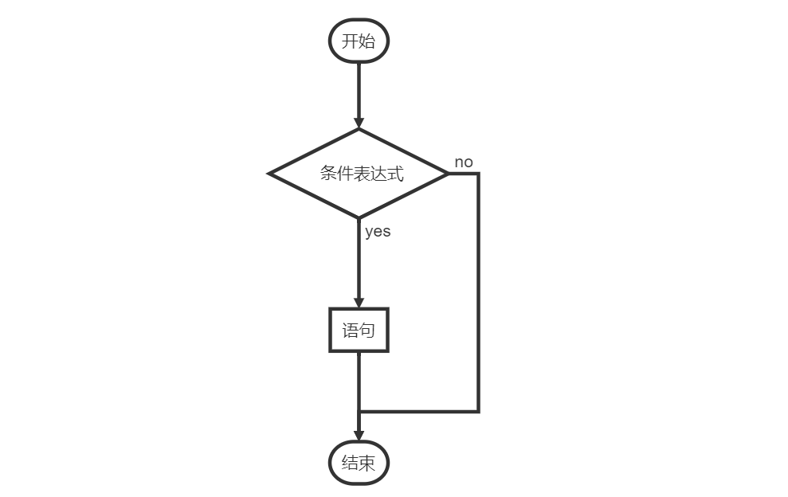
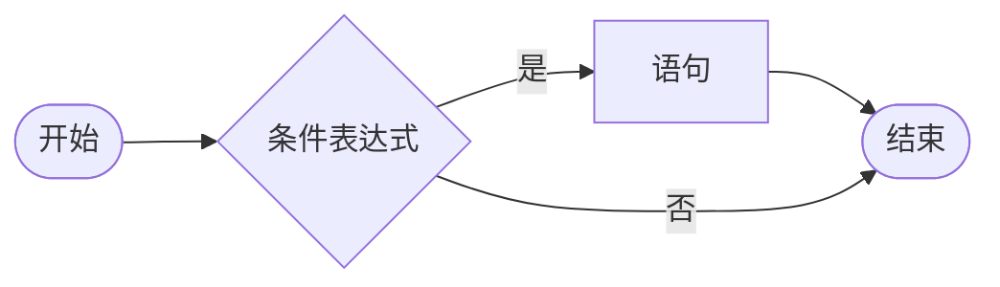
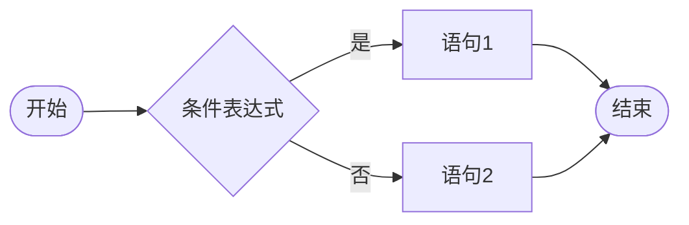
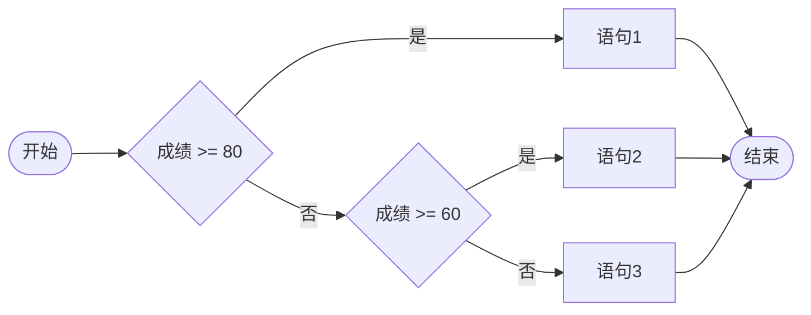
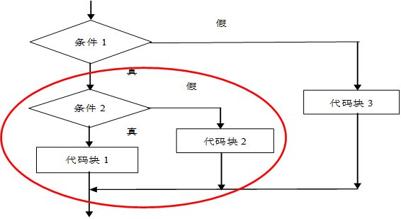
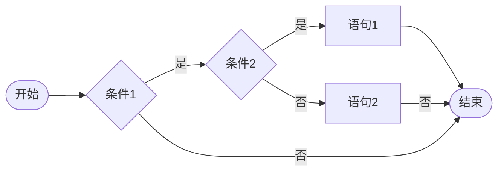
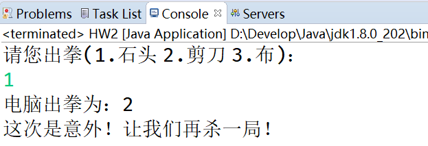

# if选择结构

## 前言

**C：** 上一篇我们介绍了流程控制语句的概念，本篇我们要正式开始学习其中的选择控制语句。那么在 Java 中，如果要实现选择控制语句有哪些语法呢？

本篇我们就来看看其中，在以后用的最多的一种选择结构语法：if 系列选择结构。


<!-- more -->

## 基础if选择结构

**基础 if 选择结构** 是 if 系列选择结构中，最基础的结构语法！它是最简单的选择结构，也只能用于一种流程分支的处理。

```java
// 语法
// 条件往往是由关系运算符来组成的判断
// 条件的结果是一个boolean值，要么为true(真)，要么为false(假)
if (条件) {
    // 条件为真时执行的语句
}
```

<!--

-->



**案例需求：如果佩奇 Java 成绩大于 90 分，笔者将会奖励她一部 OnePlus 8 Pro。**  

```java
// 声明一个变量用来存储佩奇的Java成绩
int score = 91;

// 套用基础if语法
if (score > 90) {
    System.out.println("笔者奖励了一部OnePlus 8 Pro。");
}

System.out.println("程序结束！");
```

::: tip 笔者说
套用下语法，用用关系运算符，就实现了一个很简单的选择案例，是不是很 easy。
:::

### 复杂条件的基础if

接下来再看看下方案例中的条件，它就没有那么容易了。

**案例需求：如果乔治 Java 成绩大于 90 分，并且音乐成绩大于 80 分时，或者 Java 成绩等于 100 分，音乐成绩大于 70 分时，笔者会奖励他一部 OnePlus 8 Pro。** 

面对这种场景，单靠普通的关系运算符显然无法实现，结合逻辑运算符就可以很好解决。  

```java
// 声明变量分别存储乔治的Java成绩和音乐成绩
int jScore = 60;
int mScore = 81;

// 关系运算符结合逻辑运算符
// 考虑到运算符的优先级，可以使用()来提升部分表达式的优先级，也是复杂条件下增加可读性的方法
// ()的添加应该成为一种本能，它是义务教育阶段学数学后的条件反射
if ((jScore > 90 && mScore > 80) || (jScore == 100 && mScore > 70)) {
    System.out.println("笔者奖励了一部OnePlus 8 Pro。");
}

System.out.println("程序结束！");
```

## if-else选择结构

我们敲完上方的代码发现，如果条件不满足的话，好像什么处理情况也没有，这怎么可能，只有老师奖励学生，没有学生受罚？我们再来看个案例。

**案例需求：如果苏西 Java 考试成绩大于 90 分，笔者就奖励她一部 OnePlus 8 Pro，否则就罚她给笔者买一部 OnePlus 8 Pro。**  

面对这个案例，我们还是可以采用基础If语法。

```java
// 条件成立情况
if (score > 90) {
    System.out.println("笔者奖励了一部OnePlus 8 Pro。");
}

// 条件不成立情况
// if (score <= 90) {
    // System.out.println("苏西哭着给笔者买了一部OnePlus 8 Pro，笔者很感动。");
// }

// 还可以这么写
// !表示取反，也就是某种情况的相反情况
if (!(score > 90)) {
    System.out.println("苏西哭着给笔者买了一部OnePlus 8 Pro，笔者很感动。");
}
```

但是明知道两个结果是互斥的，还要再写一次判断，并且条件越复杂，写起来就越麻烦。

例如：如果要基于刚才复杂条件的if案例来写的话。

```java
// 声明变量分别存储乔治的Java成绩和音乐成绩
int jScore = 60;
int mScore = 81;

// 成立
if ((jScore > 90 && mScore > 80) 
    || (jScore == 100 && mScore > 70)) {
    System.out.println("笔者奖励了一部OnePlus 8 Pro。");
}

// 不成立的情况
if (!((jScore > 90 && mScore > 80) 
    || (jScore == 100 && mScore > 70))) {
    System.out.println("奖励乔治给笔者买了一部OnePlus 8 Pro。");
}

System.out.println("程序结束！");
```

**头疼** ，这时候我们可以使用 `if-else` 语法来轻松解决这种条件互斥的情况。`if-else` 选择结构可以处理简单的互斥分支情况。

```java
// 语法
if (条件) {
    // 语句1
} else {
    // 语句2
}
```


<!--

-->



使用 `if-else` 来解决上述案例需求。

```java
// 声明一个变量存储苏西的Java考试成绩
int score = 90;
// 套用if-else语法
// if：如果  else：否则
if (score > 90) {
    System.out.println("笔者奖励了一部iPhone 11 Pro。");
} else {
    System.out.println("苏西哭着给笔者买了一部OnePlus 8 Pro，笔者很感动。");
}
```

::: tip 笔者说
实际上我们学的这些语法，在你念着案例时就能把代码写出来，如果（if）苏西的 Java 考试成绩（score）大于90分（> 90），笔者就奖励她一部 OnePlus 8 Pro（System.out.println("xxx");），否则（else）就罚她给笔者买一部 OnePlus 8 Pro（System.out.println("xxx");）。
:::

## 多重if选择结构

我们掌握了 `基础if` 来处理单分支选择，也掌握了 `if-else` 来处理互斥分支，但是如果出现了更多种的分支情况怎么办？

**案例需求：如果佩奇 Java 考试成绩大于等于 80 分，笔者就奖励她一部 OnePlus 8 Pro，如果佩奇 Java 考试成绩大于等于 60 分，笔者就奖励她一部一加云耳，否则就罚她给笔者买一部 iPhone 11 Pro。** 

面对此需求，`if-else` 只能处理互斥分支所以不能采用，那使用 `基础if` 的方案如下。

```java
// 声明一个变量存储佩奇的Java考试成绩
int score = 90;

if (score >= 80) {
    System.out.println("笔者奖励她一部OnePlus 8 Pro。");
}

// 如果不添加&&来进行限制，那么佩奇考试成绩>80分时，笔者将会破产
if (score >= 60 && score < 80) {
    System.out.println("笔者奖励她一部一加云耳。");
}

if (score < 60) {
    System.out.println("佩奇哭着给笔者买了一部iPhone 11 Pro，笔者很感动。");
}
```

毫无疑问，`基础if` 依然需要添加多次条件，但对于范围型判断来讲，如果不把范围控制好，那么后续的 if 条件就会出现多余判断的情况，因为每个 `基础if` 都是独立的，Java 为此提供了一种简化的方案：`多重if选择结构`。

**多重if选择结构：** 可以处理分段的条件分支情况，**它是自上而下进行选择判断，只要有一个条件满足，剩下的条件都不再执行判断** 。所以不要随意排列条件，把容易满足的条件放在下方，不然容易满足的条件判断为 `true` 后，后续其他条件都不会再判断了。

```java
// 语法
if (条件1) {
    // 语句1
} else if(条件2) { // 可以有多个else if
    // 语句2
} else { // 可以省略
    // 语句3
}
```

<!--

-->



```java
// 存储考试成绩
int score = 90;

// 套用if - else if - else语句
/*
 * 注意事项：
 *     1.else if 必须配合if使用，if只能写一个，else if可以写很多个
 *     2.if-else if结构是自上而下进行判断选择的，只要上方的一个条件成立，下方的其他条件不再执行
 *     3.可以结合else来使用，当上方所有条件都不成立时，就会执行else语句内容
 */
if (score >= 80) {
    System.out.println("笔者奖励她一部OnePlus 8 Pro。");
} else if (score >= 60) { // 不需要限制 < 80的条件了，因为只要符合>=80，就不再向下判断
    System.out.println("笔者奖励她一部一加云耳。");
} else {
    System.out.println("佩奇哭着给笔者买了一部iPhone 11 Pro，笔者很感动。");
}
```

## 嵌套if选择结构

生活在北上广深的各位同学们，对早晚高峰的地铁站印象很深了吧？在乘坐地铁前，我们需要有两次检查，第一次是安全检查，第二次是车票检查。火车站也是类似的。

面对这种多次检查，它的逻辑不是 `多重If` 这种自上而下依次执行的判断，而是当通过第一层判断后才可以进入第二层判断，面对这种场景，我们可以把 if 语句再灵活使用一点。


**嵌套if** 的应用场景：**在之前条件满足的前提下，再增加额外的判断** 。它可以通过外层语句和内层语句的协作，增强程序的灵活性。在笔者看来，当业务场景描述清楚的时候，福至心灵下就会自然而然的写出来对应的代码了。

```java
if (条件1) {
    if (条件2) 
        // 语句1
    } else {
        // 语句2
    }
} else {
    // 语句3
}
```

<!--

-->



**案例需求：学校举行运动会，百米赛跑跑入10秒内的学生有资格进决赛，然后根据性别进入男子组或女子组**  

```java
// 声明一个变量存储百米成绩
int score = 9;
// 声明一个变量存储性别
String gender = "女";

// 套用嵌套if语句
// 注意事项：如果没有进入决赛，也就不会分配组别了
if (score < 10) { // 可以进入决赛
    System.out.println("进入了决赛！");
    if ("男".equals(gender)) { // 分配组别
        System.out.println("进入了男子组！");
    } else {
        System.out.println("进入了女子组！");
    }
}
```

### 字符串的比较

大多数情况下，我们比较内容时都会采用 `==` 这个关系运算符，但是如果遇到特殊类型，就不可以了。 

**字符串的比较不要使用==，而是采用equals()方法。**

::: tip 笔者说
介绍数据类型时，笔者就说过 String 是个引用数据类型，有点特别。先了解，知道使用equals 方法来比较字符串内容即可。
:::

```java
// == 号可以比较基本数据类型的值是否相等(八大基本数据类型)
int num1 = 10;
int num2 = 10;
// System.out.println(num1 == num2); // true

char gender1 = '男';
char gender2 = '男';
// System.out.println(gender1 == gender2); // true

// ------------------

// 如果是字符串，不要使用==号比较，而是使用equals()方法
// 因为字符串是引用数据类型，==号如果比较引用数据类型，实际上比较的是数据的地址值而不是比较内容
// 所以==很有可能导致你的字符串内容比较出问题，因为它比较的是地址值
// 即使你发现两个字符串用==也比较为true了，那其实是涉及到常量池的概念了。
// 先记住不要用==比较字符串就可以了！！！后期面向对象阶段学完就知道为啥了。
String str1 = "我是一个字符串";
String str2 = "我是一个字符串";
System.out.println(str1.equals(str2));
```

## 答题环节

光看不练假把式，来几个练习，练起来。

### 模拟登录

::: details 需求：使用 if 编写程序：从键盘获取用户名和密码，如果用户名和密码都正确，那么就显示"欢迎进入xxx的世界！"，否则就提示"用户名或密码错误！"。 

提示：可以预先设定一个假的用户名和密码。
:::


### 人机猜拳

从控制台输入要出的拳，1代表石头、2代表剪刀、3代表布，电脑 **随机** 出拳，比较胜负，完成此代码功能。



#### 随机数的生成

随机数是我们在程序中经常要使用到的，前期我们可以用它模拟很多业务，下面介绍一个 Java 中生成随机数的玩法。

```java
// Math.random()可以随机生成[0.0,1.0)之间的小数
// [0.0,1.0)表示一个区间，等价于0.0 <= num1 < 1.0
// 左闭右开就是包含左边数据，不包含右边的数据
// [0.0,1.0]也表示一个区间，等价于0.0 <= num1 <= 1.0
// 左闭右闭就是包含左边数据，也包含右边的数据
// 想了解更多区间的内容，自己去百度下相关数学知识
double num1 = Math.random();

/*
 * 基于上方的方法，如果想指定生成某个范围内的随机数，可以推导出一个公式。
 * 随机数公式为：(int)(Math.random() * (max - min)) + min;
 */
// 案例1：生成[0,10)之间的随机整数
// [0.0,1.0) * 10 --> [0,10)
int num2 = (int)(Math.random() * 10);

// 案例2：生成[5,14)之间的随机整数
int num3 = (int)(Math.random() * 9) + 5;

// 案例3：如果想生成[6,20]之间的随机整数，那可以将其理解为[6,21)，这样就可以再套上方的公式了
int num4 = (int)(Math.random() * 15) + 6;
```

### 幸运抽奖

::: details 需求：实现幸运抽奖功能：输入4位的会员号，如果会员号的百位数字等于产生的随机数字，那么这个会员就是幸运会员，将奖励一部 iPhone 11 Pro！进行合理结果提示。

提示：获取4位数，各个位的数字举例：
:::


```java
int num = 1234;
// 千位
int qian = num / 1000;

// 百位
int bai = num / 100 % 10;

// 十位
int shi = num / 10 % 10;

// 个位
int ge = num % 10 % 10;
```

## 后记

选择结构的使用，一般不会困扰到大家。因为它与我们日常生活是非常贴近的，可读性非常强。当然如果还是不能理解，别忘了流程图哈！

::: info 笔者说
对于技术的学习，笔者一贯遵循的步骤是：先用最最简单的 demo 让它跑起来，然后学学它的最最常用 API 和 配置让自己能用起来，最后熟练使用的基础上，在空闲时尝试阅读它的源码让自己能够洞彻它的运行机制，部分问题出现的原因，同时借鉴这些技术实现来提升自己的代码高度。

所以在笔者的文章中，前期基本都是小白文，仅仅穿插很少量的源码研究。当然等小白文更新多了，你们还依然喜欢，后期会不定时专门对部分技术的源码进行解析。
:::
