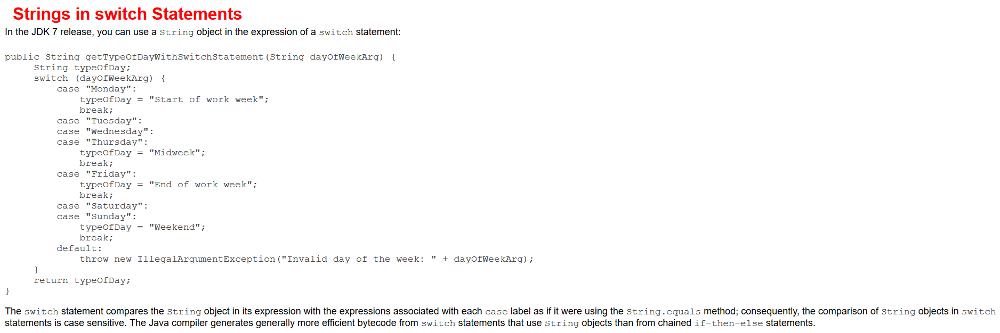

# switch选择结构

## 前言

**C：** 上一篇我们介绍了 if 系列的选择结构语法，整体感受应该是简单易懂且易写的。本篇笔者再介绍一种选择结构语法：switch，但此 switch 非彼 switch。


<!-- more -->

## Why？

有了 if ，为什么还要学习使用 switch 选择结构呢？一起来看个案例。

**案例需求：小杨参加了创造502节目。** 

- 如果获得第一名，将会担任《诛仙》女主角
- 如果获得第二名，将会担任《斗罗大陆》女主角
- 如果获得第三名，将会担任《永夜》女主角

从需求介绍中可知，案例的条件表达式是简单的等值判断，但是条件很多而且彼此都是互斥的，可以采用多重 if 来实现。

```java
// 存储名次
int score = 2;

// 使用多重if
if (score == 1) {
    System.out.println("小杨将会担任《诛仙》女主角！");
} else if (score == 2) {
    System.out.println("小杨将会担任《斗罗大陆》女主角！");
} else if (score == 3) {
    System.out.println("小杨将会担任《永夜》女主角！");
}
```

但相比于范围判断，在等值判断时使用 `多重if` 有点大材小用，实话就是 if 多了阅读起来真挺费劲的，所以笔者才给大家安利 Java 提供的另一个选择结构语句：`switch选择结构`。

我们来看看它的语法：

```java
switch (表达式) {
    case 常量1:
        语句;
        break;
    case 常量2:
        语句;
        break;
        // ....
    default:
        语句;
        break;
}
```

再套用它的语法来解决一下刚才的问题，是不是发现清晰多了？

```java
// 存储名次
int score = 2;

// 使用switch
switch (score) {
    case 1:
        System.out.println("小杨将会担任《诛仙》女主角！");
        break;
    case 2:
        System.out.println("小杨将会担任《斗罗大陆》女主角！");
        break;
    case 3:
        System.out.println("小杨将会担任《永夜》女主角！");
        break;
}
```

## 使用注意

1. 在满足等值判断的前提下，才可以使用 `switch` 来进行判断，不可用于范围型判断。

2. 如果没有特殊要求，必须给每一个 `case` 后追加 `break`。

   `break` 是表示结束某个 `case`，如果没有 `break`，会出现 `case` 的穿透性，即继续往下执行直到遇到下一个 `break` 结束！

   ```java
   // 存储名次
   int score = 1;
   // 使用switch
   switch(score){
       case 1:
           System.out.println("小杨将会担任《诛仙》女主角！");
       case 2:
           System.out.println("小杨将会担任《斗罗大陆》女主角！");
           break;
       case 3:
           System.out.println("小杨将会担任《永夜》女主角！");
           break;
   }
   ```

   上方的代码，如果 `case 1` 后缺少一个 `break`，那么输出结果是将会是。

   ```
   小杨将会担任《诛仙》女主角！
   小杨将会担任《斗罗大陆》女主角！
   ```

3. 建议加上一个 `default` 来进行默认处理。

4. `switch` 的表达式支持的类型有：`int`、( `short`、 `byte`、`char` 可以自动类型转换为 `int`)，`枚举类型(Enum)` 、`String`（自JDK1.7开始，`switch` 支持了字符串的等值判断，参考[Oracle Java7 RELEASE介绍](https://docs.oracle.com/javase/7/docs/technotes/guides/language/strings-switch.html)）。

   

   

## switch和if的对比

到此为止，Java 中的选择结构我们就学习完了，别看语法挺多，论派系的话只有两个，一个是 `if`，一个是`switch`，而且 `switch` 和 `多重if` 也很相像，理解起来也比较容易了。

**相同点：** 都是用来处理多分支条件的结构。

**不同点：** `switch` 只能处理等值条件判断的情况，`多重if` 选择结构没有 `switch` 选择结构的限制，特别适合某个变量处于某个连续区间时的情况（范围型判断）。

`switch` 从效率方面考虑，是要比 `if` 选择结构执行快（有兴趣自己百度下执行原理），但是随着硬件的发展，这两者之间的效率差距几乎可以忽略不计。

::: tip 笔者说
其实 Java 近几版本一直在对 `switch` 进行优化，switch 的使用也更加现代，后面有机会使用其他版本，再给大家开开眼。
:::

## 后记

选择结构出现后，我们就可以把现实生活的业务逻辑，在程序中模拟实现了。这些流程控制语句就像汉语拼音和基本汉字一样基础，好好记忆下语法。

把文章案例实现一下，千万要动手实现！因为理解和熟练掌握是两回事！就好像你在抖音上看了那么多生活上的教程：叠衣服、弹吉他.....，但你从没练过，那永远是学不会的，千万不要眼高手低。

::: info 笔者说
对于技术的学习，笔者一贯遵循的步骤是：先用最最简单的 demo 让它跑起来，然后学学它的最最常用 API 和 配置让自己能用起来，最后熟练使用的基础上，在空闲时尝试阅读它的源码让自己能够洞彻它的运行机制，部分问题出现的原因，同时借鉴这些技术实现来提升自己的代码高度。

所以在笔者的文章中，前期基本都是小白文，仅仅穿插很少量的源码研究。当然等小白文更新多了，你们还依然喜欢，后期会不定时专门对部分技术的源码进行解析。
:::
