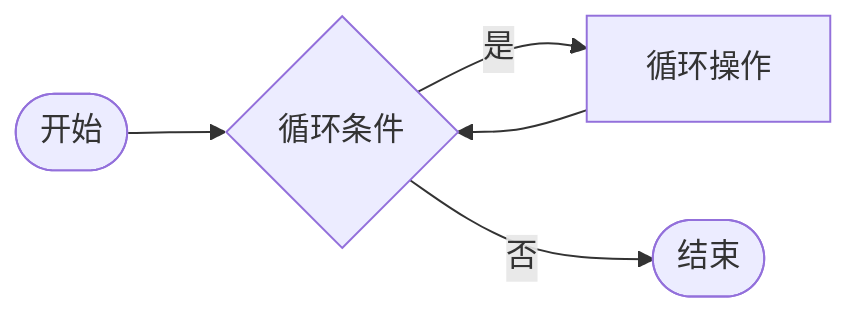
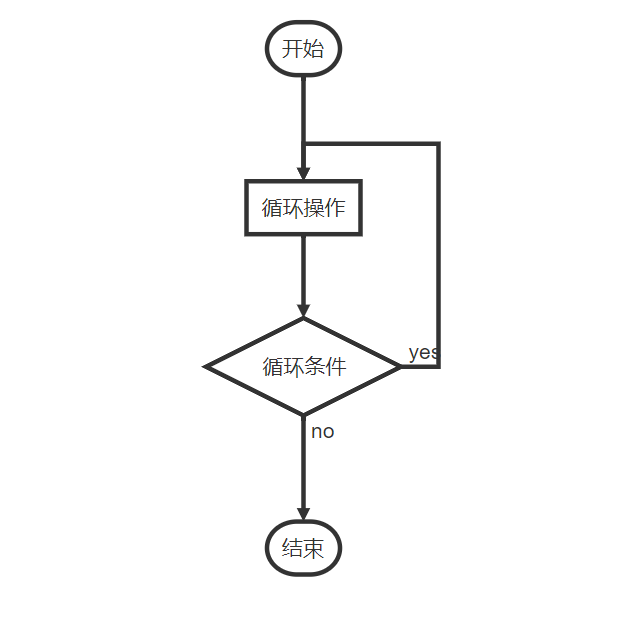
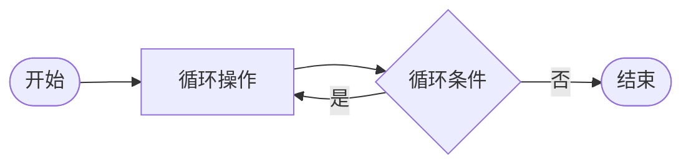
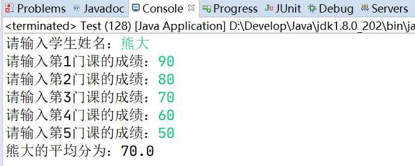
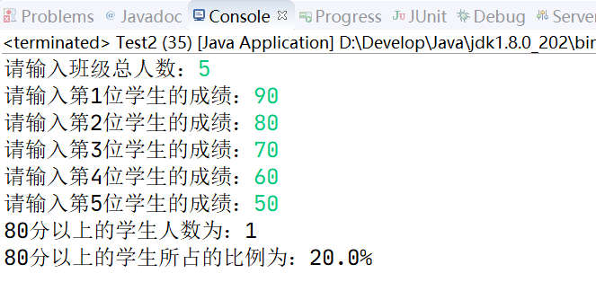
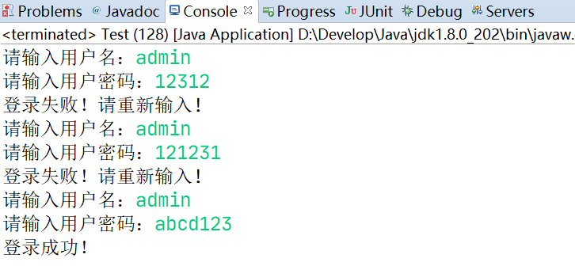

# 循环结构

## 前言

**C：** 在 [《控制语句和流程图》](./07-控制语句和流程图)篇中，笔者介绍了三种控制语句，每种控制语句都有它能解决的问题范围。例如：顺序控制语句可以解决“流水‘步骤，选择控制语句可以解决条件判断问题。

本篇我们要学习最后一种控制语句：循环控制语句。它可以用来解决业务中的重复、有规律性的问题。


<!-- more -->

## 什么是循环

### 生活

::: tip 循环 [circulate;circle]
- 以环形、回路或轨道运行;
- 沿曲折的路线运行;
- 特指运行一周而回到原处,再转。
- 或说反复地连续做某事。
:::

计算机程序是来源于生活程序的。生活中，我们上班、上学、坚持某个习惯等都算是一个循环过程。


甚至，在近两年的日常发言方面还有一个梗：“人类的本质是复读机”。


### 计算机

生活中有循环需求，在计算机程序中，类似的需求也是数不胜数的。

::: tip 笔者说
在不少实际问题中有许多具有规律性的重复操作，因此在程序中就需要重复执行某些语句。循环结构是在一定条件下反复执行某段程序的流程结构，被反复执行的程序被称为循环体（循环操作）。[1]
:::

**案例需求：熊大 Java 考试成绩未达到自己的目标。为了表明自己勤奋学习的决心，他决定写一百遍“好好学习，天天向上！”** 

这么有上进心的学生，真是令老师喜欢！那如何用 Java 代码来实现输出100遍 ”好好学习，天天向上” 呢？


好像没什么毛病，如果掌握了 Ctrl+C 和 Ctrl+V，就变得更加简单了。但是如果现在这位有上进心的学生，决定写10000遍呢？哪怕是用CV大法，这代码工作量也是吓坏个人 ！

好在，Java 语言为我们准备了三种循环结构语法，它们都可以轻松解决此需求，接下来一起去看看吧。

## while循环

while 循环是一种经典的循环结构语法，不仅仅是在 Java 语言中，其他的编程语言中也有类似的概念和语法。


### 语法

它的语法，宽松来讲包含两个组成，和 if 选择结构非常相似。

- 循环条件
- 循环体

```java
while (循环条件) {
    循环体/循环操作
}
```

从流程图中，我们可以看出它和选择结构的主要区别在于： **当条件成立且执行完操作后，它不会直接结束，而是会再次进入条件判断，直到条件不成立为止。** 

<!--

-->



### 使用

接下来我们通过案例来掌握一下使用步骤。

::: details 案例需求1：解决上方熊大的问题。
**思路分析：** 

1. 此案例为重复性步骤需求，采用循环控制语句解决

2. 要应用 while 循环，需要先确定此案例中，循环的两个固定组成部分

   - 循环条件：`<= 100`

   - 循环操作：输出 "好好学习，天天向上"

3. 套用 while 循环的语法来编写代码

   宽松的语法只考虑循环条件和循环操作即可。但为了让各位同学编写代码时可以形成一个完整步骤思路，笔者对语法步骤做了扩展，扩展为了4部分，这样你在用循环解决问题时，就直接可以去思考4部分的组成。

   - 初始化 循环变量：为循环条件表达式，准备一个起始变量

   - 循环条件

   - 循环操作

   - 循环出口：对循环条件表达式中的变量进行变化，让循环可以在指定时机结束

4. 检查是否正常在业务完成后退出循环

(上方这多出来的两个组成，其实是为了补齐循环条件的使用。)
:::

**代码实现：** 

```java
// 1.初始化 循环变量
int i = 1;

// 2.循环条件
while (i <= 100) {
    // 3.循环操作
    System.out.println("第" + i + "遍：好好学习，天天向上！");
    // 4.循环出口
    // 借助变量 i 来作循环条件，如果 i 的值不变动，会出现死循环
    i += 1;
}
```

::: tip 笔者说
你看应用循环结构语法之后，简单的几行代码就搞定了原来的问题。而且如果要更改输出的次数，只需要改一下循环条件部分即可。
:::

::: details 案例需求2：实现打印50份试卷。
**思路分析：** 

1. 此案例为重复性步骤需求，采用循环控制语句解决
2. 要应用 while 循环，需要先确定此案例中，循环的两个固定组成部分
   - 循环条件：`<= 50`

   - 循环操作：打印试卷
3. 套用 while 循环的语法来编写代码
4. 检查是否正常在业务完成后退出循环
:::

**代码实现：** 

```java
// 1.初始化 循环变量
int i = 1;

// 2.循环条件
while (i <= 50) {
    // 3.循环操作
    System.out.println("正在打印第" + i + "份试卷");
    // 4.循环出口
    i += 1;
}
```

## do-while循环

**案例需求：老师每天检查张浩的学习任务是否合格，如果不合格，则继续进行。老师给熊二安排的每天的学习任务为：上午阅读教材，学习理论部分，下午上机编程，掌握代码部分。** 

这个需求，大致一看可确定也是采用循环来解决，其中循环的两个要素：

- 循环条件：检查不合格继续进行

- 循环操作：学习任务（上午阅读教材，学习理论部分，下午上机编程，掌握代码部分）

但是我们发现，该案例与刚才的两个案例，有显著不同的地方：

- 逻辑顺序：它的逻辑是先进行学习任务（循环操作），然后再由老师检查（循环条件）。
- 条件复杂：它的条件也不再是普通次数递增，而是判断是否合格。

面对此需求，条件复杂倒是可以更改相应变量即可，但逻辑顺序方面却无法与 while 循环的流程相符（ **while 循环是先执行判断，再进行循环操作** ）。因此，Java 语言提供的第二种循环结构语法可以派上用场了： `do-while` 循环。

### 语法

```java
do {
    循环体/循环操作
} while (循环条件);
```

从流程图中，我们可以看出：`do-while` 循环的执行讲究一个先 do（循环操作），然后再执行循环条件。而且 **无论条件是否能成立，它至少会执行一次循环操作** 。

<!--

-->



### 使用

我们来使用 `do-while` 解决下熊二的问题。

```java
Scanner input = new Scanner(System.in);

// 1.初始化循环变量
String result;
// 套用do-while语句
do {
    // 2.循环操作
    System.out.println("熊二上午阅读教材，学习理论部分。");
    System.out.println("熊二下午上机编程，掌握代码部分。");
    // 3.循环出口
    System.out.print("老师检查是否合格(y/n)：");
    result = input.next();
} while ("n".equals(result)); // 4.循环条件

System.out.println("今日学习圆满！");
```

## for循环

学完了 while 系列的循环语法，接下来笔者再带你认识最后一种循环语法：for循环。

### Why？

**for循环是我们后期高频次使用的一种循环语法！**  为什么高频使用，一定有缘由，看看下方 “输出100遍，好好学习” 实现对比！

```java
// =============while循环=============
// 1.初始化 循环变量
int i = 1;

// 2.循环条件
while (i <= 100) {
    // 3.循环操作
    System.out.println("第" + i + "遍：好好学习，天天向上！");
    // 4.循环出口
    // 借助变量 i 来作循环条件，如果 i 的值不变动，会出现死循环
    i += 1;
}
```

```java
// =============for循环=============
for (int i = 1; i <= 100; i += 1) {
    System.out.println("第" + i + "遍：好好学习，天天向上！");
}
```

显而易见，**在循环次数固定的情况下，for 循环比while 循环更简洁** 。

### 语法

for 循环的语法要更加简洁，更加灵活，但是上方总结的循环四要素是没有变化的。只不过它要求我们将循环中经常忘却的几个组成要素，先指定好，这样就可以更专注于循环操作了。所以你可以将 for 循环理解为是 while 循环的延伸。（就像多重 if 延伸为 switch 选择结构一样）

::: tip 笔者说
对于笔者个人来讲，如果 for 和 while 都能解决的问题，我更偏向于 for 的使用。因为在使用 while 循环时，自上而下的编写代码，经常忘却的就是循环出口。
:::

```java
for (初始化 循环变量; 循环条件; 循环出口) {
    循环体/循环操作
}
```

### 使用

::: details 案例需求1：循环输入某同学期末考试的5门课成绩，并计算平均分。
**思路分析：**（平均分：总成绩 / 数量） 

1. 此案例为重复性步骤需求，采用循环控制语句解决
2. 确定此案例中，循环的两个固定组成部分

   - 循环条件：`<= 5`
   - 循环操作：输入每门课成绩，并累加求和（+=）
3. 由于是固定次数循环，套用 for 循环的语法来编写代码

   - 初始化 循环变量：为循环条件表达式，准备一个起始变量
   - 循环条件
   - 循环操作

   - 循环出口：对循环条件表达式中的变量进行变化，让循环可以在指定时机结束
4. 检查是否正常在业务完成后退出循环
:::



**代码实现：** 

```java
Scanner input = new Scanner(System.in);

System.out.print("请输入学生姓名：");
String name = input.next();

// 定义变量存储成绩和
double sum = 0;

// 输入每门课成绩
for (int i = 1; i <= 5; i++) {
    System.out.print("请输入第" + i + "门课的成绩：");
    double score = input.nextDouble();
    // 累加成绩和
    sum += score;
}

// 计算平均分，平均分 = 成绩和 / 课数量
double avg = sum / 5;
System.out.println(name + "的平均分为：" + avg);
```

::: details 案例需求2：输出如图所示加法表。
**思路分析：** 

1. 此案例为重复性步骤需求，采用循环控制语句解决

2. 确定此案例中，循环的两个固定组成部分

   - 循环条件：`<= 输入的值`
   - 循环操作：要输出加法运算
     加法运算的两个操作数
     - 第一个操作数：从0递增到你输入的值
     - 第二个操作数：从你输入的值递减到0

3. 由于是固定次数循环，套用 for 循环的语法来编写代码

   - 初始化 循环变量：为循环条件表达式，准备一个起始变量
   - 循环条件
   - 循环操作
   - 循环出口：对循环条件表达式中的变量进行变化，让循环可以在指定时机结束

4. 检查是否正常在业务完成后退出循环
:::


**代码实现：** 

```java
Scanner input = new Scanner(System.in);

System.out.print("请输入一个值：");
int num = input.nextInt();

System.out.println("根据这个值可以输出以下加法表：");
// 套用 for 语法
// 注意：int i = 0, j = num; 这也是变量定义的方式，但不常用
for (int i = 0, j = num; i <= num; i++, j--) {
    System.out.println(i + " + " + j + " = " + (i + j));
}
```
或者是：
```java
Scanner input = new Scanner(System.in);

System.out.print("请输入一个值：");
int num = input.nextInt();

System.out.println("根据这个值可以输出以下加法表：");
// 套用 for 语法
// 定义两个计算变量
int i = 0;
int j = num;
for (; i <= num;) {
    System.out.println(i + " + " + j + " = " + (i + j));
    // 循环出口
    i++;
    j--;
}
```

### 注意事项

- for 循环的三大项都可以省略，但是两个 `;` 号不能省！省略了三大项之后，就成了死循环。
- for 循环中的初始化变量和循环出口可以单独拿出来，比如为了提升变量作用域的情况。
- for 循环只能用于循环次数固定的场景。

## 三种循环的区别

执行顺序区别：

- while 循环：先判断再执行
- do-while 循环：先执行再判断。初始情况不满足循环条件时，do-while 至少也会执行一次。
- for 循环：先判断再执行

适用情况区别：

- 循环次数固定的情况，通常选用 for 循环
- 循环次数不确定的情况，通常选用 while 或 do-while 循环

## 死循环

上方介绍循环时，笔者大量提到了一个概念：死循环。死循环，就是当你循环没有出口，导致循环无法结束的一种现象。

下方是最简单的三种死循环代码，但只要循环条件或循环出口的错误或缺失，其实都会导致死循环出现。

```java
while (true) {
	
}
```

```java
do {

} while (true);
```

```java
for (;;) {

}
```

按理说死循环是不好的情况，但正如：“功法没有正邪之分，主要看使用者。“ 合理使用死循环会让你的程序编写更加便捷。

例如：当你 **不知道一个循环什么时候结束的时候**，使用死循环会更加合适。但一般它要配合跳转语句来使用。

### 跳转语句

#### break

生活中参加长跑比赛，如果在比赛过程中身体不支/不适，是可以退出比赛的。

而程序中，也有需要在指定的情况下就不要再执行循环的需求，这时候跳转语句们就可以灵活的调度这个循环流程。

`break` 关键字，在 switch 语句中我们就见过，表示中断的意思。它还可以使用在三大循环结构中，此时它表示 **结束当前所在的循环流程，跳转到循环块外的下一条语句** 。

```java
// 伪代码：4000米长跑
for (int i = 0; i < 10; i++) {
    if (体力不支) {
        // 退出比赛
        break;
    }
}
```

**案例需求：循环录入某学生5门课的成绩并计算平均分，如果某分数录入为负，停止录入并提示录入错误。** 


该需求，就是刚才 for 循环中实现过的案例，只不过是增加了些许要求。

```java
Scanner input = new Scanner(System.in);

System.out.print("请输入学生姓名：");
String name = input.next();

double sum = 0;

// 提升作用域
// 如果 i 定义在for循环块中，那它就只能在for循环块中使用。
int i = 1;
for (; i <= 5; i++) {
    System.out.print("请输入第" + i + "门课的成绩：");
    double score = input.nextDouble();
    // 如果输入了负数，提示错误并结束循环
    if (score < 0) {
        System.out.println("分数录入错误！请重新开始录入！");
        break;
    }
    sum += score;
}

// 提前结束循环则不需要进行平均分计算
if (i > 5) {
    double avg = sum / 5;
    System.out.println(name + "的平均分为：" + avg);
}
```

#### continue

除了 `break` 之外，还有一个跳转语句：`continue`。顾名思义，它的作用是 **跳过本次循环体中余下尚未执行的语句，立即进行下一次的循环条件判定，可以理解为仅结束本次循环** 。

**案例需求：使用循环 + continue实现，循环录入 Java 课的学生成绩，统计分数大于等于80分的学生比例。** 



```java
Scanner input = new Scanner(System.in);

System.out.print("请输入班级总人数：");
int num = input.nextInt();

// 设 >= 80分的学生人数
int count = 0;
for (int i = 1; i <= num; i++) {
    System.out.print("请输入第" + i + "位学生的成绩：");
    double score = input.nextDouble();
    // 统计成绩 >= 80分以上的学生人数
    if (score < 80) {
        // 结束本次循环，进入下一次循环
        continue;
    }
    // 累加人数
    count ++;
}

// 计算
double percent = count * 1.0 / num * 100; 
System.out.println("80分以上的学生人数为：" + count);
System.out.println("80分以上的学生所占的比例为：" + percent + "%");
```

::: tip 笔者说
这个案例，continue不是必须的，我们也可以把统计人数部分代码更换为：  

```java
if (score > 80) {
    count ++;
}
```
:::

### 死循环 + 跳转语句

好了，再介绍完跳转语句，笔者给大家介绍一种死循环结合跳转语句，实现重复输入的应用。

- 死循环的使用，可以令程序不结束永远执行下去
- break的使用，可以结束该循环
- continue的使用，可以结束本次循环，进入下次循环



```java
Scanner input = new Scanner(System.in);

while (true) {
    System.out.print("请输入用户名：");
    String username = input.next();
    System.out.print("请输入用户密码：");
    String password = input.next();
    // 失败重输
    if (!("admin".equals(username) 
            && "abcd123".equals(password))) {
        System.out.println("登录失败！请重新输入!");
        // 结束本次循环，进入下次循环
        continue;
    }
    // 结束死循环
    break;
}

System.out.println("登录成功！");
```

::: tip 笔者说
是不是感觉稍微有些烧脑了？多写几次就好了！它还可以写成下方这种。  

但笔者 **个人** 还是比较喜欢死循环的写法，只要"时机"到了，随时结束或进入下一次，很直接，很纯粹，很果断。


:::

```java
Scanner input = new Scanner(System.in);

boolean flag;
do {
    // 初始化 循环变量
    // 初始为true，只有当登录成功才将flag状态改为false以结束循环
    flag = true;

    System.out.print("请输入用户名：");
    String username = input.next();
    System.out.print("请输入用户密码：");
    String password = input.next();
    // 失败重输
    if ("admin".equals(username) 
        && "abcd123".equals(password)) {
        System.out.println("登录成功！");
        // 更改循环状态
        flag = false;
    } else {
        System.out.println("登录失败！请重新输入！");
    }
} while (flag);
```

## 答题环节

### 计算和

::: details 需求：使用 while、do-while 以及 for 循环三种编程方式分别实现：计算100以内（包括100）的偶数之和。

提示：偶数，能够被 2 整除的数字被称为偶数。例如：4 % 2 == 0，4为偶数。
:::

### 打印数列

**需求：** 使用循环输出 100、95、90、85、.......5。

### 输出所有的水仙花数

::: details 需求：使用单层循环实现所有水仙花数的输出。
**提示：什么是水仙花数？** 

1. 水仙花数都是三位数

2. 水仙花数的个位的立方 + 十位立方 + 百位立方 = 水仙花数字本身

:::

### 输出星期数

**需求：** 从键盘输入一位整数，当输入1 ~ 7 时，输出"星期一" ~ "星期日"。

- 输入其他数字时，提示用户重新输入。
- 输入数字0，程序结束


## 参考文献

[1]张桂珠、张平、陈爱国．Java面向对象程序设计（jdk1.6）第三版：北京邮电大学出版社，2005

## 后记

我想，学完这一篇的同学们一定会开始有些许头疼。因为循环它开始变得有所抽象，简单的几行代码却要表述出成百上千次操作，循环操作越是复杂，那需要的空间思维越是庞大，不过别担心，下一篇，笔者解救你。

另外，笔者在本篇给相同的需求，反复给出不同的解决方法，这对于初次学习，以及"刻板化"学习的同学会有些难受，因为不知道选择哪个了。

::: tip 笔者说
实际上，生活从来不是一个"刻板化"的步骤，生活中遇到的问题也不总是“刻板化”的来解决，程序亦是如此，千人千面，千题千解。  

笔者给你一个个人建议，根据自身情况，先选择一种最喜欢的解决方法，然后当这种解决方法怎么都无法解决问题的时候，考虑下另一种或更多种。
:::

::: info 笔者说
对于技术的学习，笔者一贯遵循的步骤是：先用最最简单的 demo 让它跑起来，然后学学它的最最常用 API 和 配置让自己能用起来，最后熟练使用的基础上，在空闲时尝试阅读它的源码让自己能够洞彻它的运行机制，部分问题出现的原因，同时借鉴这些技术实现来提升自己的代码高度。

所以在笔者的文章中，前期基本都是小白文，仅仅穿插很少量的源码研究。当然等小白文更新多了，你们还依然喜欢，后期会不定时专门对部分技术的源码进行解析。
:::
