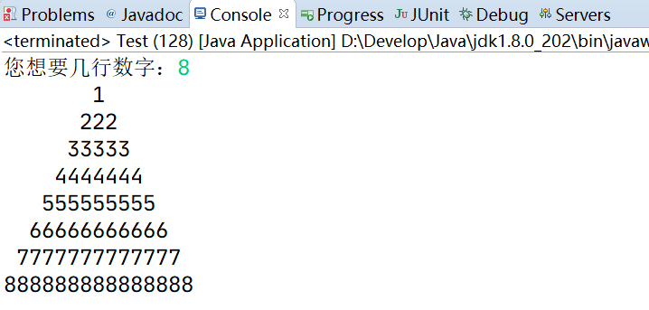

# 多重循环

## 前言

**C：** 对于很多同学来讲，上一篇，可以说是对你当前逻辑思维能力的检验篇。

逻辑思维强的同学，套着思路分析步骤和语法，很容易就写完了练习。而逻辑思维不强的同学，则因为缺少相应的练习，思路不畅导致代码写的自己都看不懂，更别提遵守什么代码规范了。但是如果认真敲完笔者的案例，应该是可以很容易看得懂一些参考答案的，只不过就是自己想不出来，甚至因而变得焦躁、钻牛角尖（为什么自己想不到，为什么别人可以想到？）。


那逻辑思维除了先天之外，自然也是可以后天培养的。笔者的培养方法是个笨方法：那就是多做练习。既然想不到解决方法，那就塌下心来学习别人怎么做，甚至是背代码，最后做多了，量变引发质变，就可以提升出自己的东西。

这种方法当然不能称之为好，但是目前它适合普罗大众，你要做的就是塌下心来，承认自己的不足，学习解决思路。

::: tip 笔者说
这类话，笔者后面文章也会反复提起，一次两次你是听不进去的。
:::

本篇我们继续学习循环结构，不过是对循环的更高级玩法，所以难度更大。不过别担心，笔者会通过思路分析一点点的带你进行案例实现。

<!-- more -->

## Why？

在学完了基本的循环结构后，我们也掌握了对简单的有规律性、重复性步骤的优化能力。别飘，新的需求又来了，看看下方的图形，如何用程序在控制台打印出来呢？


不同的人看待问题的角度不同，有些同学一看到它就会想：这个需求一点不难，实现很简单，看看下方已经被押送 "海王星" 的同学写的实现。

```java
// 第一个图形
for(int i = 0; i < 5; i++){
    System.out.println("*****");
}

// 第二个图形
System.out.println("     *****");
System.out.println("    *****");
System.out.println("  *****");
System.out.println(" *****");
System.out.println("*****");

// 第三个图形
System.out.println("    *    ");
System.out.println("   ***   ");
System.out.println("  *****  ");
System.out.println(" ******* ");
System.out.println("*********");
```


谁看谁不落泪？一点毛病都没有！所以也怪笔者的需求描述不清楚，那再对需求补充一个要求：使用循环，以一颗 `*` 一颗 `*` 的形式来实现打印这些图形。

头疼了吧？因为现有的技术你基本无法实现。 **单层循环无法解决稍微复杂些的需求。** 

## 概述

多重循环（嵌套循环），其实就是一个循环体内又包含另一个完整的循环结构。

和嵌套 if 是一回事。各循环之间可互相嵌套，但一般不超过三层，否则导致逻辑混乱，因小失大。又因为一般都是二层嵌套，故往往称为二重循环/双重循环。

**常见的多重循环伪代码如下：** 

```java
while (外层循环条件) {
    ...外层循环操作...
    while (内层循环条件) {
        ...内层循环操作...
    }
}
```

```java
do {
    ...外层循环操作...
    do {
        ...内层循环操作...
    } while (内层循环条件);
} while (外层循环条件);
```

```java
for (;外层循环条件;) {
    ...外层循环操作...
    for (;内层循环条件;) {
        ...内层循环操作...
    }
}
```

```java
while (外层循环条件) {
    ...外层循环操作...
    for (;内层循环条件;) {
        ...内层循环操作...
    }
    for (;内层循环条件;) {
        ...内层循环操作...
    }
}
```

::: tip 笔者说
多重循环要比嵌套 if 难。因为 **内层循环 就是 外层循环的 循环操作的 组成部分** ，所以程序执行特点是： **外层循环执行一次，内层循环执行一遍。** 
:::

## 使用

接下来笔者带大家打打样，看看多重循环一般怎么用，也找找它们的使用规律。

### 打印矩形

之前我们的单层循环，是解决一行行具有规律性的需求，每一行输出的格式比较稳定，例如下方输出：


这回这些复杂的图形，不仅要求我们考虑行的规律，还需要考虑每行内的规律（列）。

有规律的内容就要靠循环实现，两个有规律就要用两个循环，三个有规律就用三个循环，以此类推。

而列是包含在行内的， **所以意味着实现行规律的循环 要 包含着实现列规律的循环** ，这就是多重循环的应用场景了。

::: tip 笔者说
你就记住这类需求的一个规律，**外层循环可以控制行规律，内层循环控制每行内容(列)的规律** 。
:::

**思路分析：** 

1. 根据需求，行和列都有重复性规律，采用多重循环
2. 确定此案例中，两个循环的组成部分

   外层循环
   - 循环条件：`<= 5`
   - 循环操作：内层循环，每行结尾换行

   内层循环
   - 循环条件：`<= 5`
   - 循环操作：打印每颗 `*`
3. 由于两个都是固定次数循环，套用 for 循环的语法来编写代码

4. 检查是否能正常结束循环

```java
// 外层循环，执行五次，每次输出一行*
for (int i = 1; i <= 5; i++) {
    // 内层循环，执行五次，每次输出一个*
    for (int j = 1; j <= 5; j++){
        // 不换行输出*
        System.out.print("*");
    }
    // 每行结尾换行
    System.out.println();
}
```

### 打印直角三角形


**思路分析：** 

1. 根据需求，行和列都有重复性规律，采用多重循环

2. 确定此案例中，两个循环的组成部分

   外层循环

   - 循环条件：`<= 5`
   - 循环操作：内层循环，每行结尾换行

   内层循环

   - 循环条件：`2 * 外层循环变量 - 1` 
   - 循环操作：打印每颗 `*` 

3. 由于两个都是固定次数循环，套用 for 循环的语法来编写代码

4. 检查是否能正常结束循环

::: tip 笔者说
每行 `*` 的规律是我们在学习数学数列时最常见的规律，第一行：1、第二行：3、第三行：5、第四行：7、第五行：9...
:::

```java
// 外层循环
for (int i = 1; i <= 5; i++) {
    // 内层循环
    for (int j = 1; j <= 2 * i - 1; j++) {
        System.out.print("*");
    }
    // 每行结尾换行
    System.out.println();
}
```

### 打印等腰三角形


**思路分析：** 

1. 根据需求，行和列都有重复性规律，采用多重循环

   等腰三角形的一部分和刚才的直角三角形规律是一样的，你看看把这个图形变换一下，是不是就明白了？

   

   但此次多重循环不能只是两个循环了，我们需要多准备一个循环来实现每行打印规律的空格。

2. 确定此案例中，三个循环的组成部分

   外层循环
   - 循环条件：`<= 5`
   - 循环操作：内层循环1，内层循环2，每行结尾换行

   内层循环1：
   - 循环条件：`<= 5 - 外层循环变量`
   - 循环操作：打印一个空格

   内层循环2：
   - 循环条件：`2 * 外层循环变量 - 1` 
   - 循环操作：打印每颗 `*` 

3. 由于三个都是固定次数循环，套用 for 循环的语法来编写代码

4. 检查是否能正常结束循环

```java
// 外层循环
for (int i = 1; i <= 5; i++) {
    // 内层循环1
    for(int j = 1; j <= 5 - i; j++){
        System.out.print(" ");
    }
    // 内层循环2
    for (int j = 1;j <= 2 * i - 1; j++){
        System.out.print("*");
    }
    // 每行结尾换行
    System.out.println();
}
```

### 打印平行四边形


**思路分析：** 

1. 根据需求，行和列都有重复性规律，采用多重循环
2. 确定此案例中，三个循环的组成部分

   外层循环
   - 循环条件：`<= 5`
   - 循环操作：内层循环1，内层循环2，每行结尾换行

   内层循环1：
   - 循环条件：`<= 5 - 外层循环变量`
   - 循环操作：打印一个空格

   内层循环2：
   - 循环条件：`<= 5` 
   - 循环操作：打印每颗 `*` 
3. 由于三个都是固定次数循环，套用 for 循环的语法来编写代码
4. 检查是否能正常结束循环

```java
// 外层循环
for (int i = 1; i <= 5; i++) {
    // 内层循环1
    for (int k = 1; k <= 5 - i; k++) {
        System.out.print(" ");
    }
    // 内层循环2
    for (int j = 1; j <= 5; j++) {
        System.out.print("*");
    }
    // 每行结尾换行
    System.out.println();
}
```

### 打印九九乘法表


**思路分析：** 

1. 根据需求，行和列都有重复性规律，采用多重循环

2. 确定此案例中，两个循环的组成部分

   外层循环

   - 循环条件：`<= 9`
   - 循环操作：内层循环，每行结尾换行

   内层循环

   - 循环条件：`<= 外层循环的循环变量` 

     第1行打印1个，第2行打印2个，第3行打印3个....

   - 循环操作：打印乘法运算

     - 第1个操作数：内循环的循环变量
     - 第2个操作数：外循环的循环变量

3. 由于两个都是固定次数循环，套用 for 循环的语法来编写代码

4. 检查是否能正常结束循环

```java
// 外层循环
for (int i = 1; i <= 9; i++) {
    // 内层循环
    for (int j = 1; j <= i; j++) {
        System.out.print(j + "*" + i + "=" + (j * i) + "\t");
    }
    // 每行结尾换行
    System.out.println();
}
```

## 答题环节

### 打印数字等腰三角形

**需求：** 使用多重循环根据用户输入的数字，输出如下图形。



### 倒序打印九九乘法表

**需求：** 使用多重循环倒序打印九九乘法表。


### 打印菱形

**需求：** 使用多重循环输出如下图形。


## 后记

你就套着思路分析的步骤，塌下心来实现一下，相似的问题一定要回忆起相似的解决方法。别学一个忘一个，下一篇笔者带你学习一种专业工具，这样就可以逐行的看程序执行了。

::: info 笔者说
对于技术的学习，笔者一贯遵循的步骤是：先用最最简单的 demo 让它跑起来，然后学学它的最最常用 API 和 配置让自己能用起来，最后熟练使用的基础上，在空闲时尝试阅读它的源码让自己能够洞彻它的运行机制，部分问题出现的原因，同时借鉴这些技术实现来提升自己的代码高度。

所以在笔者的文章中，前期基本都是小白文，仅仅穿插很少量的源码研究。当然等小白文更新多了，你们还依然喜欢，后期会不定时专门对部分技术的源码进行解析。
:::
