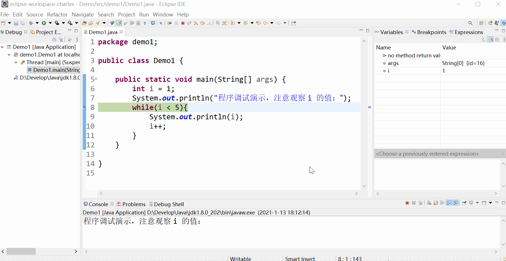
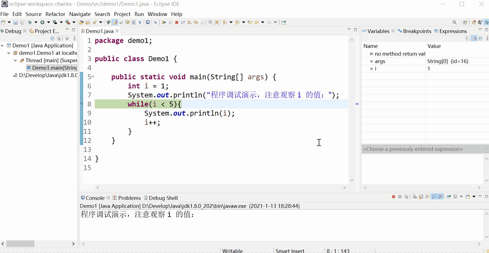
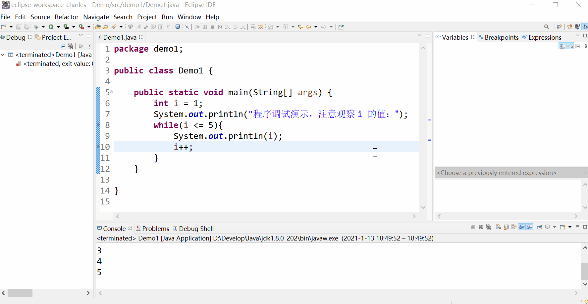

# 程序调试入门

## 前言

**C：** 学习到本篇的各位同学，想必对编写期、运行期的报红，报错早已见怪不怪了。


出了问题后，面向百度编程，解决了一部分，还有很多隐藏在 "冰山" 之下，所以在工作中，大家都自嘲是在写 Bug。


正因如此，*一个有经验的程序员不仅仅要熟练各种技术，还应该表现出成熟且稳定的 Bug 解决能力* 。笔者在本篇将会带你熟悉下常见的 Bug 解决思路及方式， **掌握了这些技巧** ，在大多数情况下你会轻松一些的。

<!-- more -->

## bug和debug

::: tip bug （计算机领域漏洞）
bug 是计算机领域专业术语，原意是 "臭虫"，现在用来指代计算机上存在的漏洞，原因是系统安全策略上存在的缺陷，有攻击者能够在未授权的情况下访问的危害。  

bug 这个术语从 "臭虫" 转换为漏洞，还有一段 "可歌可泣" 的故事 ：为马克2号（Harvard Mark II）编制程序的格蕾丝·霍珀（Grace Hopper）是一位美国海军准将及计算机科学家，同时也是世界最早的一批程序设计师之一。有一天，她在调试设备时出现故障，拆开继电器后，发现有只飞蛾被夹扁在触点中间，从而“卡”住了机器的运行。于是，霍珀诙谐地把程序故障统称为“臭虫（BUG）”，把排除程序故障叫 DEBUG，而这奇怪的“称呼”，竟成为后来计算机领域的专业行话。[1]
:::


另外以后快别外行似的喊 `必忧计` 了，人家叫 `bug` 。

::: details 行业内还有这么一个冷笑话是：程序员最讨厌乾隆的哪个儿子？ 
八阿哥（bug）
:::

## 调试思路

日常生活中，家用电路出现问题时，打了维修电话叫电工过来，电工首先会和我们沟通下大致情况，看看问题大致的方向和可能，然后再使用万用表及其他专业检测工具对电路逐段进行检测，最后再找到异常情况的部分，进行相应维修或部件更换。

我们在进行程序调试（debug）时也应该遵循类似的思路进行：

1. 理清需求， **观察故障提示、现象** ，看是否能确定问题大致方向和可能
2. 阅读代码
3. 逐条语句执行程序
4. 观察程序执行情况
5. 发现问题
6. 解决问题

## 调试方式

调试思路掌握之后，还有一些配套的调试方式可以帮助我们快速定位及修复 bug。

### 小黄鸭调试法

::: tip 小黄鸭调试法
小黄鸭调试法（又称橡皮鸭调试法，黄鸭除虫法）是软件工程中使用的调试代码方法之一。  

此概念是参照于一个来自《程序员修炼之道》书中的一个故事。传说中程序大师随身携带一只小黄鸭，在调试代码的时候会在桌上放上这只小黄鸭，然后详细地向鸭子解释每行代码[2]  

许多程序员都有过向别人（甚至可能向完全不会编程的人）提问及解释编程问题，就在解释的过程中击中了问题的解决方案。一边阐述代码的意图一边观察它实际上的意图并做调试，这两者之间的任何不协调会变得很明显，并且更容易发现自己的错误。如果没有玩具小鸭子也可以考虑向其它东西倾诉，比如桌上的花花草草，键盘鼠标。  

类似的，有一种现象叫做 cone of answers，这是一个常见的现象。 **你的朋友跑来问你一个问题，但是当他自己把问题说完，或者说到一半的时候就想出了答案走了，留下一脸茫然的你。是的，这个时候你就起到了那只小黄鸭的作用** 。  

相似的概念还有不少，例如自白调试、纸板程序员或程序员的假人、想出脑外等等。总的来说，在你试图表述自己的想法的过程中，自然地在促使自己去整理思路，重新考虑问题。[3]
:::

小黄鸭调试法是一种非常经典的代码阅读技巧。一边读代码，一边给自己或其他的媒介来解释对应代码的含义。有些简单的问题，就这么被发现了。


### 输出语句

单纯通过代码阅读，如果是单词类错误（单词错误是前期学习过程中，出现频次最高的）。以我们程序员这么 "护犊子" 的情况，有时候看多少遍都看不出来。*"我的代码和他的一样，我的代码没错啊？怎么就是不行？"* 

这种情况下，就需要我们在程序执行的过程中，找寻一些关键的地方增加输出语句，然后执行看输出效果。如果输出语句和预期效果不对，甚至干脆没有执行，那问题很大可能就出在这里了。

### 专业调试工具[重要]

通过阅读代码、加输出语句来查找程序错误，前期固然可行。但是当程序结构越来越复杂时，或者花费了大量时间依然没有能够发现及解决问题时，还需要配合专业的 debug 工具来调试。

在 JDK 中内置了 `jdb` 可以用来在命令行调试程序，但是我们现在在用 Eclipse 这种 IDE ，人家也携带了相应的调试程序。命令行和可视化界面这种选择，毫无疑问要选择后者。

## Eclipse调试

接下来我们通过一个案例来演示一下具体 Eclipse 中调试工具的使用步骤。

### 问题描述

**案例需求：输出 1 ~ 5 这5个数字。**  

**代码实现：** 

```java
int i = 1;
System.out.println("程序调试演示，注意观察 i 的值：");
while(i < 5){
    System.out.println(i);
    i++;
}
```

**存在问题：** 只能输出到4，无法输出5这个数


### 使用步骤

程序运行嗖嗖的，我们根本无法逐行的观察具体真实的执行过程，Eclipse 的程序调试（debug）又被称为断点调试。所谓断点，就是你希望运行中的程序在哪一行停下来，让你可以逐行进行分析。

**第一步：看故障现象，分析错误，设置断点。** 

在你想监测程序运行的开始代码行左侧栏，双击鼠标左键将出现一个断点标志，再双击可以取消断点。


**第二步：启动调试。** 

这时候，我们不再以 `run as` 运行了，而是右键以 `debug as` 运行。

启动时，Eclipse 会弹出一个对话框提示你是否要切换到 debug 模式视图，我们点击 switch 切换过去，debug as 运行后，它会按照正常的执行顺序进行代码执行，直到遇到断点行才停下来。此时这一行代码处于 **等待执行** ，还未执行的状态。


debug 视图的界面布局如下：


**第三步：单步运行。** 

连续点击 F6 键可以单步运行程序，即逐行执行程序，这时候我们就可以来观察程序运行过程了。



**第四步：观察变量变化。** 

在逐行运行过程中，可以观察右侧变量表来查看变量的变化情况，鼠标直接放在变量名上，也可以直接查看它的当前值。

选中表达式还可以查看表达式的计算结果。



**其他调试按钮的使用：** 

我们可以按下 F8 ，按下它，会向下快速执行代码行到下个断点才会停住。这样我们就可以只观察想要看到的代码行效果了。

::: tip 笔者说
在运行过程中，随时可以添加断点或取消断点，非常灵活。
:::

我们也可以按下 Ctrl + F2 随时结束当前的调试。


好了，我们最后完整调试一下吧，调试到最后环节时，很容易就发现 `i` 的值到了5的时候，就无法进入循环了，问题就出在这，改动条件表达式为 `i <= 5` 就没事了。

调试完之后，你可以在右侧 断点表 快速清除所有的断点，然后再点击右上角的 Java 视图标志切换回之前的开发模式。



## 参考文献

[1]百度百科. bug （计算机领域漏洞）[EB/OL]. https://baike.baidu.com/item/bug/3353935. 2020-1-13

[2]百度学术. The Pragmatic programmer:From journeyman to master[EB/OL]. https://xueshu.baidu.com/usercenter/paper/show?paperid=1971af4403d863660114ff571f6757a5&site=xueshu_se. 2021-1-13

[3]百度百科. 小黄鸭调试法[EB/OL]. https://baike.baidu.com/item/小黄鸭调试法/16569594. 2021-1-13

## 后记

在本篇中，笔者试着添加了一些动态 gif 图来更好的展现一些操作步骤，希望它们对你有帮助，也希望你能看懂这无声的“对白”。

本篇也是笔者语言入门系列的第一个程序调试使用，只是入门操作而已，后续随着系列的延续，再补充更多的使用技巧以及其他调试按钮的功能。

希望你从现在开始好好用用每个 IDE 的程序调试工具，绝对比你遇到问题或思路不畅时，只靠眼睛瞪代码有效。


::: info 笔者说
对于技术的学习，笔者一贯遵循的步骤是：先用最最简单的 demo 让它跑起来，然后学学它的最最常用 API 和 配置让自己能用起来，最后熟练使用的基础上，在空闲时尝试阅读它的源码让自己能够洞彻它的运行机制，部分问题出现的原因，同时借鉴这些技术实现来提升自己的代码高度。

所以在笔者的文章中，前期基本都是小白文，仅仅穿插很少量的源码研究。当然等小白文更新多了，你们还依然喜欢，后期会不定时专门对部分技术的源码进行解析。
:::
