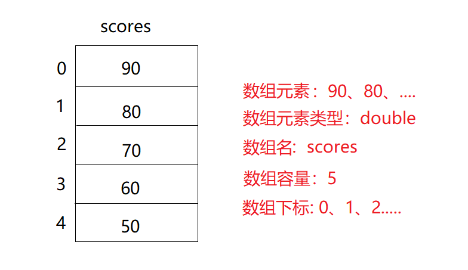

# 一维数组

## 前言

**C：** 循环是 Java 语法上的一个小坎儿，跨过来之后，我们马上就要从语法入门上岸了。

本篇，笔者要带着你学习， Java 语法入门的一个进阶知识，数据结构：数组。

在目前已学的 Java 知识中，如果我们想利用程序，存储一个成绩数据，如下所示即可。

```java
// 声明一个变量，存储成绩
double score = 90;
```

但当我们要存储并使用5个、10个，甚至更多成绩数据时，变量这种单一存储的方式，其效率及使用将变得不太友好。

```java
double score1 = 90;
double score2 = 80;
double score3 = 70;
double score4 = 60;
double score5 = 59;
...
```

所以我们需要一种更为先进的，能够同时存储多个数据、并方便使用的存储方式。


<!-- more -->

## 数据结构概述

在开始介绍数组前，我们先来普及一下数据结构的基本概念。

::: tip 《数据结构与算法》
数据结构是计算机存储、组织数据的方式。  

数据结构是指相互之间存在一种或多种特定关系的数据元素的集合。通常情况下，精心选择的数据结构可以带来更高的运行或者存储效率。数据结构往往同高效的检索算法和索引技术有关。[1]
:::

数据结构有很多种，一般来说，按照数据的逻辑结构对其进行简单的分类，包括线性结构（线性表）和非线性结构（非线性表）两类。[2] 

1. 线性表（Linear List），就是表中各个结点具有线性关系。数据排成像一条线一样的结构。[3]

   常见的线性表数据结构有：数组，队列、栈、链表等。

   

2. 非线性表，就是表中各个结点之间具有多个对应关系。[2]

   常见的非线性表数据结构有：树、图等。

   

::: tip 笔者说
数据结构在计算机系是一门非常重要的基础学科。数据结构产生的目的，就是为了让计算机能够以更加简单、高效、便捷的方式来 **存储** 和 **使用** 数据。
:::


## 数组概述

数组是线性数据结构中最为基础，最为典型的一种顺序型结构。它用一组 **连续的内存空间** ，来存储一组具有 **相同类型** 的数据。[3]

我们拿变量和数组来对比一下：

- 变量：就是在内存中划出 **一块合适** 的空间。
- 数组：就是在内存中划出 **一串连续** 的空间。


## 数组组成

我们也再拿变量的组成要素，和数组来对比一下。

|     变量     |                             数组                       |
| :---------- | :----------------------------------------------------- |
|    变量值    |              **数组元素** ：在数组中存储的数据               |
| 变量数据类型 | **数组元素的类型** ：在数组中存储的数据都必须是相同的数据类型 |
|    变量名    |    **数组名** ：用于区分不同的数组，命名规范同变量名一致     |
|              |           **数组容量** ：数组中可以存储多少个元素            |
|              | **数组下标/索引** ：数组是一串连续的空间，每个空间都有其相应的 "序号"， **从0开始计数** |



::: tip 笔者说
**数组的下标是由数组的容量（长度）决定的** 。数组的容量为5，那么数组的下标就是0、1、2、3、4。数组容量一经定义，就不可再变。
:::

## 数组定义

了解完数组的组成，接下来，我们亲自定义一个数组来使用。在 Java 中，数组的定义方式很灵活，笔者带你认识两种比较常见的定义方式。

### 方式一

第一种数组定义方式为：先声明好数组，再给数组赋值。

```java
// 声明数组语法
数据类型[] 数组名 = new 数据类型[数组容量];
```

```java
// 数组赋值语法
数组名[下标] = 元素值;
```

这种是最传统的数组定义方式了。通过指定好数据类型及数组容量，来划定好一串连续的空间，就可以来存储数据了。

::: tip 笔者说
声明数组的语法长得和变量定义方式类似，就是多了个 `new` 关键字，这个关键字我们在使用 Scanner 时也用过，以后笔者会告诉你它的含义的，先记住语法。
:::

好了，回到我们前言中提过的需求，来使用方式一实现一下。

::: details 案例需求：存储班级内5名同学的成绩，成绩分别为：90、80、70、60、50。

**思路分析：** 

1. 根据需求，由于要进行多个数据的存储，采用数组更为合适
2. 确定数组的各个组成
   - 数组元素：成绩

   - 数组元素的类型：double

   - 数组名：scores（一个成绩常被命名为：score，多个成绩则可命名为复数形式：scores）

   - 数组容量（决定下标）：5
3. 根据数组组成，套用方式一的数组语法实现
:::

```java
// 声明一个长度为5，用来存储 double 类型数据的数组
double[] scores = new double[5];

// 给数组赋值
// 把 90 赋值给数组的第1个空间
scores[0] = 90;
// 把 80 赋值给数组的第2个空间
scores[1] = 80;
// 把 70 赋值给数组的第3个空间
scores[2] = 70;
// 把 60 赋值给数组的第4个空间
scores[3] = 60;
// 把 50 赋值给数组的第5个空间
scores[4] = 50;
```

存储好了数据，在使用数据的时候，也是需要借助数组名和数组下标来进行的。

```java
// 使用语法：数组名[下标]
System.out.println(scores[0]); // 90.0
```

::: tip 笔者说
下标是从 0 开始计数的，所以极其容易出现，超出数组容量范围的使用问题。例如：`scores[5] = 40;`  
而且这种问题，在编译期不报错，在运行时才报错（数组越界异常），需要各位同学多加小心，反复用注释等方式提醒自己。
:::

### 方式二

方式一的定义方式，需要先声明一个数组，然后再进行赋值操作。步骤中规中矩，如果想快速获得一个赋值好的数组，可以通过下方的语法来实现。

```java
// 声明数组时赋值
// 语法
数据类型[] 数组名 = {元素1, 元素2, ....};
```

这种定义方式，非常适合快速定义一个有值数组的情况。不需要指定容量，数组会根据元素的数量指定好容量。

我们来通过方式二语法，改造一下刚才的需求实现。

```java
double[] scores = {90, 80, 70, 60, 50};
```

声明数组时赋值，还可以写成下方这样。

```java
// 声明数组时赋值
// 语法：
数据类型[] 数组名 = new 数据类型[] {元素1, 元素2, ...};
```

再改造下刚才的需求实现。

```java
// 注意：有[]，也不需要指定数组容量，它是空的，不是笔者写错了
double[] scores1 = new double[] {90, 80, 70, 60, 50};
```

::: tip 笔者说
肯定有同学会问：这种定义方式，和上方几乎一模一样，再学习有什么用？别着急，后续在一些篇章的场景中，这种写法可能是你使用数组唯一的、更好的选择，相信笔者。
:::

## 数组的默认值

在原来，我们声明了一个局部变量后，如果不赋值，是无法使用的。而声明好数组之后，如果你不进行任何赋值就直接来使用，却会发现数组的各个空间竟然都有值。

这是因为在数组声明时，会伴随一个初始化动作，初始化动作就是对数组每一个空间， **根据数组元素数据类型** ，来设置一个默认值的过程。

- 整数型数组（byte、short、int、long）：默认值为0
- 浮点型数组（float、double）：默认值为0.0
- 布尔型数组（boolean）：默认值为false
- 字符型数组（char）：默认值为一个空格（\u0000）
- 字符串型数组（String）：默认值为 null

::: tip 笔者说
`null` 是一种特殊的值，后期，我们在讲解引用数据类型时会再提到。
:::

```java
double[] dArr = new double[5];
System.out.println(dArr[0]); // 0.0

int[] iArr = new int[5];
System.out.println(iArr[0]); // 0

boolean[] bArr = new boolean[5];
System.out.println(bArr[0]); // false

char[] cArr = new char[5];
System.out.println(cArr[0]); // 一个空格，\U0000

String[] sArr = new String[5];
System.out.println(sArr[0]); // null
```

## 动态赋值

在方式一的赋值中，学习过循环的我们，很快就能发现一些重复性，有规律性的操作。


如果我们再结合上 Scanner 键盘输入，就可以将数组的赋值变为动态形式的。

**思路分析：** 

1. 根据效果图分析，只有单个规律，采用单层循环即可
2. 确定循环要素
   - 循环条件： `< 数组长度` 

   - 循环操作： 数组名[循环变量] = 输入的元素值;
3. 固定次数循环，采用 for 循环
4. 检查循环是否可以正常退出

```java
// 声明数组，存储5个同学成绩
double[] scores = new double[5];

// 动态录入学生成绩
Scanner input = new Scanner(System.in);
// 数组名.length 可以获取数组的容量
for (int i = 0; i < scores.length; i++) {
    System.out.print("请输入第" + (i+1) + "个学生成绩：");
    scores[i] = input.nextDouble();
}

System.out.println("第3名同学成绩：" + scores[2]);
```

## 数组遍历

在动态赋值的实现中，我们巧妙利用了循环，实现了数组赋值的规律。其实在从数组取值过程中，依然存在此规律。在数组的常见操作中，有一种叫做遍历的概念会经常出现。

::: tip 笔者说
**遍历：** 将数组中的元素挨个取出来的过程，就叫遍历。
:::

接下来，我们看看，如何才能实现数组的遍历。

### 循环下标遍历

最常见的遍历方式，就是通过循环数组的下标，来进行遍历。刚才我们动态赋值就是用的这种循环规律。

```java
// 定义数组
double[] scores = {90, 80, 70, 60, 50};

// 循环所有的下标，然后根据下标取值
for (int i = 0; i < scores.length; i++) {
    // 数组名[循环下标]
    System.out.println(scores[i]);
}
```

### forEach遍历

除此之外，还有一种较为特别的方式：使用 forEach 循环（俗称增强 for 循环）遍历。这种遍历方式，主要强调的就是将数组中的元素挨个取出来，每次都临时存储到一个变量中。

```java
// 声明数组并赋值
double[] scores = {90, 80, 70, 60, 50};

// for (数组元素数据类型 变量名 : 要遍历的数组名)
// score 是在循环中，临时存储每一个元素的变量
for (double score : scores) {
    System.out.println(score);
}
```

::: tip 笔者说
增强 for 循环遍历方式与循环下标遍历相比，在使用时更简单，但前期可能不太好理解，如果实在理解不好的话，就先用循环下标的遍历方式。而且有些时候，我们需要下标来作为辅助计算因素时，采用循环下标遍历更方便。
:::

## 数组使用

光说不练假把式，接下来我们通过数组来解决一些需求问题。

### 打印消费记录

**案例需求：根据效果图实现，会员消费清单打印。** 


```java
// 声明一个长度为5的数组，用来存储本月消费记录
double[] records = new double[5];

// 动态赋值
Scanner input = new Scanner(System.in);
System.out.println("请输入会员本月的消费记录：");
for (int i = 0; i < records.length; i++) {
    System.out.print("请输入第" + (i+1) + "笔购物金额：");
    records[i] = input.nextDouble();
}

System.out.println();

// 声明变量，存储消费总金额
double sum = 0;
System.out.println("序号\t\t金额(元)");
for (int i = 0; i < records.length; i++) {
    System.out.println((i+1) + "\t\t" + records[i]);
    sum += records[i];
}
System.out.println("总金额\t\t" + sum);
```

### 猜数字

**案例需求：有一个数列：8，4，2，1，23，344，12。** 

1. 循环输出数列的值
2. 求数列中所有数值的和
3. **猜数游戏：** 从键盘中任意输入一个数据，判断数列中是否包含此数

```java
// 声明数组，存储好数列的值
int[] numArr = {8, 4, 2, 1, 23, 344, 12};

// 1.循环输出数列的值  
System.out.println("数列中的值有：");
for (int num : numArr) {
    System.out.println(num);
}
System.out.println("-------------------------");

// 2.求数列中所有数值的和  
int sum = 0;
for (int i = 0; i < numArr.length; i++) {
    sum += numArr[i];
}
System.out.println("数列的所有数值的和为：" + sum);
System.out.println("-------------------------");

// 3.猜数游戏：从键盘中任意输入一个数据，判断数列中是否包含此数  
// 3.1 从键盘中任意输入一个数据
Scanner input = new Scanner(System.in);
System.out.print("请输入一个数值：");
int num = input.nextInt();

// 3.2 判断数列中是否包含此数  
// 标志位
boolean flag = false; // 假设数列中不包含此值
for (int i = 0; i < numArr.length; i++) {
    if (numArr[i] == num) {
        flag = true;
        break;
    } 
}
// 3.3 判断标志位
if (flag) {
    System.out.println("数列中包含此值！");
} else {
    System.out.println("数列中不包含此值！");
}
```

### 求最高分

**案例需求：从键盘输入本次Java考试五位学生的成绩，求考试成绩最高分。** 

::: tip 笔者说
武侠电视剧中，经常上演 "文无第一，武无第二" 的戏码。比武招亲或武林大会：最开始有一个守擂的，随后有各大侠士争相对抗，赢的就成为新的守擂者，等结束剩下的就是最强的。
:::

```java
//  1.从键盘输入本次 Java 考试五位学生的成绩
double[] scoreArr = new double[5]; 

Scanner input = new Scanner(System.in);
for (int i = 0; i < scoreArr.length; i++) {
    System.out.print("请输入第" + (i + 1) + "位学生的成绩：");
    scoreArr[i] = input.nextDouble();
}

// 2.求考试成绩最高分
// 假定一个最高分(从要比较的数据中假定一个数据)
double max = scoreArr[0];
for (double score : scoreArr) {
    // 如果挨个比较过程中，有比max还大的值
    // 那就将max的值换为最新的数据
    if (score > max) {
        max = score;
    }
}
System.out.println("最高分为：" + max);
```

### 求最低价

**案例需求：输入4家手机店的 OnePlus 8T 价格，输出哪家店价格最低及最低手机价格。** 


这道题和上一题是一个思路，我们来实现一下。

```java
// 声明数组，存储4家店手机价格
double[] prices = new double[4];

// 动态赋值
Scanner input = new Scanner(System.in);
System.out.println("请输入4家店的 OnePlus 8T 手机价格：");
for (int i = 0; i < prices.length; i++) {
    System.out.print("第" + (i+1) + "家店的价格：");
    prices[i] = input.nextDouble();
}

// 声明变量，假定最低价格为第1家
double min = prices[0];
// 声明变量，存储最低价格是第几家
int minStore = 1;
for (int i = 0; i < prices.length; i++) {
    // 如果有比最低价格还低的
    if (prices[i] < min) {
        // 更换最低价格
        min = prices[i];
        // 更换最低价格店铺
        minStore = i + 1;
    }
}
System.out.println("第" + minStore + "家价格最低，价格为：" + min);
```

## 答题环节

下方这些题大多来自于互联网，笔者收集汇总在一起，针对性的练习一下。

### 求最小值

**需求：获取指定数组中偶数元素值的最小值** 

1. 定义一个 int 数组 arr
2. 键盘录入5个整数，存入数组 arr 中，并且录入之前提示输入的是第几个数字
3. 获取指定数组 arr 中偶数元素值的最小值，并在控制台打印

### 求差值

**需求1：获取到数组中最大值和最小值的差值** 

1. 获取键盘录入的5个整数，并存放在 int 数组 arr 中，输入前提示输入的是第几个值。
2. 分别获取数组中最大值和最小值，并计算差值。
3. 输出差值。

**需求2：获取数组元素的偶数和与奇数和之差** 

1. 获取键盘录入的5个整数，并存放在 int 数组 arr 中，输入前提示输入的是第几个值;

2. 分别获取数组中元素的偶数和与奇数和;

3. 输出偶数和与奇数和的差值

### 个数统计

**需求1：获取指定数组中元素值为偶数的元素个数** 

1. 定义一个整数数组 arr
2. 获取5个0~50之间（包含0和50）的随机数，并存入 arr
3. 获取指定数组 arr 中元素值为偶数的元素个数，并打印

**需求2：获取指定数组中大于指定整数的元素个数** 

1. 获取键盘录入的5个整数，并存放在 int 数组 arr 中，输入前提示输入的是第几个值

2. 键盘录入一个需要进行比较的整数 num

3. 计算数组 arr 中比整数 num 大的元素个数

### 查询下标

**需求：查询指定元素值在指定数组中的下标值** 

1. 创建 int 数组 arr，arr 包含11, 32，55, 47，55, 79，23  
2. 输入任意一个整数 num
3. 遍历数组，如果指定数组 arr 中不存在指定整数 num，那么输出 -1，指定数组 arr 中存在多个相同的指定整数 num，那么输出 num 值对应的最大角标值（最后的num对应的角标）

### 替换值

**需求：用指定整数替换指定数组中的元素值** 

1. 创建 int 数组 arr，数组内包含0-9之间的10个整数

2. 获取键盘录入的一个整数 num，如果 num 为偶数，则用 num 替换指定数组 arr 中的所有偶数下标的元素值

   如果 num 为奇数，则用 num 替换指定数组 arr 中所有的奇数下标的元素值

3. 输出替换值之后的数组 arr

### 去除值

**需求：去除数组中所有的数值0** 

1. 定义一个数组 oldArr，元素为1,3,4,5,0,0,6,6,0,5,4,7,6,7,0,5

2. 去除所有为 0 的元素值，并存入到一个新的数组 newArr，效果为1,3,4,5,6,6,5,4,7,6,7,5

3. 分别遍历两个数组

### 互换值

**需求：将指定数组元素值的位置前后互换，例如：[11, 32，55, 47，79，23]	置换后的数组元素为：**
**[23, 79, 47, 55, 32, 11]** 

1. 定义一个整数数组 arr
2. 键盘录入5个整数，并存入数组 arr
3. 定义一个新数组 newArr
4. 将指定数组 arr 的元素值的位置前后互换，并存储到新数组 newArr 中
5. 在控制台分别横向打印 arr 和 newArr 的内容

### 获取随机值

**需求1：获取指定数组中随机的2个元素值** 

1. 定义一个 int 数组 arr
2. 键盘录入5个整数，存入数组 arr 中,并且录入之前提示输入的是第几个数字
3. 随机获取数组中的两个元素值并在控制台打印 

**需求2：随机获取4个A-Z之间（包含A和Z）的大写字母** 

1. 定义一个 char 数组 arr

2. 生成A-Z之间的26个大写字母，并存入数组 arr 中

3. 从 arr 数组中获取4个随机大写字母。

### 字符串的拼接

**需求：获取指定字符数组中下标为奇数的所有字符，并连接成一个字符串** 

1. 创建字符数组，数组包含 26 个大写字符及 0-9 字符
2. 获取指定字符数组中，下标为奇数的所有字符，并连接成一个字符串
3. 将字符串打印在控制台上

## 参考文献

[1]彭军、向毅主编．数据结构与算法：人民邮电出版社，2013年

[2]刘亚东；曲心慧编．C/C++常用算法手册：中国铁道出版社，2017.09：第21页

[3]冯小圆. 数据结构之数组[EB/OL]. https://www.cnblogs.com/fengxiaoyuan/p/10934399.html. 2019-05-27

## 后记

有了数组这一数据结构之后，多个数据存储及使用变得更加方便，随之而来的就是一些算法题型的解锁，笔者在本篇的作业中汇总了10来道练习题，希望你能通过解决这些问题，来锻炼下自己的逻辑思维。

做不出来也别着急，你还可以评论求助笔者来给你参考答案。


最后别忘了，牢记学习数组的原因：因为前面的数据存储方式，已经不能满足我们日益复杂的需求。而且，数组作为一种典型的，基础的线性表数据结构，有其存储上的优势。

它在查找方法因为有下标的存在，效率较为不错，所以 **适合增删情况较少，查取数据较多的场景** 。但它也有不足之处：它只能存储一组定长的具有相同数据类型的数据。

::: info 笔者说
对于技术的学习，笔者一贯遵循的步骤是：先用最最简单的 demo 让它跑起来，然后学学它的最最常用 API 和 配置让自己能用起来，最后熟练使用的基础上，在空闲时尝试阅读它的源码让自己能够洞彻它的运行机制，部分问题出现的原因，同时借鉴这些技术实现来提升自己的代码高度。

所以在笔者的文章中，前期基本都是小白文，仅仅穿插很少量的源码研究。当然等小白文更新多了，你们还依然喜欢，后期会不定时专门对部分技术的源码进行解析。
:::
