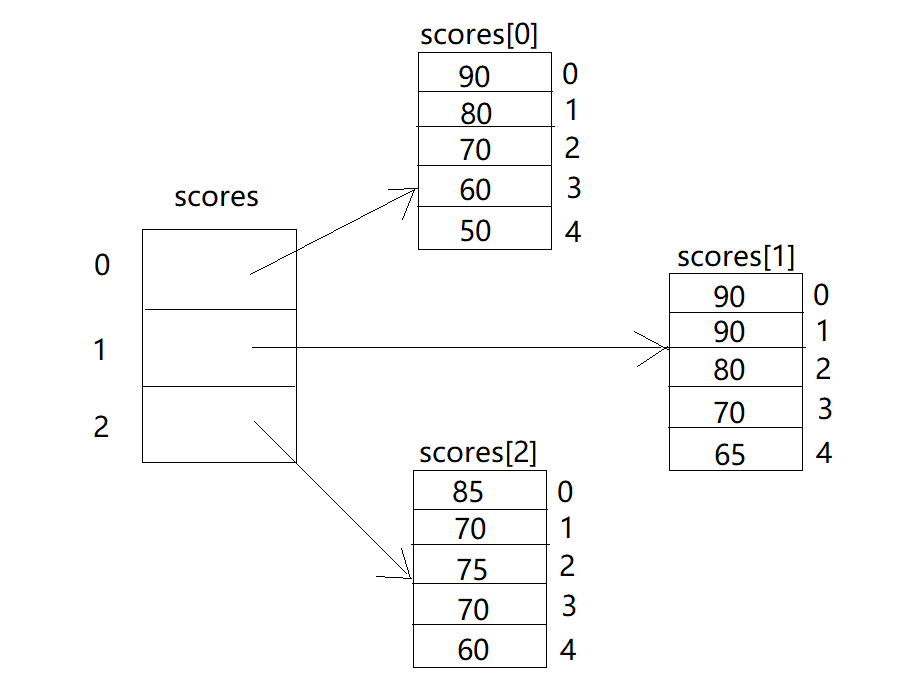
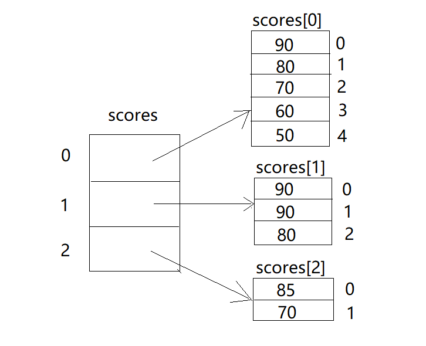
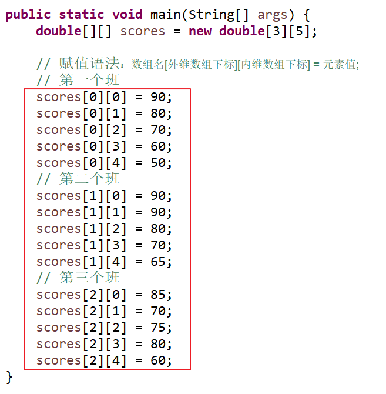

# 多维数组

## 前言

**C：** 上一篇，我们学习了数组的概念，并掌握了它的定义及基本使用方法。

下面，我们再来看一个案例需求。

**案例需求：已知有3个班级各5名学员，请计算各个班级的总成绩。** 

根据需求及经验来分析，如果我们只是要计算单个班级的学生总成绩，那么定义一个普通数组，来存储这些成绩信息，再去计算即可。

```java
// 存储一个班成绩
double[] scores = new double[5];
// ...
```

而现在需要计算三个班级的各自总成绩，按经验推导，应该先如下定义存储结构，然后分别计算。

```java
// 存储第一个班成绩
double[] scores1 = new double[5];
// 存储第二个班成绩
double[] scores2 = new double[5];
// 存储第三个班成绩
double[] scores3 = new double[5];
// ...
```

自然它也是可以实现需求的。但是，在本篇，笔者将带你学习一种更为高级的方式：多维数组。


<!-- more -->

## 概述

上一篇，我们学的用来存储多个数据的数组，它们被称为一维数组。

多维数组，类似于前面学过的嵌套 if、嵌套循环。笔者觉得，你也可以把多维数组称之为 "嵌套数组"。

它的常见表现形式有：二维数组、三维数组。

::: tip 笔者说
二维数组：是以 一维数组 作为 数组元素 的数组，即 “数组的数组”。[1]  

三维数组：是以 二维数组 作为 数组元素 的数组。
:::

有点拗口，定义向绕口令一样，分明就是 "俄罗斯套娃" 么。


不过在使用多维数组前，需要再强化些概念理解：

- 一般来讲，主要使用的是二维数组，三维及以上使用较少（ **本篇笔者也主要介绍二维数组的使用** ）
- 从语法上来看，Java 支持多维数组的写法
- 从内存分配原理的角度上来看，它们都是一维数组而已

## 定义

### 方式一

传统的一维数组的声明和赋值方式，我们都是掌握的：

```java
// 声明语法：数据类型[] 数组名 = new 数据类型[数组容量];
// 例如：存储5名学生成绩：
//    数组存储的元素：成绩
//    数组元素的数据类型：double
//    数组的容量(要存储的成绩数量)：5
double[] scores = new double[5];

// 赋值语法：数组名[下标] = 元素值;
scores[0] = 90;
scores[1] = 80;
scores[2] = 70;
scores[3] = 60;
scores[4] = 50;
```


二维数组本质上就是一维数组，只不过是以 一维数组 作为 数组元素 的数组。我们可以把二维数组分成外维数组及内维数组。

```java
// 声明二维数组
// 语法
数据类型[][] 数组名 = new 数据类型[外维数组容量][内维数组容量];

// 给二维数组赋值
// 语法
数组名[外维数组下标][内维数组下标] = 元素值;
```

我们结合着二维数组的语法，来初步实现下前言中的需求。

::: details 案例需求：存储3个班各5名学生成绩。

**思路分析：** 

1. 根据需求，由于要存储的两组数据有包含关系，采用二维数组更为合适

2. 确定数组的各个组成

   - 外维数组：
     - 数组元素：班级

     - 数组元素类型：double[]
     - 数组容量：5

   - 内维数组：
     - 数组元素：成绩
     - 数组元素类型：double
     - 数组容量：3

3. 根据数组组成，套用方式一的数组语法实现
:::

```java
// 声明一个二维数组     
double[][] scores = new double[3][5];

// 给二维数组赋值
// 第1个班
scores[0][0] = 90; // 第1个班的第1个同学成绩为90
scores[0][1] = 80;
scores[0][2] = 70;
scores[0][3] = 60;
scores[0][4] = 50;
// 第2个班
scores[1][0] = 90;
scores[1][1] = 90;
scores[1][2] = 80;
scores[1][3] = 70;
scores[1][4] = 65;
// 第3个班
scores[2][0] = 85;
scores[2][1] = 70;
scores[2][2] = 75;
scores[2][3] = 80;
scores[2][4] = 60;
```



::: tip 笔者说
虽然数组有些特别，不像之前学的基本数据类型：int、double..。但数组也是一种数据类型，所以 "别拿豆包不当干粮，别拿数组不当数据类型" 。
:::

### 方式二

在定义二维数组时，内维数组容量不是必须立刻指定的，还可以这样写。

```java
数据类型[][] 数组名 = new 数据类型[外维数组容量][内维数组容量];
```

**案例需求：存储三个班学生成绩，1班有5个学生，2班有3个学生，3班有2个学生。** 

```java
// 声明一个二维数组
double[][] scores = new double[3][];
// 声明内维数组
scores[0] = new double[5]; // 第一个班
scores[1] = new double[3]; // 第二个班
scores[2] = new double[2]; // 第三个班

// 赋值语法：数组名[外维数组下标][内维数组下标] = 元素值;
// 第1个班
scores[0][0] = 90;
scores[0][1] = 80;
scores[0][2] = 70;
scores[0][3] = 60;
scores[0][4] = 50;
// 第2个班
scores[1][0] = 90;
scores[1][1] = 90;
scores[1][2] = 80;
// 第3个班
scores[2][0] = 85;
scores[2][1] = 70;
```



### 方式三

一维数组可以在声明时，实现直接赋值，二维数组自然也是可以的。

```java
// 存储3个班各5名同学成绩
// 每个 {} 就是一个一维数组
double[][] scores = {{90, 80, 70, 60, 50}, {90, 90, 80, 70, 65}, {85, 70, 75, 80, 60}};
```

另外它也支持下方的写法：

```java
double[][] scores = new double[][]{{90, 80, 70, 60, 50}, {90, 90, 80, 70, 65}, {85, 70, 75, 80, 60}};
```

## 动态赋值及遍历

一维数组学习的时候，我们发现在数组赋值时是重复性、有规律性的。当时我们就用 Scanner 结合循环来优化了一下赋值过程，这样就拥有了动态赋值的能力。

现在二维数组赋值虽然更为复杂，但是依然保有重复性、规律性，我们也可以用 Scanner 结合循环来优化一下。



**思路分析：** 

1. 根据效果图分析，它分别有两个规律性操作，采用二重循环
   - 班级的规律
   - 每个班级的规律
2. 循环要素
   - 外层循环
     - 循环条件：`< 外维数组的容量`
     - 循环操作：内层循环

   - 内层循环
     - 循环条件：`< 内维数组的容量`
     - 循环操作： 数组名\[外层循环变量][内层循环变量] = 输入的元素值;
3. 固定次数循环，采用 for 循环
4. 检查循环是否可以正常退出

```java
double[][] scores = new double[3][5];

Scanner input = new Scanner(System.in);
// 循环班级
for (int i = 0; i < scores.length; i++) {
    // 循环每个班级
    System.out.println("开始录入第" + (i+1) + "个班的学生成绩：");
    for (int j = 0; j < scores[i].length; j++) {
        System.out.print("请输入" + (i+1) + "班的第" + (j+1) + "个学生的成绩：");
        scores[i][j] = input.nextDouble();
    }
}
```

上述代码就是二维数组的动态赋值方式。如果去除输入赋值环节后，它显然又是二维数组的遍历方式。

```java
double[][] scores = {{90, 80, 70, 60, 50}, {90, 90, 80, 70, 65}, {85, 70, 75, 80, 60}};

// 循环班级
for (int i = 0; i < scores.length; i++) {
    // 循环每个班级
    System.out.println((i+1) + "班的学生成绩如下：");
    for (int j = 0; j < scores[i].length; j++) {
        System.out.println("第" + (j+1) + "个学生的成绩是：" + scores[i][j]);
    }
}
```

**控制台输出：** 

```
1班的学生成绩如下：
第1个学生的成绩是：90.0
第2个学生的成绩是：80.0
第3个学生的成绩是：70.0
第4个学生的成绩是：60.0
第5个学生的成绩是：50.0
2班的学生成绩如下：
第1个学生的成绩是：90.0
第2个学生的成绩是：90.0
第3个学生的成绩是：80.0
第4个学生的成绩是：70.0
第5个学生的成绩是：65.0
3班的学生成绩如下：
第1个学生的成绩是：85.0
第2个学生的成绩是：70.0
第3个学生的成绩是：75.0
第4个学生的成绩是：80.0
第5个学生的成绩是：60.0
```

::: tip 笔者说
一维数组的时候，我们有两种遍历方式：1.循环下标遍历 2.增强 for循 环遍历。而二维数组的话，笔者建议你就采用循环下标方式即可，不要再去 "混合或者自造语法" 了。
:::

## 使用

好了，介绍完二维数组的概念和定义方式，接下来我们完整的使用它，来完成前言中的案例需求。

**案例需求：已知有3个班级各5名学员，请使用二维数组计算各个班级的总成绩。** 

```java
double[][] scores = {{90, 80, 70, 60, 50}, {90, 90, 80, 70, 65}, {85, 70, 75, 80, 60}};

// 循环班级
// 定义变量，记录每个班的总成绩
double sum;
for (int i = 0; i < scores.length; i++) {
    // 每次都要初始化总成绩
    sum = 0; 
    // 循环每个班级
    for (int j = 0; j < scores[i].length; j++) {
        // 累加成绩
        sum += scores[i][j];
    }
    System.out.println((i+1) + "班的学生总成绩为：" + sum);
}
```

**控制台输出：** 

```
1班的学生总成绩为：350.0
2班的学生总成绩为：395.0
3班的学生总成绩为：370.0
```

## Arrays工具类

有了数组之后，我们就可以实现非常多的算法需求。但很多算法需求中，部分功能都是类似的，我们重复的实现，重复的写。

**例如：遍历输出数组的所有内容。** 

```java
String[] arr = {"佩奇", "乔治", "苏西"};
// 循环下标来实现数组遍历
for (int i = 0; i < arr.length; i++) {
    System.out.println(arr[i]);
}
```

而这一切，Java 创造团队们也考虑到了，他们给我们在 Java 类库中提供了一个工具类：`Arrays`。在这个类中，提供的都是操作数组的方法。

| **方法名称**                     | **说明**                                                     |
| :------------------------------- | ------------------------------------------------------------ |
| toString(array) : String         | 将一个数组 array 转换成一个字符串                            |
| equals(array1,array2) : boolean  | 比较 array1 和 array2 两个数组是否相等                       |
| sort(array)  : void              | 对数组 array 的元素进行升序排列                              |
| copyOf(array,length)  : newArray | 把数组 array 复制成一个长度为 length 的新数组，返回类型与复制的数组一致 |
| ...                              | ...                                                          |

它和我们曾经使用过的 Scanner 都在 `java.util` 包下，所以使用的话也需要先导入一下。

::: tip 笔者说
Java 系统类库 java.util 包下的类都是工具类，使用前需要先 import。
:::

看看下方，有了 Arrays，你只需要一行代码，就可以搞定一个数组的遍历输出操作。

```java
package demo1;
// 1.导入 Arrays
import java.util.Arrays;

public class Demo1 {

    public static void main(String[] args) {
        String[] arr = {"佩奇", "乔治", "苏西"};
        // 2.使用 Arrays(它不需要创建对象，直接可以用)
        String arrStr = Arrays.toString(arr);
        System.out.println(arrStr); // [佩奇, 乔治, 苏西]
    }

}
```

**再例如：要比较两个数组的内容是否相同。** 

```java
char[] charArr1 = {'a', 'b', 'c', 'd'};
char[] charArr2 = {'a', 'b', 'c', 'd'};
// 不使用 equals 方法，原生写法
boolean flag = true;
for (int i = 0; i < charArr1.length; i++) {
    if (charArr1[i] != charArr2[i]) {
        flag = false;
    }
}
System.out.println("两个数组内容是否一致？" + flag);
```

而有了 Arrays，你只需要一行代码，就可以搞定两个数组的内容比较操作。

```java
char[] charArr1 = {'a', 'b', 'c', 'd'};
char[] charArr2 = {'a', 'b', 'c', 'd'};
boolean flag = Arrays.equals(charArr1, charArr2);
System.out.println("两个数组内容是否一致？" + flag);
```

我们再来看看另外两个方法的使用示例。

```java
// sort 方法
int[] arr1 = {10, 9, 11, 7, 8};
Arrays.sort(arr1);
System.out.println(Arrays.toString(arr1)); // [7, 8, 9, 10, 11]

// copyOf 方法
int[] arr2 = {10, 9, 11, 7, 8};
int[] newArr = Arrays.copyOf(arr2, arr2.length + 1);
System.out.println(Arrays.toString(newArr)); // [10, 9, 11, 7, 8, 0]
```

::: tip 笔者说
Arrays 工具类还有更多的数组操作方法，等以后需要使用时，笔者再告诉你。或者在未来你有需求时，也可以去查阅 Java 官方的 API 文档，来挑选适合你的数组操作方法。
:::

## 答题环节

### 统计销售额

**需求：统计一个公司三个销售小组中每个小组的 总销售额 以及 整个公司的销售额 。** 

1. 定义一个二维数组，存储三个销售小组的销售额。

2. 第一小组销售额为{5, 10}万元，第二小组销售额为{10, 20, 30}万元，第三小组销售额为{10, 10, 20, 20}万元。

3. 计算每个小组的总销售额和整个公司的销售额并输出。

## 参考文献

[1]百度百科. 二维数组[EB/OL]. https://baike.baidu.com/item/二维数组/8168543. 2021.1.17

## 后记

这一篇，咱们还学到了一个 Arrays 工具类，是不是感觉一些数组操作也没那么难了？的确，有了这类工具类的加入，将会更方便我们日常的需求实现。

但也别忘了自身内功的提升，如果以后没有合适的工具类，难道我们就不能自己写出来了吗？

下一篇，我们将围绕数组进行一些排序算法学习，毕竟数据结构和算法不分家，算法中又以排序算法最为经典，期待一下吧。

::: info 笔者说
对于技术的学习，笔者一贯遵循的步骤是：先用最最简单的 demo 让它跑起来，然后学学它的最最常用 API 和 配置让自己能用起来，最后熟练使用的基础上，在空闲时尝试阅读它的源码让自己能够洞彻它的运行机制，部分问题出现的原因，同时借鉴这些技术实现来提升自己的代码高度。

所以在笔者的文章中，前期基本都是小白文，仅仅穿插很少量的源码研究。当然等小白文更新多了，你们还依然喜欢，后期会不定时专门对部分技术的源码进行解析。
:::
