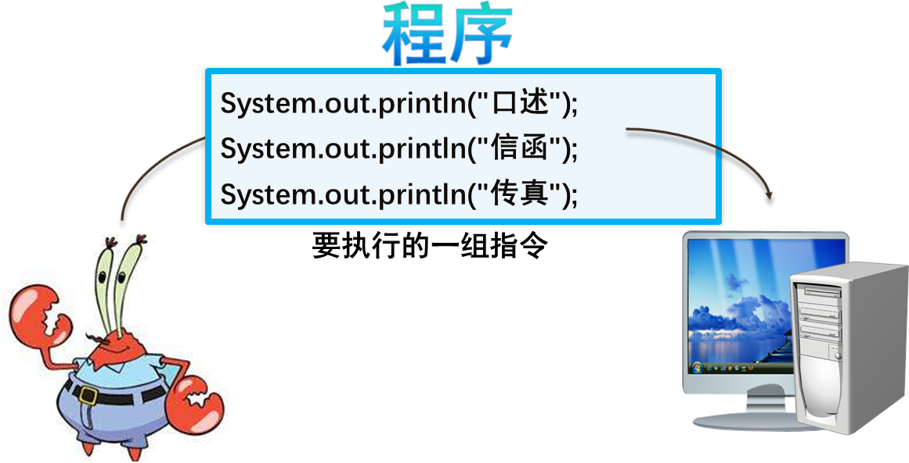
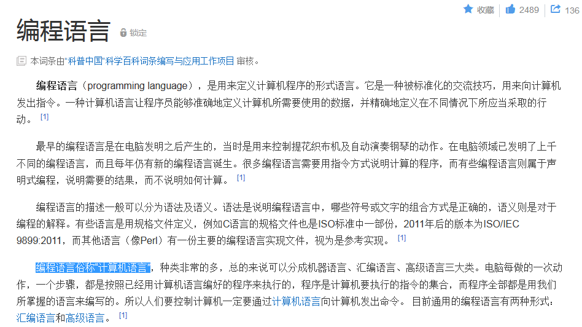
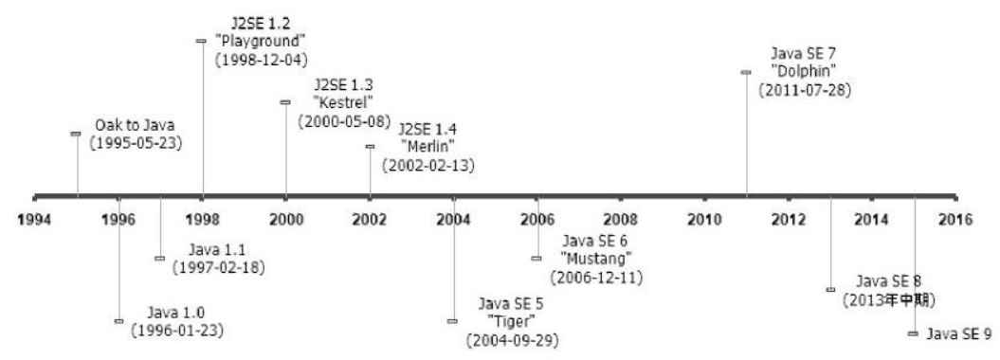
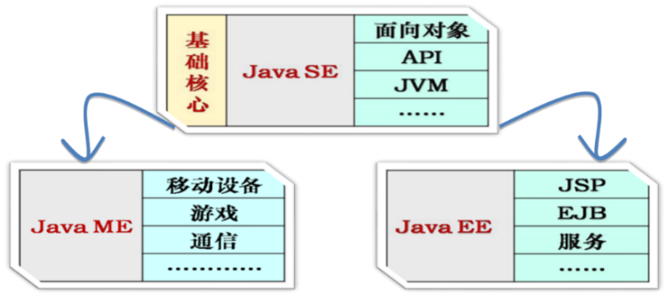

# Java基础快速入门

**C：** Hi，大家好！从本篇起，笔者将开辟一个新的专栏《Java基础快速入门》，这个专栏初期将涵盖 Java 语法、Java OOP、Java 高级特性三大部分。

当然了，此类教程在网络上不胜枚举，笔者在以前也是比较推荐大家去看谁谁谁的什么什么文章，但后来发现，这些知识是散布在网络间的，所以分散是第一个大问题；而且由于时间和作者等因素，有些内容至今还没有得到更新，这就导致一个知识的滞后性。

所以，笔者再开辟此专栏的目的，就是为了继续做好知识更新延续和传播，未来对这些内容还会继续编辑更新，仅仅希望能让后辈在学习 Java 语言的路上可以走的顺畅一些，也可以在前期少走一些弯路。

<!-- more -->

## 程序概述

好了，言归正传。从看到本篇的那一刻起，你就已经推开了 IT 编程的大门。自此，程序一词或将改变你未来的人生轨迹。未来的你，按键行云流水，脑内 CPU 高速运转，屏幕切换间，高可用、高扩展、高安全性的” 完美”程序，将由你所著。[[未来的你](http://www.acfun.cn/v/ac4552801)]

首先我们来看看程序的概念，程序在现世纪存在两种含义，即生活中的程序和计算机中的程序。

### 生活中程序

**生活中的程序：** 我们去银行办理业务或者在学校时因事请假再或者在工作中去办理报销，这些场景我们都不陌生。我们一遍一遍，一步一步的执行着所谓的流程和手续（套路），这就是生活中的程序。

### 计算机中的程序

在本世纪的今天，现实生活中的程序你可能已经把它换了个称呼，比如：流程或者手续。而程序这个概念，更多的时候已经被你安放到了手机上的APP，或者计算机上的QQ等方面。它们的确是程序，是由我们未来的同行，前辈所创造编写，**编写这些程序的过程，就是所谓的编程** 。

::: tip 笔者说
软件不是程序，软件是比应用程序更大的概念，**软件是程序、数据及相关文档的完整集合** 。可延伸阅读张海藩和吕云翔所著的《软件工程 第4版》
:::

但是如果单单这么理解程序，可就有点小儿科了。下面的[ 百度百科 ]，解释的还挺不错！程序其实是一个**指令** 的集合。

**何为指令呢？** 比方说：我是一位老板（目前不是），我有个女秘书（目前没有），每天我的行程安排或者一些繁琐的事项都交给了我秘书去做，我告诉秘书去帮我邀约一位客人，她就如是去做了。我告诉秘书去帮我通知一下部门要开会了，她也会如是去通知。**这个比方里老板所告诉秘书的一件件事就是一个个指令** ，而秘书就是接收指令然后去执行的人。

换到计算机世界的概念，我们被称为**程序员/码农** ，如果想让计算机这些秘书去执行一些操作，例如在屏幕上输出一些内容或者自动绘制一个小猪佩奇图像等，就需要去给计算机下达指令。**学习编程就是在学习给计算机秘书下达指令的过程而已。** 

### 程序和程序的关系

从上面我们理解了程序的两种含义，它们之间是否存在什么关系呢？其实计算机中的程序绝大多数都是因为现实中的某些流程/程序，很是麻烦，耗时或者产生一些资源的浪费（纸张），所以在有了计算机帮助之后，我们人类就将现实生活中的这些程序，以计算机中的程序表现出来了。**例如：** 在线挂号，在线购物，在线选课、OA系统等。

**一句话可以阐述这个关系：** 我们编程就是将现实生活中的业务程序移植到计算机中，以计算机指令的形式表现出来。

## 编程语言概述

了解完程序的概念，那这些程序指令我们是怎么告诉计算机的？口头告诉？脑电波交流？显然不是，那我们写自然语言来告诉计算机要做什么？不好意思的是，计算机并不能看懂，它只能看懂二进制（0 1这种数制）。**早期的计算机从业者就是在敲打0 1来告诉计算机需要做什么，但是对于我们人类来讲，这一堆0110阅读起来太难了，所以后期的发展中，我们用自然语言定义了一些特殊的语法，再通过一个”翻译官”(编译器)帮我们翻译给计算机看，这样就能实现计算机来执行我们的指令，而且我们自己也能看懂自己写的是什么。**  上述提到的特殊语法就是编程语言，也被称为计算机语言。

### 主流的编程语言

编程语言太多了，怎么定义语法的都有。这也很正常，就好像当今世界，自然语言都千奇百怪呢。所以我们不需要去过多的关注偏门的”小语种”，只需要去关注一下当今IT编程领域的主角们即可。[ 参见[TIOBE ](https://www.tiobe.com/tiobe-index/)]

下图是知名排行榜的统计数据，类似的网站有PYPL等。TIOBE排行榜是根据互联网上有经验的程序员、课程和第三方厂商的数量，并使用搜索引擎（如Google、Bing、Yahoo!）以及Wikipedia、Amazon、YouTube统计出排名数据，只是反映某个编程语言的热门程度，并不能说明一门编程语言好不好，或者一门语言所编写的代码数量多少。

::: tip 笔者说
在笔者看来，数据还是能说明一些语言的好坏或流行度的。截止目前，即使谦虚一些，我们要学习的 Java（爪哇/国内音译加哇，扎哇），它仍然是最热门的编程语言之一。即便在网络上有一些人每天都在喊着不要学 Java，要学 Python，学 C，学 PHP，甚至还听过 PHP 是最好的语言，这种引战言论。  

事实上呢？哪有什么完美的编程语言？只不过是不同的场景，谁更适合而已。**而且处于当今时代的我们，只会一种编程语言已经无法适应快速迭代的互联网应用和企业需要了（全栈）。所以不学哪种编程语言本身就是个”伪命题”** 。   

尤其对于刚踏入编程领域的小伙伴们来讲，笔者个人认为，Java 是一门极其合适的入门和谋生语言！它在理解难度，语法规范，性能，流传广度、社区支持，企业需要和热度等方面都属于领先地位。稍后笔者就给你详细讲讲它的来历和能力。
:::

## Java的前世今生

### Java的诞生

Java是SUN Microsystems（国内译为升阳公司）于1995年推出的高级编程语言。下图是Java的共同创始人之一：詹姆斯·高斯林James Gosling（被誉为Java之父）。2009年，SUN公司被Oracle并购，高斯林离职。截止目前，高斯林加入了亚马逊AWS工作。

下图是 Java 的 Logo（一杯热气腾腾的咖啡，有传言Java也是由于大佬们爱喝印尼爪哇岛的咖啡而得名）。不过这两缕蒸汽是多么像大佬们头上稀疏的秀发。

::: tip 《深入理解Java虚拟机》
1991年4月，由James Gosling博士领导的绿色计划（Green Project）开始启动，此计划的目的是开发一种能够在各种消费性电子产品（如机顶盒、冰箱、收音机等）上运行的程序架构。这个计划的产品就是Java语言的前身：Oak（橡树）。Oak当时在消费品市场上并不算成功，但随着1995年互联网潮流的兴起，Oak迅速找到了最适合自己发展的市场定位并蜕变成为Java语言。[1]
:::

### Java的发展

下图是Java的发展过程，重点关注一下1995年，1998年，2009年和2013年中期即可，了解下它的历史，才能让我们更好的与它"对话和结伴"。

::: tip 《深入理解Java虚拟机》
1995年5月23日，**Oak语言改名为Java** ，并且在SunWorld大会上正式发布Java 1.0版本。Java语言第一次提出了“**Write Once,Run Anywhere** ”的口号。  

1996年1月23日，JDK 1.0发布，Java语言有了第一个正式版本的运行环境。JDK 1.0提供了一个纯解释执行的Java虚拟机实现（Sun Classic VM）。JDK 1.0版本的代表技术包括：Java虚拟机、Applet、AWT等。  

1998年12月4日，JDK迎来了一个里程碑式的版本JDK 1.2，工程代号为Playground（竞技场），Sun在这个版本中把Java技术体系拆分为3个方向，分别是面向桌面应用开发的**J2SE** （Java 2 Platform,Standard Edition）、面向企业级开发的**J2EE** （Java 2 Platform,Enterprise Edition）和面向手机等移动终端开发的**J2ME** （Java 2 Platform,Micro Edition）。在这个版本中出现的代表性技术非常多，如EJB、Java Plug-in、Java IDL、Swing等，并且这个版本中Java虚拟机第一次内置了JIT（Just In Time）编译器（JDK 1.2中曾并存过3个虚拟机，Classic VM、HotSpot VM和Exact VM，其中Exact VM只在Solaris平台出现过；后面两个虚拟机都是内置JIT编译器的，而之前版本所带的Classic VM只能以外挂的形式使用JIT编译器）。  

1999年4月27日，**HotSpot** 虚拟机发布，HotSpot最初由一家名为“Longview Technologies”的小公司开发，因为HotSpot的优异表现，这家公司在1997年被Sun公司收购了。HotSpot虚拟机发布时是作为JDK 1.2的附加程序提供的，**后来它成为了JDK 1.3及之后所有版本的Sun JDK的默认虚拟机。**   

2009年2月19日，工程代号为Dolphin（海豚）的JDK 1.7完成了其第一个里程碑版本。根据JDK 1.7的功能规划，一共设置了10个里程碑。最后一个里程碑版本原计划于2010年9月9日结束，但由于各种原因，JDK 1.7最终无法按计划完成。在JDK 1.7开发期间，Sun公司由于相继在技术竞争和商业竞争中都陷入泥潭，公司的股票市值跌至仅有高峰时期的3%，已无力推动JDK 1.7的研发工作按正常计划进行。为了尽快结束JDK 1.7长期“跳票”的问题，**Oracle公司收购Sun公司** 后不久便宣布将实行“B计划”，大幅裁剪了JDK 1.7预定目标，以便保证JDK 1.7的正式版能够于2011年7月28日准时发布。[1]
:::

::: tip 笔者说
2017年11月，**Oracle（甲骨文）将Java EE（Java Enterprise Edition）移交给** Eclipse基金会，2018年3月份Eclipse将其更名为Jakarta EE。
:::

### Java的能力

从1998年的1.2版本开始，Java出现了3个方向版本，上面笔者也给你摘了一部分周老师的书籍内容。这三个版本分别是：**面向桌面应用开发的J2SE（Java 2 Platform,Standard Edition）、面向企业级开发的J2EE（Java 2 Platform,Enterprise Edition）和面向手机等移动终端开发的J2ME（Java 2 Platform,Micro Edition）** 。

 Java SE是基础核心，Java ME和Java EE是核心外的两个分支。无论是走Java ME还是Java EE都需要学习Java SE，我们系列课程的前三小阶段就是在学习Java SE基础。另外以后我们主要从事的分支就是Java EE，典型的产品就是天猫、京东等大型分布式应用。再进阶之后我们还可以进入热门的大数据领域，国内现在比较知名的大数据框架Hadoop就是Java语言编写的，而且现在国内做大数据的人才很多都是由原Java工程师进阶过去的。

还有非常重要的一点，**Java程序是跨平台的** ，即Java程序可以运行在任何平台上，不需要做不同系统平台的兼容适配。 **“write once , run anywhere.”** ，稍后我们编写完第一个Java程序后会介绍一下这句口号及原理。

::: tip 笔者说
1. 因为windows的普及性，在桌面程序开发领域，微软的C#语言更具有优势，开发游戏方面C和C++性能和渲染上也更有优势，Java几乎没有市场。
2. Java ME已经凉凉，被Android等抢占了市场，不知道你有没有用过诺基亚等老式手机？还记得Java 2D游戏吗？
3. Android（Andorid不是编程语言）虽然在2017年Google将Kotlin正式列为官方支持开发语言，但Java目前仍是其主要开发语言，原因是Android的底层有大量的Java API(可延伸阅读Oracle与Google的官司大战)。
:::

::: tip 《深入理解Java虚拟机》
Java不仅仅是一门编程语言，还是一个由一系列计算机软件和规范形成的技术体系，这个技术体系提供了完整的用于软件开发和跨平台部署的支持环境，并**广泛应用于嵌入式系统、移动终端、企业服务器、大型机等各种场合** 。时至今日，Java技术体系已经吸引了900多万软件开发者，这是全球最大的软件开发团队。使用Java的设备多达几十亿台，其中包括11亿多台个人计算机、30亿部移动电话及其他手持设备、数量众多的智能卡，以及大量机顶盒、导航系统和其他设备。[1]
:::

## 参考文献

[1]周志明. 深入理解Java虚拟机[M]. 第3版. 北京:机械工业出版社,2019
