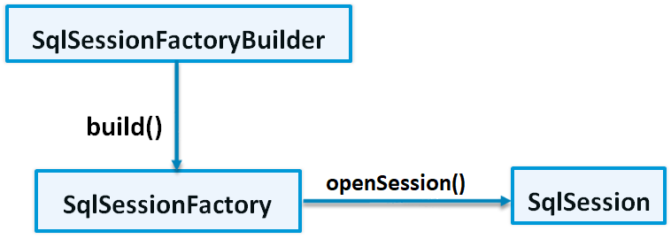

# 核心对象

## 前言

**C：** 在上一篇，笔者带大家对 MyBatis 做了一个快速入门，不知道你是否已经掌握了 MyBatis 的使用步骤呢？本篇，笔者将继续带你学习 MyBatis，掌握对上篇中三个核心对象的概念理解和使用。

在 API 使用层面，MyBatis 的核心类型有三个，分别是：SqlSessionFactoryBuilder、SqlSessionFactory、SqlSession。



## SqlSessionFactoryBuilder

SqlSessionFactoryBuilder 是 MyBatis 中应用构建者模式的一个类，它的作用就是用来 **读取 MyBatis 的核心配置文件信息，然后来构建一个 SqlSessionFactory 对象** 。

对于 SqlSessionFactoryBuilder 这个类，使用完就没有什么价值了，所以它的生命周期只存在于方法体内即可，也就是作为一个局部变量存在。

**以下是它的使用方式：** 

```java
// Resources 类是 MyBatis 中的一个资源加载工具类
// 1.从 classpath 下将 MyBatis 核心配置文件内容加载为一个输入流对象
InputStream is = Resources.getResourceAsStream("mybatis-config.xml"); 　　
// 2.构建 SqlSessionFactory 对象
SqlSessionFactory sqlSessionFactory = new SqlSessionFactoryBuilder().build(is);
```

**以下是它的常用方法：** 

- build(InputStream inputStream) : SqlSessionFactory 通过字节输入流构建
- build(Reader reader) : SqlSessionFactory  通过字符输入流构建
- build(Configuration config) : SqlSessionFactory  通过Configuration构建
- ....

::: tip 笔者说
因为 SqlSessionFactory 对象构建需要的配置参数很多，且不能保证每个参数都是正确的或者不能一次性得到构建所需的所有参数（有些参数是初始化时需要的，如数据源配置，延迟加载配置，事务配置等，有些是框架运行过程中需要的，如SQL映射等[1]），所以不能采用简单的 new 方式来创建对象。
:::

## SqlSessionFactory

SqlSessionFactory 对象比较重要，它的作用是 **创建 SqlSession 对象** 。

**以下是它的常用方法：** 

- openSession() : SqlSession  获取 SqlSession对象

  该方法是我们最常用的方法，同时也是开启事务处理的（参见下方源码）

- openSession(boolean autoCommit) : SqlSession 获取SqlSession对象，自行指定是否开启事务

  autoCommit 参数是用来指定是否开启自动提交的

  如果 autoCommit 的值为 true，代表关闭事务处理。反之，代表开启事务处理。

```java
// DefaultSqlSessionFactory 是 SqlSessionFactory的实现类
public class DefaultSqlSessionFactory implements SqlSessionFactory {
    // ...
    @Override
    public SqlSession openSession() {
        return openSessionFromDataSource(configuration.getDefaultExecutorType(), null, false);
    }
    @Override
    public SqlSession openSession(boolean autoCommit) {
        return openSessionFromDataSource(configuration.getDefaultExecutorType(), null, autoCommit);
    }
    // ...
}
```

每一个 MyBatis 的应用程序都以一个 SqlSessionFactory 对象为核心。SqlSessionFactory 一旦被创建， **它的生命周期应该与应用的生命周期相同** ，所以在应用运行期间不要重复创建 SqlSessionFactory 对象。

为此，我们可以使用单例模式来改造获取 SqlSessionFactory 对象的方式。

```java
/**
 * MyBatis 工具类
 * @author Charles7c
 */
public class MyBatisUtils {

    // 私有化构造函数
    private MyBatisUtils() {}
	
    // 静态对象
    private static volatile SqlSessionFactory SQL_SESSION_FACTORY = null;
	
    /**
     * 获取 SqlSessionFactory 对象
     * @return 单例的 SqlSessionFactory 对象
     * @throws IOException /
     */
    public static SqlSessionFactory getSqlSessionFactory() throws IOException {
        if (SQL_SESSION_FACTORY == null) {
            // 同步锁
            synchronized(MyBatisUtils.class) {
                // 双重检测机制
                if (SQL_SESSION_FACTORY == null) {
                    // 从 classpath 加载核心配置文件，构建 SqlSession 工厂对象
                    InputStream is = Resources.getResourceAsStream("mybatis-config.xml");
                    SQL_SESSION_FACTORY = new SqlSessionFactoryBuilder().build(is);
                }
            }
        }
        return SQL_SESSION_FACTORY;
    }

}
```

## SqlSession

SqlSession 是 MyBatis 执行持久化操作的关键对象，类似于 JDBC 中的 Connection。 **SqlSession 对象包含了执行 SQL 所需的所有方法** ，它的底层封装了 JDBC 连接，可以用 SqlSession 实例来直接执行被映射的 SQL 语句。

**以下是它的常用方法：** 

- insert(String statement, Object parameter) : int 增加操作
- delete(String statement, Object parameter) : int 删除操作
- update(String statement, Object parameter) : int 修改操作
- selectOne(String statement) : T 单个查询
- selectOne(String statement, Object parameter) : T 带参数单个查询
- selectList(String statement) : List\<E> 集合查询
- selectList(String statement, Object parameter) : List\<E> 带参数集合查询
- commit() : void 提交事务
- rollback() : void 回滚事务
- getMapper(Class\<T> type) : T 获取Mapper接口（Mapper接口开发）
- ...

每个线程都应该有它自己的 SqlSession 实例， SqlSession 的实例不是线程安全的，因此是不能被共享的，所以它的最佳的作用域是请求或方法作用域。绝对不能将 SqlSession 实例的引用放在一个类的静态域，甚至一个类的实例变量也不行。也绝不能将 SqlSession 实例的引用放在任何类型的托管作用域中，比如 Servlet 框架中的HttpSession。如果你现在正在使用一种 Web 框架，考虑将 SqlSession 放在一个和 HTTP 请求相似的作用域中。          换句话说，每次收到 HTTP 请求，就可以打开一个 SqlSession，返回一个响应后，就关闭它。[2]  **使用完 SqlSeesion 之后一定记得关闭，可以采用 finally 块或 try-with-resources** 。在 SqlSession 里可以执行多次 SQL 语句，但一旦关闭了 SqlSession 就需要重新创建。

结合 SqlSessionFactory 的获取方式改造，下方是在 MyBatisUtils 工具类中又增加了 SqlSession 的获取方式改造。

```java
/**
 * 获取 SqlSession 对象（开启事务处理）
 * @return SqlSession 对象
 * @throws IOException /
 */
public static SqlSession openSession() throws IOException {
    return getSqlSessionFactory().openSession();
}
```

## 参考文献

[1]哲雪君!. 第五篇 mybatis的运行原理（2）：构建者模式， SqlSessionFactoryBuilder类解析[EB/OL]. https://www.cnblogs.com/zhexuejun/p/11285206.html. 2019-08-14

[2]MyBatis官网. MyBatis 入门 | 作用域（Scope）和生命周期[EB/OL]. https://mybatis.org/mybatis-3/zh/getting-started.html. 2020-12-26

## 后记

到此为止，笔者就介绍完了在使用 MyBatis 时，所遇到的三个核心对象。同样经过上述对这些核心对象使用的改造后，我们也看一下到底它优化到了什么程度，开开眼吧。

```java
@Test
void testSelectList() throws IOException {
	
    // 获取SqlSession对象
    try (SqlSession sqlSession = MyBatisUtils.openSession()){

        // 执行SQL语句
        List<User> userList = sqlSession.selectList("userMapper.selectList");
		
        // 遍历数据
        userList.forEach(System.out::println);
    } catch (Exception e) {
        e.printStackTrace();
    }
}
```

::: info 笔者说
对于技术的学习，笔者一贯遵循的步骤是：先用最最简单的 demo 让它跑起来，然后学学它的最最常用 API 和 配置让自己能用起来，最后熟练使用的基础上，在空闲时尝试阅读它的源码让自己能够洞彻它的运行机制，部分问题出现的原因，同时借鉴这些技术实现来提升自己的代码高度。
所以在笔者的文章中，前期基本都是小白文，仅仅穿插很少量的源码研究。当然等小白文更新多了，你们还依然喜欢，后期会不定时专门对部分技术的源码进行解析。
:::
