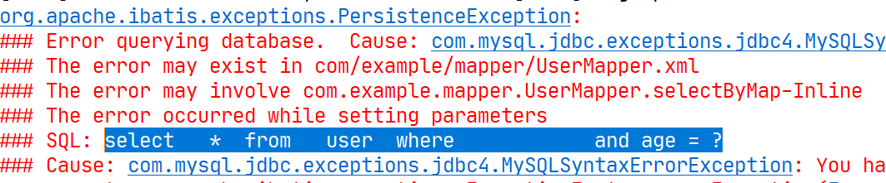

# 动态SQL

## 前言

**C：** 一晃，都来到了本系列的最后一篇了，第一篇[《快速入门》](./01-快速入门) 中，我们曾烦恼的问题们（见下方代码），被 MyBatis 的强大能力逐个逐个的瓦解了。

我们还剩下没有攻克的问题，只有 **动态参数拼接** 了。但凡使用 JDBC 做过持久层开发，你应该就能理解根据不同条件拼接 SQL 语句有多痛苦，例如：拼接时要确保不能忘记添加必要的空格，还要注意去掉列表最后一个列名的逗号[1]、解决多余的 and等。

本篇我们要学习 MyBatis 的另一个强大特性：动态 SQL 元素，利用它，我们可以彻底摆脱这种痛苦。

```java
// 假设BaseDao已经封装了通用CRUD操作，详情见笔者《BaseDao封装JDBC通用CRUD》
public class UserDaoImpl extends BaseDao implements UserDao {
    
    // 根据条件查询用户列表
    @Override
    public List<User> findByMap(Map<String, Object> params) throws Exception {
        // 动态拼接SQL语句
        StringBuffer sqlBuffer = new StringBuffer();
        // 动态拼接SQL占位符参数
        List<Object> paramsList = new ArrayList<>();
		
        sqlBuffer.append(" select ");
        sqlBuffer.append("   * ");
        sqlBuffer.append(" from ");
        sqlBuffer.append("   user ");
        sqlBuffer.append(" where 1 = 1 ");
		
        // 根据用户名模糊查询
        Object name = params.get("name");
        if (EmptyUtils.isNotEmpty(name)) {
            sqlBuffer.append(" and name like CONCAT('%',?,'%') ");
            paramsList.add(name);
        }
		
        // 根据年龄查询
        Integer age = (Integer) params.get("age");
        if (EmptyUtils.isNotEmpty(age)) {
            sqlBuffer.append(" and age = ? ");
            paramsList.add(age);
        }
		
        return this.selectList(sqlBuffer.toString(), paramsList.toArray(), User.class);
    }
    
    // 保存用户
    @Override
    public int save(User user) throws Exception {
        StringBuffer sqlBuffer = new StringBuffer();
        
        sqlBuffer.append(" insert into user ");
        sqlBuffer.append(" 	(name, age, email) ");
        sqlBuffer.append("  values(?, ?, ?) ");
		
        Object[] params = {user.getName(), user.getAge(), user.getEmail()};
        
        return this.insert(sqlBuffer.toString(), params);
    }
    
}
```

如果你之前用过 JSTL 或任何基于类 XML 语言的文本处理器，你对动态 SQL 元素可能会感觉似曾相识。在 MyBatis  之前的版本中，需要花时间了解大量的元素。借助功能强大的基于 OGNL 的表达式，MyBatis 3  替换了之前的大部分元素，大大精简了元素种类，现在要学习的元素种类比原来的一半还要少。[1]

- ***if*** 判断元素
- choose (when, otherwise) 判断元素
- **trim (where, set)** 自动去除多余组成元素
- *foreach* 迭代元素

上方这部分介绍，主要来自 MyBatis 官网，至于它怎么介（chui）绍（xu）自己我们不用过多关注，我们自己用了还好用才是真的。

## if元素

SQL 映射文件篇的时候，我们实现过一个需求：根据用户名和年龄查询用户列表。关键实现部分如下：

```java
public interface UserMapper {

    /**
     * 根据用户名和年龄查询
     * @param params 条件参数
     * @return 用户列表
     */
    List<User> selectByMap(Map<String, Object> params);

}
```

```xml
<!-- List<User> selectByMap(Map<String, Object> params); -->
<!-- 在 parameterType 为 Map 集合时, #{map的键名} 可以获取集合的值 -->
<select id="selectByMap" parameterType="map" resultType="User">
    select
        * 
    from
        user 
    where 
        name like concat('%', #{name}, '%')
        and age = #{age}
</select>
```

如果一切如下方的传值测试，那什么问题也不会发生。

```java
class TestMyBatis {
    
    @Test
    void testSelectByMap() throws IOException {
        // 获取SqlSession对象
        try (SqlSession sqlSession = MyBatisUtils.openSession()) {

            // 获取 Mapper 接口
            UserMapper userMapper = sqlSession.getMapper(UserMapper.class);
            // 执行 SQL
            Map<String, Object> params = new HashMap<>();
            params.put("name", "J");
            params.put("age", 20);
            List<User> userList = userMapper.selectByMap(params);

            // 遍历数据
            userList.forEach(System.out::println);
        } catch (Exception e) {
            e.printStackTrace();
        }
    }
    
}
```

但是往往我们在做类似的需求时，对条件一般是可选的，即：name 和 age 参数可以传递值也可以不传递值，那么当你如是做之后，结果呢？我们在 Map 集合中去除掉 age 这个参数值试试。

```java
// 执行
Map<String,Object> map = new HashMap<String, Object>();
map.put("name", "J");
List<User> userList = userMapper.selectByMap(params);
```

**控制台输出：** 


我们去除了 age 参数值，原本的设想是不再根据 age 列进行条件筛选，但是它还是处于生效状态，因为我们并没有添加 SQL 的条件判断， age = null 的结果显而易见是不存在的。

---

我们来使用 if 元素改造一下吧。

```xml
<!--
    if元素 用于条件判断
        test属性：利用关系和逻辑运算符编写条件，不需要用${}括起来
        注意：有些同学受到 JSTL 荼毒太深，就容易犯错 -->
<select id="selectByMap" parameterType="map" resultType="User">
    select
        *
    from
        user
    where
        name like concat('%', #{name},'%')
        <if test="age != null">
            and age = #{age}
        </if>
</select>
```

执行刚才的测试代码，此次就没有任何问题了。


::: tip 笔者说
if 元素可以说是日常开发用的最多的了，而且又简单，又好用。
:::

## where元素

有了 if 元素的加持，如果我们只是要进行 age 这一项条件查询，那就去掉 Map 集合中的 name 参数，这时候似乎只需要在 SQL 映射文件中也给 name 条件查询加上个判断即可。

```xml
<!-- 字符串判断可以多加一个 != '' 空字符串的判断 -->
<select id="selectByMap" parameterType="map" resultType="User">
    select
        *
    from
        user
    where
        <if test="name != null and name != ''">
            name like concat('%', #{name},'%')
        </if>
        <if test="age != null">
            and age = #{age}
        </if>
</select>
```

```java
// 执行
Map<String,Object> map = new HashMap<String, Object>();
map.put("age", 20);
List<User> userList = userMapper.selectByMap(map);		
```

但结果并不是如此，当测试执行后，控制台报错了。



但实际上，你就算不运行，你好好看看上方的 SQL 部分，就可以看出问题，它一共有可能出现4种情况。

1. name 和 age 都传递了值，那一切都正常执行
2. 只传递了 name 值，那么也正常
3. *如果只传递了 age 值，那么就会多余一个 and 出现* 
4. *如果都没有传值，那么就会多余一个 where 出现* 

在之前 JDBC 开发中，我们的解决方法是添加一个 `where 1 = 1` 的恒等式。

```xml
<select id="selectByMap" parameterType="map" resultType="User">
    select
        *
    from
        user
    where
        1 = 1
        <if test="name != null and name != ''">
            and name like concat('%', #{name},'%')
        </if>
        <if test="age != null">
            and age = #{age}
        </if>
</select>
```

在 MyBatis 中，准备了一个专门的元素用来解决此类问题，比添加额外的 `1=1` 语句更简单。

```xml
<!-- 
    where 元素在执行时，会智能添加一个 where 查询关键字
    并且结合着 if 元素，它会自动【去除】每个 if 段内前面【多余的 and 或 or】 关键字（不会去除后面的）
 -->
<select id="selectByMap" parameterType="map" resultType="User">
    select
        *
    from
        user
    <where>
        <if test="name != null and name != ''">
            name like concat('%', #{name},'%')
        </if>
        <if test="age != null">
            and age = #{age}
        </if>
    </where>
</select>
```

## set元素

set 元素，和 where 元素一样也是结合 if 元素用于去除多余内容的。顾名思义，它是和 update 语句的 set 部分有关的。

我们来做一个修改示例：

```java
public interface UserMapper {

    /**
     * 修改用户信息
     * @param user 用户信息
     * @return 影响行数
     */
    int update(User user);

}
```

```xml
<!-- int update(User user); -->
<update id="update" parameterType="User">
    update
        user
    set
        name = #{name},
        age = #{age},
        email = #{email},
        roleId = #{roleId}
    where
        id = #{id}
</update>
```

```java
class TestMyBatis {
    @Test
    void testUpdate1() {
        // 获取SqlSession
        try (SqlSession sqlSession = MyBatisUtils.openSession()) {
			
            // 获取Mapper
            UserMapper userMapper = sqlSession.getMapper(UserMapper.class);
			
            // 只想修改1号用户的名字
            User user = new User();
            user.setName("Charles");
            user.setId(1L);
            // 执行
            int rows = userMapper.update(user);
            System.out.println("影响行数为：" + rows);
			
            // 提交事务
            sqlSession.commit();
        } catch (Exception e) {
            e.printStackTrace();
        }
    }

}
```

执行测试后，本来我们只想修改用户名，结果却是将所有的列都清空了。


所以它也需要加上 if 元素来判断是否需要修改。

```xml
<update id="update" parameterType="User">
    update
        user
    set
        <if test="name != null">
            name = #{name},
        </if>
        <if test="age != null">
            age = #{age},
        </if>
        <if test="email != null">
            email = #{email},
        </if>
        <if test="roleId != null">
            roleId = #{roleId}
        </if>
    where
        id = #{id}
</update>
```

但如果仅仅这样，当最后一个条件判断不成立时，那么前面的内容只要有一个传了值就会在结尾出现多余 `,` 的问题，使用 set 元素可以很容易解决该类问题。

```xml
<update id="update" parameterType="User">
    update
        user
    <set>
        <if test="name != null">
            name = #{name},
        </if>
        <if test="age != null">
            age = #{age},
        </if>
        <if test="nemailame != null">
            email = #{email},
        </if>
        <if test="roleId != null">
            roleId = #{roleId}
        </if>
    </set>
    where
        id = #{id}
</update>
```

set 元素可以智能添加一个 set 关键字，并且可以去除 if 段后面多余的 `,` 号。

## trim元素

当我们需要灵活变更自动去除的内容时，where 和 set 就不合适了，它们是死板的，只能去除那几样。

trim 元素，看名字就知道是用来去除东西，下面我们用 trim 元素分别实现一下刚才的 where 元素和 set元素。

实现 where 元素。

```xml
<!-- 
    trim元素，用于去除多余内容
        prefix：为整段内容添加一个前缀
        prefixOverrides：自动去除每个 if 段的多余前缀内容
 -->
<select id="selectByMap" parameterType="map" resultType="User">
    select
        *
    from
        user
    <trim prefix="where" prefixOverrides="and | or">
        <if test="name != null and name != ''">
            name like concat('%', #{name},'%')
        </if>
        <if test="age != null">
            and age = #{age}
        </if>
    </trim>
</select>
```

实现 set 元素。

```xml
<!-- 
    trim元素，用于去除多余内容
        suffix：为整段内容添加一个后缀
        suffixOverrides：去除每个if段后多余的内容
 -->
<update id="update" parameterType="User">
    update
        user
    <trim prefix="set" suffix="where id = #{id}" suffixOverrides=",">
        <if test="name != null">
            name = #{name},
        </if>
        <if test="age != null">
            age = #{age},
        </if>
        <if test="email != null">
            email = #{email},
        </if>
        <if test="roleId != null">
            roleId = #{roleId}
        </if>
    </trim>
</update>
```

## foreach元素

上方的四个元素，可以说在 SQL 映射文件中，用的最多，你把它们掌握了一般情况够用了。

但是有时候我们有一些特殊的需求，例如：下方的案例，根据角色 id 的集合来查询用户列表。

```java
public interface UserMapper {

    /**
     * 根据角色集合查询用户
     * @param roleIds 角色集合
     * @return 用户列表
     */
    List<User> selectByRoleList(List<Long> roleIds);
    
}
```

```xml
<!-- 
    foreach 迭代元素
        collection：
            可选值为 list（List集合）、array（数组）、Map集合的键（对应的值需要为List或Array）
        item：遍历出来的每一项
        open：在整段前添加的内容
        separator：遍历出来的每一项都添加什么分隔符
        close：在整段后添加的内容
-->
<select id="selectByRoleList" parameterType="long" resultType="User">
    select
        *
    from
        user
    where
        roleId in 
        <foreach collection="list" item="id" open="(" separator="," close=")">
            #{id}
        </foreach>
</select>
```

测试一下：

```java
class TestMyBatis {

    @Test
    void selectByRoleList() {
        // 获取SqlSession
        try (SqlSession sqlSession = MyBatisUtils.openSession()) {
			
            // 获取Mapper
            UserMapper userMapper = sqlSession.getMapper(UserMapper.class);
			
            // 执行
            List<Long> roleIds = Arrays.asList(1L, 2L);
            List<User> userList = userMapper.selectByRoleList(roleIds);
			
            // 遍历
            userList.forEach(System.out::println);
        } catch (Exception e) {
            e.printStackTrace();
        }
    }
}
```

**控制台输出：** 

```sql
-- 输出的 SQL
select * from user where roleId in ( ? , ? )
```

```
User [id=2, name=JSON, age=20, email=Jack@126.com]
User [id=3, name=Tom, age=28, email=Tom@126.com]
User [id=4, name=Sandy, age=21, email=Sandy@126.com]
User [id=5, name=Billie, age=24, email=Billie@126.com]
User [id=8, name=PeiQi, age=18, email=PeiQi@126.com]
```

## choose元素

最后我们再介绍一个应用不算太多的元素：choose，它比较类似于在 Java 中的 switch 选择结构。

**案例需求：查询用户列表，如果参数 name 有值那就根据 name 模糊查询，否则参数 age 有值那就根据 age 查询， 如果都没值那就查询所有角色为1的用户。** 

```java
public interface UserMapper {

    /**
     * 查询用户列表
     * 	name有值时，根据名字做模糊查询
     * 	否则age有值时，根据年龄等值查询
     * 	都没值，查询角色Id为1的用户
     * @param user 查询条件
     * @return 用户列表
     */
    List<User> selectByUser(User user);

}
```

```xml
<select id="selectByUser" parameterType="User" resultType="User">
    select
        *
    from
        user
    <where>
        <choose>
            <when test="name != null and name != ''">
                name like concat('%', #{name},'%')
            </when>
            <when test="age != null">
                age = #{age}
            </when>
            <otherwise>
                roleId = 1
            </otherwise>
        </choose>
    </where>
</select>
```

测试一下，如果同时传了 name 和 age的值。

```java
@Test
void testSelectByUser() {
    try (SqlSession sqlSession = MyBatisUtils.openSession()){

        UserMapper userMapper = sqlSession.getMapper(UserMapper.class);

        User user = new User();
        user.setName("T");
        user.setAge(18);
        List<User> userList = userMapper.selectByUser(user);

        userList.forEach(System.out::println);
    } catch (Exception e) {
        e.printStackTrace();
    }
}
```

**控制台输出：** 

```sql
-- 输出的 SQL
select * from user WHERE name like concat('%', ?,'%')
```

测试一下，如果只传了 age 的值。

```java
@Test
void testSelectByUser() {
    try (SqlSession sqlSession = MyBatisUtils.openSession()){

        UserMapper userMapper = sqlSession.getMapper(UserMapper.class);

        User user = new User();
        user.setAge(18);
        List<User> userList = userMapper.selectByUser(user);

        userList.forEach(System.out::println);
    } catch (Exception e) {
        e.printStackTrace();
    }
}
```

**控制台输出：** 

```sql
-- 输出的 SQL
select * from user WHERE age = ?
```

测试一下，如果什么值都没传。

```java
@Test
void testSelectByUser() {
    try (SqlSession sqlSession = MyBatisUtils.openSession()){

        UserMapper userMapper = sqlSession.getMapper(UserMapper.class);

        List<User> userList = userMapper.selectByUser(null);

        userList.forEach(System.out::println);
    } catch (Exception e) {
        e.printStackTrace();
    }
}
```

**控制台输出：** 

```sql
-- 输出的 SQL
select * from user WHERE roleId = 1
```

::: tip 笔者说
效果很明显了，自上而下进行条件判断，只要其中一个满足，后面的条件就不再执行。这就是 switch 的机制。
::: 

## 参考文献

[1]MyBatis 官网. 动态 SQL[EB/OL]. https://mybatis.org/mybatis-3/zh/dynamic-sql.html. 2020-12-28

## 后记

《初识MyBatis》 系列到本篇就结束了，笔者的更文速度，你还能追的上吗？:smile:

其实这不过是因为笔者有存稿而已，否则哪那么快，每篇文章在最初时都花费了大量的时间，在存稿基础上再来发表又花费了不短时间，所以真没什么产出速度，大概比一些"临近太监的网文"的作者快点？

这个系列结束，不代表 MyBatis 系列就完全结束了，后续笔者会再次抽时间开放 MyBatis 新的系列 《MyBatis原理》，当然这可能需要一段时间，因为笔者最近在忙另一个系列。但愿那时候还在关注的你，依然保持有对 MyBatis 热爱、研究的心。:gift_heart:

::: info 笔者说
对于技术的学习，笔者一贯遵循的步骤是：先用最最简单的 demo 让它跑起来，然后学学它的最最常用 API 和 配置让自己能用起来，最后熟练使用的基础上，在空闲时尝试阅读它的源码让自己能够洞彻它的运行机制，部分问题出现的原因，同时借鉴这些技术实现来提升自己的代码高度。

所以在笔者的文章中，前期基本都是小白文，仅仅穿插很少量的源码研究。当然等小白文更新多了，你们还依然喜欢，后期会不定时专门对部分技术的源码进行解析。
:::
