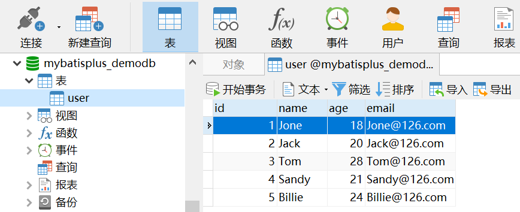
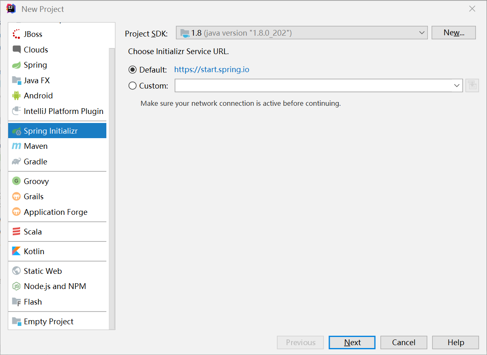
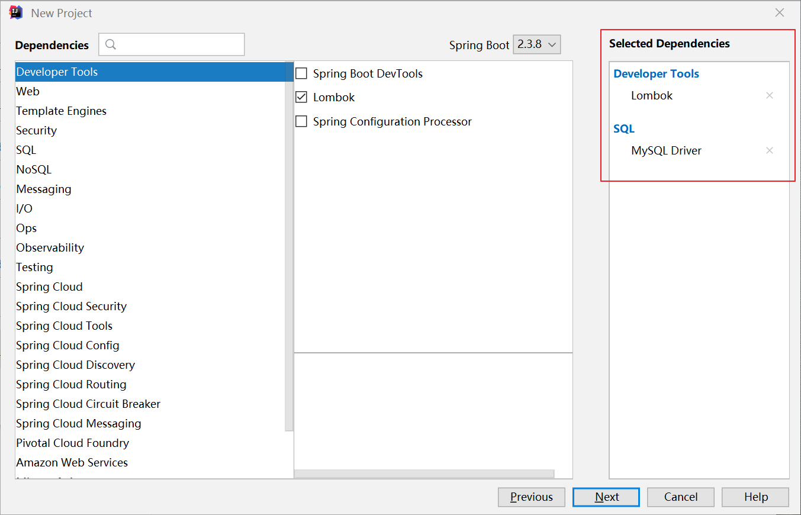
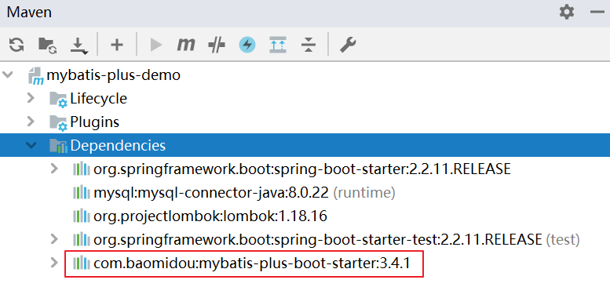

# 快速入门

## 前言

**C：** 在 Java Web 的日常开发中，风靡中日韩的持久层框架 MyBatis ，想必你不会陌生。如果你不认识它，那么本篇目前不适合你，请先学习 [《MyBatis快速入门》](/courses/mybatis/index.html) 后再过来。

MyBatis 框架，作为一款非常优秀的 **半自动的持久层ORM框架** 。它支持自定义 SQL、动态SQL、存储过程以及高级映射， **免除了几乎所有的 JDBC 代码以及设置参数和获取结果集的工作** 。

它的确很好，但是你也再看看下方代码。在 MyBatis 中，不同实体的基础数据操作几乎属于套模板一样。尤其是在项目搭建初期，要写一大堆的基础 CRUD。随着开发工作量及工作时间上升，这就又成了天下程序员苦之久矣的事儿。

```java
public interface UserMapper {
    // 增加
    int insert(User user);
    // 修改
    int update(User user);
    // 删除
    int deleteById(@Param("id") Long id);
    // 根据ID查询
    User selectById(@Param("id") Long id);
    // 根据条件查询总记录数
    Integer selectCount(Map<String, Object> params);
    // 根据条件查询列表
    List<User> selectByMap(Map<String, Object> params);
}
```

当然，MyBatis 官方在一开始就想到了这事儿，所以提供了一套代码生成器。其他还有一些第三方 IDE 插件也有类似功能，但都到今天这年头了，你看看最近的一篇 MyBatis 代码生成器讲解文章下的评论。


类似的评论在类似的文章中，不知凡几。我们自然是要跟随上技术时代的浪潮，做技术的 "弄潮儿"，接下来笔者会开启一个新的系列《MyBatis-Plus快速入门》，来讲解体验下这个人云亦云的 MyBatis Plus。


## 简介

::: tip 官方释义
[MyBatis-Plus](https://baomidou.com/)（简称 MP）是一个 [MyBatis](http://www.mybatis.org/mybatis-3/) 的增强工具， **在 MyBatis 的基础上只做增强不做改变** ，为简化开发、提高效率而生。[1]
:::


顾名思义，MyBatis Plus 是 MyBatis 的 Plus 版本，也就是升级版、增强版的意思。

::: tip 笔者说
由于名字较长，后面笔者会较多的叫它的简称：MP，注意是 MP 不是 MMP。
:::

## 特点

以 MP 的作者所言：MyBatis Plus 的愿景是成为 MyBatis 最好的搭档，就像魂斗罗中的 1P、2P，基友搭配，效率翻倍。[1]

看看下方总结的 MyBatis Plus 特点，有没有一些心动。

- **无侵入** ：只做增强不做改变，引入它不会对现有工程产生影响，如丝般顺滑
- **损耗小** ：启动即会自动注入基本 CRUD，性能基本无损耗，直接面向对象操作
- **强大的 CRUD 操作** ：内置通用 Mapper、通用 Service，仅仅通过少量配置即可实现单表大部分 CRUD 操作，更有强大的条件构造器，满足各类使用需求
- **支持 Lambda 形式调用** ：通过 Lambda 表达式，方便的编写各类查询条件，无需再担心字段写错
- **支持主键自动生成** ：支持多达 4 种主键策略（内含分布式唯一 ID 生成器 - Sequence），可自由配置，完美解决主键问题
- **支持 ActiveRecord 模式** ：支持 ActiveRecord 形式调用，实体类只需继承 Model 类即可进行强大的 CRUD 操作
- **支持自定义全局通用操作** ：支持全局通用方法注入（ Write once, use anywhere ）
- **内置代码生成器** ：采用代码或者 Maven 插件可快速生成 Mapper 、 Model 、 Service 、 Controller 层代码，支持模板引擎，更有超多自定义配置
- **内置分页插件** ：基于 MyBatis 物理分页，开发者无需关心具体操作，配置好插件之后，写分页等同于普通 List 查询
- **分页插件支持多种数据库** ：支持 MySQL、MariaDB、Oracle、DB2、H2、HSQL、SQLite、Postgre、SQLServer 等多种数据库
- **内置性能分析插件** ：可输出 SQL语句以及其执行时间，建议开发测试时启用该功能，能快速揪出慢查询
- **内置全局拦截插件** ：提供全表 delete 、 update 操作智能分析阻断，也可自定义拦截规则，预防误操作

## 使用步骤

看官方说的这么好，心动不如行动，赶快跟着笔者来体验一下吧。

我们将通过一个简单的 Demo 来体验 MP 的强大功能，在此之前，笔者假设你已经：

- 拥有 Java 开发环境以及相应 IDE（IDEA）
- 熟悉 MySQL 数据库
- 熟悉 Maven 工具
- 熟悉 Lombok 工具
- 熟悉 MyBatis 技术
- 熟悉 Spring Boot 技术

### 数据库准备

首先我们需要准备好一个数据库，并添加点测试数据。

下方是我们的测试数据：

| 主键 |  姓名  | 年龄 |      邮箱      |
| :--: | :----: | :--: | :------------: |
|  1   |  Jone  |  18  |  Jone@126.com  |
|  2   |  Jack  |  20  |  Jack@126.com  |
|  3   |  Tom   |  28  |  Tom@126.com   |
|  4   | Sandy  |  21  | Sandy@126.com  |
|  5   | Billie |  24  | Billie@126.com |

其对应的数据库 结构 脚本如下：

```sql
-- 创建并切换数据库
CREATE DATABASE mybatisplus_demodb;
USE mybatisplus_demodb;

-- 创建用户数据表
CREATE TABLE `user`  (
  `id` bigint(20) NOT NULL AUTO_INCREMENT COMMENT '主键ID',
  `name` varchar(30) CHARACTER SET utf8 COLLATE utf8_general_ci NULL DEFAULT NULL COMMENT '姓名',
  `age` int(11) NULL DEFAULT NULL COMMENT '年龄',
  `email` varchar(50) CHARACTER SET utf8 COLLATE utf8_general_ci NULL DEFAULT NULL COMMENT '邮箱',
  PRIMARY KEY (`id`) USING BTREE
) ENGINE = InnoDB AUTO_INCREMENT = 1 CHARACTER SET = utf8 COLLATE = utf8_general_ci COMMENT = '用户表' ROW_FORMAT = Compact;
```

其对应的数据库 数据 脚本如下：

```sql
-- 清空用户表数据
TRUNCATE TABLE user;

-- 向用户表插入测试数据
INSERT INTO `user` VALUES (1, 'Jone', 18, 'Jone@126.com');
INSERT INTO `user` VALUES (2, 'Jack', 20, 'Jack@126.com');
INSERT INTO `user` VALUES (3, 'Tom', 28, 'Tom@126.com');
INSERT INTO `user` VALUES (4, 'Sandy', 21, 'Sandy@126.com');
INSERT INTO `user` VALUES (5, 'Billie', 24, 'Billie@126.com');
```

依次执行完结构及数据脚本后，最终数据库效果如下：



### 创建项目

在有了 Spring Boot 之后，MyBatis 开发变得非常简单。作为 MyBatis 的升级版，毫无疑问，MP 的开发团队也为 Spring Boot 开发准备了一份 starter，这让我们开发一个 MP 项目变得非常 Easy。

我们使用 IntelliJ IDEA 中封装的 [Spring Initializer](https://start.spring.io/) 来快速初始化一个 Spring Boot 工程。



填写好 Maven 的 GAV 信息。


在项目构建选择依赖这一步的时候，直接选择好 Lombok 和 MySQL 驱动的依赖。



构建好的项目结构如下。


最后，我们需要调整下 Spring Boot 的版本，以及导入好 MP 的 starter 依赖。



::: tip 笔者说
为了方便使用本案例中的单元测试，建议采用 2.2.x 以上的 Spring Boot。
:::

```xml
<parent>
    <groupId>org.springframework.boot</groupId>
    <artifactId>spring-boot-starter-parent</artifactId>
    <!--
        Spring Boot已经做好了相应依赖版本的锁定工作。
        调整一下Spring Boot版本，Lombok和MySQL驱动的版本就会随之变动。
    -->
    <version>2.2.11.RELEASE</version>
    <relativePath/>
</parent>

<groupId>com.example</groupId>
<artifactId>mybatis-plus-demo</artifactId>
<version>0.0.1-SNAPSHOT</version>

<properties>
    <java.version>1.8</java.version>
</properties>

<dependencies>
    <!-- Spring Boot基础依赖 -->
    <dependency>
        <groupId>org.springframework.boot</groupId>
        <artifactId>spring-boot-starter</artifactId>
    </dependency>
    <!-- Spring Boot单元测试依赖 -->
    <dependency>
        <groupId>org.springframework.boot</groupId>
        <artifactId>spring-boot-starter-test</artifactId>
        <scope>test</scope>
    </dependency>
    
    <!-- Lombok依赖 -->
    <dependency>
        <groupId>org.projectlombok</groupId>
        <artifactId>lombok</artifactId>
        <optional>true</optional>
    </dependency>

    <!-- MySQL数据库驱动 -->
    <dependency>
        <groupId>mysql</groupId>
        <artifactId>mysql-connector-java</artifactId>
        <scope>runtime</scope>
    </dependency>
    
    <!-- MyBatis Plus依赖 -->
    <dependency>
        <groupId>com.baomidou</groupId>
        <artifactId>mybatis-plus-boot-starter</artifactId>
        <version>3.4.1</version>
    </dependency>
</dependencies>
```

::: warning 笔者说
引入 `MP` 依赖之后，就不要再引入 `MyBatis` 以及 `MyBatis-Spring` 这些依赖了，因为 MP 都包含好了。你再引入，还可能出现因版本差异导致的其他问题。
:::


### 创建POJO类

项目创建好后，按原来 MyBatis 的使用步骤，首先要根据数据库编写好 POJO 类。

```java
@Data
public class User {
    
    private Long id;
    private String name;
    private Integer age;
    private String email;

}
```

::: tip 笔者说
此处使用了 Lombok 来简化 getter/setter 等代码，如果不会用，可以直接自己手写 getter/setter 等代码。
:::

### 创建Mapper接口

有了 POJO 类之后，原来的 MyBatis 中，下一步自然就要写 Mapper 接口，写 SQL 映射文件了。但是现在你只需要写好 Mapper 接口，然后继承一个由 MP 所提供的 `BaseMapper` 接口即可。

```java
// 注：给 BaseMapper 指定好泛型，它里面的 CRUD 需要使用泛型来确定具体操作数据类型
public interface UserMapper extends BaseMapper<User> {

}
```

::: tip 笔者说
在 `BaseMapper` 中封装有大量的基础 CRUD 操作，这一点就直接解决了我们前言中所提到的需求。
:::

### 添加配置

写好核心部分代码后，MP 需要像 MyBatis 整合 Spring Boot 一样，在 `application.yml` 配置文件中添加上数据源配置及一些 MyBatis 自定义配置。

```yaml
spring:
  # 数据源配置
  datasource:
    driver-class-name: com.mysql.cj.jdbc.Driver
    url: jdbc:mysql:///mybatisplus_demodb?serverTimezone=Asia/Shanghai&useUnicode=true&characterEncoding=utf8
    username: root
    password: root
mybatis-plus:
  configuration:
    # 控制台打印SQL日志
    log-impl: org.apache.ibatis.logging.stdout.StdOutImpl
```

::: tip 笔者说
一般我们还会给 MyBatis 添加些自定义配置：类型别名包扫描，指定 Mapper 映射文件地址等。这回这些配置都被 MP 整合在一起了，有的还拥有了默认值。
例如：原来指定 Mapper 映射文件地址需要用：`mybatis.mapper-locations` ，现在 MP 中需要用：`mybatis-plus.mapper-locations`，MP 还给它准备了默认值：`classpath*:/mapper/**/*.xml`。 
这意味着啥？意味着，这种配置以后如果没有额外指定，就不需要我们再配置它啦。
:::


最后， MP 同样也需要在 Spring Boot 启动类中，添加 `@MapperScan` 注解来指定 Mapper 接口扫描包。

```java
@SpringBootApplication
@MapperScan("com.example.mapper")
public class MybatisPlusDemoApplication {

    public static void main(String[] args) {
        SpringApplication.run(QuickStartApplication.class, args);
    }

}
```

### 测试

终于搞定了，我们再去测试类中编写一个测试用例，去测试一下效果就完事儿了。

**测试代码：** 

```java
@SpringBootTest
class MybatisPlusDemoApplicationTests {

    @Autowired
    private UserMapper userMapper;

    @Test
    void testSelectList() {
        // 查询用户列表
        List<User> userList = userMapper.selectList(null);
        // 遍历用户列表
        userList.forEach(System.out::println);
    }

}
```


**控制台输出：** 

```sql
==>  Preparing: SELECT id,name,age,email FROM user
==> Parameters: 
<==    Columns: id, name, age, email
<==        Row: 1, Jone, 18, Jone@126.com
<==        Row: 2, Jack, 20, Jack@126.com
<==        Row: 3, Tom, 28, Tom@126.com
<==        Row: 4, Sandy, 21, Sandy@126.com
<==        Row: 5, Billie, 24, Billie@126.com
<==      Total: 5
```

```
User(id=1, name=Jone, age=18, email=Jone@126.com)
User(id=2, name=Jack, age=20, email=Jack@126.com)
User(id=3, name=Tom, age=28, email=Tom@126.com)
User(id=4, name=Sandy, age=21, email=Sandy@126.com)
User(id=5, name=Billie, age=24, email=Billie@126.com)
```

::: tip 笔者说
你在编写单元测试时，可能会看到如下报错。别担心这不是什么要紧的事儿，不影响你运行，也不影响你开法拉利。
如果你看不惯它，那就去 UserMapper 接口上加一个 `@Repository` 或 `@Component` 注解，这问题就迎刃而解了。
:::


## 参考文献

[1]MyBatis Plus 官网. 指南[EB/OL]. https://baomidou.com/guide/. 2021-01-16

## 后记

**C：** 好了，MP 的快速入门就到这儿结束了，是不是快的都让你觉得在做梦？通过以上几个简单的步骤，我们就拥有了一个具有通用 CRUD 操作功能的 Mapper 接口，甚至连 XML 文件都不用编写！

当然，若是它们还不够你用，或是你需要写一些复杂的数据操作，继续按照 MyBatis 原来的玩法去写就可以了，一点不影响。

 `MyBatis-Plus` 的强大远不止如此，想要详细了解 MyBatis-Plus 的强大功能，那就继续查看笔者该系列的下一篇吧！

**另外，提醒一下，本系列的编写思路，就是基于官网而来，甚至有同学看完官网会觉得笔者多余了。但笔者一贯以小白文著称，学起来不吃力，学重点，比官网更细致，是笔者本系列的目的。所以等等再 "恶评" 吧。** 

::: info 笔者说
对于技术的学习，笔者一贯遵循的步骤是：先用最最简单的 demo 让它跑起来，然后学学它的最最常用 API 和 配置让自己能用起来，最后熟练使用的基础上，在空闲时尝试阅读它的源码让自己能够洞彻它的运行机制，部分问题出现的原因，同时借鉴这些技术实现来提升自己的代码高度。

所以在笔者的文章中，前期基本都是小白文，仅仅穿插很少量的源码研究。当然等小白文更新多了，你们还依然喜欢，后期会不定时专门对部分技术的源码进行解析。
:::

