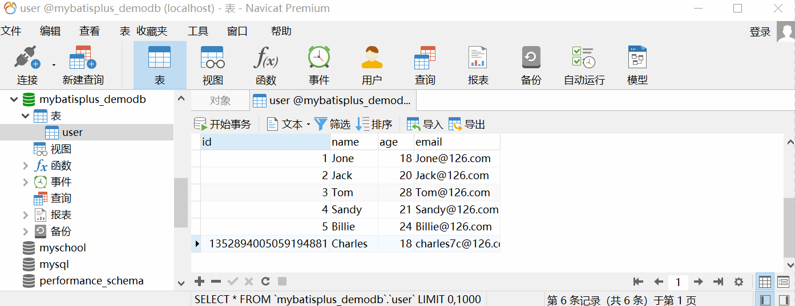
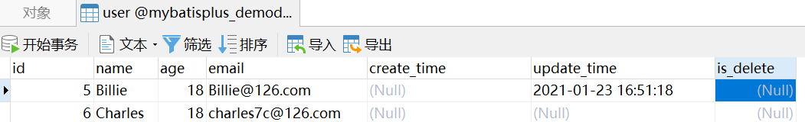
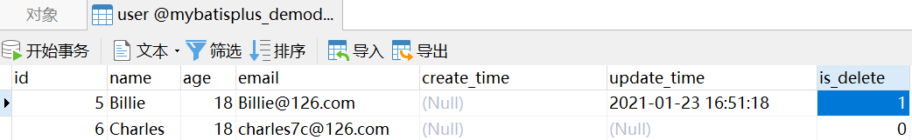

# 增删改操作

## 前言

**C：** 在上一篇，笔者带大家快速入门了 MP，不知道你是否已经掌握了 MP 的使用步骤，折服于 MP 的强大呢？本篇，笔者将继续在上一篇的 Demo 基础上带你学习 MP，掌握 MP 中常见的 CUD 操作 API。

::: tip 笔者说
CUD 不知道是什么意思？在咱们后端的圈子里，有一个常常挂在嘴边的名词 "CRUD"。甚至有些同学在去面试时，直言自己在某个项目中就是在做 xxx 的 "CRUD" 而已。  

至于它的含义，你使用有道词典都能搜到它的含义。CRUD 代表的是 Create, Read (Retrieve), Update, Delete 这四个单词的简写，俗称 "增删改查"/"增删查改"。  

因为我们做后端，避免不掉的就是操作数据库，而数据库的基本操作就是这四类。另外在行业内，它也一度成为了咱们圈子里较为 "自嘲" 类的名词，有些小伙伴儿常常自称自己是 "CRUD 工程师" ，旨在表达自己平时做的业务都很简单的意思。  

CUD 自然就是笔者从 CRUD 中拆出来的，意味着数据的增删改操作。
:::


## 插入操作

你是不是以为，笔者要做一大堆的前情准备工作？你错了，在 MP 中，这一切都不需要。直接 "莽"。


在上一篇 Demo 项目的 UserMapper 中，因为它已经继承了 [BaseMapper](https://gitee.com/baomidou/mybatis-plus/blob/3.0/mybatis-plus-core/src/main/java/com/baomidou/mybatisplus/core/mapper/BaseMapper.java) 接口，所以甚至无需编写 UserMapper.xml 文件，就已获得了通用的 CRUD API。

在 BaseMapper 接口中，插入操作的 API 只有一个。

```java
// 其他 API 略
public interface BaseMapper<T> extends Mapper<T> {
    
    /**
     * 插入一条记录
     *
     * @param entity 实体对象
     * @return 影响行数
     */
    int insert(T entity);

}
```

### 插入1条记录

接下来，我们准备测试一下插入操作 API，我们先在上一篇 Demo 项目的基础上，复制粘贴一个专门用于测试 CUD 操作的单元测试类。


**测试代码：** 

笔者提前准备好了一条测试数据。

|  姓名   | 年龄 |       邮箱        |
| :-----: | :--: | :---------------: |
| Charles |  18  | charles7c@126.com |

```java
import org.junit.Assert;

@SpringBootTest
class MybatisPlusCUDTests {
    
    @Autowired
    private UserMapper userMapper;

    @Test
    public void testInsert(){
        // 创建用户对象
        User user = new User();
        user.setName("Charles");
        user.setAge(18);
        user.setEmail("charles7c@126.com");
        
        // 调用插入操作API
        int rows = userMapper.insert(user);
        Assert.assertEquals(1, rows);
        
        // MP默认就会自动回填生成的主键
        System.out.println(user.getId());
    }
    
}
```

**控制台输出：** 

```sql
==>  Preparing: INSERT INTO user ( id, name, age, email ) VALUES ( ?, ?, ?, ? )
==> Parameters: 1352882704631181313(Long), Charles(String), 18(Integer), charles7c@126.com(String)
<==    Updates: 1
```

```
1352882704631181313
```

### ID生成策略

我们在插入成功后，看到用户的 id 值是一个很长的数值，不仔细看还以为是身份证号呢？其实，这是 MP 默认的主键生成策略：**生成分布式唯一ID** 的锅。

::: tip 笔者说
所谓的分布式唯一ID，简称分布式ID。我们都知道数据库中的每条数据都要定义好一个唯一 ID，像 MySQL 等数据库，提供了主键自增功能，以帮助我们自动生成 1、2、3...这种简单的唯一ID。但随着系统业务越来越复杂，数据库开始分库分表，这种传统的 ID 生成策略在分布式情况下有极大可能出现重复 ID，所以分布式 ID 的概念就诞生了。常见的分布式 ID 解决方案有：Redis生成ID、UUID、Snowflake(雪花算法)等。  

自 MP 3.3.0 开始，主键生成策略默认为：使用 雪花算法 + UUID(不含中划线)  组合而成。 

**UUID：** UUID是国际标准化组织（ISO）提出的一个概念，是通用唯一识别码（Universally Unique Identifier）的缩写。在所有空间和时间上被视为唯一的标识，UUID 通常由32个十六进制数字表示，以5个字符组显示，每个字符组以“-”隔开。例如：6db55ec5-ff6f-478a-911d-313de67ed563。  

**[Snowflake](https://github.com/twitter-archive/snowflake/releases/tag/snowflake-2010)：** Snowflake 是 Twitter 开源的分布式ID生成算法，结果是一个 long 型的 ID。
:::

如果我们的需求不需要分布式ID，可以替换成 MP 中其他的主键生成策略。我们可以通过查看 MP 的 ID 类型枚举类源码，来查看它有哪些主键生成策略。

```java
/**
 * 生成ID类型枚举类
 *
 * @author hubin
 * @since 2015-11-10
 */
@Getter
public enum IdType {
    /**
     * 数据库ID自增
     * 该类型请确保数据库支持并设置了主键自增 否则无效
     */
    AUTO(0),
    
    /**
     * 该类型为未设置主键类型(注解里等于跟随全局,全局里约等于 INPUT)
     */
    NONE(1),
    
    /**
     * 用户输入ID
     * 该类型可以通过自己注册自动填充插件进行填充
     */
    INPUT(2),

    /* 注意：以下类型、只有当插入对象ID 为空，才自动填充。 */
    /**
     * 【MP 默认采用此种主键生成策略】
     * 通过雪花算法分配ID (主键类型为数值或字符串),
     * @since 3.3.0 (3.3.0版本新增该策略)
     */
    ASSIGN_ID(3),
    
    /**
     * 通过UUID分配ID (主键类型为字符串)
     */
    ASSIGN_UUID(4),
    
    /* ---------已过时，不建议采用--------- */
    /**
     * 从3.3.0版本开始过时，可使用ASSIGN_ID替代
     */
    @Deprecated
    ID_WORKER(3),
    /**
     * 从3.3.0版本开始过时，可使用ASSIGN_ID替代
     */
    @Deprecated
    ID_WORKER_STR(3),
    /**
     * 从3.3.0版本开始过时，可使用ASSIGN_UUID替代
     */
    @Deprecated
    UUID(4);

    private final int key;

    IdType(int key) {
        this.key = key;
    }
}
```

当你看中了某一个生成策略，想来改变默认的主键生成策略时，直接在对应实体类的主键属性上，添加 `@TableId` 注解即可。

```java
@Data
public class User {
    
    // @TableId是用于标注主键属性的注解
    //   value：数据表对应的列名，如果实体类属性和数据表列名不一致时使用
	//   type：主键生成策略类型
    @TableId(type = IdType.AUTO)
    private Long id;
    private String name;
    private Integer age;
    private String email;

}
```

当然，如果你每个实体都要更改主键生成策略，最好的方式还是直接在 `application.yml` 中进行全局配置。

```yaml
# MyBatis Plus配置
mybatis-plus:
  # 全局配置
  global-config:
    db-config:
      # 主键生成策略
      id-type: auto
```

::: warning 笔者说
上方的两种配置，如果你选择了全局配置， **就不需要再配置第一种了** 。
:::

更改了主键生成策略后，别忘了先 Truncate 再 Insert 来重置下当前的用户表数据，否则再测试插入时，数据库主键自增序列是从当前的 ID 最大值开始的。



重置完成后，我们再去测试一下刚才的插入操作。

**控制台输出：** 

```sql
==>  Preparing: INSERT INTO user ( name, age, email ) VALUES ( ?, ?, ? )
==> Parameters: Charles(String), 18(Integer), charles7c@126.com(String)
<==    Updates: 1
```

```
6
```

很显然，这一次，MP 不再为我们分配 ID 了，而是由数据库进行主键自增生成的 ID。

## 修改操作

在 BaseMapper 接口中，修改操作的 API 有两个，但本篇我们先只介绍一个，另一个需要等我们学完下一篇的条件构造器再介绍。

```java
// 其他 API 略
public interface BaseMapper<T> extends Mapper<T> {
    
    /**
     * 根据 ID 修改
     *
     * @param entity 实体对象
     * @return 影响行数
     */
    int updateById(@Param(Constants.ENTITY) T entity);

    /**
     * 根据 whereEntity 条件，更新记录
     *
     * @param entity        实体对象 (set 条件值,可以为 null)
     * @param updateWrapper 实体对象封装操作类（可以为 null,里面的 entity 用于生成 where 语句）
     * @return 影响行数
     */
    int update(@Param(Constants.ENTITY) T entity, @Param(Constants.WRAPPER) Wrapper<T> updateWrapper);
    
}
```

### 根据ID修改

为了测试修改操作 API，笔者也提前准备好了一条测试数据。

| 主键  |  姓名  |  年龄  |      邮箱      |
| :---: | :----: | :----: | :------------: |
| **5** | Billie | **18** | Billie@126.com |

**测试代码：** 

```java
@SpringBootTest
class MybatisPlusCUDTests {
    
    @Autowired
    private UserMapper userMapper;

    @Test
    void testUpdateById(){
        // 创建用户对象
        User user = new User();
        user.setId(5L);
        user.setAge(18);
        
        // 执行修改操作 API
        int rows = userMapper.updateById(user);
        Assert.assertEquals(1, rows);
    }
    
}
```

**控制台输出：** 

```sql
==>  Preparing: UPDATE user SET age=? WHERE id=?
==> Parameters: 18(Integer), 5(Long)
<==    Updates: 1
```

### 自动填充

我们在项目开发过程中，经常要在最终存储数据前，进行一些数据填充工作，例如审计信息：创建人、创建时间，更新人、更新时间等。

这些数据的填充工作，重复且枯燥，有时候还容易忘记，MP 中提供了自动填充功能，可以结束这类问题。

接下来，我们就以自动填充实体类的 创建时间、更新时间 这两个属性为例来演示一下 MP 的自动填充功能。

**第1步：我们需要给实体类、数据库表先做一些结构调整工作。** 

```sql
-- 给用户表添加 create_time 和 update_time 两个列
ALTER TABLE `mybatisplus_demodb`.`user` 
ADD COLUMN `create_time` datetime(0) NULL COMMENT '创建时间' AFTER `email`,
ADD COLUMN `update_time` datetime(0) NULL COMMENT '更新时间' AFTER `create_time`;
```

```java
@Data
public class User {
    
    private Long id;
    private String name;
    private Integer age;
    private String email;
    // 添加对应的实体属性：createTime、updateTime
    private LocalDateTime createTime;
    private LocalDateTime updateTime;

}
```

**第2步：在 User 类中添加 @TableField 注解来给属性指定自动填充类型。** 

```java
@Data
public class User {
    
    private Long id;
    private String name;
    private Integer age;
    private String email;

    // @TableField是用于标注普通属性的注解
    //   value：数据表对应的列名，如果实体类属性和数据表列名不一致时使用
    //   fill：自动填充类型
    //     INSERT：插入时自动填充
    //     UPDATE：更新时自动填充
    //     INSERT_UPDATE：插入或更新时自动填充
    @TableField(fill = FieldFill.INSERT)
    private LocalDateTime createTime;
    @TableField(fill = FieldFill.INSERT_UPDATE)
    private LocalDateTime updateTime;

}
```

**第3步：创建自动审计处理器，实现元对象处理器接口。** 

`com.baomidou.mybatisplus.core.handlers.MetaObjectHandler`

```java
/**
 * 通过 MP 的自动填充功能实现自动审计
 */
@Component
public class AutoAuditHandler implements MetaObjectHandler {

    @Override
    public void insertFill(MetaObject metaObject) {
        this.strictInsertFill(metaObject, "createTime", LocalDateTime.class, LocalDateTime.now()); // 起始版本 3.3.0(推荐使用)
        this.strictInsertFill(metaObject, "updateTime", LocalDateTime.class, LocalDateTime.now()); // 起始版本 3.3.0(推荐使用)
    }

    @Override
    public void updateFill(MetaObject metaObject) {
        this.setFieldValByName("updateTime", LocalDateTime.now(), metaObject);
    }

}
```

这么做完之后，我们再来测试下刚才的修改操作。

**控制台输出：**

```sql
==>  Preparing: UPDATE user SET age=?, update_time=? WHERE id=?
==> Parameters: 18(Integer), 2021-01-23T16:51:18.413(LocalDateTime), 5(Long)
<==    Updates: 1
```

显而易见，执行的 SQL 中多了一个更新时间的修改，而且传的值是当前时间。

::: tip 笔者说
你也可以测试一下刚才的插入操作 API，看看新增数据时是否会自动填充 创建时间 和 更新时间 数据。
:::

## 删除操作

在 BaseMapper 接口中，删除操作的 API 一共有4个，我们本篇主要介绍一下前三个，最后一个同样也在下一篇再进行介绍。

```java
// 其他 API 略
public interface BaseMapper<T> extends Mapper<T> {
    /**
     * 根据 ID 删除
     *
     * @param id 主键ID
     * @return 影响行数
     */
    int deleteById(Serializable id);
    
    /**
     * 删除（根据ID 批量删除）
     *
     * @param idList 主键ID列表(不能为 null 以及 empty)
     * @return 影响行数
     */
    int deleteBatchIds(@Param(Constants.COLLECTION) Collection<? extends Serializable> idList);

    /**
     * 根据 columnMap 条件，删除记录
     *
     * @param columnMap 表字段 map 对象
     * @return 影响行数
     */
    int deleteByMap(@Param(Constants.COLUMN_MAP) Map<String, Object> columnMap);

    /**
     * 根据 entity 条件，删除记录
     *
     * @param queryWrapper 实体对象封装操作类（可以为 null,里面的 entity 用于生成 where 语句）
     * @return 影响行数
     */
    int delete(@Param(Constants.WRAPPER) Wrapper<T> queryWrapper);
    
}
```

### 根据ID删除

**测试代码：** 

```java
@SpringBootTest
class MybatisPlusCUDTests {
    
    @Autowired
    private UserMapper userMapper;
    
    @Test
    void testDeleteById() {
        // 执行删除操作API，删除ID为1的用户数据
        int rows = userMapper.deleteById(1L);
        Assert.assertEquals(1, rows);
    }
}
```

**控制台输出：** 

```sql
==>  Preparing: DELETE FROM user WHERE id=?
==> Parameters: 1(Long)
<==    Updates: 1
```

### 批量ID删除

**测试代码：** 

```java
@SpringBootTest
class MybatisPlusCUDTests {
    
    @Autowired
    private UserMapper userMapper;
    
    @Test
    void testDeleteBatchIds() {
        // 删除ID为2、3的用户数据
        List<Integer> ids = Arrays.asList(2, 3);
        int rows = userMapper.deleteBatchIds(ids);
        Assert.assertEquals(2, rows);
    }
    
}
```

**控制台输出：** 

```sql
==>  Preparing: DELETE FROM user WHERE id IN ( ? , ? )
==> Parameters: 2(Integer), 3(Integer)
<==    Updates: 2
```

### 简单的带条件删除

**测试代码：** 

```java
@SpringBootTest
class MybatisPlusDemoApplication {
    
    @Autowired
    private UserMapper userMapper;
    
    @Test
    void testDeleteByMap() {
        // 删除姓名为Sandy的用户数据
        // Map集合的键：表示的是数据库列名不是实体类属性名
        Map<String, Object> columnMap = new HashMap<>();
        columnMap.put("name", "Sandy");
        int rows = userMapper.deleteByMap(columnMap);
        Assert.assertEquals(1, rows);
    }
    
}
```

**控制台输出：** 

```sql
==>  Preparing: DELETE FROM user WHERE name = ?
==> Parameters: Sandy(String)
<==    Updates: 1
```

### 逻辑删除

在项目开发过程中，为了保留用户数据，在删除用户数据时，我们会选择逻辑删除，而非物理删除。

- **物理删除：** 真实删除，将对应数据从数据库中删除，即采用 `delete` SQL。

- **逻辑删除：** 假删除，将对应数据中代表是否被删除的列，修改为 "被删除状态值"，即采用 `update` SQL。

接下来，我们也实现一下逻辑删除功能。

**第1步：我们需要给实体类、数据库表先做一些结构调整工作。** 

```sql
-- 给用户表添加 is_delete 列
ALTER TABLE `mybatisplus_demodb`.`user` 
ADD COLUMN `is_delete` int(2) NULL COMMENT '是否被删除' AFTER `update_time`;
```

```java
@Data
public class User {
    
    private Long id;
    private String name;
    private Integer age;
    private String email;
    @TableField(fill = FieldFill.INSERT)
    private LocalDateTime createTime;
    @TableField(fill = FieldFill.INSERT_UPDATE)
    private LocalDateTime updateTime;
   
    // 添加对应的实体属性：isDelete
    // 为 逻辑删除 属性指定插入数据时自动填充，并调整好数据填充处理器
    @TableField(fill = FieldFill.INSERT)
    private Integer isDelete;
    
}
```

```java
/**
 * 通过 MP 的自动填充功能实现自动审计
 */
@Component
public class AutoAuditHandler implements MetaObjectHandler {

    @Override
    public void insertFill(MetaObject metaObject) {
        this.strictInsertFill(metaObject, "createTime", LocalDateTime.class, LocalDateTime.now());
        this.strictInsertFill(metaObject, "updateTime", LocalDateTime.class, LocalDateTime.now()); 
        // 插入数据时，逻辑删除属性自动填充值
        this.strictInsertFill(metaObject, "isDelete", Integer.class, 0);
    }

    @Override
    public void updateFill(MetaObject metaObject) {
        this.setFieldValByName("updateTime", LocalDateTime.now(), metaObject);
    }

}
```

**第2步：在 application.yml 中，全局配置逻辑删除的默认值和删除值。** 

::: tip 笔者说
这一步也可以通过在 逻辑删除 属性上方添加 `@TableLogic` 注解实现，但还是建议采用全局配置。
:::

```yaml
mybatis-plus:
  global-config:
    db-config:
      # 逻辑删除属性
      logic-delete-field: isDelete
      # 未删除状态值
      logic-not-delete-value: 0
      # 删除状态值
      logic-delete-value: 1
```

配置完后，我们再去测试一下刚才的 根据ID删除 操作。

**测试代码：** 

```java
@SpringBootTest
class MybatisPlusCUDTests {

    @Autowired
    private UserMapper userMapper;
    
    @Test
    void testDeleteById() {
        // 执行删除操作API，删除ID为5的用户数据
        int rows = userMapper.deleteById(5L);
        // int rows = userMapper.deleteById(1L);
        Assert.assertEquals(1, rows);
    }

}
```

**控制台输出：** 

```sql
==>  Preparing: UPDATE user SET is_delete=1 WHERE id=? AND is_delete=0
==> Parameters: 5(Long)
<==    Updates: 0
```

```
java.lang.AssertionError: expected:<1> but was:<0>
Expected :1
Actual   :0
```

这次执行单元测试，竟然报错了！仔细看一下，原来是 `断言` 提示我们实际结果和预期结果不一致。

什么原因导致失败呢？其实是因为我们加入逻辑删除列之后，数据库表中虽然多了这列，但是这一列都还没有设置过值呢。



而执行的 SQL 中却需要查找逻辑删除列值为0的数据，这肯定找不到啊，影响行数自然为 0 了，和我们预期的影响行数 1 不符，于是报错了。

知道原因后，那就先手动，给数据表的逻辑删除列都设置为0。


再去执行一次刚才的删除测试。

**控制台输出：** 

```sql
==>  Preparing: UPDATE user SET is_delete=1 WHERE id=? AND is_delete=0
==> Parameters: 5(Long)
<==    Updates: 1
```

这回就不再报错了，而且显而易见，执行的 SQL 由没有做逻辑删除配置前的 `DELETE` 操作现在变为了 `UPDATE` 操作。



::: tip 笔者说
在逻辑删除配置好之后，原来的部分操作，像查询操作，在执行 SQL 时将自动带上 `where is_delete = 0` 这个条件。 
:::

## 参考文献

[1]MyBatis Plus 官网. 指南[EB/OL]. https://baomidou.com/guide/. 2021-01-18

## 后记

**C：** 学习 MyBatis 的时候，我们就没担心过 CUD，现在 MP 中自然更不存在这事儿了。而且 MP 还给我们提供了这么多实用功能。

下一篇我们将会学到较为复杂的查询操作，但 MP 还是相对简单的，敬请期待吧。

::: info 笔者说
对于技术的学习，笔者一贯遵循的步骤是：先用最最简单的 demo 让它跑起来，然后学学它的最最常用 API 和 配置让自己能用起来，最后熟练使用的基础上，在空闲时尝试阅读它的源码让自己能够洞彻它的运行机制，部分问题出现的原因，同时借鉴这些技术实现来提升自己的代码高度。

所以在笔者的文章中，前期基本都是小白文，仅仅穿插很少量的源码研究。当然等小白文更新多了，你们还依然喜欢，后期会不定时专门对部分技术的源码进行解析。
:::
