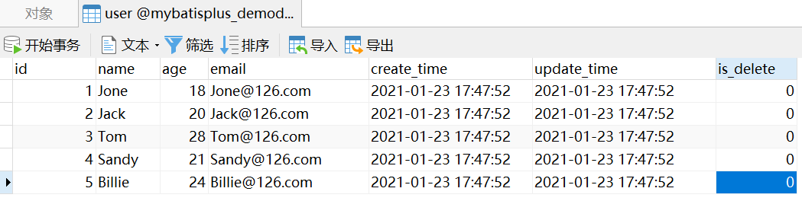

# 简单查询操作

## 前言

**C：** 在 CRUD 中，哪一个操作是最复杂的，毫无疑问是 R（查询）操作。在大多数业务中，查询也是涉及最广泛的部分。很多初级程序员有个毛病：简单的查询不想写，难一点的查询不会写。

上一篇，我们体验了 MP 的增删改操作，本篇，笔者将带你看看你想写或不想写的查询究竟被 MP 封装优化成什么样了。


## 数据准备

在介绍查询操作前，我们需要重置一次数据表，因为上一篇，数据表的数据已经被我们玩的不能看了。

```sql
-- 清空用户表数据
TRUNCATE TABLE user;

-- 向用户表插入测试数据
INSERT INTO `user` VALUES (1, 'Jone', 18, 'Jone@126.com', NOW(), NOW(), 0);
INSERT INTO `user` VALUES (2, 'Jack', 20, 'Jack@126.com', NOW(), NOW(), 0);
INSERT INTO `user` VALUES (3, 'Tom', 28, 'Tom@126.com', NOW(), NOW(), 0);
INSERT INTO `user` VALUES (4, 'Sandy', 21, 'Sandy@126.com', NOW(), NOW(), 0);
INSERT INTO `user` VALUES (5, 'Billie', 24, 'Billie@126.com', NOW(), NOW(), 0);
```



## 根据ID查询记录

在MP 的 BaseMapper 中，为我们提供了 10 来个查询操作，我们还是先介绍一些简单的 API，至于需要使用条件构造器的 API 等等再说。

那第1个要介绍的查询操作是：根据 ID 查询单个实体数据，日常开发中将会频繁使用的一个 API。

```java
// 其他 API 略
public interface BaseMapper<T> extends Mapper<T> {
    
    /**
     * 根据 ID 查询
     *
     * @param id 主键ID
     * @return 单个实体数据
     */
    T selectById(Serializable id);
    
}
```

接下来，我们准备测试一下它，我们还是先在上一篇 Demo 项目的基础上，复制粘贴一个专门用于测试 R 操作的单元测试类。


**测试代码：** 

```java
@SpringBootTest
class MybatisPlusRTests {
    
    @Autowired
    private UserMapper userMapper;

    @Test
    void testSelectById() {
        // 查询ID为1的用户数据
        User user = userMapper.selectById(5L);
        System.out.println(user);
    }
    
}
```

**控制台输出：** 

```sql
==>  Preparing: SELECT id,name,age,email,create_time,update_time,is_delete FROM user WHERE id=? AND is_delete=0
==> Parameters: 1(Long)
<==    Columns: id, name, age, email, create_time, update_time, is_delete
<==        Row: 1, Jone, 18, Jone@126.com, 2021-01-23 17:47:52, 2021-01-23 17:47:52, 0
<==      Total: 1
```

```
User(id=1, name=Jone, age=18, email=Jone@126.com, createTime=2021-01-23T17:47:52, updateTime=2021-01-23T17:47:52, isDelete=0)
```

::: tip 笔者说
在控制台上显示的执行 SQL 中，我们可以看到它结尾有一个 `is_delete = 0` 条件，别害怕，这是我们上一篇配置逻辑删除后的正常现象。
:::

## 批量ID查询

第2个要介绍的查询操作是：根据多个 ID 来批量查询实体数据。

```java
// 其他 API 略
public interface BaseMapper<T> extends Mapper<T> {

    /**
     * 查询（根据ID 批量查询）
     *
     * @param idList 主键ID列表(不能为 null 以及 empty)
     * @return 实体列表
     */
    List<T> selectBatchIds(@Param(Constants.COLLECTION) Collection<? extends Serializable> idList);
    
}
```

**测试代码：** 

```java
@SpringBootTest
class MybatisPlusRTests {
    
    @Autowired
    private UserMapper userMapper;

    @Test
    public void selectBatchIds() {
        // 查询ID为1、2的用户数据
        List<User> users = userMapper.selectBatchIds(Arrays.asList(1, 2));
        users.forEach(System.out::println);
    }
    
}
```

**控制台输出：** 

```sql
==>  Preparing: SELECT id,name,age,email,create_time,update_time,is_delete FROM user WHERE id IN ( ? , ? ) AND is_delete=0
==> Parameters: 1(Integer), 2(Integer)
<==    Columns: id, name, age, email, create_time, update_time, is_delete
<==        Row: 1, Jone, 18, Jone@126.com, 2021-01-23 17:47:52, 2021-01-23 17:47:52, 0
<==        Row: 2, Jack, 20, Jack@126.com, 2021-01-23 17:47:52, 2021-01-23 17:47:52, 0
<==      Total: 2
```

```
User(id=1, name=Jone, age=18, email=Jone@126.com, createTime=2021-01-23T17:47:52, updateTime=2021-01-23T17:47:52, isDelete=0)
User(id=2, name=Jack, age=20, email=Jack@126.com, createTime=2021-01-23T17:47:52, updateTime=2021-01-23T17:47:52, isDelete=0)
```

## 简单的带条件查询

第3个要介绍的查询操作是：根据 Map 集合封装好的条件来查询实体列表。

```java
// 其他 API 略
public interface BaseMapper<T> extends Mapper<T> {

    /**
     * 查询（根据 columnMap 条件）
     *
     * @param columnMap 表字段 map 对象
     * @return 实体列表
     */
    List<T> selectByMap(@Param(Constants.COLUMN_MAP) Map<String, Object> columnMap);
    
}
```

**测试代码：** 

```java
@SpringBootTest
class MybatisPlusRTests {
    
    @Autowired
    private UserMapper userMapper;

    @Test
    void selectByMap() {
        // 通过 Map 封装条件
        // Map集合的键表示的是数据库列名
        HashMap<String, Object> columnMap = new HashMap<>();
        columnMap.put("name", "Jack");
        columnMap.put("age", "20");
        
        // 根据条件查询用户列表
        List<User> users = userMapper.selectByMap(columnMap);
        users.forEach(System.out::println);
    }
    
}
```

**控制台输出：** 

```sql
==>  Preparing: SELECT id,name,age,email,create_time,update_time,is_delete FROM user WHERE name = ? AND age = ? AND is_delete=0
==> Parameters: Jack(String), 20(String)
<==    Columns: id, name, age, email, create_time, update_time, is_delete
<==        Row: 2, Jack, 20, Jack@126.com, 2021-01-23 17:47:52, 2021-01-23 17:47:52, 0
<==      Total: 1
```

```
User(id=2, name=Jack, age=20, email=Jack@126.com, createTime=2021-01-23T17:47:52, updateTime=2021-01-23T17:47:52, isDelete=0)
```

## 分页

在大多数批量查询操作的时候，我们都会采用分页技术来限制查询的条数，以优化效率及体验。

所以第4个要介绍的查询操作就是分页查询，原来在使用 MyBatis 时，接入 [page-helper](https://pagehelper.github.io/) 就可以快速实现分页功能，而 MP 则自带分页插件，只要简单的配置就可以实现分页功能。

**在项目中创建一个 MP 配置类，添加一个分页插件类的 Bean 配置。** 

```java
/**
 * MyBatis Plus配置类
 */
@Configuration
public class MyBatisPlusConfig {
    
    @Bean
    public PaginationInterceptor paginationInterceptor() {
        PaginationInterceptor paginationInterceptor = new PaginationInterceptor();
        // 设置请求的页面大于最大页后操作， true调回到首页，false 继续请求  默认false
        // paginationInterceptor.setOverflow(false);
        
        // 设置最大单页限制数量，默认 500 条，-1 不受限制
        // paginationInterceptor.setLimit(500);
        
        // 开启 count 的 join 优化,只针对部分 left join
        paginationInterceptor.setCountSqlParser(new JsqlParserCountOptimize(true));
        return paginationInterceptor;
    }
    
}
```

好了，接下来我们就可以测试分页查询 API 了。

在 BaseMapper 中，一共提供了两种分页查询，它们都可以实现分页数据的查询，**唯一的区别在于查到的每页数据，究竟是要存储为实体数据集合，还是直接以键值对形式存到Map集合。** 

```java
// 其他 API 略
public interface BaseMapper<T> extends Mapper<T> {
    
    /**
     * 根据 entity 条件，查询全部记录（并翻页）
     *
     * @param page         分页查询条件（可以为 RowBounds.DEFAULT）
     * @param queryWrapper 实体对象封装操作类（可以为 null）
     * @return 分页数据（查询到的每页数据会映射为实体数据集合）
     */
    <E extends IPage<T>> E selectPage(E page, @Param(Constants.WRAPPER) Wrapper<T> queryWrapper);
    
    /**
     * 根据 Wrapper 条件，查询全部记录（并翻页）
     *
     * @param page         分页查询条件
     * @param queryWrapper 实体对象封装操作类
     * @return 分页数据（查询到的每页数据会以键值对形式存入Map集合）
     */
    <E extends IPage<Map<String, Object>>> E selectMapsPage(E page, @Param(Constants.WRAPPER) Wrapper<T> queryWrapper);

}
```

笔者只带大家测试第一种分页查询 API，另一种你可以自行选择测试一下。

**测试代码：** 

```java
@SpringBootTest
class MybatisPlusDemoApplication {
    
    @Autowired
    private UserMapper userMapper;

    @Test
    void testSelectPage() {
        // 创建分页对象，通过构造传入 当前页 和 每页显示条数
        Page<User> page = new Page<>(1, 2);
        
        // 查询分页数据，条件构造器部分我们还是先传null
        userMapper.selectPage(page, null);
        // 分页数据输出
        System.out.println("数据总数:" + page.getTotal());
        System.out.println("总页数:" + page.getPages());
        System.out.println("当前页:" + page.getCurrent());
        System.out.println("页大小:" + page.getSize());
        // 每页的数据列表
        page.getRecords().forEach(System.out::println);
    }

}
```

**控制台输出：** 

```sql
==>  Preparing: SELECT COUNT(1) FROM user WHERE is_delete = 0
==> Parameters: 
<==    Columns: COUNT(1)
<==        Row: 5
==>  Preparing: SELECT id,name,age,email,create_time,update_time,is_delete FROM user WHERE is_delete=0 LIMIT ?
==> Parameters: 2(Long)
<==    Columns: id, name, age, email, create_time, update_time, is_delete
<==        Row: 1, Jone, 18, Jone@126.com, 2021-01-23 17:47:52, 2021-01-23 17:47:52, 0
<==        Row: 2, Jack, 20, Jack@126.com, 2021-01-23 17:47:52, 2021-01-23 17:47:52, 0
<==      Total: 2
```

```
数据总数:5
总页数:3
当前页:1
页大小:2
User(id=1, name=Jone, age=18, email=Jone@126.com, createTime=2021-01-23T17:47:52, updateTime=2021-01-23T17:47:52, isDelete=0)
User(id=2, name=Jack, age=20, email=Jack@126.com, createTime=2021-01-23T17:47:52, updateTime=2021-01-23T17:47:52, isDelete=0)
```

::: tip 笔者说
测试完后，笔者再告诉你一件事儿，MP 的这款分页插件，支持的数据库也很多： MySQL 、MariaDB 、Oracle 、DB2 、H2 、HSQL 、SQL Lite 、PostgreSQL 、SQL Server 、Presto 、Gauss 、Firebird、Phoenix 、ClickHouse 、Sybase ASE 、 OceanBase 、达梦数据库 、虚谷数据库 、人大金仓数据库 、南大通用数据库。  

这么多种类的数据库支持，从我们日常使用上来讲绝对够用了！
:::

## 参考文献

[1]MyBatis Plus 官网. 指南[EB/OL]. https://baomidou.com/guide/. 2021-01-18

## 后记

**C：** 好了，简单的查询操作就介绍到这儿了，这些基础查询是不是还挺简单的？下一篇，我们将介绍预热了两篇已久的条件构造器，肯定有很多同学等急了。别着急，好饭不怕晚，下一篇笔者就带你好好认识认识它。

::: info 笔者说
对于技术的学习，笔者一贯遵循的步骤是：先用最最简单的 demo 让它跑起来，然后学学它的最最常用 API 和 配置让自己能用起来，最后熟练使用的基础上，在空闲时尝试阅读它的源码让自己能够洞彻它的运行机制，部分问题出现的原因，同时借鉴这些技术实现来提升自己的代码高度。

所以在笔者的文章中，前期基本都是小白文，仅仅穿插很少量的源码研究。当然等小白文更新多了，你们还依然喜欢，后期会不定时专门对部分技术的源码进行解析。
:::
