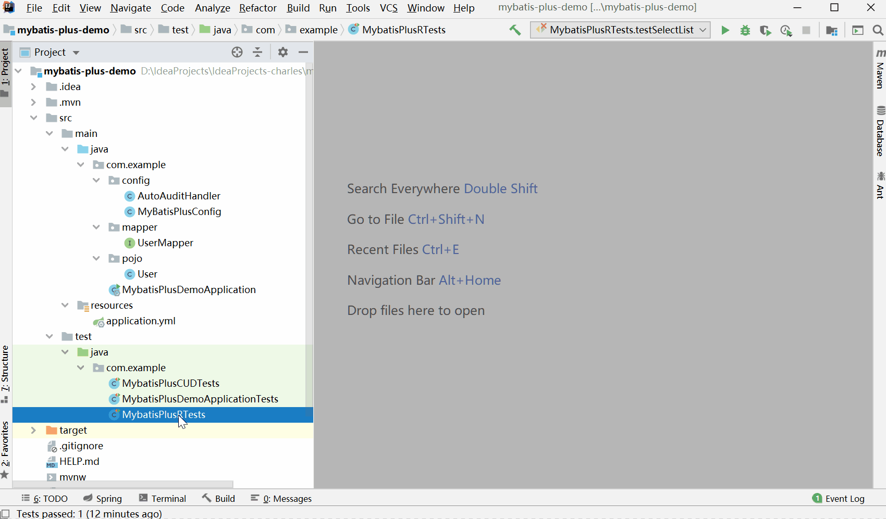

# 条件构造器

## 前言

**C：** 在前两篇 MP 的 CRUD API 演示中，笔者一直刻意忽略了一些带有条件构造器的 API，你说哪些是带有条件构造器的 API ？看下面。

- `update(T entity, Wrapper<T> updateWrapper) : int`
- `delete(Wrapper<T> queryWrapper) : int`
- `selectOne(Wrapper<T> queryWrapper) : T`
- `selectCount(Wrapper<T> queryWrapper) : Integer`
- `selectList(Wrapper<T> queryWrapper) : List<T>`
- `selectMaps(Wrapper<T> queryWrapper) : List<Map<String, Object>>`
- `selectObjs(Wrapper<T> queryWrapper) : List<Object>` 
- `selectPage(E page, Wrapper<T> queryWrapper) : E`
- `selectMapsPage(E page, Wrapper<T> queryWrapper) : E`

看到了吧？上述这些 API 中，都有一个显著的特点，即要求传递一个 Wrapper 类型的参数，而这个 Wrapper 类型就是笔者提到的条件构造器。

预热了两篇之久，本篇，笔者将带着你入门 MP 的条件构造器，看看传统的 SQL 语句条件如何用 条件构造器API 组装出来。


## 概述

Wrapper 类型，顾名思义就是一个包装类，但它又不是我们常说的 Integer 这种包装类概念，在 MP 中它是用于包装各种丰富的查询条件的包装类。

它是 MP 中条件包装类的顶级类，笔者在下方给你列出了它的类层次结构。当然，枝繁叶茂的它不可能就这几个子类，笔者只不过是挑重点的展示一下而已。


但Wrapper 类是一个抽象类，所以我们不可能直接使用它，而是需要使用它的子类，那么哪些子类是我们常用的呢？一共有4个。

- `QueryWrapper`：查询条件构造器

- `UpdateWrapper`：更新条件构造器
- `LambdaQueryWrapper`：使用 Lambda 语法的查询条件构造器
- `LambdaUpdateWrapper`：使用 Lambda 语法的更新条件构造器

接下来笔者就以 `QueryWrapper` 和 `LambdaQueryWrapper` 为例，带着大家体验一下条件构造器。至于其他两个，使用方法没有太大差别，所以笔者不再单独讲解了。

我们还是先CV一个专用于条件构造器的单元测试类。



## QueryWrapper

QueryWrapper 是 MP 中主要用于查询操作的条件包装类，我们将借助《快速入门》篇提到过的查询实体列表 API 来测试一下它。

```java
// 其他 API 略
public interface BaseMapper<T> extends Mapper<T> {
    
    /**
     * 根据 entity 条件，查询全部记录
     *
     * @param queryWrapper 实体对象封装操作类（可以为 null）
     */
    List<T> selectList(@Param(Constants.WRAPPER) Wrapper<T> queryWrapper);
    
}
```

下方的基础 SQL 查询语法，大家应该都不陌生吧？

```sql
SELECT
  [ALL | DISTINCT] -- 是否去重
  {* | table_name.* | [table_name.field1 [AS alias1] [, table_name.field2 [AS  alias2]][, ...]]} -- 查询哪些列
FROM
  table_name [AS table_ alias] [, ...] -- 从哪些表查询
  [LEFT | RIGHT | INNER JOIN table_name2 [AS table_alias] ON 关联条件] -- 连接查询
[WHERE ...] -- 根据条件来完成上述表数据的筛选
[GROUP BY …] -- 根据一个或多个列分组
[HAVING …]	-- 分组查询后的筛选条件
[ORDER BY… ] -- 根据一个或多个列排序
[LIMIT  {[offset,] row_count}]  -- 限制查询结果数量和范围
```

笔者就是要以 QueryWrapper ，带大家体验一下如何用条件构造器，来实现上述的基础 SQL 查询。

### 指定查询的列

在写查询类 SQL 时，我们都要先指定好要查询哪些列。在 MP 的查询条件构造器中，可以通过 `select()` 方法来实现查询列的指定。

- `select(String... columns) : QueryWrapper<T>`
- ...

**测试代码：** 

```java
@SpringBootTest
class MybatisPlusWrapperTests {

    @Autowired
    private UserMapper userMapper;
    
    // 需求：查询用户的姓名和年龄信息
    @Test
    void testSelectList1() {
        // 创建查询条件构造器对象，通过泛型指定查询结果类型
        QueryWrapper<User> queryWrapper = new QueryWrapper<>();
        // 指定查询 name、age 两列数据
        queryWrapper.select("name", "age");

        // 执行用户列表查询
        List<User> userList = userMapper.selectList(queryWrapper);

        // 遍历用户列表
        userList.forEach(System.out::println);
    }
}
```

**控制台输出：** 

```java
==>  Preparing: SELECT name,age FROM user WHERE is_delete=0
==> Parameters: 
<==    Columns: name, age
<==        Row: Jone, 18
<==        Row: Jack, 20
<==        Row: Tom, 28
<==        Row: Sandy, 21
<==        Row: Billie, 24
<==      Total: 5
```

```
User(id=null, name=Jone, age=18, email=null, createTime=null, updateTime=null, isDelete=null)
User(id=null, name=Jack, age=20, email=null, createTime=null, updateTime=null, isDelete=null)
User(id=null, name=Tom, age=28, email=null, createTime=null, updateTime=null, isDelete=null)
User(id=null, name=Sandy, age=21, email=null, createTime=null, updateTime=null, isDelete=null)
User(id=null, name=Billie, age=24, email=null, createTime=null, updateTime=null, isDelete=null)
```

而且，你还可以借助这个方法实现结果去重功能，只需要在第一个指定的列名前添加 `DISTINCT` 关键字即可。

```java
// 创建查询条件构造器对象，通过泛型指定查询结果类型
QueryWrapper<User> queryWrapper = new QueryWrapper<>();
// 指定查询 name、age 两列数据,并去重结果
queryWrapper.select("DISTINCT name", "age");
```

最终执行的 SQL 就变成了这样：

```sql
SELECT DISTINCT name,age FROM user WHERE is_delete=0
```

::: tip 笔者说
聪明如你，一定能举一反三，如果未来需要给查询列起别名、或者使用一些聚合函数，直接在 select() 方法中写就可以。
:::

### where条件子句

查询类 SQL 中，在指定了查询哪些列之后，另一个非常重要的就是指定筛选结果数据的条件。

where 条件子句就是 **用于检索数据表中符合条件记录** 的，**条件子句可以由一个或多个逻辑表达式组成，结果一般为真或假。** 

#### 关系运算符

下方是 where 条件子句中常用关系运算 和 MP 中对应方法的对照表。

| **SQL 运算符** | **含义**       | **MP 对应方法**   | 笔者帮你强化理解 |
| -------------- | :------------- | ----------------- | -------------- |
| =              | 等于           | eq(R column, Object val) : Children | eq：equal |
| <> 或 !=       | 不等于         | ne(R column, Object val) : Children | ne：not equal |
| >              | 大于           | gt(R column, Object val) : Children | gt：greater than |
| <              | 小于           | lt(R column, Object val) : Children | lt：less than |
| >=             | 大于等于       | ge(R column, Object val) : Children | ge：greater than or equal |
| <=             | 小于等于       | le(R column, Object val) : Children | le：less than or equal |
| is null | 等于null | isNull(R column) : Children |  |
| is not null | 不等于null | isNotNull(R column) : Children |  |

**测试代码：** 

```java
@SpringBootTest
class MybatisPlusWrapperTests {

    @Autowired
    private UserMapper userMapper;

    // 需求：查询年龄 >= 21 的用户数据
    @Test
    void testSelectList2() {
        // 创建查询条件构造器对象，通过泛型指定查询结果类型
        QueryWrapper<User> queryWrapper = new QueryWrapper<>();
        // ge：greater equals 大于等于
        queryWrapper.ge("age", 21);

        // 执行用户列表查询
        List<User> userList = userMapper.selectList(queryWrapper);

        // 遍历用户列表
        userList.forEach(System.out::println);
    }

}
```

**控制台输出：** 

```sql
==>  Preparing: SELECT id,name,age,email,create_time,update_time,is_delete FROM user WHERE is_delete=0 AND (age >= ?)
==> Parameters: 21(Integer)
<==    Columns: id, name, age, email, create_time, update_time, is_delete
<==        Row: 3, Tom, 28, Tom@126.com, 2021-01-23 17:47:52, 2021-01-23 17:47:52, 0
<==        Row: 4, Sandy, 21, Sandy@126.com, 2021-01-23 17:47:52, 2021-01-23 17:47:52, 0
<==        Row: 5, Billie, 24, Billie@126.com, 2021-01-23 17:47:52, 2021-01-23 17:47:52, 0
<==      Total: 3
```

```
User(id=3, name=Tom, age=28, email=Tom@126.com, createTime=2021-01-23T17:47:52, updateTime=2021-01-23T17:47:52, isDelete=0)
User(id=4, name=Sandy, age=21, email=Sandy@126.com, createTime=2021-01-23T17:47:52, updateTime=2021-01-23T17:47:52, isDelete=0)
User(id=5, name=Billie, age=24, email=Billie@126.com, createTime=2021-01-23T17:47:52, updateTime=2021-01-23T17:47:52, isDelete=0)
```

其他的笔者就不再测试了，你可以自己挨个试试。

#### 逻辑运算符

##### 普通逻辑

| **SQL 运算符** | **含义**                         | **MP 对应方法**                           |
| -------------- | :------------------------------- | ----------------------------------------- |
| **AND**        | 逻辑与，同时为真，结果才为真     | 默认使用 and 作为多个条件之间的关系表示   |
|                | 嵌套 and                         | and(Consumer\<Param> consumer) : Children |
| **OR**         | 逻辑或，只要一个为真，则结果为真 | or() : Children                           |
|                | 嵌套 or                          | or(Consumer\<Param> consumer) : Children  |
| **NOT**        | 逻辑非，若操作数为假，结果则为真 | not(Consumer\<Param> consumer) : Children |

**测试代码：** 

```java
@SpringBootTest
class MybatisPlusWrapperTests {

    @Autowired
    private UserMapper userMapper;

    // 需求：查询年龄 >= 21 并且姓名为Tom的用户数据
    @Test
    void testSelectList3() {
        // 创建查询条件构造器对象，通过泛型指定查询结果类型
        QueryWrapper<User> queryWrapper = new QueryWrapper<>();
        // 可以分开设置
        // queryWrapper.ge("age", 21);
        // queryWrapper.eq("name", "Tom");
        // 也可以链式操作
        queryWrapper.ge("age", 21)
                    .eq("name", "Tom");
        
        // 执行用户列表查询
        List<User> userList = userMapper.selectList(queryWrapper);

        // 遍历用户列表
        userList.forEach(System.out::println);
    }

}
```

**控制台输出：** 

```sql
==>  Preparing: SELECT id,name,age,email,create_time,update_time,is_delete FROM user WHERE is_delete=0 AND (age >= ? AND name = ?)
==> Parameters: 21(Integer), Tom(String)
<==    Columns: id, name, age, email, create_time, update_time, is_delete
<==        Row: 3, Tom, 28, Tom@126.com, 2021-01-23 17:47:52, 2021-01-23 17:47:52, 0
<==      Total: 1
```

```
User(id=3, name=Tom, age=28, email=Tom@126.com, createTime=2021-01-23T17:47:52, updateTime=2021-01-23T17:47:52, isDelete=0)
```

当你编写了多个条件表达式的时候，MP 默认认为它们之间采用 `and` 关系。但如果你想实现 `or` 关系的需求，那就必须得使用 `or()` 方法了。

**测试代码：** 

```java
@SpringBootTest
class MybatisPlusWrapperTests {

    @Autowired
    private UserMapper userMapper;

    // 需求：查询年龄 = 18 或者 年龄 = 24 的用户数据
    @Test
    void testSelectList4() {
        // 创建查询条件构造器对象，通过泛型指定查询结果类型
        QueryWrapper<User> queryWrapper = new QueryWrapper<>();
        // 或者关系
        queryWrapper.eq("age", 18)
                    .or()
                    .eq("age", 24);

        // 执行用户列表查询
        List<User> userList = userMapper.selectList(queryWrapper);

        // 遍历用户列表
        userList.forEach(System.out::println);
    }
    
}
```

**控制台输出：** 

```sql
==>  Preparing: SELECT id,name,age,email,create_time,update_time,is_delete FROM user WHERE is_delete=0 AND (age = ? OR age = ?)
==> Parameters: 18(Integer), 24(Integer)
<==    Columns: id, name, age, email, create_time, update_time, is_delete
<==        Row: 1, Jone, 18, Jone@126.com, 2021-01-23 17:47:52, 2021-01-23 17:47:52, 0
<==        Row: 5, Billie, 24, Billie@126.com, 2021-01-23 17:47:52, 2021-01-23 17:47:52, 0
<==      Total: 2
```

```
User(id=1, name=Jone, age=18, email=Jone@126.com, createTime=2021-01-23T17:47:52, updateTime=2021-01-23T17:47:52, isDelete=0)
User(id=5, name=Billie, age=24, email=Billie@126.com, createTime=2021-01-23T17:47:52, updateTime=2021-01-23T17:47:52, isDelete=0)
```

##### 嵌套逻辑

我们看到上方的对照表中，还有一种是用于嵌套 or 或 嵌套 and 关系的方法，有些同学可能有点懵，看看下面这行代码是不是就明白了呢？

```sql
select xx from xx where xx = xx or (xx = xx and xx = xx)
```

**测试代码：** 

```java
@SpringBootTest
class MybatisPlusWrapperTests {

    @Autowired
    private UserMapper userMapper;

    // 需求：查询姓名中带有o字母 或者 (年龄 = 21 并且 姓名以S字母开头) 的用户数据
    @Test
    void testSelectList7() {
        // 创建查询条件构造器对象，通过泛型指定查询结果类型
        QueryWrapper<User> queryWrapper = new QueryWrapper<>();
        queryWrapper.like("name", "o")
                    .or(i -> i.eq("age", 21).likeRight("name", "S"));

        // 执行用户列表查询
        List<User> userList = userMapper.selectList(queryWrapper);

        // 遍历用户列表
        userList.forEach(System.out::println);
    }
    
}
```

**控制台输出：** 

```sql
==>  Preparing: SELECT id,name,age,email,create_time,update_time,is_delete FROM user WHERE is_delete=0 AND (name LIKE ? OR (age = ? AND name LIKE ?))
==> Parameters: %o%(String), 21(Integer), S%(String)
<==    Columns: id, name, age, email, create_time, update_time, is_delete
<==        Row: 1, Jone, 18, Jone@126.com, 2021-01-23 17:47:52, 2021-01-23 17:47:52, 0
<==        Row: 3, Tom, 28, Tom@126.com, 2021-01-23 17:47:52, 2021-01-23 17:47:52, 0
<==        Row: 4, Sandy, 21, Sandy@126.com, 2021-01-23 17:47:52, 2021-01-23 17:47:52, 0
<==      Total: 3
```

```
User(id=1, name=Jone, age=18, email=Jone@126.com, createTime=2021-01-23T17:47:52, updateTime=2021-01-23T17:47:52, isDelete=0)
User(id=3, name=Tom, age=28, email=Tom@126.com, createTime=2021-01-23T17:47:52, updateTime=2021-01-23T17:47:52, isDelete=0)
User(id=4, name=Sandy, age=21, email=Sandy@126.com, createTime=2021-01-23T17:47:52, updateTime=2021-01-23T17:47:52, isDelete=0)
```

#### 范围查询

上面的 `or` 关系需求中，是对相同列的多个值的查询，这种情况在 SQL 中我们可以采用 in 查询来优化。而如果是对相同列的连续范围值的查询，则可以采用 between ... and ...查询来优化。

下方是 in 查询 和 between ... and ...查询与 MP 中方法的对照表。

| **SQL 运算符**          | **含义**         | **MP 对应方法**                                           |
| ----------------------- | :--------------- | --------------------------------------------------------- |
| in (值1, 值2, ...)      | 在某个列表之间   | in(R column, Object... values) : Children                 |
| not in (值1, 值2, ...)  | 不在某个列表之间 | notIn(R column, Object... value) : Children               |
| between ... and ...     | 在某个范围之间   | between(R column, Object val1, Object val2) : Children    |
| not between ... and ... | 不在某个范围之间 | notBetween(R column, Object val1, Object val2) : Children |

**测试代码：** 

```java
@SpringBootTest
class MybatisPlusWrapperTests {

    @Autowired
    private UserMapper userMapper;

    // 需求：查询年龄 = 18 或者 年龄 = 24 的用户数据
    @Test
    void testSelectList5() {
        // 创建查询条件构造器对象，通过泛型指定查询结果类型
        QueryWrapper<User> queryWrapper = new QueryWrapper<>();
        // 如果是对相同列的多个值查询，使用in查询优化
        queryWrapper.in("age", 18, 24);
        
        // 执行用户列表查询
        List<User> userList = userMapper.selectList(queryWrapper);

        // 遍历用户列表
        userList.forEach(System.out::println);
    }

}
```

**控制台输出：** 

```sql
==>  Preparing: SELECT id,name,age,email,create_time,update_time,is_delete FROM user WHERE is_delete=0 AND (age IN (?,?))
==> Parameters: 18(Integer), 24(Integer)
<==    Columns: id, name, age, email, create_time, update_time, is_delete
<==        Row: 1, Jone, 18, Jone@126.com, 2021-01-23 17:47:52, 2021-01-23 17:47:52, 0
<==        Row: 5, Billie, 24, Billie@126.com, 2021-01-23 17:47:52, 2021-01-23 17:47:52, 0
<==      Total: 2
```

```
User(id=1, name=Jone, age=18, email=Jone@126.com, createTime=2021-01-23T17:47:52, updateTime=2021-01-23T17:47:52, isDelete=0)
User(id=5, name=Billie, age=24, email=Billie@126.com, createTime=2021-01-23T17:47:52, updateTime=2021-01-23T17:47:52, isDelete=0)
```

#### 模糊查询

除了精确的查询之外， 模糊查询也是使用频率很高的。下方是模糊查询 和 MP 中方法的对照表。

| **SQL 运算符** | **含义**         | **MP 对应方法**                            |
| -------------- | :--------------- | ------------------------------------------ |
| like '%A%'     | 在某个范围之间   | like(R column, Object val) : Children      |
| not like '%A%' | 不在某个范围之间 | notLike(R column, Object val) : Children   |
| like '%A'      | 查询             | likeLeft(R column, Object val) : Children  |
| like 'A%'      | 不在某个列表之间 | likeRight(R column, Object val) : Children |

**测试代码：** 

```java
@SpringBootTest
class MybatisPlusWrapperTests {

    @Autowired
    private UserMapper userMapper;

    // 需求：查询姓名中带有 o 字母的用户数据
    @Test
    void testSelectList6() {
        // 创建查询条件构造器对象，通过泛型指定查询结果类型
        QueryWrapper<User> queryWrapper = new QueryWrapper<>();
        queryWrapper.like("name", "o");

        // 执行用户列表查询
        List<User> userList = userMapper.selectList(queryWrapper);

        // 遍历用户列表
        userList.forEach(System.out::println);
    }
    
}
```

**控制台输出：** 

```sql
==>  Preparing: SELECT id,name,age,email,create_time,update_time,is_delete FROM user WHERE is_delete=0 AND (name LIKE ?)
==> Parameters: %o%(String)
<==    Columns: id, name, age, email, create_time, update_time, is_delete
<==        Row: 1, Jone, 18, Jone@126.com, 2021-01-23 17:47:52, 2021-01-23 17:47:52, 0
<==        Row: 3, Tom, 28, Tom@126.com, 2021-01-23 17:47:52, 2021-01-23 17:47:52, 0
<==      Total: 2
```

```
User(id=1, name=Jone, age=18, email=Jone@126.com, createTime=2021-01-23T17:47:52, updateTime=2021-01-23T17:47:52, isDelete=0)
User(id=3, name=Tom, age=28, email=Tom@126.com, createTime=2021-01-23T17:47:52, updateTime=2021-01-23T17:47:52, isDelete=0)
```

### 分组查询

好了，写了这么多个查询示例，笔者相信聪明的你已经悟了。我们本篇毕竟不是去讲解 SQL 语句的，所以笔者最后把分组查询和排序查询的 API 再列一下，你想测试就自行测试一下吧。

| **SQL 运算符**    | **含义**               | **MP 对应方法**                                       | 示例                                                         |
| ----------------- | :--------------------- | ----------------------------------------------------- | ------------------------------------------------------------ |
| group by 列1, 列2 | 根据一个列或多个列分组 | groupBy(R column) : Children                          | 例: groupBy("id", "name")                                    |
| having ...        | 分组查询后的筛选条件   | having(String sqlHaving, Object... params) : Children | 例1: having("sum(age) &gt; 10") 例2：having("sum(age) &gt; {0}", 10) |

### 排序查询

| **SQL 运算符**   | **含义**         | **MP 对应方法**                      | 示例                          |
| ---------------- | :--------------- | ------------------------------------ | ----------------------------- |
| order by 列 ASC  | 按指定列升序排序 | orderByAsc(R... columns) : Children  | 例: orderByAsc("id", "name")  |
| order by 列 DESC | 按指定列降序排序 | orderByDesc(R... columns) : Children | 例: orderByDesc("id", "name") |

### 连接查询

MP 的确很强大，但是它封装的接口都是针对单表的，所以如果我们要多表查询的时候，还是需要采用原生的 MyBatis 写法，这里笔者就不再介绍了。

## LambdaQueryWrapper

LambdaQueryWrapper 和 QueryWrapper 只差一个 Lambda 语法的使用而已，不知道你是否还记得《快速入门》篇中介绍的 MP 特点，其中有一条就是：**支持 Lambda 形式调用** ：通过 Lambda 表达式，方便的编写各类查询条件，无需再担心字段写错。[1]

**测试代码：** 

```java
@SpringBootTest
class MybatisPlusWrapperTests {

    @Autowired
    private UserMapper userMapper;

    // 需求：查询年龄 >= 21 的用户数据
    @Test
    void testSelectList8() {
        // 创建查询条件构造器对象，通过泛型指定查询结果类型
        LambdaQueryWrapper<User> queryWrapper = new LambdaQueryWrapper<>();
        // Lambda 语法无需再担心字段写错
        queryWrapper.ge(User::getAge, 21);

        // 执行用户列表查询
        List<User> userList = userMapper.selectList(queryWrapper);

        // 遍历用户列表
        userList.forEach(System.out::println);
    }
    
}
```

**控制台输出：** 

```sql
==>  Preparing: SELECT id,name,age,email,create_time,update_time,is_delete FROM user WHERE is_delete=0 AND (age >= ?)
==> Parameters: 21(Integer)
<==    Columns: id, name, age, email, create_time, update_time, is_delete
<==        Row: 3, Tom, 28, Tom@126.com, 2021-01-23 17:47:52, 2021-01-23 17:47:52, 0
<==        Row: 4, Sandy, 21, Sandy@126.com, 2021-01-23 17:47:52, 2021-01-23 17:47:52, 0
<==        Row: 5, Billie, 24, Billie@126.com, 2021-01-23 17:47:52, 2021-01-23 17:47:52, 0
<==      Total: 3
```

```
User(id=3, name=Tom, age=28, email=Tom@126.com, createTime=2021-01-23T17:47:52, updateTime=2021-01-23T17:47:52, isDelete=0)
User(id=4, name=Sandy, age=21, email=Sandy@126.com, createTime=2021-01-23T17:47:52, updateTime=2021-01-23T17:47:52, isDelete=0)
User(id=5, name=Billie, age=24, email=Billie@126.com, createTime=2021-01-23T17:47:52, updateTime=2021-01-23T17:47:52, isDelete=0)
```

## allEq

最后，笔者再介绍一个比较实用的方法：`allEq`，当你得到的查询条件都被封装好在一个 Map 集合中时，为了使用 MP 查询这些条件，难道还要一个个的将数据取出来封装为 Wrapper 吗？显然我们是拒绝的。

`allEq` 可以解决此问题。

**测试代码：** 

```java
@SpringBootTest
class MybatisPlusWrapperTests {

    @Autowired
    private UserMapper userMapper;

    // 需求：查询年龄 = 28 并且姓名为Tom的用户数据
    @Test
    void testSelectList9() {
        // 创建查询条件构造器对象，通过泛型指定查询结果类型
        QueryWrapper<User> queryWrapper = new QueryWrapper<>();

        // 模拟一个封装好查询条件的 Map 集合
        Map<String, Object> map = new HashMap<>();
        map.put("age", 28);
        map.put("name", "Tom");
        
        // 将Map直接传给Wrapper的allEq方法，它会自行识别查询条件
        queryWrapper.allEq(map);
        
        // 执行用户列表查询
        List<User> userList = userMapper.selectList(queryWrapper);

        // 遍历用户列表
        userList.forEach(System.out::println);
    }

}
```

**控制台输出：** 

```
==>  Preparing: SELECT id,name,age,email,create_time,update_time,is_delete FROM user WHERE is_delete=0 AND (name = ? AND age = ?)
==> Parameters: Tom(String), 28(Integer)
<==    Columns: id, name, age, email, create_time, update_time, is_delete
<==        Row: 3, Tom, 28, Tom@126.com, 2021-01-23 17:47:52, 2021-01-23 17:47:52, 0
<==      Total: 1
```

```
User(id=3, name=Tom, age=28, email=Tom@126.com, createTime=2021-01-23T17:47:52, updateTime=2021-01-23T17:47:52, isDelete=0)
```

::: warning 笔者说
需要注意的是 `allEq()` 方法 **只能用于具有 and 关系且都是等值判断的情况** 。
:::

## 参考文献

[1]MyBatis Plus 官网. 指南[EB/OL]. https://baomidou.com/guide/. 2021-01-18

## 后记

**C：** 好了，MP 的条件构造器就介绍完了。笔者有很多 API 没有带大家测试，但我想你也能明白，即便我全部测试了，它也不一定能被你用上，灵活使用它们是需要时间积累的。所以说，讲些典型的，让你 "悟了" MP 的大致规律和节奏，这才是最重要的。

除了 API 之外，实际上，MP 还有一些功能，因为时间原因，笔者在本次系列并没有提及，你可以前往官网查阅一下，或者等后面笔者时间允许的时候，会再去介绍下它的其他功能。

**最后的最后，笔者个人建议，在日常开发中，如果遇到的需求需要写一个比较复杂的 SQL，那还是直接使用 MyBatis 原生写法去 XML 中写吧，毕竟 MyBatis 最强大的优势还是体现在 XML 的 SQL 中。** 

::: info 笔者说
对于技术的学习，笔者一贯遵循的步骤是：先用最最简单的 demo 让它跑起来，然后学学它的最最常用 API 和 配置让自己能用起来，最后熟练使用的基础上，在空闲时尝试阅读它的源码让自己能够洞彻它的运行机制，部分问题出现的原因，同时借鉴这些技术实现来提升自己的代码高度。

所以在笔者的文章中，前期基本都是小白文，仅仅穿插很少量的源码研究。当然等小白文更新多了，你们还依然喜欢，后期会不定时专门对部分技术的源码进行解析。
:::
