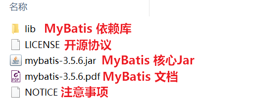

# 快速入门

我们将通过一个简单的 Demo 来阐述 MyBatis 的强大功能，在此之前，笔者假设你已经：

- 拥有 Java 开发环境以及相应 IDE（本 Demo 采用 Eclipse 作为IDE）
- 熟悉 Java Web 开发流程
- 熟悉至少一个关系型数据库（本 Demo 采用 MySQL 作为数据库）

## 数据库准备

现有一张 `User` 表，其表结构如下：

| 主键 |  姓名  | 年龄 |      邮箱      |
| :--: | :----: | :--: | :------------: |
|  1   |  Jone  |  18  |  Jone@126.com  |
|  2   |  Jack  |  20  |  Jack@126.com  |
|  3   |  Tom   |  28  |  Tom@126.com   |
|  4   | Sandy  |  21  | Sandy@126.com  |
|  5   | Billie |  24  | Billie@126.com |

其对应的数据库 结构 脚本如下：

```sql
-- 创建并切换数据库
CREATE DATABASE mybatis_demo_db;
USE mybatis_demo_db;

-- 创建用户数据表
CREATE TABLE `user`  (
  `id` bigint(20) NOT NULL AUTO_INCREMENT COMMENT '主键ID',
  `name` varchar(30) CHARACTER SET utf8 COLLATE utf8_general_ci NULL DEFAULT NULL COMMENT '姓名',
  `age` int(11) NULL DEFAULT NULL COMMENT '年龄',
  `email` varchar(50) CHARACTER SET utf8 COLLATE utf8_general_ci NULL DEFAULT NULL COMMENT '邮箱',
  PRIMARY KEY (`id`) USING BTREE
) ENGINE = InnoDB AUTO_INCREMENT = 1 CHARACTER SET = utf8 COLLATE = utf8_general_ci COMMENT = '用户表' ROW_FORMAT = Compact;
```

其对应的数据库 数据 脚本如下：

```sql
-- 清空用户表数据
TRUNCATE TABLE user;

-- 向用户表插入测试数据
INSERT INTO `user` VALUES (1, 'Jone', 18, 'Jone@126.com');
INSERT INTO `user` VALUES (2, 'Jack', 20, 'Jack@126.com');
INSERT INTO `user` VALUES (3, 'Tom', 28, 'Tom@126.com');
INSERT INTO `user` VALUES (4, 'Sandy', 21, 'Sandy@126.com');
INSERT INTO `user` VALUES (5, 'Billie', 24, 'Billie@126.com');
```

## 下载依赖

要使用 MyBatis 框架，第一步就是下载好 MyBatis 的 jar 包，我们可以从 [MyBatis](https://github.com/mybatis/mybatis-3/releases) 在 GitHub 上的开源地址下载。


笔者下载了 MyBatis 的核心压缩包（mybatis-x.x.x.zip）及其源码包（mybatis-x-mybatis-x.x.x.zip）。


解压开 **mybatis-3.5.6.zip** 压缩包，目录结构如下：



::: tip 笔者说
如果 GitHub 下载太慢，可以前往 [FastGit](https://hub.fastgit.org/mybatis/mybatis-3/releases/tag/mybatis-3.5.6) 进行下载，它是 GitHub 的镜像地址，网站界面等各方面与 GitHub 几乎一模一样。
但是注意它仅仅是一个镜像网站，可以用于克隆或下载 GitHub 资源，但登录之类的功能是不可用的。
:::

## 创建项目

下载好依赖之后，我们通过 Eclipse，创建一个动态 Web 项目，并将刚才下载的 jar 包和指定数据库驱动包添加到 WebConent\WEB-INF\lib 目录，效果如下：


::: tip 笔者说
本次我们不会使用到 Servlet API，所以创建一个普通 Java 工程也没问题。
:::

## 创建POJO类

在 DAO 模式开发中，第一步就是要创建实体类，而在 MyBatis 项目中，实体类"弱化"为了 POJO，这种类型是专门用于和数据库做映射的 Java 类型，数据表中的列与 POJO 类型的属性一 一对应。

```java
package com.example.pojo;

/**
 * 用户POJO类（它是Java和关系数据库表映射的类型）
 * @author Charles7c
 */
public class User {
    private Long id;
    private String name;
    private Integer age;
    private String email;
    // 省略getter/setter方法
    // 省略toString方法
}
```

::: tip 笔者说
POJO（Plain Old Java Objects，普通老式 Java 对象）。一般来讲，将 POJO 简单理解为实体类也无伤大雅。
:::

## 创建SQL映射文件

在 DAO 模式开发中，实体类创建完之后就是要编写 BaseDao、以及不同实体的 Dao 接口和 Dao 实现类。但这一切的繁琐过程，在现在都被 MyBatis 解决了。

现在，我们只需要按照 MyBatis 的要求创建好一个编写 SQL 的映射文件，在映射文件中编写好数据库的 CRUD 操作即可。

```xml
<?xml version="1.0" encoding="UTF-8"?>
<!DOCTYPE mapper
PUBLIC "-//mybatis.org//DTD Mapper 3.0//EN"
"http://mybatis.org/dtd/mybatis-3-mapper.dtd">
<!-- namespace：命名空间，在同一个项目中保持唯一 -->
<mapper namespace="userMapper">
    <!--  SQL 操作（根据 CRUD 的不同选择不同的标签编写 SQL 操作）
          id：SQL 操作标识
          resultType： 结果集类型（全类名）
          下方设定等价于编写了一个方法：List<User> selectList();
    -->
    <select id="selectList" resultType="com.example.pojo.User">
        SELECT * FROM `user`
    </select>
</mapper>
```

::: tip 笔者说
SQL 映射文件的命名风格为：POJO类名Mapper.xml，就像命名以前的 Dao接口 一样，你可以将 SQL 映射文件理解为是以前的 Dao 实现类。
:::

## 创建核心配置文件

MyBatis 为我们简化了非常多的操作，但是一些必须由我们自定义的配置还是少不了的。在 classpath 下创建一个核心配置文件命名为：`mybatis-config.xml`。

```xml
<?xml version="1.0" encoding="UTF-8"?>
<!DOCTYPE configuration
PUBLIC "-//mybatis.org//DTD Config 3.0//EN"
"http://mybatis.org/dtd/mybatis-3-config.dtd">
<configuration>
    <!-- 环境配置：
         可以配置多个，但生效的只有一个
         default属性：指定生效的环境的id
    -->
    <environments default="develop">
        <!-- 单个环境配置 -->
        <environment id="develop">
            <!-- 事务管理配置 -->
            <transactionManager type="JDBC"/>
            <!-- 数据源配置 -->
            <dataSource type="POOLED">
                <property name="driver" value="com.mysql.jdbc.Driver"/>
                <property name="url" value="jdbc:mysql://localhost:3306/mybatis_demo_db"/>
                <property name="username" value="root"/>
                <property name="password" value="root"/>
            </dataSource>
        </environment>
    </environments>
	
    <!-- 指定要加载的SQL映射文件 -->
    <mappers>
        <!-- 注意：该地址不是全类名！！！ -->
        <mapper resource="com/example/mapper/UserMapper.xml"/>
    </mappers>
</configuration>
```

## 添加日志配置文件

在 MyBatis 中，采用的日志框架是 log4j，所以为了能够查看到日志输出，我们需要在 classpath 下添加一个 log4j.properties 文件。

```
###############################################################
#                           输出到控制台                        #
###############################################################
# log4j.rootLogger日志输出类别和级别：只输出不低于该级别的日志信息DEBUG < INFO < WARN < ERROR < FATAL
# DEBUG：日志级别  CONSOLE：输出位置自己定义的一个名字
log4j.rootLogger=DEBUG,CONSOLE
# 配置CONSOLE输出到控制台
log4j.appender.CONSOLE=org.apache.log4j.ConsoleAppender 
# 配置CONSOLE设置为自定义布局模式
log4j.appender.CONSOLE.layout=org.apache.log4j.PatternLayout 
# 配置CONSOLE日志的输出格式  [demo] 2019-08-22 22:52:12,000  %r耗费毫秒数 %p日志的优先级 %t线程名 %C所属类名通常为全类名 %L代码中的行号 %x线程相关联的NDC %m日志 %n换行
log4j.appender.CONSOLE.layout.ConversionPattern=[demo] %d{yyyy-MM-dd HH:mm:ss,SSS} - %-4r %-5p [%t] %C:%L %x - %m%n
```

## 测试

当一切准备好之后，完整的项目目录结构如下：


创建好一个单元测试类，测试一下：

```java
class TestMyBatis {

    @Test
    void testSelectList() throws IOException {
        // 1.从classpath加载核心配置文件，构建SqlSession工厂对象
        InputStream is = Resources.getResourceAsStream("mybatis-config.xml");
        SqlSessionFactory sqlSessionFactory = new SqlSessionFactoryBuilder().build(is);
		
        // 2.获取SqlSession对象
        try (SqlSession sqlSession = sqlSessionFactory.openSession()){
			
            // 3.执行SQL语句 根据要执行的SQL语句选择合适的API
            // p1：SQL语句唯一地址 (SQL映射文件的namespace值.SQL语句的id值)
            List<User> userList = sqlSession.selectList("userMapper.selectList");
			
            // 4.遍历数据
            userList.forEach(System.out::println);
        } catch (Exception e) {
            e.printStackTrace();
        }
    }

}
```

**控制台输出：** 

```
User [id=1, name=Jone, age=18, email=Jone@126.com]
User [id=2, name=Jack, age=20, email=Jack@126.com]
User [id=3, name=Tom, age=28, email=Tom@126.com]
User [id=4, name=Sandy, age=21, email=Sandy@126.com]
User [id=5, name=Billie, age=24, email=Billie@126.com]
```

## 后记

**C：** 好了，与 MyBatis 的第一次约会结束了。怎么样？约会体验如何？使用步骤是不是还挺简单的？

虽然是在学习一个新技术，但是一定要时刻想想当初 DAO 模式你是怎么一个开发步骤，这样对比着会发现 MyBatis 就是在简化、优化原来的每个环节而已。根本上还是那么回事，多想想，脑子里就能留下使用思路。

::: info 笔者说
对于技术的学习，笔者一贯遵循的步骤是：先用最最简单的 demo 让它跑起来，然后学学它的最最常用 API 和 配置让自己能用起来，最后熟练使用的基础上，在空闲时尝试阅读它的源码让自己能够洞彻它的运行机制，部分问题出现的原因，同时借鉴这些技术实现来提升自己的代码高度。

所以在笔者的文章中，前期基本都是小白文，仅仅穿插很少量的源码研究。当然等小白文更新多了，你们还依然喜欢，后期会不定时专门对部分技术的源码进行解析。
:::
