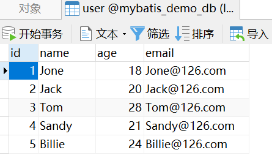
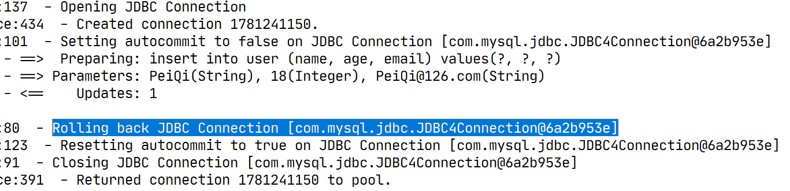

# SQL映射文件之增删改元素

## 前言

**C：** 在上一篇，笔者带大家对 MyBatis SQL 映射文件的 select 元素、sql 元素进行了学习。本篇，笔者将带你学习 MyBatis SQL 映射文件中的 insert、update、delete元素，这三个可以说是 SQL 映射文件中最为简单的，别愣神，快跟上我。


## insert元素

**案例需求：新增用户，PeiQi，18，PeiQi@126.com** 

首先，在 Mapper 接口中我们添加一个方法。

```java
public interface UserMapper {

    /**
     * 添加用户
     * @param user 用户信息
     * @return 影响行数
     */
    int insert(User user);

}
```

::: tip 笔者说
insert、update、delete 这类操作，本身默认就是返回影响的行数，所以不需要对 resultType 进行指定。在定义这类接口方法的时候设置返回值类型为 int 即可。
:::

然后我们在 SQL 映射文件中再添加一个与该方法对应的查询元素。

```xml
<!-- int insert(User user); -->
<insert id="insert" parameterType="User">
    insert into user (name, age, email) values(#{name}, #{age}, #{email})
</insert>
```

测试一下：

```java
class TestMyBatis {

    @Test
    void testInsert() {
        // 获取SqlSession对象
        try (SqlSession sqlSession = MyBatisUtils.openSession()) {

            // 获取 Mapper 接口
            UserMapper userMapper = sqlSession.getMapper(UserMapper.class);
            // 执行 SQL
            User user = new User();
            user.setName("PeiQi");
            user.setAge(18);
            user.setEmail("PeiQi@126.com");
            int rows = userMapper.insert(user);
			
            System.out.println("影响行数为：" + rows);
        } catch (Exception e) {
            e.printStackTrace();
        }
    }
}
```

**控制台输出：** 

```sql
-- 输出的 SQL 语句
insert into user (name, age, email) values(?, ?, ?)
```

```
影响行数为：1
```

---

输出的结果一如既往的表示成功了，但是当你前往数据库查看时，却并没有新增数据。



仔细看看执行日志吧！相比于查询元素，插入元素执行多了一行日志，大白话理解就是：**JDBC 连接正在回滚事务** 。



这是因为我们在获取 SqlSession 的时候，采用的是开启事务的方式。开启事务对于查询没什么大影响，但是对于增删改，如果你不提交事务，就意味着不会将数据持久化到数据库。

所以改动一下测试代码吧：

```java
class TestMyBatis {
    @Test
    void testInsert() {
        // 获取SqlSession对象
        try (SqlSession sqlSession = MyBatisUtils.openSession()) {

            // 获取 Mapper 接口
            UserMapper userMapper = sqlSession.getMapper(UserMapper.class);
            // 执行 SQL
            User user = new User();
            user.setName("PeiQi");
            user.setAge(18);
            user.setEmail("PeiQi@126.com");
            int rows = userMapper.insert(user);
			
            System.out.println("影响行数为：" + rows);
			
            // 提交事务
            sqlSession.commit();
        } catch (Exception e) {
            e.printStackTrace();
        }
    }
}
```

这回测试之后就正常了。


### 获取自增主键值

我们在一些支持自动生成主键的数据库中设置了主键自增，当数据插入之后，我们可能需要用到刚生成的主键值，这时候传统的方法是自己去手动查询一次，而 MyBatis 则是通过在插入元素上添加几个属性就可以解决了。

```xml
<!-- int insert(User user); -->
<!-- 
    【useGeneratedKeys:】（仅适用于 insert 和 update）表示要获取自动生成的主键
    这会令 MyBatis 使用 JDBC 的 getGeneratedKeys 方法来取出由数据库内部生成的主键
    （比如：像 MySQL 和 SQL Server 这样的关系型数据库管理系统的自动递增字段），默认值：false。 
    【keyProperty】:（仅适用于 insert 和 update）表示获取到自动生成主键之后应该映射到对象的哪个属性中
    MyBatis 会使用 getGeneratedKeys 的返回值或 insert 语句的 selectKey 子元素设置它的值，默认值：未设置（unset）。
    如果生成列不止一个，可以用逗号分隔多个属性名称。 [1]
  -->
<insert id="insert" parameterType="User" useGeneratedKeys="true" keyProperty="id">
    insert into user (name, age, email) values(#{name}, #{age}, #{email})
</insert>
```

测试一下：

```java
class TestMyBatis {

    @Test
    void testInsert() {
        // 获取SqlSession对象
        try (SqlSession sqlSession = MyBatisUtils.openSession()) {

            // 获取 Mapper 接口
            UserMapper userMapper = sqlSession.getMapper(UserMapper.class);
            // 执行 SQL
            User user = new User();
            user.setName("PeiQi");
            user.setAge(18);
            user.setEmail("PeiQi@126.com");
            System.out.println("插入前：" + user);
            int rows = userMapper.insert(user);
            System.out.println("影响行数为：" + rows);
            System.out.println("插入后：" + user);
			
            // 提交事务
            sqlSession.commit();
        } catch (Exception e) {
            e.printStackTrace();
        }
    }
    
}
```

**控制台输出：** 

```
插入前：User [id=null, name=PeiQi, age=18, email=PeiQi@126.com]
影响行数为：1
插入后：User [id=8, name=PeiQi, age=18, email=PeiQi@126.com]
```

## update元素

再来试试 update 元素。**案例需求：将id为1的用户年龄改为20。** 

首先，在 Mapper 接口中我们添加一个方法。

```java
public interface UserMapper {

    /**
     * 修改用户
     * @param user 用户信息
     * @return 影响行数
     */
    int update(User user);

}
```

然后我们在 SQL 映射文件中再添加一个与该方法对应的查询元素。

```xml
<!-- int update(User user); -->
<update id="update" parameterType="User">
    update user set age = #{age} where id = #{id}
</update>
```

测试一下：

```java
class TestMyBatis {

    @Test
    void testUpdate() {
        // 获取SqlSession对象
        try (SqlSession sqlSession = MyBatisUtils.openSession()) {

            // 获取 Mapper 接口
            UserMapper userMapper = sqlSession.getMapper(UserMapper.class);
            // 执行 SQL
            User user = new User();
            user.setId(1L);
            user.setAge(20);
            int rows = userMapper.update(user);
			
            System.out.println("影响行数为：" + rows);
			
            // 提交事务
            sqlSession.commit();
        } catch (Exception e) {
            e.printStackTrace();
        }
    }

}
```

**控制台输出：** 

```sql
-- 输出的 SQL 语句
update user set age = ? where id = ?
```

```
影响行数为：1
```

## delete元素

再来试试 delete 元素。**案例需求：将id为1的用户删除。** 

首先，在 Mapper 接口中我们添加一个方法。

```java
public interface UserMapper {

    /**
     * 根据ID删除用户
     * @param id 用户ID
     * @return 影响行数
     */
    int deleteById(@Param("id") Long id);

}
```

然后我们在 SQL 映射文件中再添加一个与该方法对应的查询元素。

```xml
<!-- int deleteById(@Param("id") Long id); -->
<delete id="deleteById">
    delete from user where id = #{id}
</delete>
```

测试一下：

```java
class TestMyBatis {

    @Test
    void testDeleteById() {
        // 获取SqlSession对象
        try (SqlSession sqlSession = MyBatisUtils.openSession()) {

            // 获取 Mapper 接口
            UserMapper userMapper = sqlSession.getMapper(UserMapper.class);
            // 执行 SQL
            int rows = userMapper.deleteById(1L);
			
            System.out.println("影响行数为：" + rows);
			
            // 提交事务
            sqlSession.commit();
        } catch (Exception e) {
            e.printStackTrace();
        }
    }

}
```

**控制台输出：** 

```sql
-- 输出的 SQL 语句
delete from user where id = ?
```

```
影响行数为：1
```

## 参考文献

[1]MyBatis 官网. XML 映射文件[EB/OL]. https://mybatis.org/mybatis-3/zh/sqlmap-xml.html. 2020-12-26

## 后记

你就看看，它们使用起来简单不？这还能有理由说学不动、学不会吗？

::: info 笔者说
对于技术的学习，笔者一贯遵循的步骤是：先用最最简单的 demo 让它跑起来，然后学学它的最最常用 API 和 配置让自己能用起来，最后熟练使用的基础上，在空闲时尝试阅读它的源码让自己能够洞彻它的运行机制，部分问题出现的原因，同时借鉴这些技术实现来提升自己的代码高度。

所以在笔者的文章中，前期基本都是小白文，仅仅穿插很少量的源码研究。当然等小白文更新多了，你们还依然喜欢，后期会不定时专门对部分技术的源码进行解析。
:::

