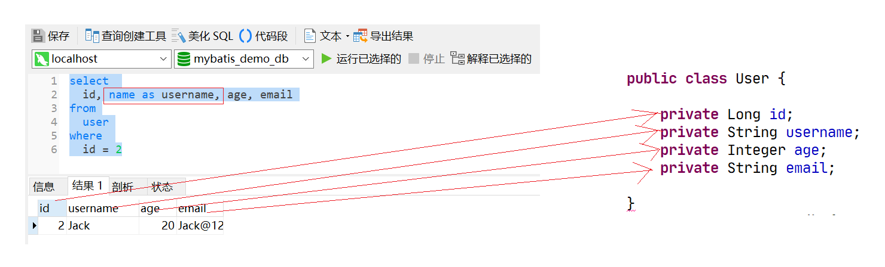
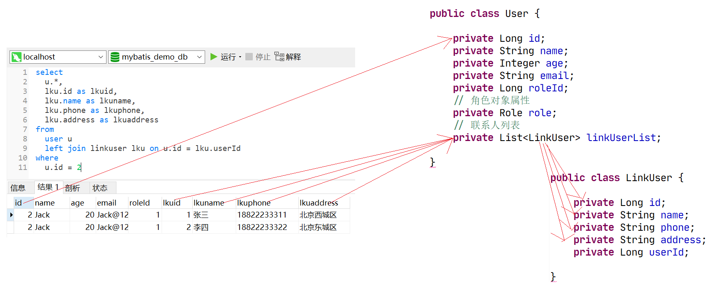

# SQL映射文件之自定义映射元素

## 前言

**C：** 在上一篇，笔者带大家对 MyBatis SQL 映射文件的 insert、update、delete元素做了介绍。到此，CRUD 的基本操作我们就介绍完了。本篇，笔者将带你学习 MyBatis SQL 映射文件的 resultMap 元素，它是 MyBatis 中号称"最强"的元素。有多强？容易令人头秃。


## resultMap元素

要介绍 resultMap 元素，那必然要先详细提一下 resultType 属性。

### resultType属性

在 select 元素中，我们一直在使用 resultType 属性，我们可以用它来指定 SQL 查询完后的 ResultSet（结果集）到底映射为哪种类型。

下方的示例中，resultType 代表的就是将查询回来的所有结果数据映射为User类型的对象。

```xml
<select id="selectById" resultType="User">
    select 
        id, name, age, email
    from
        user
    where 
        id = #{id}
</select>
```

MyBatis 会按照 SQL 查询出的结果数据的列名或别名来映射。


如果列名和属性名不能匹配上，可以在 SELECT 语句中设置列别名来完成匹配，效果如下。

```xml
<select id="selectById" resultType="User">
    select 
        id, name as username, age, email
    where 
        id = #{id}
</select>
```



### 简单自定义映射

在学习了上面的知识后，你会发现上面的例子没有一个需要显式配置 `ResultMap`，这就是 `ResultMap` 的优秀之处：你完全可以不用显式地配置它们。

::: tip 笔者说
实际上 `resultType` 属性的实现原理就是 `ResultMap`， MyBatis 在幕后会自动创建一个 `ResultMap`，再根据属性名来映射列到 JavaBean 的属性上。所以记得注意 **二者不能同时存在** 。
:::

虽然上面的例子不用显式配置 `ResultMap`，但为了讲解，我们来看看如果在刚刚的示例中，显式使用外部的 `resultMap` 会怎样，这也是解决列名不匹配的另外一种方式。[1]

```xml
<!-- 
    自定义映射
        id属性：resultMap的唯一标识
        type属性：要映射为的Java类型全限定类名或别名
-->
<resultMap id="userMap" type="User">
    <!-- 
        用来映射主键列，可以帮助提高整体性能（建议配置）
            property：Java类型的属性名
            column：结果集的列名或别名
    -->
    <id column="id" property="id"/>
    <!-- 用来映射普通列 -->
    <result column="name" property="username"/>
</resultMap>

<select id="selectById" resultMap="userMap">
    select 
        id, name, age, email
    from
        user
    where id = #{id}
</select>
```

::: tip 笔者说
在简单自定义映射时，我们仅仅需要对结果集列名和类属性名不一致的情况作映射规则指定，其他一致的，MyBatis 依然可以帮助我们自动映射好。
但是当出现复杂的自定义映射时，MyBatis 将会进入映射"罢工"状态，未指明自定义映射规则的部分将不再进行自动映射，看看下方的例子吧。
:::

### 复杂自定义映射[难点]

除了上述简单的自定义映射元素外，在 resultMap 元素中，还有两个用于进行复杂映射的子元素（多表操作）：

- **association** 映射到 JavaBean 的某个“复杂类型”属性，例如：JavaBean类

- **collection** 映射到 JavaBean 的某个“复杂类型”属性，例如：集合

我们通过两个案例分别体会一下这两个子元素。

#### association案例 

**案例需求：根据ID查询用户信息，同时将该用户的角色信息也查询出来。** 

刚才我们做了那么多练习，数据库搞的太乱了，**我们先重置回 MyBatis 第一篇的数据库** ，并做一些数据库上的调整。

```sql
-- 创建并初始化数据表 role
CREATE TABLE `role`  (
  `id` bigint(20) NOT NULL AUTO_INCREMENT COMMENT '主键',
  `name` varchar(255) CHARACTER SET utf8 COLLATE utf8_general_ci NULL DEFAULT NULL COMMENT '角色名',
  PRIMARY KEY (`id`) USING BTREE
) ENGINE = InnoDB AUTO_INCREMENT = 3 CHARACTER SET = utf8 COLLATE = utf8_general_ci COMMENT = '角色表' ROW_FORMAT = Compact;

INSERT INTO `role` VALUES (1, '超级管理员');
INSERT INTO `role` VALUES (2, '普通管理员');

-- 为 user 表添加 roleId 列
ALTER TABLE `user` ADD COLUMN `roleId` bigint(0) NULL COMMENT '角色id';
-- 为 user 表做一些角色修改
UPDATE user SET roleId = 1 WHERE id BETWEEN 1 AND 3;
UPDATE user SET roleId = 2 WHERE id > 3;
```

根据数据库改动，创建及改动 POJO：

```java
/**
 * 角色 POJO
 * @author Charles7c
 */
public class Role {
    private Long id;
    private String name;
    // 省略 getter/setter 、toString
}
```

```java
/**
 * 用户 POJO
 * @author Charles7c
 */
public class User {
    private Long id;
    private String name;
    private Integer age;
    private String email;
    private Long roleId;
    // 角色对象属性
    private Role role;
    // 省略 getter/setter 、toString
}
```

改造好数据库之后，我们直接来改造一下 SQL 映射文件中的对应查询。

```xml
<resultMap id="userMap" type="User">
    <id column="id" property="id"/>
    <!-- 复杂的类型关联：一对一映射，映射对象属性
            property：对象属性在映射类中的名字
            javaType：对象属性的类型全限定类名或别名
    -->
    <association property="role" javaType="Role">
        <!-- 和外层的映射一样的，"俄罗斯套娃" -->
        <id column="rid" property="id"/>
        <result column="rname" property="name"/>
    </association>
</resultMap>

<select id="selectById" resultMap="userMap">
    select 
        u.*,
        r.id as rid,
        r.name as rname
    from
        user u
        left join role r on u.roleId = r.id
    where u.id = #{id}
</select>
```


测试一下：

```java
class TestMyBatis {

    @Test
    void testSelectById() {
        // 获取SqlSession对象
        try (SqlSession sqlSession = MyBatisUtils.openSession()) {

            // 获取 Mapper 接口
            UserMapper userMapper = sqlSession.getMapper(UserMapper.class);
            // 执行 SQL
            User user = userMapper.selectById(2L);
			
            System.out.println(user);
            System.out.println(user.getRole());
        } catch (Exception e) {
            e.printStackTrace();
        }
    }

}
```

**控制台输出：** 

```sql
-- 输出的 SQL 语句
select u.*, r.id as rid, r.name as rname from user u left join role r on u.roleId = r.id where u.id = ?
```

```
User [id=2, name=null, age=null, email=null]
Role [id=1, name=超级管理员]
```

---

看看这结果，MyBatis 映射是不是"罢工"了？解决方法有两种：

1. 挨个的把所有结果集列与对应类属性映射好

2. 在 MyBatis 核心配置文件中，更改自动映射的默认级别

   ```xml
   <settings>
       <!-- 自动映射行为设置 -->
       <setting name="autoMappingBehavior" value="FULL"/>
   </settings>
   ```

   再来试试，看看控制台输出的结果。

   ```
   User [id=2, name=Jack, age=20, email=Jack@126.com]
   Role [id=1, name=超级管理员]
   ```

#### collection案例

**案例需求：根据ID查询用户信息，同时将该用户的联系人列表也查询出来。** 

我们再来做一些数据库上的调整。

```sql
-- 创建并初始化数据表 linkuser
CREATE TABLE `linkuser`  (
  `id` bigint(20) NOT NULL AUTO_INCREMENT COMMENT '主键',
  `name` varchar(255) CHARACTER SET utf8 COLLATE utf8_general_ci NULL DEFAULT NULL COMMENT '联系人名',
  `phone` varchar(255) CHARACTER SET utf8 COLLATE utf8_general_ci NULL DEFAULT NULL COMMENT '联系电话',
  `address` varchar(255) CHARACTER SET utf8 COLLATE utf8_general_ci NULL DEFAULT NULL COMMENT '联系地址',
  `userId` bigint(20) NULL DEFAULT NULL COMMENT '用户id',
  PRIMARY KEY (`id`) USING BTREE
) ENGINE = InnoDB AUTO_INCREMENT = 3 CHARACTER SET = utf8 COLLATE = utf8_general_ci COMMENT = '联系人表' ROW_FORMAT = Compact;

INSERT INTO `linkuser` VALUES (1, '张三', '18822233311', '北京西城区', 2);
INSERT INTO `linkuser` VALUES (2, '李四', '18822233322', '北京东城区', 2);
```

根据数据库改动，创建及改动 POJO：

```java
/**
 * 联系人 POJO
 * 
 * @author Charles7c
 */
public class LinkUser {
    private Long id;
    private String name;
    private String phone;
    private String address;
    private Long userId;
    // 省略 getter/setter 、toString
}
```

```java
/**
 * 用户 POJO
 * 
 * @author Charles7c
 */
public class User {
    private Long id;
    private String name;
    private Integer age;
    private String email;
    private Long roleId;
    // 角色对象属性
    private Role role;
    // 联系人列表
    private List<LinkUser> linkUserList;
    // 省略 getter/setter 、toString
}
```

改造好数据库之后，我们直接来改造一下 SQL 映射文件中的对应查询。

```xml
<resultMap id="userMap" type="User">
    <id column="id" property="id"/>
    <!-- 复杂类型集合，一对多，映射集合属性
            property：集合属性在映射类中的名字
            ofType：集合属性的泛型全限定类名或别名
    -->
    <collection property="linkUserList" ofType="LinkUser">
        <id column="lkuid" property="id"/>
        <result column="lkuname" property="name"/>
        <result column="lkuphone" property="phone"/>
        <result column="lkuaddress" property="address"/>
    </collection>
</resultMap>

<select id="selectById" resultMap="userMap">
    select 
        u.*,
        lku.id as lkuid,
        lku.name as lkuname,
        lku.phone as lkuphone,
        lku.address as lkuaddress
    from
        user u
        left join linkuser lku on u.id = lku.userId
    where 
        u.id = #{id}
</select>
```



测试一下：

```java
class TestMyBatis {

    @Test
    void testSelectById() {
        // 获取SqlSession对象
        try (SqlSession sqlSession = MyBatisUtils.openSession()) {

            // 获取 Mapper 接口
            UserMapper userMapper = sqlSession.getMapper(UserMapper.class);
            // 执行 SQL
            User user = userMapper.selectById(2L);
			
            System.out.println(user);
			
            user.getLinkUserList().forEach(System.out::println);
        } catch (Exception e) {
            e.printStackTrace();
        }
    }

}
```

**控制台输出：** 

```sql
-- 输出的 SQL 语句
select u.*, lku.id as lkuid, lku.name as lkuname, lku.phone as lkuphone, lku.address as lkuaddress from user u left join linkuser lku on u.id = lku.userId where u.id = ?
```

```
User [id=2, name=Jack, age=20, email=Jack@126.com]
LinkUser [id=1, name=张三, phone=18822233311, address=北京西城区, userId=null]
LinkUser [id=2, name=李四, phone=18822233322, address=北京东城区, userId=null]
```

## 参考文献

[1]MyBatis 官网. XML 映射文件[EB/OL]. https://mybatis.org/mybatis-3/zh/sqlmap-xml.html. 2020-12-26

## 后记

大多数人在学到复杂自定义映射时都容易犯迷糊，所以笔者说过如果要学习 Hibernate 框架，开局容易深入难，因为 Hibernate 这框架中经常要处理类似的映射，年轻人慢慢来，加油！

::: info 笔者说
对于技术的学习，笔者一贯遵循的步骤是：先用最最简单的 demo 让它跑起来，然后学学它的最最常用 API 和 配置让自己能用起来，最后熟练使用的基础上，在空闲时尝试阅读它的源码让自己能够洞彻它的运行机制，部分问题出现的原因，同时借鉴这些技术实现来提升自己的代码高度。

所以在笔者的文章中，前期基本都是小白文，仅仅穿插很少量的源码研究。当然等小白文更新多了，你们还依然喜欢，后期会不定时专门对部分技术的源码进行解析。
:::