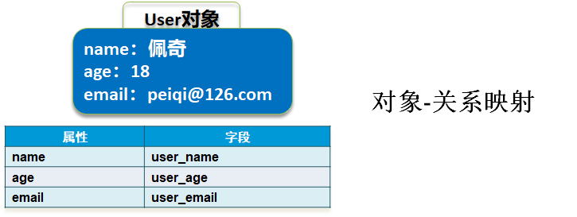

# MyBatis快速入门

## 前言

**C：** 在 Java Web 开发中，我们通常将后台开发拆分为三层架构，分别是：表现层、业务层、持久层。

在持久层中，最开始我们使用原生 JDBC 来进行数据库的 CRUD，代码繁琐的令人抓狂。后来随着学习深入，我们利用 DAO (Data Access Object) 模式对 JDBC 进行了一定的优化封装。

即便如此，还是要在 Java 代码中编写大量的 SQL 语句，参数判断等，下面是我截取的一段 DAO模式封装后的代码，你简单感受一下。

```java
// 假设BaseDao已经封装了通用CRUD操作
public class UserDaoImpl extends BaseDao implements UserDao {

    // 根据条件查询用户列表
    @Override
    public List<User> findByMap(Map<String, Object> params) throws Exception {
        // 动态拼接SQL语句
        StringBuffer sqlBuffer = new StringBuffer();
        // 动态拼接SQL占位符参数
        List<Object> paramsList = new ArrayList<>();

        sqlBuffer.append(" select ");
        sqlBuffer.append("   * ");
        sqlBuffer.append(" from ");
        sqlBuffer.append("   user ");
        sqlBuffer.append(" where 1 = 1 ");

        // 根据用户名模糊查询
        Object name = params.get("name");
        if (EmptyUtils.isNotEmpty(name)) {
            sqlBuffer.append(" and name like CONCAT('%',?,'%') ");
            paramsList.add(name);
        }

        // 根据年龄查询
        Integer age = (Integer) params.get("age");
        if (EmptyUtils.isNotEmpty(age)) {
            sqlBuffer.append(" and age = ? ");
            paramsList.add(age);
        }

        return this.selectList(sqlBuffer.toString(), paramsList.toArray(), User.class);
    }

    // 保存用户
    @Override
    public int save(User user) throws Exception {
        StringBuffer sqlBuffer = new StringBuffer();

        sqlBuffer.append(" insert into user ");
        sqlBuffer.append(" 	(name, age, email) ");
        sqlBuffer.append("  values(?, ?, ?) ");

        Object[] params = {user.getName(), user.getAge(), user.getEmail()};

        return this.insert(sqlBuffer.toString(), params);
    }
}
```

有问题存在，就不缺解决问题的人。在行业内随之诞生了大量的持久层解决方案，除了各自公司自研的方案之外，比较有名的通用开源方案有：Hibernate、MyBatis等，各有各的优劣势，在此我先不谈论它们的区别，只说一个现象：在国内来讲MyBatis应用相对广泛。


所以那没什么好说的了，直接学吧？

开玩笑的，其实MyBatis在国内应用广泛的原因是因为相对于Hibernate等，它可以更加灵活的编写SQL语句，对于需求变动比较频繁，业务比较复杂，高并发要求较高的应用，优势显而易见。国内这两年互联网发展的挺快，互联网用户群体基数大，而国外人群规模相对较少，相比于国内开发者，他们更关注实现效率而非极致的性能。

## 简介

::: tip 笔者说
MyBatis读音是:[mai'bətɪs]（买杯涕死），原是 Apache 软件基金会的一个[开源项目](https://baike.baidu.com/item/开源项目/3406069) iBatis , 2010年这个项目由 Apache 软件基金会迁移到了 Google Code 平台，并且改名为 MyBatis 。2013年11月再迁移到 [GitHub](https://baike.baidu.com/item/Github/10145341)。

MyBatis 是一款优秀的 **半自动的持久层ORM框架** ，它支持自定义 SQL、存储过程以及高级映射。MyBatis 免除了几乎所有的 JDBC 代码以及设置参数和获取结果集的工作。MyBatis 可以通过简单的 XML 或注解来配置和映射原始类型、接口和 Java POJO（Plain Old Java Objects，普通老式 Java 对象）为数据库中的记录。

当前，最新版本是MyBatis 3.5.6 ，其发布时间是2020年10月6日。[1]

:::

::: details **1.什么是 ORM ？** [2]
ORM，对象关系映射（Object Relation Mapping，简称ORM，或O/RM，或O/R  Mapping），它是随着面向对象的软件开发方法发展而产生的。

面向对象的开发方法是当今企业级应用开发环境中的主流开发方法，关系数据库是企业级应用环境中永久存放数据的主流数据存储系统。对象和关系数据是业务实体的两种表现形式，业务实体在内存中表现为对象，在数据库中表现为关系数据。内存中的对象之间存在关联和继承关系，而在数据库中，关系数据无法直接表达多对多关联和继承关系。因此，对象-关系映射( ORM )系统一般以中间件的形式存在，主要实现程序对象到关系数据库数据的映射。


面向对象是从软件工程基本原则(如耦合、聚合、封装)的基础上发展起来的，而关系数据库则是从数学理论发展而来的，两套理论存在显著的区别。为了解决这个不匹配的现象，对象关系映射技术应运而生。 

**它可以有效解决数据库与程序间的异构性，实现面向对象编程语言里不同类型系统的数据之间的转换。** 

**大白话：** 一个完整的ORM框架，可以使得我们在具体的操作业务对象的时候，不需要再去和复杂的SQL语句之流打交道，只需简单的操作对象的属性即可。例如：在指定好对象和数据库映射之后，要保存一个用户数据，只需要创建好用户对象，然后调用ORM解决方案，就会自动将对象数据持久化到数据库中。（无需关心SQL，ORM自动生成SQL） ；要更新一个用户信息，只需要在程序中对该用户对象的属性进行更新，ORM解决方案就会自动将更改后的结果持久化到数据库中。
:::

::: details **2.为什么说 MyBatis 是半自动 ORM ？** [2]
Mybatis 在查询关联对象或关联集合对象时，需要手动编写 SQL 来完成，所以称之为半自动 ORM 映射工具。也可以说 MyBatis 是一个业务实体对象和 SQL 之间的映射工具。
:::

## 特点

**C：** 笔者其实不愿意先给你介绍一个技术的特点，因为没有用过，光靠说是不行的。只有在我们实际体验之后，它的优缺点才可以感受到了，不过提前先了解一下，也更有学习动力，千万记得学习的过程中及时思考和理解这些特点。

**优势：** 

- **简单易学：** 框架规模小，学习门槛低（官方文档简单详细），与 JDBC 相比，减少了50%以上的代码量，消除了 JDBC 大量冗余的代码，不需要手动开关连接。
- **灵活度高：** 半自动化 ORM，程序员直接编写原生态 SQL ，可严格控制 SQL 执行性能，灵活度高，非常适合对关系数据模型要求不高的软件开发，例如：互联网软件、企业运营类软件等，因为这类软件需求变化频繁，一但需求变化要求成果输出迅速。
- **解除 SQL 与程序代码的耦合：** SQL 代码从程序代码中彻底分离，写在XML里，可重用。
- **提供映射标签，支持对象与数据库的 ORM 字段映射** 
- **提供 XML 标签，支持编写动态 SQL ：** 在使用 JDBC 的过程中， 根据条件进行 SQL 的拼接是很麻烦且很容易出错的。 MyBatis 动态 SQL 的出现， 解决了这个麻烦。

**劣势：** 

- **SQL语句的编写工作量较大**：尤其当字段多，关联表多时，对开发人员编写SQL语句的功底有一定要求。
- **数据库无关性、移植性差：** SQL语句依赖数据库，导致数据库移植性差，不能随意更换数据库。[3]

## 参考文献

[1]MyBatis 官网. MyBatis 简介[EB/OL]. https://mybatis.org/mybatis-3/zh/index.html. 2020-12-25

[2]laouei. 理解 ORM 和数据持久化[EB/OL]. https://blog.csdn.net/u012585964/article/details/52412520. 2016-09-02

[3]W3CSchool. MyBatis 教程[EB/OL]. https://www.w3cschool.cn/mybatis/. 2020-12-25